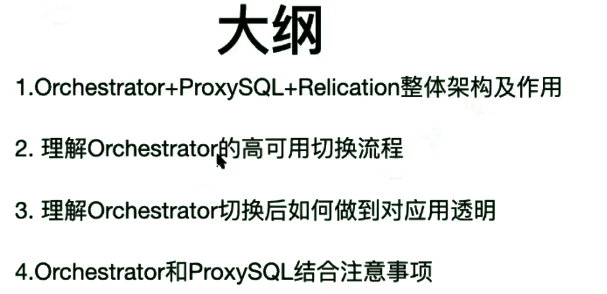
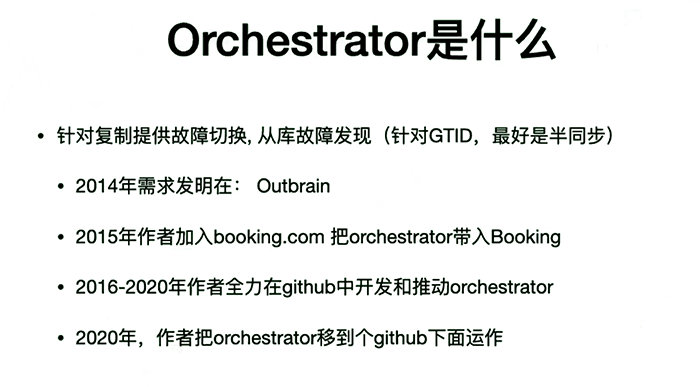
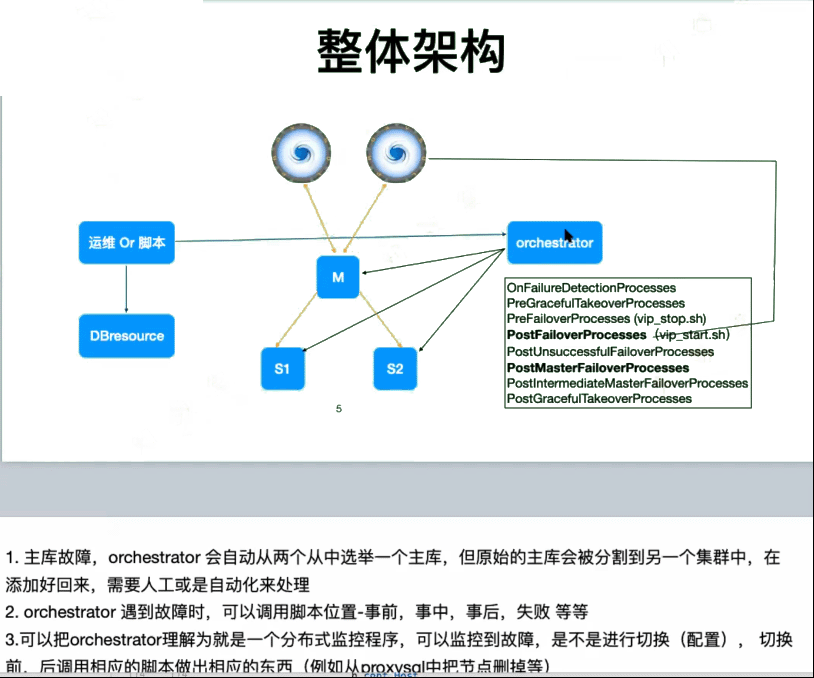
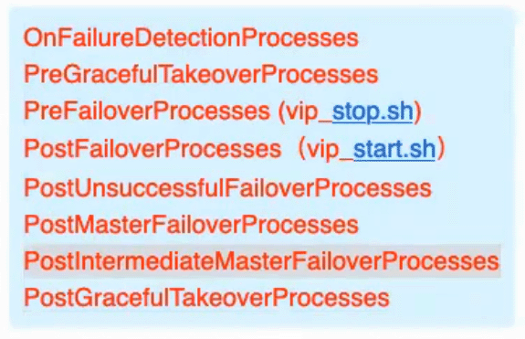
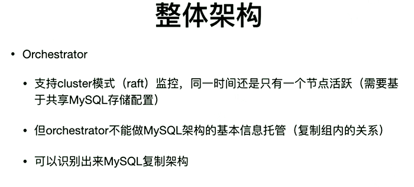
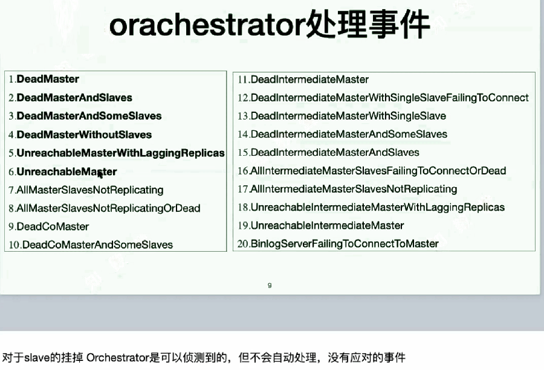
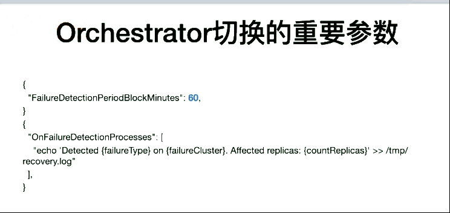

使用Orchestrator，需要具有一定的开发能力。

 

 

ProxySQL + Orchestrator + Replication 高可用

 

 

 

 

 

 

 

Orc也是，只负责主库的failover。

 

 

 

super、replication slave 、replication client.

 

 

6.主库没死，但是无法连接：

什么情况下会没死但是无法连接？

如何判断这种情况？

--binlog还在写，slave还在源源不断收到relaylog

--telnet port还通

 

默认配置情况下，

 

 

orc

 

4秒。4秒内没收到主库响应、没收到master的任何数据传输，则认为master挂了。

但是master如果4秒内就没有事务发生呢？

 

--引入心跳包。5.7开始支持。

 

 

 