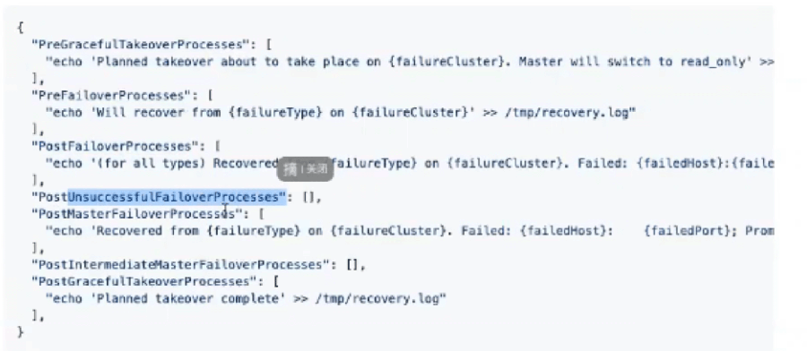

 

Orc

 

ORC和replication-manager都要求monitor-Master使用半同步。

MHA需要monitor和Master做SSH互信

 

开启半同步后，Master和S之间不再需要补数据的情况（m的log已经提交给S了），否则会产生幽灵事务，这样在数据库层面不会引起问题，但是在业务层面，便不合理了——业务并不知道事务是否完成， 数据还同步提交给slave，这是非法的。

 

这样的话，即使Master挂掉， 也可以立即从Slave中选举一个，作为新的Master。（半同步+master，切换是很轻松的事情）

 

 

 

orc自带高可用， 然后orc维护MySQL高可用架构的高可用。（有点绕）

 

orc的不足：

默认的，如果节点挂掉，一小时内是不允许该节点切回来的。

如果网络闪断导致failover后，投票过程中该节点又胜出（如：GTID较大），此时不允许切回来，这就是风险点。

如果节点切回来后，read only没关，那么也是风险点。（数据写乱了就，m2 --\--> m1）

 

 

m1 failover后，m1数据多余m2 ， 如果启用了增强半同步， 那么不会出现数据丢失的情况。（m2未ack时，m1等待）

m2成为master后，掐掉主从复制，reset slave all; ， 此时m1的事务依然卡着（永远不会收到ack响应了）， 不会继续进行，待业务被m2接管后，重新提交请求。 这边保证了数据不丢失。

 

如果未启用增强半同步，那么就可能出现二者不一致的情况了。

 

 

 

 