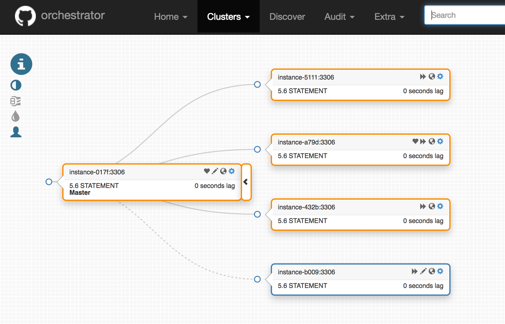
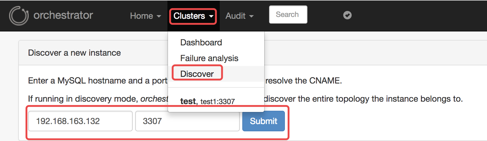
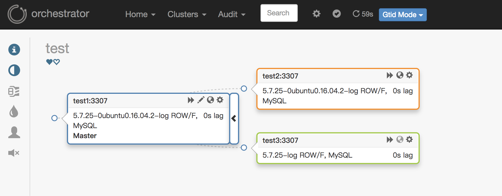

## 背景

在MySQL高可用架构中，目前使用比较多的是Percona的PXC，Galera以及MySQL 5.7之后的MGR等，其他的还有的[MHA](https://github.com/yoshinorim/mha4mysql-manager)，今天介绍另一个比较好用的MySQL高可用复制管理工具：[Orchestrator](https://github.com/github/orchestrator)（orch）。

[Orchestrator](https://github.com/github/orchestrator)（orch）：go编写的MySQL高可用性和复制拓扑管理工具，支持复制拓扑结构的调整，自动故障转移和手动主从切换等。后端数据库用MySQL或SQLite存储元数据，并提供Web界面展示MySQL复制的拓扑关系及状态，通过Web可更改MySQL实例的复制关系和部分配置信息，同时也提供命令行和api接口，方便运维管理。相对比MHA来看最重要的是解决了管理节点的单点问题，其通过raft协议保证本身的高可用。GitHub的一部分管理也在用该工具进行管理。关于[Orchestrator](https://github.com/github/orchestrator)更详细的介绍可以看Github的介绍，大致的特点有：

① 自动发现MySQL的复制拓扑，并且在web上展示。

② 重构复制关系，可以在web进行拖图来进行复制关系变更。

③ 检测主异常，并可以自动或手动恢复，通过Hooks进行自定义脚本。

④ 支持命令行和web界面管理复制。



## 环境：

```
系统：
Ubuntu 16.04

三台主机：
test1:192.168.163.131
test2:192.168.163.132
test3:192.168.163.133

后端MySQL端口：3306
测试MySQL端口：3307
```

## 安装 

根据需要[下载](https://github.com/github/orchestrator/releases)合适的包进行[安装](https://github.com/github/orchestrator/blob/master/docs/install.md)，本文是基于Ubuntu16.04安装的，下载好deb包后，需要安装jq的依赖包（apt-get install jq）。安装完成之后，相应的目录为：

```
/usr/local/orchestrator
-rwxr-xr-x 1 root root  20M 1月  16 21:49 orchestrator
-rw-r--r-- 1 root root 5.1K 1月  16 21:49 orchestrator-sample.conf.json
-rw-r--r-- 1 root root 4.4K 1月  16 21:49 orchestrator-sample-sqlite.conf.json
drwxr-xr-x 7 root root 4.0K 2月  15 19:03 resources
```

orchestrator：应用程序

*.json：默认的配置模板

resources：orchestrator相关的文件：client、web、伪GTID等相关文件。

## 配置

配置的相关[参数](https://github.com/github/orchestrator/blob/master/go/config/config.go)了解后，大致说明如下（可能会有偏差、后续不定时更新）： 

```
        Debug:                                      false,  --设置debug模式
        EnableSyslog:                               false, -- 是否把日志输出到系统日志里
        ListenAddress:                              ":3000", -- web http tpc 监听端口
        ListenSocket:                               "", -- 套接字文件，默认空，和ListenAddress互斥。
        HTTPAdvertise:                              "", --可选，为raft设置。通知相关http信息
        AgentsServerPort:                           ":3001",--回调接口
        StatusEndpoint:                             "/api/status",--状态查看，默认为'/ api / status'
        StatusOUVerify:                             false,--如果为true，请尝试在Mutual TLS打开时验证OU。 默认为false
        BackendDB:                                  "mysql",--后端数据库类型，可选mysql或则sqlite3
        SQLite3DataFile:                            "", --sqlite3的数据文件
        SkipOrchestratorDatabaseUpdate:             false,-- 如果为true，不检查后端数据库模式，也不尝试更新它。 当运行多个版本的orchestrator时很有用
        PanicIfDifferentDatabaseDeploy:             false, --如果为true，此进程发现协调器后端的数据库由不同版本配置，则发生混乱
        RaftBind:                                   "127.0.0.1:10008",
        RaftAdvertise:                              "",
        RaftDataDir:                                "",
        DefaultRaftPort:                            10008, --如果RaftNodes未指定端口，使用此端口
        RaftNodes:                                  []string{}, --raft初始化连接
        ExpectFailureAnalysisConcensus:             true,
        MySQLOrchestratorMaxPoolConnections:        128, --限制后端数据库的并发数
        MySQLOrchestratorPort:                      3306, --后端数据库端口
        MySQLTopologyUseMutualTLS:                  false,--是否启用TLS身份验证
        MySQLTopologyUseMixedTLS:                   true,--是否混合TLS和非TLS身份验证
        MySQLOrchestratorUseMutualTLS:              false,--是否为Orchestrator MySQL实例启用TLS身份验证
        MySQLConnectTimeoutSeconds:                 2,--数据库连接超时时间，秒。
        MySQLOrchestratorReadTimeoutSeconds:        30,--读操作超时
        MySQLDiscoveryReadTimeoutSeconds:           10,--发现查询的超时
        MySQLTopologyReadTimeoutSeconds:            600,--发现查询之外查询的超时
        MySQLConnectionLifetimeSeconds:             0,--活跃状态的的时间
        DefaultInstancePort:                        3306,--数据库默认端口
        TLSCacheTTLFactor:                          100,--为TLS信息缓存到期的InstancePollSeconds的因子
        InstancePollSeconds:                        5,--实例之间读取间隔
        InstanceWriteBufferSize:                    100,--实例写入缓冲区大小
        BufferInstanceWrites:                       false,--在后端表上设置为“true”以进行写入优化，写入可能过时并覆盖非陈旧数据
        InstanceFlushIntervalMilliseconds:          100,--实例写入缓冲区刷新之间的最大间隔时间
        SkipMaxScaleCheck:                          false,--如果没有MaxScale BinlogServer，请将其设置为“true”以保存一些无意义的查询
        UnseenInstanceForgetHours:                  240,--忽略不可见的实例的小时数
        SnapshotTopologiesIntervalHours:            0,--快照拓扑调用之间的小时间隔。 默认值：0（禁用）
        DiscoverByShowSlaveHosts:                   false,--在PROCESSLIST之前尝试SHOW SLAVE HOSTS
        UseSuperReadOnly:                           false,--每当它设置read_only时，orchestrator应该是super_read_only
        DiscoveryMaxConcurrency:                    300,--实例发现时go的最大进程数量。
        DiscoveryQueueCapacity:                     100000,--发现队列的缓冲区大小。 应该大于发现的数据库实例的数量
        DiscoveryQueueMaxStatisticsSize:            120,--发现队列的第二次统计数据的最大数量
        DiscoveryCollectionRetentionSeconds:        120,--保留发现集合信息的秒数
        InstanceBulkOperationsWaitTimeoutSeconds:   10,--在进行批量操作时等待单个实例的时间
        HostnameResolveMethod:                      "default",
        MySQLHostnameResolveMethod:                 "@@hostname",
        SkipBinlogServerUnresolveCheck:             true, --跳过检查未解析的主机名是否解析为binlog服务器的相同主机名
        ExpiryHostnameResolvesMinutes:              60, --主机名解析到期之前的分钟数
        RejectHostnameResolvePattern:               "",--不接受解析主机名的正则表达式。 这样做是为了避免因网络故障而存储错误
        ReasonableReplicationLagSeconds:            10,--复制延迟高于该值表示异常
        ProblemIgnoreHostnameFilters:               []string{},--将与给定的regexp过滤器匹配的主机名最小化问题
        VerifyReplicationFilters:                   false, --在拓扑重构之前检查复制筛选器
        ReasonableMaintenanceReplicationLagSeconds: 20,--高于此值会上移和下移
        CandidateInstanceExpireMinutes:             60,--该时间之后，使用实例作为候选副本的建议已过期。
        AuditLogFile:                               "", --审计操作的日志文件名。 空的时候禁用。
        AuditToSyslog:                              false, --审计日志是否写入到系统日志
        AuditToBackendDB:                           false, --审计日志是否入库，表为audit，默认true
        RemoveTextFromHostnameDisplay:              "",--去除群集/群集页面上的主机名的文本
        ReadOnly:                                   false,
        AuthenticationMethod:                       "",--身份验证类型。可选值有：
"" for none, "basic" for BasicAuth,
"multi" for advanced BasicAuth, 
"proxy" for forwarded credentials via reverse proxy, 通过反向代理转发凭证
"token" for token based access

        HTTPAuthUser:                               "", --HTTP基本身份验证的用户名，空表示禁用身份验证
        HTTPAuthPassword:                           "", --HTTP基本身份验证的密码，空表示禁用密码
        AuthUserHeader:                             "X-Forwarded-User",--当AuthenticationMethod为“proxy”时，HTTP标头指示auth用户
        PowerAuthUsers:                             []string{"*"},--在AuthenticationMethod ==“proxy”上，可以更改的用户列表。 所有其他都是只读的
        PowerAuthGroups:                            []string{},--经过身份验证的用户必须是unix组列表成员
        AccessTokenUseExpirySeconds:                60,--必须使用已颁发token的时间
        AccessTokenExpiryMinutes:                   1440,--访问的到期的时间
        ClusterNameToAlias:                         make(map[string]string),
        DetectClusterAliasQuery:                    "",--可选查询（在拓扑实例上执行），返回集群的别名
        DetectClusterDomainQuery:                   "",--可选查询（在拓扑实例上执行），返回此集群主服务器的VIP / CNAME /别名/任何域名
        DetectInstanceAliasQuery:                   "",--可选查询（在拓扑实例上执行），返回实例的别名
        DetectPromotionRuleQuery:                   "",--可选查询（在拓扑实例上执行），返回实例的提升规则
        DataCenterPattern:                          "", --一个组的正则表达式模式，从主机名中提取数据中心名称
        PhysicalEnvironmentPattern:                 "",--一个组的正则表达式模式，从主机名中提取物理环境信息
        DetectDataCenterQuery:                      "",--可选查询（在拓扑实例上执行），返回实例的数据中心，覆盖DataCenterPattern，对无法通过主机名推断DC非常有用
        DetectPhysicalEnvironmentQuery:      "",--可选查询（在拓扑实例上执行），返回实例的物理环境。覆盖PhysicalEnvironmentPattern，对无法通过主机名推断出env非常有用
        DetectSemiSyncEnforcedQuery:                "",--可选查询（在拓扑实例上执行）以确定是否对主写入完全强制执行半同步
        SupportFuzzyPoolHostnames:                  true,--应该“submit-pool-instances”命令能够传递模糊实例列表（模糊意味着非fqdn，但足够独特，可以识别）。 默认值为“true”，表示后端数据库上有更多查询
        InstancePoolExpiryMinutes:                  60,--database_instance_pool的过期的时间
        PromotionIgnoreHostnameFilters:             []string{},--不使用主机名匹配模式来提升副本
        ServeAgentsHttp:                            false,--产生另一个专用于orchestrator-agent的HTTP接口
        AgentsUseSSL:                               false,--当“true”orchestrator将使用SSL侦听代理端口以及通过SSL连接到代理时
        AgentsUseMutualTLS:                         false,--当“true”时，使用相互TLS服务器与代理通信
        AgentSSLValidOUs:                           []string{},--使用相互TLS与代理进行通信
        AgentSSLSkipVerify:                         false,--为代理使用SSL
        AgentSSLPrivateKeyFile:                     "",
        AgentSSLCertFile:                           "",
        AgentSSLCAFile:                             "",
        UseSSL:                                     false,--在Web端口上使用SSL
        UseMutualTLS:                               false,--“true”时使用TLS作为服务器的Web和API连接
        SSLValidOUs:                                []string{},--使用TLS交互
        SSLSkipVerify:                              false,--使用SSL时，是否应忽略SSL认证错误
        SSLPrivateKeyFile:                          "",
        SSLCertFile:                                "",
        SSLCAFile:                                  "",
        AgentPollMinutes:                           60,--代理轮询的分钟数
        UnseenAgentForgetHours:                     6,--忘记不可见的代理的小时数
        StaleSeedFailMinutes:                       60,--过时（无进展）被视为失败的分钟数
        SeedAcceptableBytesDiff:                    8192,--种子源和目标数据大小之间的字节差异仍被视为成功复制
        SeedWaitSecondsBeforeSend:                  2,--在代理上开始发送数据命令之前等待的秒数
        AutoPseudoGTID:                             false, --是否自动将Pseudo-GTID条目注入主服务器
        PseudoGTIDPattern:                          "",--在二进制日志中查找的模式，用于创建唯一条目（伪GTID）。 为空时，禁用基于伪GTID的重构。
        PseudoGTIDPatternIsFixedSubstring:          false,--如为true，则PseudoGTIDPattern不被视为正则表达式而是固定子字符串
        PseudoGTIDMonotonicHint:                    "",--Pseudo-GTID条目中的子字符串，表示Pseudo-GTID条目预计会单调递增
        DetectPseudoGTIDQuery:                      "",--可选查询，用于确定是否在实例上启用了伪gtid
        BinlogEventsChunkSize:                      10000,--SHOW BINLOG | RELAYLOG EVENTS LIMIT的块大小。 较小意味着更少的锁定和工作要做
        SkipBinlogEventsContaining:                 []string{},--扫描/比较Pseudo-GTID的binlog时，跳过包含给定文本的条目。 这些不是正则表达式（扫描binlog时会消耗太多的CPU），只需查找子字符串。
        ReduceReplicationAnalysisCount:             true,--如果为true，则复制分析将报告可能首先处理问题的可能性的实例。 如果为false，则为每个已知实例提供一个条目
        FailureDetectionPeriodBlockMinutes:         60,--实例的故障发现保持“活动”的时间，以避免实例失败的并发“发现”; 如果有的话，这会在任何恢复过程之前。
        RecoveryPeriodBlockMinutes:                 60,--实例的恢复保持“活动”的时间，以避免并发恢复
        RecoveryPeriodBlockSeconds:                 3600, --实例的恢复保持“活动”的时间，以避免并发恢复
        RecoveryIgnoreHostnameFilters:              []string{},--恢复分析将完全忽略与给定模式匹配的主机
        RecoverMasterClusterFilters:                []string{},--只对匹配这些正则表达式模式的集群进行主恢复（“*”模式匹配所有）
        RecoverIntermediateMasterClusterFilters:    []string{},--只对匹配这些正则表达式模式的集群进行恢复（“*”模式匹配所有内容）
        ProcessesShellCommand:                      "bash",--执行命令脚本的Shell
        OnFailureDetectionProcesses:                []string{},--检测故障转移方案时执行（在决定是否进行故障转移之前）。 可以并且应该使用其中一些占位符{failureType}，{failureDescription}，{command}，{failedHost}，{failureCluster}，{failureClusterAlias}，{failureClusterDomain}，{failedPort}，{successorHost}，{successorPort}，{ successorAlias}，{countReplicas}，{replicaHosts}，{isDowntimed}，{autoMasterRecovery}，{autoIntermediateMasterRecovery}
        PreGracefulTakeoverProcesses:      []string{},--在主变为只读之前立即执行。 可以并且应该使用其中一些占位符：{failureType}，{failureDescription}，{command}，{failedHost}，{failureCluster}，{failureClusterAlias}，{failureClusterDomain}，{failedPort}，{successorHost}，{successorPort}，{ successorAlias}，{countReplicas}，{replicaHosts}，{isDowntimed}
        PreFailoverProcesses:                       []string{},--在执行恢复操作之前立即执行。任何这些进程的失败（非零退出代码）都会中止恢复。提示：这使您有机会根据系统的某些内部状态中止恢复。 可以并且应该使用其中一些占位符：{failureType}，{failureDescription}，{command}，{failedHost}，{failureCluster}，{failureClusterAlias}，{failureClusterDomain}，{failedPort}，{successorHost}，{successorPort}，{ successorAlias}，{countReplicas}，{replicaHosts}，{isDowntimed}
        PostMasterFailoverProcesses:                []string{},--在主恢复成功结束时执行（未定义的执行顺序）。 使用与PostFailoverProcesses相同的占位符
        PostIntermediateMasterFailoverProcesses:    []string{},--在成功的中间主恢复结束时执行（未定义的执行顺序）。 使用与PostFailoverProcesses相同的占位符
        PostFailoverProcesses:                      []string{},--在成功恢复结束时执行（包括并添加到上述两个）。 可以并且应该使用其中一些占位符：{failureType}，{failureDescription}，{command}，{failedHost}，{failureCluster}，{failureClusterAlias}，{failureClusterDomain}，{failedPort}，{successorHost}，{successorPort}，{ successorAlias}，{countReplicas}，{replicaHosts}，{isDowntimed}，{isSuccessful}，{lostReplicas}
        PostUnsuccessfulFailoverProcesses:          []string{},--在任何不成功的恢复结束时执行。（未定义的执行顺序）。 可以并且应该使用其中一些占位符：{failureType}，{failureDescription}，{command}，{failedHost}，{failureCluster}，{failureClusterAlias}，{failureClusterDomain}，{failedPort}，{successorHost}，{successorPort}，{ successorAlias}，{countReplicas}，{replicaHosts}，{isDowntimed}，{isSuccessful}，{lostReplicas}
        PostGracefulTakeoverProcesses:              []string{},--在旧主位于新晋升的主之后执行。 使用与PostFailoverProcesses相同的占位符
        CoMasterRecoveryMustPromoteOtherCoMaster:   true,--当'false'时，任何都可以得到提升（候选人比其他人更受欢迎）。 当'true'时，将促进其他共同主人或否则失败
        DetachLostSlavesAfterMasterFailover(DetachLostReplicasAfterMasterFailover):        true,--恢复过程中可能会丢失一些副本。如果为true，将通过detach-replica命令强制中断其复制，以确保没有人认为它们完全正常运行。
        ApplyMySQLPromotionAfterMasterFailover:     true,--将重置slave all并在提升的master上设置read_only = 0，默认true。
        PreventCrossDataCenterMasterFailover:       false,--如果为true（默认值：false），则不允许跨DC主故障转移，orchestrator将尽其所能仅在同一DC内进行故障转移，否则不进行故障转移。
        MasterFailoverLostInstancesDowntimeMinutes: 0,--在主故障转移（包括失败的主副本和丢失的副本）之后丢失的任何服务器停机的分钟数。 0表示禁用
        MasterFailoverDetachSlaveMasterHost(MasterFailoverDetachReplicaMasterHost):        false,--orchestrator是否应该在新升级的master上发出detach-replica-master-host（这样可以确保新master不会尝试复制旧的master，如果它恢复生命）。 默认为'false'。 如果ApplyMySQLPromotionAfterMasterFailover为'true'则无意义。

        FailMasterPromotionIfSQLThreadNotUpToDate:  false,--如果为true，并且发生主故障转移，如果候选主服务器未消耗所有中继日志（延迟），则中止并显示错误
        PostponeSlaveRecoveryOnLagMinutes（PostponeReplicaRecoveryOnLagMinutes）:          0,--在崩溃恢复时，滞后超过给定分钟的副本仅在主/ IM被选出并执行进程后才在恢复过程的后期复活。 值为0将禁用此功能
        RemoteSSHForMasterFailover:                 false,--orchestrator是否应该在主故障转移时尝试远程-shsh relaylog-synching？ 需要RemoteSSHCommand
        RemoteSSHCommand:                           "",--一个`ssh`命令，由恢复进程用于读取/应用relaylogs。 如果提供，则此变量必须包含文本“{hostname}”。 远程SSH登录必须具有读/写中继日志的权限。 示例：“setuidgid remoteuser ssh {hostname}”
        RemoteSSHCommandUseSudo:                    true,--是否orchestrator应该在SSH命令下在远程主机上应用'sudo'
        OSCIgnoreHostnameFilters:                   []string{},--建议将忽略与给定模式匹配的副本主机名
        GraphiteAddr:                               "",
        GraphitePath:                               "",
        GraphiteConvertHostnameDotsToUnderscores:   true,
        GraphitePollSeconds:                        60,
        URLPrefix:                                  "",
        DiscoveryIgnoreReplicaHostnameFilters: []string{},
        ConsulAddress:                         "",
        ConsulAclToken:                        "",
        ZkAddress:                             "",
        KVClusterMasterPrefix:                 "mysql/master",
        WebMessage:                            "",
```


按照本文的测试用例，定制了一个相关的[模板](https://github.com/github/orchestrator/blob/master/docs/configuration-sample.md)（/etc/orchestrator.conf.json）：

```
{
  "Debug": true,
  "EnableSyslog": false,
  "ListenAddress": ":3000",
  "MySQLTopologyUser": "orchestrator",
  "MySQLTopologyPassword": "Aa123456",
  "MySQLTopologyCredentialsConfigFile": "",
  "MySQLTopologySSLPrivateKeyFile": "",
  "MySQLTopologySSLCertFile": "",
  "MySQLTopologySSLCAFile": "",
  "MySQLTopologySSLSkipVerify": true,
  "MySQLTopologyUseMutualTLS": false,
  "MySQLOrchestratorHost": "127.0.0.1",
  "MySQLOrchestratorPort": 3306,
  "MySQLOrchestratorDatabase": "orchestrator",
  "MySQLOrchestratorUser": "orchestrator",
  "MySQLOrchestratorPassword": "123456",
  "MySQLOrchestratorCredentialsConfigFile": "",
  "MySQLOrchestratorSSLPrivateKeyFile": "",
  "MySQLOrchestratorSSLCertFile": "",
  "MySQLOrchestratorSSLCAFile": "",
  "MySQLOrchestratorSSLSkipVerify": true,
  "MySQLOrchestratorUseMutualTLS": false,
  "MySQLConnectTimeoutSeconds": 1,
  "MySQLTopologyReadTimeoutSeconds": 3,
  "MySQLDiscoveryReadTimeoutSeconds": 3,
  "DefaultInstancePort": 3306,
  "DiscoverByShowSlaveHosts": true,
  "InstancePollSeconds": 3,
  "UnseenInstanceForgetHours": 240,
  "SnapshotTopologiesIntervalHours": 0,
  "InstanceBulkOperationsWaitTimeoutSeconds": 10,
  "HostnameResolveMethod": "default",
  "MySQLHostnameResolveMethod": "@@hostname",
  "SkipBinlogServerUnresolveCheck": true,
  "SkipMaxScaleCheck":true,
  "ExpiryHostnameResolvesMinutes": 60,
  "RejectHostnameResolvePattern": "",
  "ReasonableReplicationLagSeconds": 10,
  "ProblemIgnoreHostnameFilters": [],
  "VerifyReplicationFilters": false,
  "ReasonableMaintenanceReplicationLagSeconds": 20,
  "CandidateInstanceExpireMinutes": 1440,
  "AuditLogFile": "",
  "AuditToSyslog": false,
  "RemoveTextFromHostnameDisplay": ":3306",
  "ReadOnly": false,
  "AuthenticationMethod": "",
  "HTTPAuthUser": "",
  "HTTPAuthPassword": "",
  "AuthUserHeader": "",
  "PowerAuthUsers": [
    "*"
  ],
  "ClusterNameToAlias": {
    "127.0.0.1": "test suite"
  },
  "SlaveLagQuery": "",
  "DetectClusterAliasQuery":  "SELECT cluster_name FROM meta.cluster WHERE cluster_name = left(@@hostname,4) ",
  "DetectClusterDomainQuery": "SELECT cluster_domain FROM meta.cluster WHERE cluster_name = left(@@hostname,4) ",
  "DetectInstanceAliasQuery": "SELECT @@hostname as instance_alias",
  "DetectPromotionRuleQuery": "",
  "DetectDataCenterQuery": "SELECT data_center FROM meta.cluster WHERE cluster_name = left(@@hostname,4) ",
  "PhysicalEnvironmentPattern": "",
  "PromotionIgnoreHostnameFilters": [],
  "DetachLostReplicasAfterMasterFailover": true,
  "DetectSemiSyncEnforcedQuery": "SELECT 0 AS semisync FROM DUAL WHERE NOT EXISTS (SELECT 1 FROM performance_schema.global_variables WHERE VARIABLE_NAME = 'rpl_semi_sync_master_wait_no_slave' AND VARIABLE_VALUE = 'ON') UNION SELECT 1 FROM DUAL WHERE EXISTS (SELECT 1 FROM performance_schema.global_variables WHERE VARIABLE_NAME = 'rpl_semi_sync_master_wait_no_slave' AND VARIABLE_VALUE = 'ON')",
  "ServeAgentsHttp": false,
  "AgentsServerPort": ":3001",
  "AgentsUseSSL": false,
  "AgentsUseMutualTLS": false,
  "AgentSSLSkipVerify": false,
  "AgentSSLPrivateKeyFile": "",
  "AgentSSLCertFile": "",
  "AgentSSLCAFile": "",
  "AgentSSLValidOUs": [],
  "UseSSL": false,
  "UseMutualTLS": false,
  "SSLSkipVerify": false,
  "SSLPrivateKeyFile": "",
  "SSLCertFile": "",
  "SSLCAFile": "",
  "SSLValidOUs": [],
  "URLPrefix": "",
  "StatusEndpoint": "/api/status",
  "StatusSimpleHealth": true,
  "StatusOUVerify": false,
  "AgentPollMinutes": 60,
  "UnseenAgentForgetHours": 6,
  "StaleSeedFailMinutes": 60,
  "SeedAcceptableBytesDiff": 8192,
  "AutoPseudoGTID":true,
  "PseudoGTIDPattern": "drop view if exists `meta`.`_pseudo_gtid_hint__asc:",
  "PseudoGTIDPatternIsFixedSubstring": true,
  "PseudoGTIDMonotonicHint": "asc:",
  "DetectPseudoGTIDQuery": "select count(*) as pseudo_gtid_exists from meta.pseudo_gtid_status where anchor = 1 and time_generated > now() - interval 2 hour",
  "BinlogEventsChunkSize": 10000,
  "SkipBinlogEventsContaining": [],
  "ReduceReplicationAnalysisCount": true,
  "FailureDetectionPeriodBlockMinutes": 60,
  "RecoveryPeriodBlockSeconds": 31,
  "RecoveryIgnoreHostnameFilters": [],
  "RecoverMasterClusterFilters": ["*"],
  "RecoverIntermediateMasterClusterFilters": ["*"],
  "OnFailureDetectionProcesses": [
    "echo '②  Detected {failureType} on {failureCluster}. Affected replicas: {countSlaves}' >> /tmp/recovery.log"
  ],
  "PreGracefulTakeoverProcesses": [
    "echo '①   Planned takeover about to take place on {failureCluster}. Master will switch to read_only' >> /tmp/recovery.log"
  ],
  "PreFailoverProcesses": [
    "echo '③  Will recover from {failureType} on {failureCluster}' >> /tmp/recovery.log"
  ],
  "PostMasterFailoverProcesses": [
    "echo '④  Recovered from {failureType} on {failureCluster}. Failed: {failedHost}:{failedPort}; Promoted: {successorHost}:{successorPort}' >> /tmp/recovery.log"
  ],
  "PostFailoverProcesses": [
    "echo '⑤  (for all types) Recovered from {failureType} on {failureCluster}. Failed: {failedHost}:{failedPort}; Successor: {successorHost}:{successorPort}' >> /tmp/recovery.log"
  ],
  "PostUnsuccessfulFailoverProcesses": [
    "echo '⑧  >> /tmp/recovery.log'"
  ],
  "PostIntermediateMasterFailoverProcesses": [
    "echo '⑥ Recovered from {failureType} on {failureCluster}. Failed: {failedHost}:{failedPort}; Successor: {successorHost}:{successorPort}' >> /tmp/recovery.log"
  ],
  "PostGracefulTakeoverProcesses": [
    "echo '⑦ Planned takeover complete' >> /tmp/recovery.log"
  ],
  "CoMasterRecoveryMustPromoteOtherCoMaster": true,
  "DetachLostSlavesAfterMasterFailover": true,
  "ApplyMySQLPromotionAfterMasterFailover": true,
  "PreventCrossDataCenterMasterFailover": false,
  "MasterFailoverDetachSlaveMasterHost": false,
  "MasterFailoverLostInstancesDowntimeMinutes": 0,
  "PostponeSlaveRecoveryOnLagMinutes": 0,
  "OSCIgnoreHostnameFilters": [],
  "GraphiteAddr": "",
  "GraphitePath": "",
  "GraphiteConvertHostnameDotsToUnderscores": true,

  "RaftEnabled": true,
  "BackendDB": "mysql",
  "RaftBind": "192.168.163.131",
  "RaftDataDir": "/var/lib/orchestrator",
  "DefaultRaftPort": 10008,
  "RaftNodes": [
    "192.168.163.131",
    "192.168.163.132",
    "192.168.163.133"
    ],
 "ConsulAddress": "",
 "ConsulAclToken": ""
}
```

这里列出说明几个比较重要的[参数](https://github.com/github/orchestrator/blob/master/docs/configuration.md)：

- ListenAddress：　　
  web界面的http端口

- MySQLOrchestratorHost
  orch后端数据库地址

- MySQLOrchestratorPort
  orch后端数据库端口

- MySQLOrchestratorDatabase
  orch后端数据库名

- MySQLOrchestratorUser
  orch后端数据库用户名（明文）

- MySQLOrchestratorPassword
  orch后端数据库密码（明文）

- MySQLOrchestratorCredentialsConfigFile
  后端数据库用户名密码的配置文件「 "MySQLOrchestratorCredentialsConfigFile": "/etc/mysql/orchestrator-backend.cnf" 」，格式：

  ```
  [client]
  user=orchestrator_srv
  password=${ORCHESTRATOR_PASSWORD}
  ```

  后端MySQL数据库的用户权限需要是：

  ```
  CREATE USER 'orchestrator_srv'@'orc_host' IDENTIFIED BY 'orc_server_password';
  GRANT ALL ON orchestrator.* TO 'orchestrator_srv'@'orc_host';
  ```

- MySQLTopologyUser
  被管理的MySQL的用户（明文）

- MySQLTopologyPassword
  被管理的MySQL的密码（密文）

- MySQLTopologyCredentialsConfigFile
  被管理的MySQL的用户密码配置文件「"/etc/mysql/orchestrator-topology.cnf"」，格式：

  ```
  [client]
  user=orchestrator_srv
  password=${ORCHESTRATOR_PASSWORD}
  ```

- 被管理MySQL数据库的用户权限需要是：

  ```
  CREATE USER 'orchestrator'@'orc_host' IDENTIFIED BY 'orc_topology_password';
  GRANT SUPER, PROCESS, REPLICATION SLAVE, REPLICATION CLIENT, RELOAD ON *.* TO 'orchestrator'@'orc_host';
  GRANT SELECT ON meta.* TO 'orchestrator'@'orc_host';
  GRANT SELECT ON ndbinfo.processes TO 'orchestrator'@'orc_host'; -- Only for NDB Cluster
  ```

- InstancePollSeconds
  orch探测MySQL的间隔秒数
- MySQLConnectTimeoutSeconds
  orch连接MySQL的超时时间
- MySQLOrchestratorReadTimeoutSeconds
  后端MySQL读超时时间
- MySQLTopologyReadTimeoutSeconds
  被管理MySQL读超时时间，用于除发现查询以外的所有查询
- MySQLDiscoveryReadTimeoutSeconds
  被管理MySQL读超时时间，用于发现
- DefaultInstancePort
  被管理MySQL的默认端口
- DiscoverByShowSlaveHosts
  通过show slave hosts 来发现拓扑结构
- UnseenInstanceForgetHours
  忽略看不见的实例的小时数
- HostnameResolveMethod
  解析主机名，使用主机名：default；不解析用none，直接用IP
- MySQLHostnameResolveMethod
  解析主机名，发出select @@hostname；发出select @@report_host（需要配置report_host）。不解析用""，直接用IP。
- InstanceBulkOperationsWaitTimeoutSeconds
  进行批量操作时等待单个实例的时间
- ReasonableReplicationLagSeconds
  复制延迟高于该值表示异常
- VerifyReplicationFilters
  在拓扑重构之前检查复制筛选器
- ReasonableMaintenanceReplicationLagSeconds
  复制延迟高于该值会上下移动调整MySQL拓扑
- CandidateInstanceExpireMinutes
  该时间之后，使用实例作为候选从库（在主故障转移时提升）的建议到期
- ReplicationLagQuery（SlaveLagQuery）
  使用SHOW SLAVE STATUS进行延迟判断，力度为秒。使用pt-heartbeat。这提供了亚秒级的力度，允许自己设置查询「 "select absolute_lag from meta.heartbeat_view"」
- [DetectClusterAliasQuery](https://github.com/github/orchestrator/blob/master/docs/configuration-discovery-classifying.md)
  查询集群别名的query，信息放到每个被管理实例的meta库的cluster表中「"select ifnull(max(cluster_name), '') as cluster_alias from meta.cluster where anchor=1"」
- DetectClusterDomainQuery
  查询集群Domain的query，信息放到每个被管理实例的meta库的cluster表中「select ifnull(max(cluster_domain), '') as cluster_domain from meta.cluster where anchor=1」
- DetectInstanceAliasQuery
  查询实例的别名
- DetectDataCenterQuery
  查询数据中心的query，信息放到每个被管理实例的meta库的cluster表中「"select substring_index(substring_index(@@hostname, '-',3), '-', -1) as dc"」
- DetachLostReplicasAfterMasterFailover（DetachLostSlavesAfterMasterFailover）
  是否强制分离在主恢复中不会丢失的从库
- DetectSemiSyncEnforcedQuery
  检测是否强制半同步
- [AutoPseudoGTID](https://github.com/github/orchestrator/blob/master/docs/configuration-discovery-pseudo-gtid.md)
  是否自动将Pseudo-GTID条目注入主服务器，对于没用GTID的复制推荐使用。要是使用了GTID的复制，设置“false”即可。
- RecoveryPeriodBlockSeconds
  在该时间内再次出现故障，不会进行迁移，避免出现并发恢复和不稳定。
- FailureDetectionPeriodBlockMinutes
  在该时间内再次出现故障，不会被多次发现。
- RecoverMasterClusterFilters
  只对匹配这些正则表达式模式的集群进行主恢复（“*”模式匹配所有）。
- RecoverIntermediateMasterClusterFilters
  只对匹配这些正则表达式模式的集群进行主恢复（“*”模式匹配所有）。
- OnFailureDetectionProcesses
  检测故障转移时执行，属于[Hooks](https://github.com/github/orchestrator/blob/master/docs/configuration-recovery.md#hooks)。
- PreGracefulTakeoverProcesses
  在主变为只读之前立即执行，属于[Hooks](https://github.com/github/orchestrator/blob/master/docs/configuration-recovery.md#hooks)。
- PreFailoverProcesses
  在执行恢复操作之前立即执行，属于[Hooks](https://github.com/github/orchestrator/blob/master/docs/configuration-recovery.md#hooks)。
- PostMasterFailoverProcesses
  在主恢复成功结束时执行，属于[Hooks](https://github.com/github/orchestrator/blob/master/docs/configuration-recovery.md#hooks)。
- PostFailoverProcesses
  在成功恢复结束时执行，属于[Hooks](https://github.com/github/orchestrator/blob/master/docs/configuration-recovery.md#hooks)。
- PostUnsuccessfulFailoverProcesses
  在任何不成功的恢复结束时执行，属于[Hooks](https://github.com/github/orchestrator/blob/master/docs/configuration-recovery.md#hooks)。
- PostIntermediateMasterFailoverProcesses
  在成功的中间主恢复结束时执行，属于[Hooks](https://github.com/github/orchestrator/blob/master/docs/configuration-recovery.md#hooks)。
- PostGracefulTakeoverProcesses
  在旧主位于新晋升的主之后执行，属于[Hooks](https://github.com/github/orchestrator/blob/master/docs/configuration-recovery.md#hooks)。
- CoMasterRecoveryMustPromoteOtherCoMaster
  当'false'时，任何实例都可以得到提升； 当'true'时，将提升共同主人否则失败。
- ApplyMySQLPromotionAfterMasterFailover
  将重置slave all并在提升的master上设置read_only = 0，默认true
- PreventCrossDataCenterMasterFailover
  如果为true（默认值：false），则不允许跨DC主故障转移，orchestrator将尽其所能仅在同一DC内进行故障转移，否则不进行故障转移。
- MasterFailoverDetachReplicaMasterHost（MasterFailoverDetachSlaveMasterHost）
  否应该在新升级的master上发出detach-replica-master-host，这样可以确保新master不会尝试复制正常之后的旧的master。如果参数ApplyMySQLPromotionAfterMasterFailover为True，则该参数无意义。
- MasterFailoverLostInstancesDowntimeMinutes
  主故障转移后丢失的任何服务器停机的分钟数（包括失败的主和丢失的从）。 0表示禁用。
- PostponeReplicaRecoveryOnLagMinutes（PostponeSlaveRecoveryOnLagMinutes）
  在崩溃恢复时，延迟超过给定分钟的从库在主被选出后才复活。 值为0将禁用此功能。
- BackendDB
  后端数据库类型。
- [RaftEnabled](https://github.com/github/orchestrator/blob/master/docs/configuration-raft.md)
  是否开启Raft，保证orch的高可用。
- [RaftDataDir](https://github.com/github/orchestrator/blob/master/docs/configuration-raft.md)
  Raft的数据目录。
- [RaftBind](https://github.com/github/orchestrator/blob/master/docs/configuration-raft.md)
  Raft 的 bind地址。
- [DefaultRaftPort](https://github.com/github/orchestrator/blob/master/docs/configuration-raft.md)
  Raft的端口。
- [RaftNodes](https://github.com/github/orchestrator/blob/master/docs/configuration-raft.md)
  Raft的节点。
- [ConsulAddress
  ](https://github.com/github/orchestrator/blob/master/docs/configuration-kv.md)Consul的地址。
- [ConsulAclToken
  ](https://github.com/github/orchestrator/blob/master/docs/configuration-kv.md)Consul的token。

## 运行部署

###  **环境：**

　 在三台测试机上各自安装MySQL2个实例：orch用的后端MySQL（3306）和被orch管理的MySQL（3307）。按照给出的配置模板，首先在后端数据库的实例上创建账号：

```
CREATE USER 'orchestrator'@'127.0.0.1' IDENTIFIED BY '123456';
GRANT ALL ON orchestrator.* TO 'orchestrator'@'127.0.0.1'; 
```

   再在被管理的MySQL（3307）实例上 创建账号：

```
CREATE USER 'orchestrator'@'%' IDENTIFIED BY 'Aa123456';
GRANT SUPER, PROCESS, REPLICATION SLAVE, RELOAD ON *.* TO 'orchestrator'@'%';
GRANT SELECT ON mysql.slave_master_info TO 'orchestrator'@'%';
GRANT SELECT ON meta.* TO 'orchestrator'@'orc_host';
```

其中[meta](https://github.com/github/orchestrator/blob/622e979722bf433232ae267727933ba055cdbfed/resources/pseudo-gtid/pseudo-gtid.sql)库的作用是自己的query所用到的，如：[cluster](https://github.com/github/orchestrator/blob/622e979722bf433232ae267727933ba055cdbfed/docs/configuration-discovery-classifying.md)、[pseudo_gtid_status](https://github.com/github/orchestrator/blob/622e979722bf433232ae267727933ba055cdbfed/resources/pseudo-gtid/pseudo-gtid.sql)等，后面会有相关说明。

  到此，关于orch的环境已经准备完毕，最后只需要把被管理的3台MySQL部署成一主二从即可（rep）:

```
Master：192.168.163.131:3307
Slave  ：192.168.163.132:3307
Slave  ：192.168.163.133:3307
```

  最后，因为配置文件里写的是域名(hostname)，所以需要修改三台被管理MySQL的hosts。即：

```
192.168.163.131 test1
192.168.163.132 test2
192.168.163.133 test3
```

### 安装：

**1.** [开启orchestrator](https://github.com/github/orchestrator/blob/master/docs/execution.md)

```
./orchestrator --debug --config=/etc/orchestrator.conf.json http
```

**2.** 把配置好的复制实例加入到orchestrator，因为orch可以自动发现整个拓扑的所有实例，所以只需要添加任意一台实例即可，如果没有发现的话可以再添加。

在web上添加（导航里的Clusters -> Discover）：



添加完成之后，最终的结构图如下：



## 总结：

限于篇幅的原因，本文先对orchestrator进行参数和部署做些简单的说明，对于一些Failover和HA在放在下一篇「[MySQL高可用复制管理工具 —— Orchestrator使用](https://www.cnblogs.com/zhoujinyi/p/10394389.html)」中进行介绍。

## 参考文档：

https://github.com/github/orchestrator

https://www.percona.com/blog/2016/03/08/orchestrator-mysql-replication-topology-manager/

\~~~~~~~~~~~~~~~ 万物之中,希望至美 ~~~~~~~~~~~~~~~