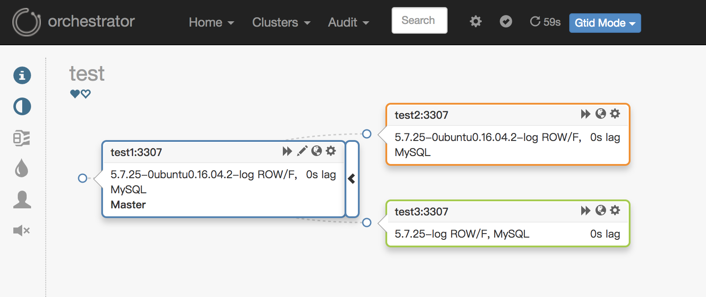
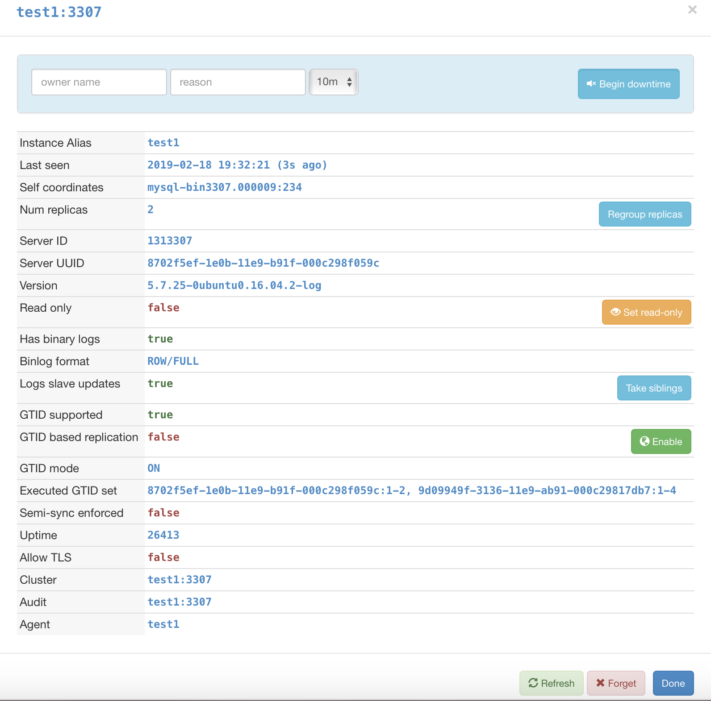
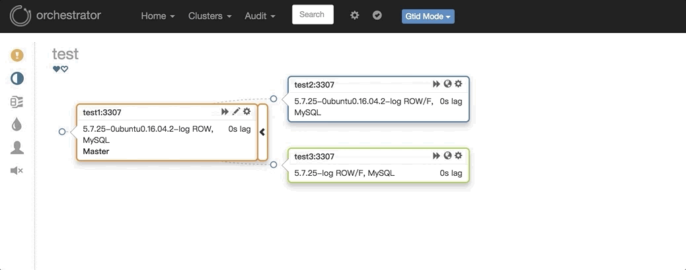
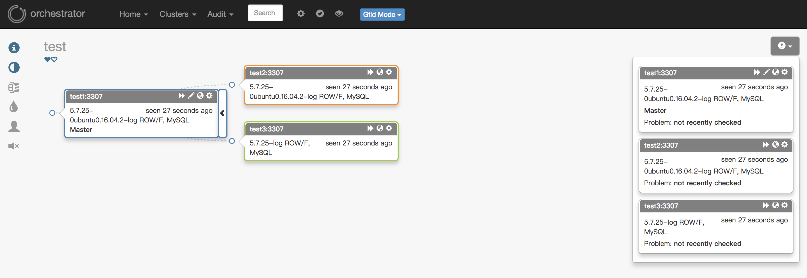
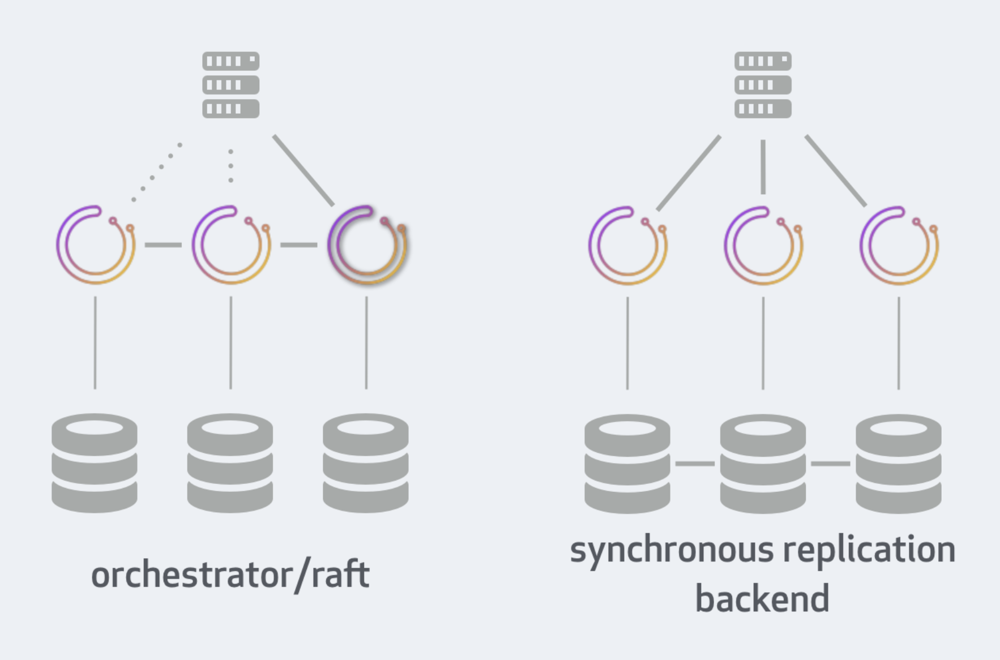

## 背景

在上一篇「[MySQL高可用复制管理工具 —— Orchestrator介绍](https://www.cnblogs.com/zhoujinyi/p/10387581.html)」中大致介绍了[Orchestrator](https://github.com/github/orchestrator)的功能、配置和部署，当然最详细的说明可以查阅[官方文档](https://github.com/github/orchestrator)。本文开始对[Orchestrator](https://github.com/github/orchestrator)的各方面进行测试和说明。

## 测试说明

### 环境介绍

服务器环境：

```
三台服务器
1：MySQL实例（3306是orch的后端数据库，3307是MySQL主从架构「开启GTID」）
Master ：192.168.163.131:3307
Slave  ：192.168.163.132:3307
Slave  ：192.168.163.133:3307

2：hosts（etc/hosts）：
192.168.163.131 test1
192.168.163.132 test2
192.168.163.133 test3
```

这里需要注意的是，orch检测主库宕机依赖从库的IO线程（本身连不上主库后，还会通过从库再去检测主库是否异常），所以默认change搭建的主从感知主库宕机的等待时间过长，需要需要稍微改下：

```
change master to master_host='192.168.163.131',master_port=3307,master_user='rep',master_password='rep',master_auto_position=1,MASTER_HEARTBEAT_PERIOD=2,MASTER_CONNECT_RETRY=1, MASTER_RETRY_COUNT=86400;
set global slave_net_timeout=8;
slave_net_timeout（全局变量）：MySQL5.7.7之后，默认改成60秒。该参数定义了从库从主库获取数据等待的秒数，超过这个时间从库会主动退出读取，中断连接，并尝试重连。
```

[master_heartbeat_period](http://dev.mysql.com/doc/refman/5.7/en/change-master-to.html)：复制心跳的周期。默认是[slave_net_timeout](https://dev.mysql.com/doc/refman/5.7/en/replication-options-slave.html#sysvar_slave_net_timeout)的一半。Master在没有数据的时候，每[master_heartbeat_period](http://dev.mysql.com/doc/refman/5.7/en/change-master-to.html)秒发送一个心跳包，这样 Slave 就能知道 Master 是不是还正常。

slave_net_timeout是设置在多久没收到数据后认为网络超时，之后 Slave 的 IO 线程会重新连接 Master 。结合这两个设置就可以避免由于网络问题导致的复制延误。master_heartbeat_period 单位是秒，可以是个带上小数，如 10.5，最高精度为 1 毫秒。

```
重试策略为：备库过了slave-net-timeout秒还没有收到主库来的数据，它就会开始第一次重试。然后每过 master-connect-retry 秒，备库会再次尝试重连主库。直到重试了 master-retry-count 次，它才会放弃重试。如果重试的过程中，连上了主库，那么它认为当前主库是好的，又会开始 slave-net-timeout 秒的等待。
slave-net-timeout 的默认值是 60 秒， master-connect-retry 默认为 60 秒， master-retry-count 默认为 86400 次。也就是说，如果主库一分钟都没有任何数据变更发送过来，备库才会尝试重连主库。
```

这样，主库宕机之后，约8~10秒感知主库异常，[Orchestrator](https://github.com/github/orchestrator)开始切换。另外还需要注意的是，orch默认是用主机名来进行管理的，需要在mysql的配置文件里添加：report_host和report_port参数。

数据库环境：

```
Orchestrator后端数据库：
在启动Orchestrator程序的时候，会自动在数据库里创建orchestrator数据库，保存orchestrator的一些数据信息。

Orchestrator管理的数据库：
在配置文件里配置的一些query参数，需要在每个被管理的目标库里有meta库来保留一些元信息（类似cmdb功能），比如用pt-heartbeat来验证主从延迟；用cluster表来保存别名、数据中心等。
```

如下面是测试环境的cluster表信息：

```
> CREATE TABLE `cluster` (
  `anchor` tinyint(4) NOT NULL,
  `cluster_name` varchar(128) CHARACTER SET ascii NOT NULL DEFAULT '',
  `cluster_domain` varchar(128) CHARACTER SET ascii NOT NULL DEFAULT '',
  `data_center` varchar(128) NOT NULL,
  PRIMARY KEY (`anchor`)
) ENGINE=InnoDB DEFAULT CHARSET=utf8

>select * from cluster;
+--------+--------------+----------------+-------------+
| anchor | cluster_name | cluster_domain | data_center |
+--------+--------------+----------------+-------------+
|      1 | test         | CaoCao         | BJ          |
+--------+--------------+----------------+-------------+
```

### 测试说明

开启[Orchestrator](https://github.com/github/orchestrator)进程：

```
./orchestrator --config=/etc/orchestrator.conf.json http
```

在浏览器里输入三台主机的任意主机的IP加端口（http://192.168.163.131:3000）进入到Web管理界面，在Clusters导航的Discover里输入任意一台被管理MySQL实例的信息。添加完成之后，Web界面效果：



在web上可以进行相关的管理，关于Web上的相关按钮的说明，下面会做相关说明：

**1.** **部分可修改的参数**(点击Web上需要被修改实例的任意图标）：



说明

```
Instance Alias ：实例别名
Last seen       :  最后检测时间
Self coordinates ：自身的binlog位点信息
Num replicas ：有几个从库
Server ID    ： MySQL server_id
Server UUID ：    MySQL UUID
Version ：    版本
Read only ： 是否只读
Has binary logs ：是否开启binlog
Binlog format    ：binlog 模式
Logs slave updates ：是否开启log_slave_updates
GTID supported ：是否支持GTID
GTID based replication ：是否是基于GTID的复制
GTID mode    ：复制是否开启了GTID
Executed GTID set ：复制中执行过的GTID列表
Uptime ：启动时间
Allow TLS ：是否开启TLS
Cluster ：集群别名
Audit ：审计实例
Agent ：Agent实例
```

说明：上面图中，后面有按钮的都是可以在Web上进行修改的功能，如：是否只读，是否开启GTID的复制等。其中Begin Downtime 会将实例标记为已停用，此时如果发生Failover，该实例不会参与。

**2. 任意改变主从的拓扑结构**：可以直接在图上拖动变更复制，会自动恢复拓扑关系：


**3. 主库挂了之后自动Failover**，如：



图中显示，当主挂掉之后，拓扑结构里自动剔除该主节点，选择一个最合适的从库提升成主库，并修复复制拓扑。在Failover过程当中，可以查看/tmp/recovery.log文件（配置文件里定死），里面包含了在Failover过程中Hooks执行的外部脚本，类似MHA的master_ip_failover_script参数。可以通过外部脚本进行相应的如：VIP切换、Proxy修改、DNS修改、中间件修改、LVS修改等等，具体的执行脚本可以根据自己的实际情况编写。

**4. [Orchestrator](https://github.com/github/orchestrator)[高可用](https://github.com/github/orchestrator/blob/master/docs/raft-vs-sync-repl.md)**。因为在一开始就已经部署了3台，通过[配置文件](https://github.com/github/orchestrator/blob/master/docs/configuration-raft.md)里的[Raft](https://github.com/github/orchestrator/blob/master/docs/deployment-raft.md)参数进行通信。只要有2个节点的[Orchestrator](https://github.com/github/orchestrator)正常，就不会影响使用，如果出现2个节点的[Orchestrator](https://github.com/github/orchestrator)异常，则Failover会失败。2个节点异常的图如下：



图中的各个节点全部显示灰色，此时Raft算法失效，导致Orch的Failover功能失败。相对比MHA的Manager的单点，[Orchestrator](https://github.com/github/orchestrator)通过Raft算法解决了本身的高可用性以及解决网络隔离问题，特别是跨数据中心网络异常。这里说明下Raft，通过共识算法：

   [Orchestrator](https://github.com/github/orchestrator)节点能够选择具有仲裁的领导者（leader）。如有3个orch节点，其中一个可以成为leader（3节点仲裁大小为2，5节点仲裁大小为3）。只允许leader进行修改，每个MySQL拓扑服务器将由三个不同的orchestrator节点独立访问，在正常情况下，三个节点将看到或多或少相同的拓扑图，但他们每个都会独立分析写入其自己的专用后端数据库服务器：

① 所有更改都必须通过leader。

② 在启用raft模式上禁止使用orchestrator客户端。

③ 在启用raft模式上使用orchestrator-client，orchestrator-client可以安装在没有orchestrator上的服务器。

④ 单个orchestrator节点的故障不会影响orchestrator的可用性。在3节点设置上，最多一个服务器可能会失败。在5节点设置上，2个节点可能会失败。

⑤ Orchestrator节点异常关闭，然后再启动。它将重新加入Raft组，并接收遗漏的任何事件,只要有足够的Raft记录。

⑥ 要加入比日志保留允许的更长/更远的orchestrator节点或者数据库完全为空的节点，需要从另一个活动节点[克隆后端DB](https://github.com/github/orchestrator/blob/master/docs/raft.md#behavior-and-implications-of-orchestratorraft-setup)。

关于Raft更多的信息见：https://github.com/github/orchestrator/blob/master/docs/raft.md

[Orchestrator](https://github.com/github/orchestrator)的[**高可用有2种方式**](https://github.com/github/orchestrator/blob/master/docs/raft-vs-sync-repl.md)，第一种就是上面说的通过[Raft](https://github.com/github/orchestrator/blob/master/docs/deployment-raft.md)（推荐），另一种是通过[后端数据库的同步](https://github.com/github/orchestrator/blob/master/docs/deployment-shared-backend.md)。详细信息见[文档](https://github.com/github/orchestrator/blob/master/docs/raft-vs-sync-repl.md)。文档里详细比较了两种高可用性部署方法。两种方法的图如下：



到这里，[Orchestrator](https://github.com/github/orchestrator)的基本功能已经实现，包括主动Failover、修改拓扑结构以及Web上的可视化操作。

**5. Web上各个按钮的功能说明**

①：Home下的status：查看orch的状态：包括运行时间、版本、后端数据库以及各个Raft节点的状态。

②：Cluster下的dashboard：查看orch下的所有被管理的MySQL实例。

③：Cluster下的Failure analysis：查看故障分析以及包括记录的故障类型列表。

④：Cluster下的Discover：用来发现被管理的MySQL实例。

⑤：Audit下的Failure detection：故障检测信息，包含历史信息。

⑥：Audit下的Recovery：故障恢复信息以及故障确认。

⑦：Audit下的[Agent](https://github.com/github/orchestrator-agent)：是一个在MySQL主机上运行并与orchestrator通信的服务，能够向orch提供操作系统，文件系统和LVM信息，以及调用某些命令和脚本。

⑧：导航栏里的图标，对应左边导航栏的图标：

第1行：集群别名的查看修改。

第2行：pools。

第3行：Compact display，紧凑展示。

第4行：Pool indicator，池指示器。

第5行：Colorize DC，每个数据中心用不同颜色展示。

第6行：Anonymize，匿名集群中的主机名。

注意：左边导航栏里的图标，表示实例的概括：实例名、别名、故障检测和恢复等信息。

⑧：导航栏里的图标，表示是否禁止全局恢复。禁止掉的话不会进行Failover。

⑨：导航栏里的图标，表示是否开启刷新页面（默认60一次）。

⑩：导航栏里的图标，表示MySQL实例迁移模式。

```
Smart mode：自动选择迁移模式，让Orch自己选择迁移模式。
Classic mode：经典迁移模式，通过binlog和position进行迁移。
GTID mode：GTID迁移模式。
Pseudo GTID mode：伪GTID迁移模式。
```

到此，[Orchestrator](https://github.com/github/orchestrator)的基本测试和Web说明已经介绍完毕。和MHA比已经有很大的体验提升，不仅在Web进行部分参数的设置修改，还可以改变复制拓扑，最重要的是解决MHA Manager单点的问题。还有什么理由不替换MHA呢？:)

## 工作流程说明

[Orchestrator](https://github.com/github/orchestrator)实现了自动Failover，现在来看看自动Failover的大致流程是怎么样的。

**1.** [**检测流程**](https://github.com/github/orchestrator/blob/master/docs/failure-detection.md)

① orchestrator利用复制拓扑，先检查主本身，并观察其slaves。

② 如果orchestrator本身连不上主，可以连上该主的从，则通过从去检测，若在从上也看不到主（IO Thread）「2次检查」，判断Master宕机。

该检测方法比较合理，当从都连不上主了，则复制肯定有出问题，故会进行切换。所以在生产中非常可靠。

检测发生故障后并不都会进行自动恢复，比如：禁止全局恢复、设置了shutdown time、上次恢复离本次恢复时间在RecoveryPeriodBlockSeconds设置的时间内、失败类型不被认为值得恢复等。检测与恢复无关，但始终启用。 每次检测都会执行OnFailureDetectionProcesses Hooks。

[配置故障检测](https://github.com/github/orchestrator/blob/master/docs/configuration-failure-detection.md)：

```
{
  "FailureDetectionPeriodBlockMinutes": 60,
}

Hooks相关参数：
{
  "OnFailureDetectionProcesses": [
    "echo 'Detected {failureType} on {failureCluster}. Affected replicas: {countReplicas}' >> /tmp/recovery.log"
  ],
}

MySQL复制相关调整：
slave_net_timeout
MASTER_CONNECT_RETRY
```

**2. [恢复流程](https://github.com/github/orchestrator/blob/master/docs/topology-recovery.md)**

 恢复的实例需要支持：GTID、伪GTID、开启Binlog。[恢复的配置](https://github.com/github/orchestrator/blob/master/docs/configuration-recovery.md)如下：

```
{
  "RecoveryPeriodBlockSeconds": 3600,
  "RecoveryIgnoreHostnameFilters": [],
  "RecoverMasterClusterFilters": [
    "thiscluster",
    "thatcluster"
  ],
  "RecoverMasterClusterFilters": ["*"],
  "RecoverIntermediateMasterClusterFilters": [
    "*"
  ],
}

{
  "ApplyMySQLPromotionAfterMasterFailover": true,
  "PreventCrossDataCenterMasterFailover": false,
  "FailMasterPromotionIfSQLThreadNotUpToDate": true,
  "MasterFailoverLostInstancesDowntimeMinutes": 10,
  "DetachLostReplicasAfterMasterFailover": true,
}

Hooks：
{
  "PreGracefulTakeoverProcesses": [
    "echo 'Planned takeover about to take place on {failureCluster}. Master will switch to read_only' >> /tmp/recovery.log"
  ],
  "PreFailoverProcesses": [
    "echo 'Will recover from {failureType} on {failureCluster}' >> /tmp/recovery.log"
  ],
  "PostFailoverProcesses": [
    "echo '(for all types) Recovered from {failureType} on {failureCluster}. Failed: {failedHost}:{failedPort}; Successor: {successorHost}:{successorPort}' >> /tmp/recovery.log"
  ],
  "PostUnsuccessfulFailoverProcesses": [],
  "PostMasterFailoverProcesses": [
    "echo 'Recovered from {failureType} on {failureCluster}. Failed: {failedHost}:
    {failedPort}; Promoted: {successorHost}:{successorPort}' >> /tmp/recovery.log"
  ],
  "PostIntermediateMasterFailoverProcesses": [],
  "PostGracefulTakeoverProcesses": [
    "echo 'Planned takeover complete' >> /tmp/recovery.log"
  ],
}
```

具体的参数含义请参考「[MySQL高可用复制管理工具 —— Orchestrator介绍](https://www.cnblogs.com/zhoujinyi/p/10387581.html)」。在执行故障检测和恢复的时候都可以执行外部自定义脚本（hooks），来配合使用（VIP、Proxy、DNS）。

**可以恢复中继主库（DeadIntermediateMaster）和主库：**

中继主库：恢复会找其同级的节点进行做主从。匹配副本按照哪些实例具有log-slave-updates、实例是否延迟、它们是否具有复制过滤器、哪些版本的MySQL等等

主库：恢复可以指定提升特定的从库「提升规则」（register-candidate），提升的从库不一定是最新的，而是选择最合适的，设置完提升规则之后，有效期为1个小时。

提升规则选项有：

```
prefer      --比较喜欢
neutral    --中立（默认）
prefer_not --比较不喜欢
must_not  --拒绝
```

恢复支持的类型有：[自动恢复](https://github.com/github/orchestrator/blob/master/docs/topology-recovery.md#automated-recovery)、[优雅的恢复](https://github.com/github/orchestrator/blob/master/docs/topology-recovery.md#graceful-master-promotion)、[手动恢复](https://github.com/github/orchestrator/blob/master/docs/topology-recovery.md#manual-recovery)、[手动强制恢复](https://github.com/github/orchestrator/blob/master/docs/topology-recovery.md#manual-forced-failover)，恢复的时候也可以执行相应的[Hooks参数](https://github.com/github/orchestrator/blob/master/docs/topology-recovery.md#recovery-hooks)。具体的恢复流程可以看**[恢复流程](https://github.com/github/orchestrator/blob/master/docs/topology-recovery.md)**的说明。关于[恢复的配置](https://github.com/github/orchestrator/blob/master/docs/configuration-recovery.md)可以[官方说明](https://github.com/github/orchestrator/blob/master/docs/configuration-recovery.md)。

**补充：**每次恢复除了自动的Failover之外，都需要配合执行自己定义的Hooks的脚本来处理外部的一些操作：VIP修改、DNS修改、Proxy修改等等。所以这么多Hooks的参数该如何设置呢？哪个参数需要执行，哪个参数不需要执行，以及Hooks的执行顺序是怎么样的？虽然文章里有介绍，但为了更好的进行说明，下面进行各种恢复场景执行Hooks的顺序：

```
 主库宕机，自动Failover
②  Detected UnreachableMaster on test1:3307. Affected replicas: 2
②  Detected DeadMaster on test1:3307. Affected replicas: 2
③  Will recover from DeadMaster on test1:3307
④  Recovered from DeadMaster on test1:3307. Failed: test1:3307; Promoted: test2:3307
⑤  (for all types) Recovered from DeadMaster on test1:3307. Failed: test1:3307; Successor: test2:3307

 优雅的主从切换：test2:3307优雅的切换到test1:3307，切换之后需要手动执行start slave
  orchestrator-client -c graceful-master-takeover -a test2:3307 -d test1:3307
①  Planned takeover about to take place on test2:3307. Master will switch to read_only
②  Detected DeadMaster on test2:3307. Affected replicas: 1
③  Will recover from DeadMaster on test2:3307
④  Recovered from DeadMaster on test2:3307. Failed: test2:3307; Promoted: test1:3307
⑤  (for all types) Recovered from DeadMaster on test2:3307. Failed: test2:3307; Successor: test1:3307
⑦ Planned takeover complete

 手动恢复，当从库进入停机或则维护模式，此时主库宕机，不会自动Failover，需要手动执行恢复，指定死掉的主实例：
  orchestrator-client -c recover -i test1:3307
②  Detected UnreachableMaster on test1:3307. Affected replicas: 2
②  Detected DeadMaster on test1:3307. Affected replicas: 2
③  Will recover from DeadMaster on test1:3307
④  Recovered from DeadMaster on test1:3307. Failed: test1:3307; Promoted: test2:3307
⑤  (for all types) Recovered from DeadMaster on test1:3307. Failed: test1:3307; Successor: test2:3307

 手动强制恢复，不管任何情况，都进行恢复：
  orchestrator-client -c force-master-failover -i test2:3307
②  Detected DeadMaster on test2:3307. Affected replicas: 2
③  Will recover from DeadMaster on test2:3307
②  Detected AllMasterSlavesNotReplicating on test2:3307. Affected replicas: 2
④  Recovered from DeadMaster on test2:3307. Failed: test2:3307; Promoted: test1:3307
⑤  (for all types) Recovered from DeadMaster on test2:3307. Failed: test2:3307; Successor: test1:3307
```

其中上面的情况下，⑥和⑧都没执行。因为⑥是执行中间主库时候执行的，没有中间主库（级联复制）可以不用设置。⑧是恢复失败的时候执行的，上面恢复没有出现失败，可以定义一些告警提醒。

## 生产环境上部署

在生产上部署[Orchestrator](https://github.com/github/orchestrator)，可以参考[文档](https://github.com/github/orchestrator/blob/master/docs/deployment.md)。

**1.** [Orchestrator](https://github.com/github/orchestrator)首先需要确认本身高可用的后端数据库是用单个MySQL，MySQL复制还是本身的Raft。

**2.** 运行发现服务（web、orchestrator-client） 

```
orchestrator-client -c discover -i this.hostname.com
```

**3.** 确定提升规则（某些服务器更适合被提升）

```
orchestrator -c register-candidate -i ${::fqdn} --promotion-rule ${promotion_rule}
```

**4.** 如果服务器出现问题，将在Web界面上的问题下拉列表中显示。使用[Downtiming](https://github.com/github/orchestrator/blob/master/docs/deployment.md#downtiming)则不会在问题列表里显示，并且也不会进行恢复，处于维护模式。

```
orchestrator -c begin-downtime -i ${::fqdn} --duration=5m --owner=cron --reason=continuous_downtime"

也可以用API：
curl -s "http://my.orchestrator.service:80/api/begin-downtime/my.hostname/3306/wallace/experimenting+failover/45m"
```

**5.** [伪GTID](https://github.com/github/orchestrator/blob/master/docs/deployment.md#pseudo-gtid)，如果MySQL没有开启GTID，则可以开启伪GTID实现类似GTID的功能。

**6.** 保存[元数据](https://github.com/github/orchestrator/blob/master/docs/deployment.md#populating-meta-data)，元数据大部分通过参数的query来获取，比如在自的表cluster里获取集群的别名(DetectClusterAliasQuery)、数据中心(DetectDataCenterQuery)、域名(DetectClusterDomainQuery)等，以及复制的延迟（pt-heartbeat）、是否半同步(DetectSemiSyncEnforcedQuery)。以及可以通过正则匹配：DataCenterPattern、PhysicalEnvironmentPattern等。

**7.** 可以给实例打[标签](https://github.com/github/orchestrator/blob/master/docs/tags.md)。

## 命令行、API的使用

[Orchestrator](https://github.com/github/orchestrator)不仅有Web界面来进行查看和管理，还可以通过命令行（[orchestrator-client](https://github.com/github/orchestrator/blob/622e979722bf433232ae267727933ba055cdbfed/docs/orchestrator-client.md#orchestrator-client)）和API（curl）来执行更多的管理命令，现在来说明几个比较常用方法。

通过help来看下有哪些可以执行的命令：./orchestrator-client --help，命令的说明可以看[手册说明](https://github.com/github/orchestrator/blob/622e979722bf433232ae267727933ba055cdbfed/go/app/command_help.go)。

[orchestrator-client](https://github.com/github/orchestrator/blob/622e979722bf433232ae267727933ba055cdbfed/docs/orchestrator-client.md#orchestrator-client)不需要和[Orchestrator](https://github.com/github/orchestrator)服务放一起，不需要访问后端数据库，在任意一台上都可以。

**注意：**因为配置了Raft，有多个Orchestrator，所以需要ORCHESTRATOR_API的环境变量，orchestrator-client会自动选择leader。如：

```
export ORCHESTRATOR_API="test1:3000/api test2:3000/api test3:3000/api"
```

\1. 列出所有集群：clusters

默认：

```
# orchestrator-client -c clusters
test2:3307
```

返回包含集群别名：clusters-alias

```
# orchestrator-client -c clusters-alias
test2:3307,test
```

\2. 发现指定实例：discover/async-discover

同步发现：

```
# orchestrator-client -c discover -i test1:3307
test1:3307
```

异步发现：适用于批量

```
# orchestrator-client -c async-discover -i test1:3307
:null
```

\3. 忘记指定对象：forget/forget-cluster

忘记指定实例：

```
# orchestrator-client -c forget -i test1:3307
```

忘记指定集群：

```
# orchestrator-client -c forget-cluster -i test
```

\4. 打印指定集群的拓扑：topology/topology-tabulated

普通返回：

```
# orchestrator-client -c topology -i test1:3307
test2:3307   [0s,ok,5.7.25-0ubuntu0.16.04.2-log,rw,ROW,>>,GTID]
+ test1:3307 [0s,ok,5.7.25-0ubuntu0.16.04.2-log,ro,ROW,>>,GTID]
+ test3:3307 [0s,ok,5.7.25-log,ro,ROW,>>,GTID]
```

列表返回：

```
# orchestrator-client -c topology-tabulated -i test1:3307
test2:3307  |0s|ok|5.7.25-0ubuntu0.16.04.2-log|rw|ROW|>>,GTID
+ test1:3307|0s|ok|5.7.25-0ubuntu0.16.04.2-log|ro|ROW|>>,GTID
+ test3:3307|0s|ok|5.7.25-log                 |ro|ROW|>>,GTID
```

\5. 查看使用哪个API：自己会选择出leader。which-api

```
# orchestrator-client -c which-api
test3:3000/api
```

也可以通过 http://192.168.163.133:3000/api/leader-check 查看。

\6. 调用api请求，需要和 -path 参数一起：api..-path

```
# orchestrator-client -c api -path clusters
[ "test2:3307" ]
# orchestrator-client -c api -path leader-check
"OK"
# orchestrator-client -c api -path status
{ "Code": "OK", "Message": "Application node is healthy"...}
```

\7. 搜索实例：search

```
# orchestrator-client -c search -i test
test2:3307
test1:3307
test3:3307
```

\8. 打印指定实例的主库：which-master 

```
# orchestrator-client -c which-master -i test1:3307
test2:3307
# orchestrator-client -c which-master -i test3:3307
test2:3307
# orchestrator-client -c which-master -i test2:3307 #自己本身是主库
:0
```

\9. 打印指定实例的从库：which-replicas 

```
# orchestrator-client -c which-replicas -i test2:3307
test1:3307
test3:3307
```

\10. 打印指定实例的实例名：which-instance 

```
# orchestrator-client -c instance -i test1:3307
test1:3307
```

\11. 打印指定主实例从库异常的列表：which-broken-replicas，模拟test3的复制异常：

```
# orchestrator-client -c which-broken-replicas -i test2:3307
test3:3307
```

\12. 给出一个实例或则集群别名，打印出该实例所在集群下的所有其他实例。which-cluster-instances

```
# orchestrator-client -c which-cluster-instances -i test
test1:3307
test2:3307
test3:3307
root@test1:~# orchestrator-client -c which-cluster-instances -i test1:3307
test1:3307
test2:3307
test3:3307
```

\13. 给出一个实例，打印该实的集群名称：默认是hostname:port。which-cluster 

```
# orchestrator-client -c which-cluster -i test1:3307
test2:3307# orchestrator-client -c which-cluster -i test2:3307
test2:3307# orchestrator-client -c which-cluster -i test3:3307
test2:3307
```

\14. 打印出指定实例/集群名或则所有所在集群的可写实例，：which-cluster-master

指定实例：which-cluster-master

```
# orchestrator-client -c which-cluster-master -i test2:3307
test2:3307
# orchestrator-client -c which-cluster-master -i test
test2:3307
```

所有实例：all-clusters-masters，每个集群返回一个

```
# orchestrator-client -c all-clusters-masters
test1:3307
```

\15. 打印出所有实例：all-instances

```
# orchestrator-client -c all-instances
test2:3307
test1:3307
test3:3307
```

\16. 打印出集群中可以作为pt-online-schema-change操作的副本列表：which-cluster-osc-replicas 

```
~# orchestrator-client -c which-cluster-osc-replicas -i test
test1:3307
test3:3307
root@test1:~# orchestrator-client -c which-cluster-osc-replicas -i test2:3307
test1:3307
test3:3307
```

\17. 打印出集群中可以作为pt-online-schema-change可以操作的健康的副本列表：which-cluster-osc-running-replicas

```
# orchestrator-client -c which-cluster-osc-running-replicas -i test
test1:3307
test3:3307
# orchestrator-client -c which-cluster-osc-running-replicas -i test1:3307
test1:3307
test3:3307
```

\18. 打印出所有在维护（downtimed）的实例：downtimed

```
# orchestrator-client -c downtimed
test1:3307
test3:3307
```

\19. 打印出进群中主的数据中心：dominant-dc

```
# orchestrator-client -c dominant-dc
BJ
```

\20. 将集群的主提交到KV存储。submit-masters-to-kv-stores

```
# orchestrator-client -c submit-masters-to-kv-stores 
mysql/master/test:test2:3307
mysql/master/test/hostname:test2
mysql/master/test/port:3307
mysql/master/test/ipv4:192.168.163.132
mysql/master/test/ipv6:
```

\21. 迁移从库到另一个实例上：relocate

```
# orchestrator-client -c relocate -i test3:3307 -d test1:3307   #迁移test3:3307作为test1:3307的从库
test3:3307<test1:3307

查看
# orchestrator-client -c topology -i test2:3307
test2:3307     [0s,ok,5.7.25-0ubuntu0.16.04.2-log,rw,ROW,>>,GTID]
+ test1:3307   [0s,ok,5.7.25-0ubuntu0.16.04.2-log,ro,ROW,>>,GTID]
  + test3:3307 [0s,ok,5.7.25-log,ro,ROW,>>,GTID]
```

\22. 迁移一个实例的所有从库到另一个实例上：relocate-replicas

```
# orchestrator-client -c relocate-replicas -i test1:3307 -d test2:3307   #迁移test1:3307下的所有从库到test2:3307下，并列出被迁移的从库的实例名
test3:3307
```

\23. 将slave在拓扑上向上移动一级，对应web上的是在Classic Model下进行拖动：move-up

```
# orchestrator-client -c move-up -i test3:3307 -d test2:3307
test3:3307<test2:3307
```

 结构从 test2:3307 -> test1:3307 -> test3:3307 变成 test2:3307 -> test1:3307

　　　　　　　　　　　　　　　　　　　　　　　　　　　　　 -> test3:3307

\24. 将slave在拓扑上向下移动一级（移到同级的下面），对应web上的是在Classic Model下进行拖动：move-below

```
# orchestrator-client -c move-below -i test3:3307 -d test1:3307
test3:3307<test1:3307
```

 结构从 test2:3307 -> test1:3307 变成 test2:3307 -> test1:3307 -> test3:3307

　　　　　　 　  -> test3:3307

\25. 将给定实例的所有从库在拓扑上向上移动一级，基于Classic Model模式：move-up-replicas

```
# orchestrator-client -c move-up-replicas -i test1:3307  
 test3:3307
```

 结构从 test2:3307 -> test1:3307 -> test3:3307 变成 test2:3307 -> test1:3307

　　　　　　　　　　　　　　　　　　　　　　　　　　 　　-> test3:3307

\26. 创建主主复制，将给定实例直接和当前主库做成主主复制：make-co-master

```
# orchestrator-client -c make-co-master -i test1:3307
test1:3307<test2:3307
```

27.将实例转换为自己主人的主人，切换两个：take-master 

```
# orchestrator-client -c take-master -i test3:3307
test3:3307<test2:3307
```

结构从 test2:3307 -> test1:3307 -> test3:3307 变成 test2:3307 -> test3:3307 -> test1:3307

\28. 通过GTID移动副本，move-gtid：

通过[orchestrator-client](https://github.com/github/orchestrator/blob/622e979722bf433232ae267727933ba055cdbfed/docs/orchestrator-client.md#orchestrator-client)执行报错：

```
# orchestrator-client -c move-gtid -i test3:3307 -d test1:3307
parse error: Invalid numeric literal at line 1, column 9
parse error: Invalid numeric literal at line 1, column 9
parse error: Invalid numeric literal at line 1, column 9
```

通过orchestrator执行是没问题，需要添加--ignore-raft-setup参数：

```
# orchestrator -c move-gtid -i test3:3307 -d test2:3307 --ignore-raft-setup
test3:3307<test2:3307
```

29.通过GTID移动指定实例下的所有slaves到另一个实例，move-replicas-gtid

通过[orchestrator-client](https://github.com/github/orchestrator/blob/622e979722bf433232ae267727933ba055cdbfed/docs/orchestrator-client.md#orchestrator-client)执行报错：

```
# orchestrator-client -c move-replicas-gtid -i test3:3307 -d test1:3307
jq: error (at <stdin>:1): Cannot index string with string "Key"
```

通过orchestrator执行是没问题，需要添加--ignore-raft-setup参数： 

```
# ./orchestrator -c move-replicas-gtid -i test2:3307 -d test1:3307 --ignore-raft-setup
test3:3307
```

\30. 将给定实例的同级slave，变更成他的slave，take-siblings

```
# orchestrator-client -c take-siblings -i test3:3307
test3:3307<test1:3307
```

结构从 test1:3307 -> test2:3307 变成 test1:3307 -> test3:3307 -> test2:3307

　　　　　　 　  -> test3:3307

\31. 给指定实例打上标签，tag

```
# orchestrator-client -c tag -i test1:3307 --tag 'name=AAA'
test1:3307 
```

\32. 列出指定实例的标签，tags：

```
# orchestrator-client -c tags -i test1:3307
name=AAA 
```

\33. 列出给定实例的标签值：tag-value

```
# orchestrator-client -c tag-value -i test1:3307 --tag "name"
AAA
```

\34. 移除指定实例上的标签：untag

```
# orchestrator-client -c untag -i test1:3307 --tag "name=AAA"
test1:3307 
```

\35. 列出打过某个标签的实例，tagged：

```
# orchestrator-client -c tagged -t name
test3:3307
test1:3307
test2:3307
```

\36. 标记指定实例进入停用模式，包括时间、操作人、和原因，begin-downtime：

```
# orchestrator-client -c begin-downtime -i test1:3307 -duration=10m -owner=zjy -reason 'test'
test1:3307
```

\37. 移除指定实例的停用模式，end--downtime：

```
# orchestrator-client -c end-downtime -i test1:3307
test1:3307
```

\38. 请求指定实例上的维护锁：拓扑更改需要将锁放在最小受影响的实例上，以避免在同一个实例上发生两个不协调的操作，begin-maintenance ：

```
# orchestrator-client -c begin-maintenance -i test1:3307 --reason "XXX"
test1:3307
```

锁默认10分钟后过期，有参数MaintenanceExpireMinutes。

\39. 移除指定实例上的维护锁：end-maintenance

```
# orchestrator-client -c end-maintenance -i test1:3307
test1:3307
```

\40. 设置提升规则，恢复时可以指定一个实例进行提升：register-candidate：需要和promotion-rule一起使用

```
# orchestrator-client -c register-candidate -i test3:3307 --promotion-rule prefer 
test3:3307
```

提升test3:3307的权重，如果进行Failover，会成为Master。

\41. 指定实例执行停止复制：

普通的：stop slave：stop-replica

```
# orchestrator-client -c stop-replica -i test2:3307
test2:3307
```

应用完relay log，在stop slave：stop-replica-nice

```
# orchestrator-client -c stop-replica-nice -i test2:3307
test2:3307
```

42.指定实例执行开启复制： start-replica 

```
# orchestrator-client -c start-replica -i test2:3307
test2:3307
```

\43. 指定实例执行复制重启：restart-replica

```
# orchestrator-client -c restart-replica -i test2:3307
test2:3307
```

44.指定实例执行复制重置：reset-replica

```
# orchestrator-client -c reset-replica -i test2:3307
test2:3307
```

45.分离副本：非GTID修改binlog position，detach-replica ：

```
# orchestrator-client -c detach-replica -i test2:3307
```

46.恢复副本：reattach-replica 

```
# orchestrator-client -c reattach-replica  -i test2:3307 
```

47.分离副本：注释master_host来分离，detach-replica-master-host ：如Master_Host: //test1

```
# orchestrator-client -c detach-replica-master-host -i test2:3307
test2:3307
```

\48. 恢复副本：reattach-replica-master-host

```
# orchestrator-client -c reattach-replica-master-host -i test2:3307
test2:3307
```

\49. 跳过SQL线程的Query，如主键冲突，支持在GTID和非GTID下：skip-query 

```
# orchestrator-client -c skip-query -i test2:3307
test2:3307
```

\50. 将错误的GTID事务当做空事务应用副本的主上：gtid-errant-inject-empty「web上的fix」

```
# orchestrator-client -c gtid-errant-inject-empty  -i test2:3307
test2:3307 
```

\51. 通过RESET MASTER删除错误的GTID事务：gtid-errant-reset-master 

```
# orchestrator-client -c gtid-errant-reset-master  -i test2:3307
test2:3307
```

\52. 设置半同步相关的参数:

```
orchestrator-client -c $variable -i test1:3307
    enable-semi-sync-master      主上执行开启半同步
    disable-semi-sync-master      主上执行关闭半同步
    enable-semi-sync-replica       从上执行开启半同步
    disable-semi-sync-replica      从上执行关闭半同步
```

\53. 执行需要stop/start slave配合的SQL：restart-replica-statements

```
# orchestrator-client -c restart-replica-statements -i test3:3307 -query "change master to auto_position=1" | jq .[] -r 
stop slave io_thread;
stop slave sql_thread;
change master to auto_position=1;
start slave sql_thread;
start slave io_thread;

# orchestrator-client -c restart-replica-statements -i test3:3307 -query "change master to master_auto_position=1" | jq .[] -r  |  mysql -urep -p -htest3 -P3307
Enter password: 
```

54.根据复制规则检查实例是否可以从另一个实例复制(GTID和非GTID）：

非GTID，can-replicate-from： 

```
# orchestrator-client -c can-replicate-from -i test3:3307 -d test1:3307
test1:3307
```

GTID：can-replicate-from-gtid

```
# orchestrator-client -c can-replicate-from-gtid -i test3:3307 -d test1:3307
test1:3307 
```

\55. 检查指定实例是否在复制：is-replicating 

```
#有返回在复制
# orchestrator-client -c is-replicating -i test2:3307
test2:3307

#没有返回，不在复制
# orchestrator-client -c is-replicating -i test1:3307
```

56.检查指定实例的IO和SQL限制是否都停止： 

```
# orchestrator-client -c is-replicating -i test2:3307
```

57.将指定实例设置为只读，通过SET GLOBAL read_only=1，set-read-only：

```
# orchestrator-client -c set-read-only -i test2:3307
test2:3307
```

58.将指定实例设置为读写，通过SET GLOBAL read_only=0，set-writeable

```
# orchestrator-client -c set-writeable -i test2:3307
test2:3307
```

\59. 轮询指定实例的binary log，flush-binary-logs

```
# orchestrator-client -c flush-binary-logs -i test1:3307
test1:3307
```

\60. 手动执行恢复，指定一个死机的实例，recover：

```
# orchestrator-client -c recover -i test2:3307
test3:3307
```

测试下来，该参数会让处理停机或则维护状态下的实例进行强制恢复。结构：

test1:3307 -> test2:3307 -> test3:3307(downtimed) 当test2:3307死掉之后，此时test3:3307处于停机状态，不会进行Failover，执行后变成

test1:3307 -> test2:3307

　　　　　-> test3:3307

\61. 优雅的进行主和指定从切换，graceful-master-takeover：

```
# orchestrator-client -c graceful-master-takeover -a test1:3307 -d test2:3307
test2:3307
```

结构从test1:3307 -> test2:3307 变成 test2:3307 -> test1:3307。新主指定变成读写，新从变成只读，还需要手动start slave。

**注意需要配置：需要从元表里找到复制的账号和密码。**

```
"ReplicationCredentialsQuery":"SELECT repl_user, repl_pass from meta.cluster where anchor=1"
```

\62. 手动强制执行恢复，即使orch没有发现问题，force-master-failover：转移之后老主独立，需要手动加入到集群。

```
# orchestrator-client -c force-master-failover -i test1:3307
test3:3307
```

63.强行丢弃master并指定的一个实例，force-master-takeover：老主(test1)独立，指定从(test2)提升为master

```
# orchestrator-client -c force-master-takeover -i test1:3307 -d test2:3307
test2:3307
```

\64. 确认集群恢复理由，在web上的Audit->Recovery->Acknowledged 按钮确认，/ack-all-recoveries 

确认指定集群：ack-cluster-recoveries

```
# orchestrator-client -c ack-cluster-recoveries  -i test2:3307 -reason=''
test1:3307
```

确认所有集群：ack-all-recoveries 

```
# orchestrator-client -c ack-all-recoveries  -reason='OOOPPP'
eason=XYZ
```

65.检查、禁止、开启orchestrator执行全局恢复：

检查：check-global-recoveries

```
# orchestrator-client -c check-global-recoveries
enabled
```

禁止：disable-global-recoveries

```
# orchestrator-client -c disable-global-recoveries
disabled
```

开启：enable--global-recoveries

```
# orchestrator-client -c enable-global-recoveries
enabled
```

\66. 检查分析复制拓扑中存在的问题：replication-analysis

```
# orchestrator-client -c replication-analysis
test1:3307 (cluster test1:3307): ErrantGTIDStructureWarning
```

\67. raft检测：leader查看、健康监测、迁移leader：


```
查看leader节点
# orchestrator-client -c raft-leader
192.168.163.131:10008

健康监测
# orchestrator-client -c raft-health
healthy

leader 主机名
# orchestrator-client -c  raft-leader-hostname 
test1

指定主机选举leader
# orchestrator-client -c raft-elect-leader -hostname test3
test3
```

68.伪GTID相关参数：

```
match      #使用Pseudo-GTID指定一个从匹配到指定的另一个（目标）实例下
match-up #Transport the replica one level up the hierarchy, making it child of its grandparent, using Pseudo-GTID
match-up-replicas  #Matches replicas of the given instance one level up the topology, making them siblings of given instance, using Pseudo-GTID
last-pseudo-gtid #Dump last injected Pseudo-GTID entry on a server
```

到此关于[Orchestrator](https://github.com/github/orchestrator)的使用以及命令行说明已经介绍完毕，Web API可以在[Orchestrator API](https://github.com/github/orchestrator/blob/master/docs/topology-recovery.md#web-api-command-line)查看，通过命令行和API上的操作可以更好的进行自动化开发。

## 总结：

[Orchestrator](https://github.com/github/orchestrator)是一款开源(go编写)的MySQL复制拓扑管理工具，支持MySQL主从复制拓扑关系的调整、主库故障自动切换、手动主从切换等功能。提供Web界面展示MySQL集群的拓扑关系及状态，可以更改MySQL实例的部分配置信息，也提供命令行和api接口。相对比MHA，[Orchestrator](https://github.com/github/orchestrator)自身可以部署多个节点，通过raft分布式一致性协议来保证自身的高可用。

 

### **更多玩法**：[MySQL High Availability at GitHub](https://githubengineering.com/mysql-high-availability-at-github/)，翻译文 [GitHub 的 MySQL 高可用性实践分享](https://www.oschina.net/translate/mysql-high-availability-at-github?print)

\~~~~~~~~~~~~~~~ 万物之中,希望至美 ~~~~~~~~~~~~~~~