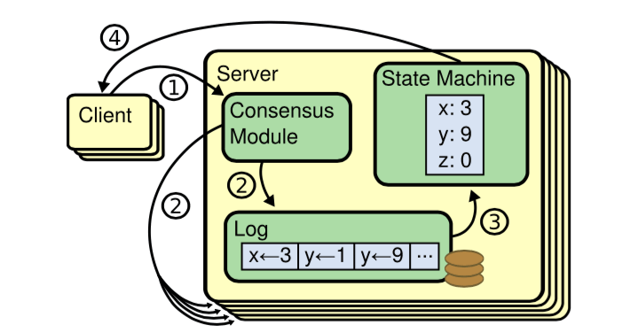
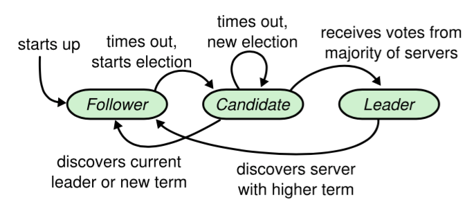
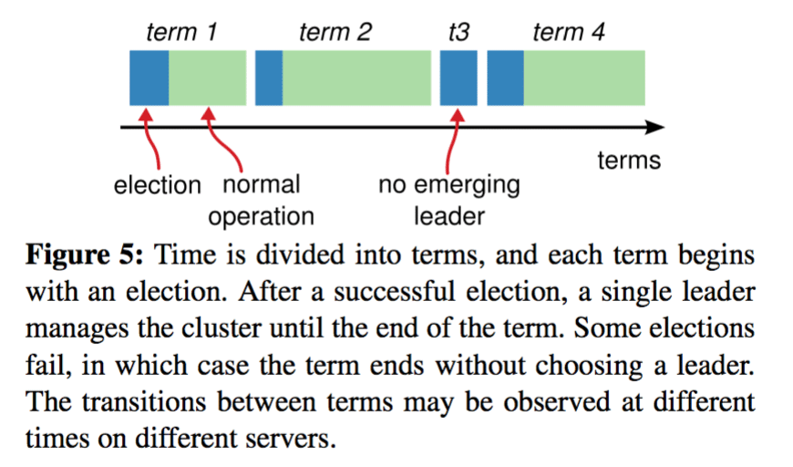

- #                  [     解读Raft（一 算法基础）        ](https://www.cnblogs.com/hzmark/p/raft.html)             

- 最近工作中讨论到了Raft协议相关的一些问题，正好之前读过多次Raft协议的那paper，所以趁着讨论做一次总结整理。

-  

- 我会将Raft协议拆成四个部分去总结：

-  

- 1. 算法基础
  2. 选举和日志复制
  3. 安全性
  4. 节点变更

-  

- 这是第一篇：《解读Raft（一 算法基础）》

-  

- ### 什么是RAFT

- 分布式系统除了提升整个体统的性能外还有一个重要特征就是提高系统的可靠性。

- 提供可靠性可以理解为系统中一台或多台的机器故障不会使系统不可用（或者丢失数据）。

- 保证系统可靠性的关键就是多副本（即数据需要有备份），一旦有多副本，那么久面临多副本之间的一致性问题。

- 一致性算法正是用于解决分布式环境下多副本之间数据一致性的问题的。

- 业界最著名的一致性算法就是大名鼎鼎的Paxos（Chubby的作者曾说过：世上只有一种一致性算法，就是Paxos）。但Paxos是出了名的难懂，而Raft正是为了探索一种更易于理解的一致性算法而产生的。

- > Raft is a consensus algorithm for managing a replicated log. 

- Raft是一种管理复制日志的一致性算法。

- 它的首要设计目的就是易于理解，所以在选主的冲突处理等方式上它都选择了非常简单明了的解决方案。

- Raft将一致性拆分为几个关键元素：

- - Leader选举
  - 日志复制
  - 安全性

- ### Raft算法

- 所有一致性算法都会涉及到状态机，而状态机保证系统从一个一致的状态开始，以相同的顺序执行一些列指令最终会达到另一个一致的状态。

- 

- 以上是状态机的示意图。所有的节点以相同的顺序处理日志，那么最终x、y、z的值在多个节点中都是一致的。

- #### 算法基础

- **角色**

- Raft通过选举Leader并由Leader节点负责管理日志复制来实现多副本的一致性。

- 在Raft中，节点有三种角色：

- - Leader：负责接收客户端的请求，将日志复制到其他节点并告知其他节点何时应用这些日志是安全的
  - Candidate：用于选举Leader的一种角色
  - Follower：负责响应来自Leader或者Candidate的请求

- 角色转换如下图所示：

- 

- - 所有节点初始状态都是Follower角色
  - 超时时间内没有收到Leader的请求则转换为Candidate进行选举
  - Candidate收到大多数节点的选票则转换为Leader；发现Leader或者收到更高任期的请求则转换为Follower
  - Leader在收到更高任期的请求后转换为Follower

- **任期**

- Raft把时间切割为任意长度的任期，每个任期都有一个任期号，采用连续的整数。

-  

- 

- 每个任期都由一次选举开始，若选举失败则这个任期内没有Leader；如果选举出了Leader则这个任期内有Leader负责集群状态管理。

- **算法**

- ***状态\***

- | 状态        | 所有节点上持久化的状态（在响应RPC请求之前变更且持久化的状态） |
  | ----------- | ------------------------------------------------------------ |
  | currentTerm | 服务器的任期，初始为0，递增                                  |
  | votedFor    | 在当前获得选票的候选人的 Id                                  |
  | log[]       | 日志条目集；每一个条目包含一个用户状态机执行的指令，和收到时的任期号 |

- | 状态        | 所有节点上非持久化的状态        |
  | ----------- | ------------------------------- |
  | commitIndex | 最大的已经被commit的日志的index |
  | lastApplied | 最大的已经被应用到状态机的index |

- | 状态         | Leader节点上非持久化的状态（选举后重新初始化）               |
  | ------------ | ------------------------------------------------------------ |
  | nextIndex[]  | 每个节点下一次应该接收的日志的index（初始化为Leader节点最后一个日志的Index + 1） |
  | matchIndex[] | 每个节点已经复制的日志的最大的索引（初始化为0，之后递增）    |

- ***AppendEntries RPC\***

- 用于Leader节点复制日志给其他节点，也作为心跳。

- | 参数         | 解释                           |
  | ------------ | ------------------------------ |
  | term         | Leader节点的任期               |
  | leaderId     | Leader节点的ID                 |
  | prevLogIndex | 此次追加请求的上一个日志的索引 |
  | prevLogTerm  | 此次追加请求的上一个日志的任期 |
  | entries[]    | 追加的日志（空则为心跳请求）   |
  | leaderCommit | Leader上已经Commit的Index      |

- prevLogIndex和prevLogTerm表示上一次发送的日志的索引和任期，用于保证收到的日志是连续的。

- | 返回值  | 解释                                                         |
  | ------- | ------------------------------------------------------------ |
  | term    | 当前任期号，用于Leader节点更新自己的任期（应该说是如果这个返回值比Leader自身的任期大，那么Leader需要更新自己的任期） |
  | success | 如何Follower节点匹配prevLogIndex和prevLogTerm，返回true      |

- *接收者实现逻辑*

- 1. 返回false，如果收到的任期比当前任期小
  2. 返回false，如果不包含之前的日志条目（没有匹配prevLogIndex和prevLogTerm）
  3. 如果存在index相同但是term不相同的日志，删除从该位置开始所有的日志
  4. 追加所有不存在的日志
  5. 如果leaderCommit>commitIndex，将commitIndex设置为commitIndex = min(leaderCommit, index of last new entry)

- ***RequestVote RPC\***

- 用于Candidate获取选票。

- | 参数         | 解释                        |
  | ------------ | --------------------------- |
  | term         | Candidate的任期             |
  | candidateId  | Candidate的ID               |
  | lastLogIndex | Candidate最后一条日志的索引 |
  | lastLogTerm  | Candidate最后一条日志的任期 |

- | 参数        | 解释                                  |
  | ----------- | ------------------------------------- |
  | term        | 当前任期，用于Candidate更新自己的任期 |
  | voteGranted | true表示给Candidate投票               |

- *接收者的实现逻辑*

- 1. 返回false，如果收到的任期比当前任期小
  2. 如果本地状态中votedFor为null或者candidateId，且candidate的日志等于或多余（按照index判断）接收者的日志，则接收者投票给candidate，即返回true

- ***节点的执行规则\***

- *所有节点*

- - 如果commitIndex > lastApplied，应用log[lastApplied]到状态机，增加lastApplied
  - 如果RPC请求或者响应包含的任期T > currentTerm，将currentTerm设置为T并转换为Follower

- *Followers*

- - 响应来自Leader和Candidate的RPC请求
  - 如果在选举超时周期内没有收到AppendEntries的请求或者给Candidate投票，转换为Candidate角色

- *Candidates*

- - 转换为candidate角色，开始选举：

  - - 递增currentTerm
    - 给自己投票
    - 重置选举时间
    - 发送RequestVote给其他所有节点

  - 如果收到了大多数节点的选票，转换为Leader节点

  - 如果收到Leader节点的AppendEntries请求，转换为Follower节点

  - 如果选举超时，重新开始新一轮的选举

- *Leaders*

- - 一旦选举完成：发送心跳给所有节点；在空闲的周期内不断发送心跳保持Leader身份

  - 如果收到客户端的请求，将日志追加到本地log，在日志被应用到状态机后响应给客户端

  - 如果对于一个跟随者，最后日志条目的索引值大于等于 nextIndex，那么：发送从 nextIndex 开始的所有日志条目：

  - - 如果成功：更新相应跟随者的 nextIndex 和 matchIndex
    - 如果因为日志不一致而失败，减少 nextIndex 重试
    - 如果存在一个满足N > commitIndex的 N，并且大多数的matchIndex[i] ≥ N成立，并且log[N].term == currentTerm成立，那么令commitIndex等于这个N