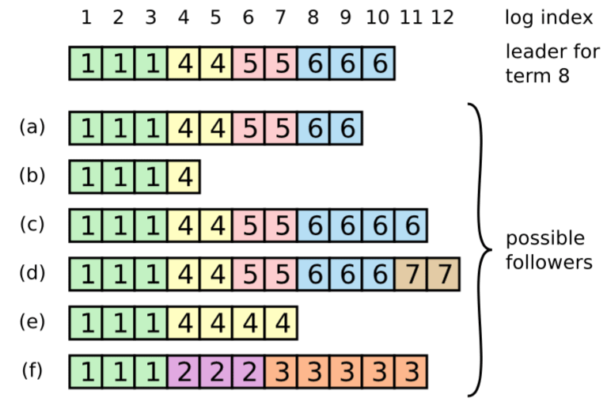

#                  [     解读Raft（二 选举和日志复制）        ](https://www.cnblogs.com/hzmark/p/raft_2.html)             

## Leader election

Raft采用心跳机制来触发Leader选举。Leader周期性的发送心跳（如果有正常的RPC的请求情况下可以不发心跳）包保持自己Leader的角色（避免集群中其他节点认为没有Leader而开始选举）。

Follower在收到Leader或者Candidate的RPC请求的情况下一直保持Follower状态。而当一段时间内（election timeout）没有收到请求则认为没有Leader节点而出发选举流程。

选举流程如下：

1. Follower递增自己的任期并设置为Candidate角色
2. 投票给自己并且并发的给所有节点发送投票请求
3. 保持Candidate状态直到：
   - 同一个任期内获得大多数选票，成为Leader（一个节点在一个任期内只能给一个Candidate投票，任期相同则选票先到先得）并给其他节点发送心跳来保持自己的角色
   - 收到其他节点的RPC请求，如果请求中的任期大于等于Candidate当前的任期，认为其他节点成为了Leader，自身转换为Follower；如果其他节点的任期小于自身的任期，拒绝RPC请求并保持Candidate角色
   - 一段时间后仍旧没有Leader（可能是出现了平票的情况），则在选举超时后重新发起一轮选举（递增任期、发送投票请求）

为了避免平票的问题，同时在出现平票的情况后能快速解决，Raft的选举**超时时间是在一个区间内随机选择的**（150~300ms）。这样尽量把服务器选举时间分散到不同的时间，保证大多数情况下只有一个节点会发起选举。在平票的情况下，每个节点也会在**一个随机时间**后开始新一轮选举，避免可能出现的一直处于平票的情况。

### Log replication

一旦Leader被选举出来后，Leader就开始为集群服务：处理所有的客户端请求并将数据复制到所有节点。

一旦日志被“安全”的复制，那么Leader将这个日志应用到自己的状态机并响应客户端。

如果有节点异常或网络异常，Leader会**一直重试**直到所有日志都会正确复制到所有节点（**日志不允许有空洞，所以每个节点上的日志都是连续的，不能有因为失败引起的空洞**）。

日志组织形式如上图，每个日志条目中包含可执行的指令、和日志被创建时的任期号，日志条目也包含了自己在日志中的位置，即index。一旦一个日志条目存在于大多数节点，那么该日志条目是committed的。

Raft算法保证所有committed的日志都是持久化的（日志需要在大多数节点上持久化之后再响应给客户端，这意味着每个Follower节点收到AppendEntry请求后需要持久化到日志之后再响应给Leader），且最终会被所有的状态机执行。

Raft算法保证了以下特性：

- 如果两个日志条目有相同的index和term，那么他们存储了相同的指令（即index和term相同，那么可定是同一条指令，就是同一个日志条目）
- 如果不同的日志中有两个日志条目，他们的index和term相同，那么这个条目之前的所有日志都相同

两条规则合并起来的含义：**两个日志LogA、LogB，如果LogA[i].index=Log[i]B.index且LogA[i].term=Log[i].term，那么LogA[i]=Log[i]B，且对于任何n < i的日志条目，LogA[n]=LogB[n]都成立。**（这个结论显而易见的可以从日志复制规则中推导出来）

一个新Leader被选举出来时，Follower可能是上图中的任何一种情况。

- (a)(b)可能还没复制到日志
- (c)(d)可能曾经是Leader，所有包含了多余的日志（这些日志可能被提交了，也可能没提交）
- (e)可能是成为Leader之后增加了一些日志，但是在Commit之前又编程了Follower角色，且还没有更新日志条目
- (f)可能是在任期2称为了Leader并追加了日志但是还没提交就Crash了，恢复之后在任期3又成了Leader并且又追加了日志

在Raft中，通过使用Leader的日志覆盖Follower的日志的方式来解决出现像上图的情况（**强Leader**）。Leader会找到Follower和自己想通的最后一个日志条目，将该条目之后的日志全部删除并复制Leader上的日志。详细过程如下：

- Leader维护了每个Follower节点下一次要接收的日志的索引，即nextIndex
- Leader选举成功后将所有Follower的nextIndex设置为自己的最后一个日志条目+1
- Leader将数据推送给Follower，如果Follower验证失败（nextIndex不匹配），则在下一次推送日志时缩小nextIndex，直到nextIndex验证通过

上面的方式显然可以通过一些方法进行优化来减少重试的次数，但是在Raft论文中对是否有必要进行优化提出了质疑，因为这种异常的情况很少出现。