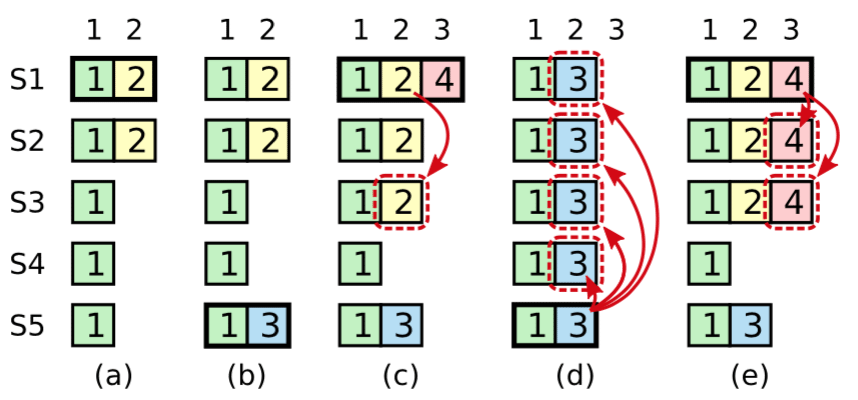

#                  [     解读Raft（三 安全性）        ](https://www.cnblogs.com/hzmark/p/raft_3.html)             

### 前言

之前的两篇文章更多的是在描述Raft算法的正常流程，没有过多的去讨论异常场景。

而实际在分布式系统中，我们更多的都是在应对网络不可用、机器故障等异常场景，所以本篇来讨论一下Raft协议的安全性，即在异常场景下是否会导致数据丢失、数据不一致等情况。

### 选举限制

在Raft协议中，所有的日志条目都只会从Leader节点往Follower节点写入，且Leader节点上的日志只会增加，绝对不会删除或者覆盖。

这意味着Leader节点必须包含所有已经提交的日志，即能被选举为Leader的节点一定需要包含所有的已经提交的日志。因为日志只会从Leader向Follower传输，所以如果被选举出的Leader缺少已经Commit的日志，那么这些已经提交的日志就会丢失，显然这是不符合要求的。

这就是Leader选举的限制：能被选举成为Leader的节点，一定包含了所有已经提交的日志条目。

回看算法基础中的RequestVote RPC：

| 参数         | 解释                        |
| ------------ | --------------------------- |
| term         | Candidate的任期             |
| candidateId  | Candidate的ID               |
| lastLogIndex | Candidate最后一条日志的索引 |
| lastLogTerm  | Candidate最后一条日志的任期 |

| 参数        | 解释                                  |
| ----------- | ------------------------------------- |
| term        | 当前任期，用于Candidate更新自己的任期 |
| voteGranted | true表示给Candidate投票               |

请求中的lastLogIndex和lastLogTerm即用于保证Follower投票选出的Leader一定包含了已经被提交的所有日志条目。

1. Candidate需要收到超过版本的节点的选票来成为Leader
2. 已经提交的日志条目至少存在于超过半数的节点上
3. 那么这两个集合一定存在交集（至少一个节点），且Follower只会投票给日志条目比自己的“新”的Candidate，那么被选出的节点的日志一定包含了交集中的节点已经Commit的日志

日志比较规则（即上面“新”的含义）：Raft 通过比较两份日志中最后一条日志条目的索引值和任期号定义谁的日志比较新。如果两份日志最后的条目的任期号不同，那么任期号大的日志更加新。如果两份日志最后的条目任期号相同，那么日志比较长的那个就更加新。

### 日志提交限制

上图按时间序列展示了Leader在提交日志时可能会遇到的问题。

1. 在 (a) 中，S1 是领导者，部分的复制了索引位置 2 的日志条目。
2. 在 (b) 中，S1 崩溃了，然后 S5 在任期 3 里通过 S3、S4 和自己的选票赢得选举，然后从客户端接收了一条不一样的日志条目放在了索引 2 处。
3. 然后到 (c)，S5 又崩溃了；S1 重新启动，选举成功，开始复制日志。在这时，来自任期 2 的那条日志已经被复制到了集群中的大多数机器上，但是还没有被提交。
4. 如果 S1 在 (d) 中又崩溃了，S5 可以重新被选举成功（通过来自 S2，S3 和 S4 的选票），然后覆盖了他们在索引 2  处的日志。反之，如果在崩溃之前，S1 把自己主导的新任期里产生的日志条目复制到了大多数机器上，就如 (e)  中那样，那么在后面任期里面这些新的日志条目就会被提交（因为S5 就不可能选举成功）。  这样在同一时刻就同时保证了，之前的所有老的日志条目就会被提交。

任期2内产生的日志可能在(d)的情况下被覆盖，所以在出现(c)的状态下，Leader节点是不能commit任期2的日志条目的，即不能更新commitIndex。

在上图最终状态是(e)的情况下，commitIndex的变化应该是1->3，即在(c)的情况下，任期4在索引3的位置commit了一条消息，commitIndex直接被修改成3。

而任期2的那条日志会通过Log Matching Property最终被复制到大多数节点企且被应用。

> Raft算法保证了以下特性：
>
> - 如果两个日志条目有相同的index和term，那么他们存储了相同的指令（即index和term相同，那么可定是同一条指令，就是同一个日志条目）
> - 如果不同的日志中有两个日志条目，他们的index和term相同，那么这个条目之前的所有日志都相同
>
> 两条规则合并起来的含义：**两个日志LogA、LogB，如果LogA[i].index=Log[i]B.index且LogA[i].term=Log[i].term，那么LogA[i]=Log[i]B，且对于任何n < i的日志条目，LogA[n]=LogB[n]都成立。**（这个结论显而易见的可以从日志复制规则中推导出来）