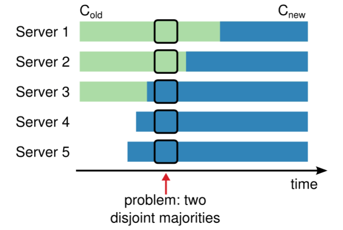
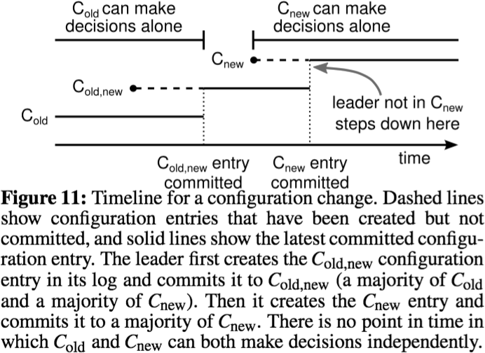

#                  [     解读Raft（四 成员变更）        ](https://www.cnblogs.com/hzmark/p/raft_4.html)             

将成员变更纳入到算法中是Raft易于应用到实践中的关键，相对于Paxos，它给出了明确的变更过程（实践的基础，任何现实的系统中都会遇到因为硬件故障等原因引起的节点变更的操作）。

显然，我们可以通过shutdown集群，然后变更配置后重启集群的方式达到成员变更的目的。但是这种操作会损失系统的可用性，同时会带来操作失误引起的风险。支持自动化配置，即配置可以在集群运行期间进行动态的变更（不影响可用性）显示是一个非常重要的特性。

### Raft成员变更机制

在成员变更时，因为无法做到在同一个时刻使所有的节点从旧配置转换到新配置，那么直接从就配置向新配置切换就可能存在一个节点同时满足新旧配置的“超过半数”原则。

如下图，原集群由Server1、Server2、Server3，现在对集群做变更，增加Server4、Server5。如果采用直接从旧配置到新配置的切换，那么有一段时间存在两个不想交的“超过半数的集群”。

上图，中在中间位置Server1可以通过自身和Server2的选票成为Leader（满足旧配置下收到大多数选票的原则）；Server3可以通过自身和Server4、Server5的选票成为Leader（满足新配置线，即集群有5个节点的情况下的收到大多数选票的原则）；此时整个集群可能在同一任期中出现了两个Leader，这和协议是违背的。

为了保证安全性，Raft采用了一种两阶段的方式。

第一阶段称为joint consensus，当joint consensus被提交后切换到新的配置下。

joint consensus状态下：

- 日志被提交给新老配置下所有的节点
- 新旧配置中所有机器都可能称为Leader
- 达成一致（选举和提交）要在两种配置上获得超过半数的支持

具体的切换过程如下：

- Leader收到C-old到C-new的配置变更请求时，创建C-old-new的日志并开始复制给其他节点（和普通日志复制没有区别）
- Follower以最新的配置做决定（收到C-old-new后就以C-old-new来决定），Leader需要以已经提交的配置来做决定（即只有C-old-new复制到大多数节点后Leader才以这个配置做决定）；这个时候处于一个共同决定的过程
- 之后提交C-new到所有节点，一旦C-new被提交，旧的配置就无所谓了

从上图可以看出，不存在一个阶段C-old和C-new可以同时根据自己的配置做出决定，所以不会出现本文开头描述的情况。

### Review成员变更

**如果当前的Leader不在C-new的配置中会怎么样（即当前的Leader是一个要被下线的节点）？**

在C-old-new的状态下，Leader依旧可用；在C-new被commit之后Leader实际已经从集群中脱离，此时可以对Leader节点进行下线操作，而新集群则会在C-new的配置下重新选举出一个Leader。

**如果在配置分发过程中Leader Crash了会怎么样？**

这个问题要分为多种情况：1. C-new已经分发到超过半数节点、2. C-new还没分发到超过半数的节点

*情况1：C-new已经分发到超过半数节点*

集群开始重新选举，此时在C-new的规则下，旧节点（不存在新配置中的节点）不会赢得选举（因为他们要在C-old-new的情况下决定，但是拿不到C-new的选票），只有拿到C-new的节点可能成为Leader并继续下发C-new配置，流程恢复。

*情况2：C-new还没分发到超过半数的节点*

这种情况下，C-old-new和C-new的节点都可以成为Leader，但是无所谓，因为无论谁成为Leader，都能根据当前的配置继续完成后续流程（如果是C-new那么相当与完成了最终的配置，不在C-new的节点会因为没有心跳数据而失效）

**旧节点下线造成的问题：旧节点收不到心跳触发选举，发送请求给C-old-new中的节点，是否会影响集群正常运行**

Raft的处理方式：当节点确信有Leader存在时，不会进行投票（在Leader超时之前收到新的投票请求时不会提升term和投票）。且开始选举之前等待一个选举超时时间，这样在新Leader正常工作的情况下，不会受到旧节点的影响。

旧节点在发起选举前需要等待一段时间，那么这段时间新Leader可以发送心跳，这样就减少了影响。  对正常流程的影响不大。（Leader失效后要等一段时间，没有及时触发，然而本身这里就有一个判断失效的时间，好像影响不大；比如原先超时时间是10s，那么如果设置成5s，原策略下10s超时就是10s后开始选举，新策略下5s超时就是超时后再等5s再开始选举，影响就是超时时间变短）

**新的服务器没有任何数据，加入进来进来怎么保证系统的可用性（这个时候新日志没办法Commit就没办法响应给客户端）？**

新加入的节点需要时间复制数据，在这个过程完成之前，Raft采用以下机制来保证可用性： 新加入节点没有投票权（Leader复制日志给他们，但是不将他们考虑在机器数量里面——即在判断是否超过半数时不把这些节点考虑在内），直到这些节点的日志追上其他节点。

### 参考资料

论文：https://ramcloud.atlassian.net/wiki/download/attachments/6586375/raft.pdf

翻译：https://github.com/maemual/raft-zh_cn

动画演示：http://thesecretlivesofdata.com/raft/