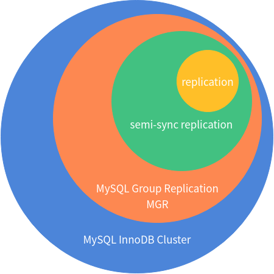

# MySQL 高可用

 [TOC]

高可用的两个重要概念

- 数据一致性（RPO）
- 业务连续性（RTO）

场景

- 业务规模，可维护性
- 业务性能，数据一致性

## 高可用等级、方案及对应要求

| 容灾等级 | 可用区域         | 运行状态      | MySQL高可用选型建议                      |
| -------- | ---------------- | ------------- | ---------------------------------------- |
| 3级      | <=1同城 或 1异地 | 主备+备份     | 半同步 /  异步复制+备份                  |
| 4级      | <=1异地          | 主备+备份     | 异步复制 + 备份                          |
| 5级      | <=1同城 或 1异地 | 同城双活      | 中间件拆分 + 半同步复制 + 全局一致性备份 |
| 6级      | <=1同城 或 1异地 | 同城+异地多活 | --                                       |

## 常见复制架构故障自动切换方案对比 

 

|        | MySQL 版本             | 可用解决方案                                       | 存在问题                                                     |
| ------ | ---------------------- | -------------------------------------------------- | ------------------------------------------------------------ |
| 第一代 | MySQL 5.5              | MHA                                                | 传统复制，主库存在没把日志传输到从库的风险。 不能处理MySQL本身的幽灵事务问题。 |
| 第二代 | MySQL 5.6              | Maxscale                                           | 利用binlog server和主库做半同步，保证数据安全 但是binlog server没有太好的开元解决方案。 |
| 第三代 | MySQL 5.7              | Xenon MySQL replication manager Orchestrator | 增强半同步，基本完美                                         |
| 第四代 | MySQL 5.7 MySQL 8.0 | MySQL Router ProxySQL MGR                    | 原生的高可用解决方案                                         |

## 主库故障时，各复制方式的注意事项

| 复制模式 | 从库               | 注意事项                                                     |
| -------- | ------------------ | ------------------------------------------------------------ |
| 异步复制 | 从库正常           | 1.判断同步是否完成 2.判断是否有日志补机会 3.选择新主，构建主从关系 |
| 异步复制 | 从库部分损坏       | 除了上面3点，还要考虑集群成员是否超过半数                    |
| 半同步   | 从库正常           | 1.判断同步是否完成 2.从库中选择新主，构建主从关系         |
| 半同步   | 从库部分损坏       | 除了上面2点，还要考虑集群成员是否超过半数                    |
|          | 主库正常，从库故障 | 直接下线从库                                                 |

 

### 实质的切换流程

- 针对不同故障，定义好运维规则，按规则进行，搞不定就停下来并退出、并报警。
- 可以把动作处理分为：
  - pre-recovery ，一般让用户配置
  - recovery-process -> Healing of topology ， 高可用软件搞定
  - post-recovery， 用户配置

 

## 云上环境自建MySQL复制架构的高可用实现

- 云上环境的特殊地方
  - 网络只支持TCP/UDP协议，例如基于VRRP广播的keepalived无法使用
  - 云上最佳的实践，最好使用VPC，存在一个独立的网络中
  - 利用TCP方式的切换方式有：
    - Xenon
    - MySQL Replication Manager
    - Orchestrator
    - MySQL InnoDB Cluster
    - ProxySQL
  - 服务注册类方式有：
    - Zookeeper
    - etcd
    - consul
    - DNS

##  一主一从架构的高可用实现

- 简单的keepalived也可以

- Haproxy
- ipvsadm+脚本
- Orchestrator

例如腾讯云，提供读IP，只读IP(ipvsadm)

虽然是一主一从，但是业务只放在一个节点上， 确保集群性能弹性。 不然，做读写分离后，如果发生switchover，单点压力过大会爆掉。