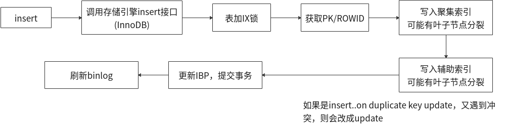
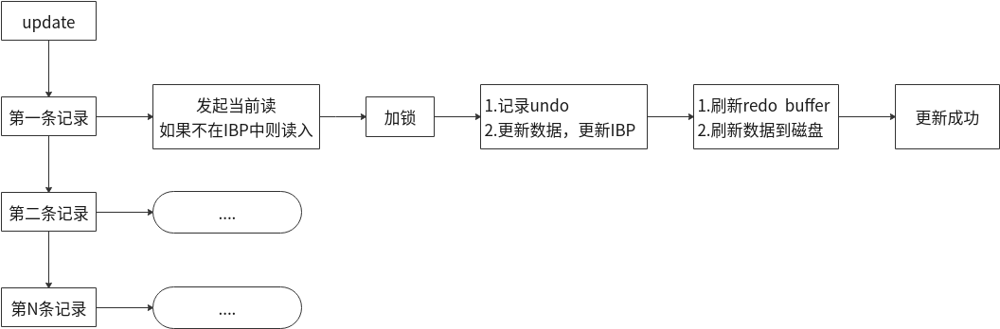
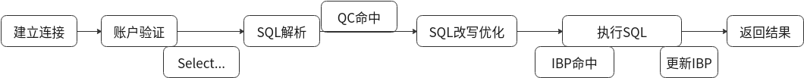
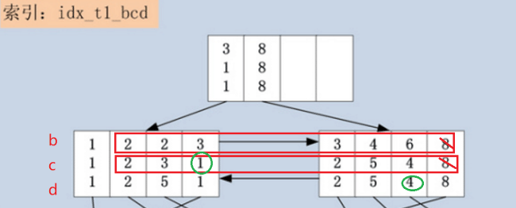

[TOC]

# SQL 执行过程

**insert执行过程**




**update/delete过程**




**select执行过程**



 


# select语句中where条件的提取过程

所有SQL的where条件，均可归纳为3大类：

1. Index Key (First Key & Last Key)：用于确定SQL查询在索引中的连续范围(起始范围+结束范围)的查询条件，被称之为Index Key。
2. Index Filter：经过index key提取的结果里，并不都是满足查询条件的项，因此需要进一步对索引列进行筛选。
3. Table Filter：所有不属于索引列的查询条件，均归为Table Filter之中。

> 尝试总结一下：
>
> - 首先，引擎层通过index key将连续范围的索引列条件提取走。就是属于索引列的查询条件里，以=、>=的，以及第一个>的条件作为范围开始（index first key），直到=、<=、第一个<的条件作为范围结束（index last key）。
>
> - 其次，server层通过index filter将第一列满足index key之外的**所有**属于索引列查询条件的，都提取走。
>
> - 最后，server层将剩下的所有不属于索引列查询条件的，提取走。

1. Index key  (First Key & Last Key)

   - 引擎层

   - 用于确定SQL查询在索引中的连续范围(起始范围+结束范围)的查询条件，被称之为Index Key

   - Index First Key

     - 用于确定索引查询的起始范围。

     - 提取规则：

       - 从索引的第一个column开始，检查其在where条件中是否存在。
         - 若存在并且条件是=、>=，则将对应的条件加入Index First Key之中，继续读取<u>索引的下一个键值</u>，使用同样的提取规则；
         - 若存在并且条件是>，则将对应的条件加入Index First Key中，同时终止Index First Key的提取；
         - 若不存在，同样终止Index First Key的提取。 

       > =、>=一定加入index first key， 其次，第一个> 的条件会加入index first key， 然后不管有没有第一个> 条件，都结束提取。
       >
       > 也就是说，index first key包含着： 等值，包含自身的范围起始值，以及[第一个]不包含自身的范围起始值的条件

   - Index Last Key

     - 用于确定索引查询的终止范围。

     - 提取规则：

       - 从索引的第一个键值开始，检查其在where条件中是否存在。
         - 若存在并且条件是=、<=，则将对应条件加入到Index Last Key中，继续提取<u>索引的下一个键值</u>，使用同样的提取规则；
         - 若存在并且条件是 < ，则将条件加入到Index Last Key中，同时终止提取；
         - 若不存在，同样终止Index Last Key的提取。

       >*和index first key相对，*也就是说，index last key包含着： 等值，包含自身的范围结束值，以及[第一个]不包含自身的范围结束值。

       

2. Index Filter

   - Server层。（ICP特性作用时，Index Filter下降（推）到引擎层实现。）

   - index key之后，此范围中的项并不都是满足查询条件的项，对范围之内的数据进行再次条件限制，称为 Index Filter。 其实就是，有索引的列除了被index key连续范围条件提取了之外，其他的都给index filter。

   - Index Filter提取规则

     - 同样从索引列的第一column开始，检查其在where条件中是否存在。

     - 若存在并且where条件仅为 =，则跳过第一列继续检查索引下一列，下一索引列采取与索引第一列同样的提取规则；

       > 索引第一列条件为等值则跳过这一列，因为这个被index key拿走啦

     - 若where条件为 >=、>、<、<= 其中的几种，<u>则跳过索引第一列</u>，<u>***将其余where条件中索引相关列全部加入到Index Filter之中***</u>（这句很重要，因为这一块在index key提取环节中，非第一列的键也可能符合index key条件被提取，到了index filter又因为这个规则归给inex filter了！）；

       > 索引第一列条件为范围，则跳过这一列，因为这个被index key拿走啦，然后把其他所有[有索引的]列的条件都拿过来

     - 若索引第一列的where条件包含 =、>=、>、<、<= 之外的条件，则将此条件以及其余where条件中索引相关列全部加入到Index Filter之中；

       > 索引第一列条件非范围非等值，意味着没有东西被index key拿走，自然就把所有[有索引的]列的条件都拿到这里了。

     - 若第一列不包含查询条件，则将所有索引相关条件均加入到Index Filter之中。（同上）

     

3. Table  Filter

   - Server层
   - 无索引的条件，所有不属于索引列的查询条件，均归为Table Filter之中。


> Index Key/Index Filter/Table Filter小结
>
> - SQL语句中的where条件，使用以上的提取规则，最终都会被提取到Index Key (First Key & Last Key)，Index Filter与Table Filter之中。
> - Index First Key，只是用来定位索引的起始范围，因此只在索引第一次Search Path(沿着索引B+树的根节点一直遍历，到索引正确的叶节点位置)时使用，一次判断即可；
> - Index Last Key，用来定位索引的终止范围，因此对于起始范围之后读到的每一条索引记录，均需要判断是否已经超过了Index。
> - Table Filter，则是最后一道where条件的防线，用于过滤通过前面索引的层层考验的记录，此时的记录已经满足了Index First Key与Index Last Key构成的范围，并且满足Index Filter的条件，回表读取了完整的记录，判断完整记录是否满足Table Filter中的查询条件，同样的，若不满足，跳过当前记录，继续读取索引的下一条记录，若满足，则返回记录，此记录满足了where的所有条件，可以返回给前端用户。
>
> ICP特性：MySQL 5.6中引入的Index Condition Pushdown，将Index Filter环节 Push Down到索引层面进行过滤。
>
> - 在MySQL 5.6之前，并不区分Index Filter与Table Filter，统统将Index First Key与Index Last Key范围内的索引记录，回表读取完整记录，然后返回给MySQL Server层进行过滤。
> - 在MySQL 5.6之后，Index Filter与Table Filter分离，Index Filter下降到InnoDB的索引层面进行过滤，减少了回表与返回MySQL Server层的记录交互开销，提高了SQL的执行效率。


## SQL的where条件提取的例子

考虑以下的一条SQL：

```
create table t1 (
    a int,
    b int,
    c int,
    d int,
    e varchar(20),
    primary key (a),
    key idx_t1_bcd (b,c,d)
);

mysql> select * from t1;
+---+------+------+------+------+
| a | b    | c    | d    | e    |
+---+------+------+------+------+
| 1 |    1 |    1 |    1 | a    |
| 3 |    3 |    2 |    2 | c    |
| 4 |    3 |    1 |    1 | d    |
| 5 |    2 |    3 |    5 | e    |
| 6 |    6 |    4 |    4 | f    |
| 7 |    4 |    5 |    5 | g    |
+---+------+------+------+------+

select * from t1 
	where b >= 2            // idx_t1_bcd 索引第一列b
	and b < 8               // idx_t1_bcd 索引第一列b
	and c > 1               // idx_t1_bcd 索引第二列c
	and d != 4              // idx_t1_bcd 索引第三列d
	and e != ‘a’;           // 不属于索引列
```

- 可以发现where条件使用到了[b,c,d,e]四个字段，而t1表的idx_t1_bcd索引，恰好使用了[b,c,d]这三个字段。走idx_t1_bcd索引进行条件过滤，应该是一个不错的选择。

  - 此SQL，覆盖索引idx_t1_bcd上的哪个范围？

    - 起始范围：记录[2,2,2]是第一个需要检查的索引项。索引起始查找范围由b >= 2，c > 1决定。

    - 终止范围：记录[8,8,8]是第一个不需要检查的记录，而之前的记录均需要判断。索引的终止查找范围由b < 8决定；

      

  

  - 在确定了查询的起始、终止范围之后，SQL中还有可以通过索引idx_t1_bcd，使用c > 1 and d != 4条件进行索引记录的过滤。

    - 根据SQL，固定了索引的查询范围[(2,2,2),(8,8,8))之后，此索引范围中并不是每条记录都是满足where查询条件的。例如：(3,1,1)不满足c > 1的约束；(6,4,4)不满足d != 4的约束。而c，d列，均可在索引idx_t1_bcd中过滤掉不满足条件的索引记录的。
    - 因此，SQL中还可以使用c > 1 and d != 4条件进行索引记录的过滤。

    

  - 在确定了索引中最终能够过滤掉的条件之后，e != ‘a’这个查询条件，是无法在索引idx_t1_bcd上进行过滤的，因为索引并未包含e列。e列只在表上存在。为了过滤此查询条件，必须将已经满足索引查询条件的记录回表，取出表中的e列，然后使用e列的查询条件e != ‘a’进行最终的过滤。


- 剖析一下where条件提取流程：

  - Index Key (First Key & Last Key)

    - 应用index first key提取规则，提取出来的Index First Key为(b >= 2, c > 1)。由于c的条件为 >，提取结束，不包括d。
    - 应用Index Last Key提取规则，提取出来的Index Last Key为(b < 8)，由于是 < 符号，因此提取b之后结束。

  - Index Filter

    在上面的SQL用例中，(3,1,1)，(6,4,4)均属于范围中，但是又均不满足SQL的查询条件。

    - 针对上面的用例SQL，索引第一列只包含 >=、< 两个条件(b>=2, b<8)，因此第一列可跳过，将余下的c、d两列加入到Index Filter中。因此获得的Index Filter为 c > 1 and d != 4 。

  - Table Filter

    - 所有不属于索引列的查询条件，均归为Table Filter之中。Table Filter就为 e != 'a'


# SQL执行过程中的优化特性/算法

- [ICP（Index Condition Pushdown）](./4.3.ICP特性.md)

  ICP特性将Index Filter下降到InnoDB的索引层面进行过滤，减少了IO次数，减少了回表与返回MySQL Server层的记录交互开销，提高了SQL的执行效率。

  

- [MRR（Multi-Range Read）](./4.1.MRR特性.md)

  是基于辅助/第二索引的查询，减少随机IO，将随机IO转化为顺序IO，提高查询效率。

  查询辅助索引时，首先把查询结果按照主键进行排序，按照主键的顺序进行书签查找，避免频繁发生离散读操作导致缓冲区中的页被替换出缓冲区，然后又不断的被新的请求读入缓冲区，减少缓冲池中页被替换的次数。

  

- [Nested Loop Join算法](./4.2.BKA特性.md)

  将驱动表/外部表的结果集作为循环基础数据，然后循环该结果集，每次获取一条数据作为下一个表的过滤条件查询数据，然后合并结果，获取结果集返回给客户端。

  Nested-Loop一次只将一行传入内层循环, 所以**外层循环(的结果集)有多少行, 内存循环便要执行多少次，效率非常差**。


- [Block Nested-Loop Join算法（BNL）](./4.2.BKA特性.md)

  主要用于当被join的表上无索引。

  将外层循环的行/结果集存入join buffer, 内层循环的每一行与整个buffer中的记录做比较，从而减少内层循环的次数。


- [Batched Key Access算法（BKA）](./4.2.BKA特性.md)

  当被join的表能够使用索引时，就先排好顺序，然后再去检索被join的表。对这些行按照索引字段进行排序，因此减少了随机IO。

  如果被Join的表上没有索引，则使用老版本的BNL策略(Block Nested-Loop)。


> 参考：
>
> http://dev.mysql.com/doc/refman/5.7/en/select-optimization.html
>
> http://www.kancloud.cn/taobaomysql/monthly/117959
>
> http://www.kancloud.cn/taobaomysql/monthly/67181
>
> http://www.cnblogs.com/zhoujinyi/p/4746483.html
>
> 作者：[踏雪无痕](http://weibo.com/chenpingzhao)
>
> 出处：http://www.cnblogs.com/chenpingzhao/