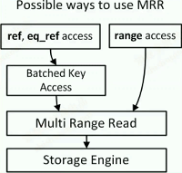
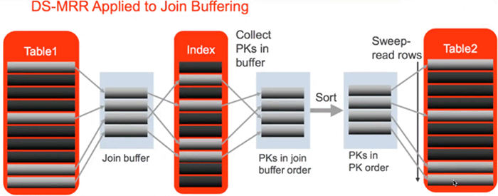

> Nested Loop Join →  Block Nested-Loop Join → Batched Key Access
>
> 表Join时使用BNL/BKA，需要temporary。

[TOC]

# BKA，Batched Key Access，批量索引访问

> Batched Key Access (BKA) 和 Block Nested-Loop(BNL)
>
> BKA主要适用于join的表上有索引可利用，无索引只能使用BNL。
>
> 多表join语句，被join的表/非驱动表必须有索引可用，才能利用BKA。

MySQL5.6开始支持。

Batched Key Access (BKA)  是用来提高表join性能的算法。BKA适合MRR在范围访问的场景，MRR是BKA的基础。

**如果被Join的表上没有索引，则使用老版本的BNL策略(Block Nested-Loop)。**当被join的表能够使用索引时，就先排好顺序，然后再去检索被join的表。对这些行按照索引字段进行排序，因此减少了随机IO。



## BKA作用

- 同时用于表连接以及join buffer时的index访问
- 支持inner join、outer join、semi-join以及nested-outer join
- join表扫描时效率更高，提高join效率

## BKA原理

BKA需要使用 join buffer，通过参数join buffer size来确定buffer的大小，buffer越大，访问被join的表/内部表就越顺序。

1. 对于多表join语句，当MySQL使用索引访问第二个join表的时候，使用一个join buffer来收集第一个操作对象生成的相关列值。

2. BKA构建好key后，批量传给引擎层做索引查找。key是通过MRR接口提交给引擎的（MRR目的是较为顺序）MRR使得查询更有效率。 

大致的过程如下:

1. BKA使用join buffer保存由join的第一个操作产生的符合条件的数据

2. 然后BKA算法构建key来访问被连接的表，并批量使用MRR接口提交keys到数据库存储引擎去查找查找。

3. 提交keys之后，MRR使用最佳的方式来获取行并反馈给BKA




## 启用BKA所需的参数和依赖

- 由于BKA使用了MRR，要想使用BAK必须打开MRR功能。

- 需要注意的是，**<u>MRR基于mrr_cost_based的成本估算并不能保证总是使用MRR</u>**，官方推荐设置mrr_cost_based=off来总是开启MRR功能。

- 打开BKA功能(BKA默认OFF)：

  - 优化器开关`optimizer_switch` 控制是否启用BKA，默认未启用

    > batched_key_access={on|off}

  - 开启方式

    > 三个条件
    >
    > 1. 前置条件：mrr = on 
    >
    > 2. 前置条件：mrr_cost_based = off
    >
    > 3. 开启条件：batched_key_access = on
    >
    >    另外，join buffer 适当加大。
    >
    >    SET optimizer_switch='mrr=on,mrr_cost_based=off,batched_key_access=on';
    >
    > 开启后执行计划显示 Using join buffer (Batched Key Access)

  

## BKA和BNL

BNL和BKA都是批量的提交一部分行给被join的表，从而减少访问的次数，那么它们有什么区别呢？

- BNL比BKA出现的早，BKA直到5.6才出现，而BNL至少在5.1里面就存在。
- BNL主要用于当被join的表上**无索引**
- BKA主要是指在被join表上有索引可以利用，那么就在行提交给被join的表之前，对这些行按照索引字段进行排序，因此减少了随机IO，排序这才是两者最大的区别，但是如果被join的表没用索引呢？那就使用BNL

BKA和BNL标识

- Using join buffer (Batched Key Access)

- Using join buffer (Block Nested Loop)

- 表Join时使用BNL/BKA，需要temporary。

# 延伸：Nested Loop Join和Block Nested-Loop Join

## Nested Loop Join

- Nested Loop Join算法

  将驱动表/外部表的结果集作为循环基础数据，然后循环的从该结果集中每次获取一条数据，作为下一个表的查询过滤条件，然后合并结果。

  如果有多表join，则将前面的表的结果集作为循环数据，取到每行再到联接的下一个表中循环匹配，获取结果集返回给客户端。 

- Nested-Loop 的伪代码

  ```
  for each row in t1 matching range {
    for each row in t2 matching reference key {
       for each row in t3 {
        if row satisfies join conditions,
        send to client
       }
     }
   }
  ```

- 因为普通Nested-Loop一次只将一行传入内层循环，所以外层循环(的结果集)有多少行，内存循环便要执行多少次。在内部表的连接上有索引的情况下，其扫描成本为O(Rn)，若没有索引，则扫描成本为O(Rn*Sn)。如果内部表S有很多记录，则Simple Nested-Loops Join会扫描内部表很多次，执行效率非常差。 

## Block Nested-Loop Join

- BNL 算法

  将外层循环的行/结果集存入join buffer，内层循环的每一行与整个buffer中的记录做比较，从而减少内层循环的次数。

  举例来说，外层循环的结果集是100行，使用NLJ 算法需要扫描内部表100次，如果使用BNL算法，先把对Outer Loop表(外部表)每次读取的10行记录放到join buffer，然后在InnerLoop表(内部表)中直接匹配这10行数据，内存循环就可以一次与这10行进行比较，这样只需要比较10次，对内部表的扫描减少了9/10。

  所以BNL算法就能够显著减少内层循环表扫描的次数。

- Block Nested-Loop的伪代码

  ```
  for each row in t1 matching range {
     for each row in t2 matching reference key {
      store used columns from t1, t2 in join buffer
      
      if buffer is full {
        for each row in t3 {
           for each t1, t2 combination in join buffer {
            if row satisfies join conditions,
            send to client
          }
         }
         
       	empty buffer
      }
      
    }
  }
  
      if buffer is not empty {
     		for each row in t3 {
      		for each t1, t2 combination in join buffer {
       	 		if row satisfies join conditions,
        		send to client
       		}
    	}
  	}
  ```

  如果t1, t2参与join的列长度只和为s, c为二者组合数, 那么t3表被扫描的次数为(S * C)/join_buffer_size + 1，
  扫描t3的次数随着join_buffer_size的增大而减少，直到join buffer能够容纳所有的t1、t2组合，再增大join buffer size，query 的速度就不会再变快了。

### BNL支持的join类型

- Block Nested loop（BNL）join 算法被扩展也支持这些BKA支持的join类型：支持inner join,outer join 和semi join操作，包括nested outer joins。

### BNL开启所需参数及依赖

- 5.6版本及以后，优化器管理参数optimizer_switch中的block_nested_loop参数控制着BNL是否被用于优化器。

- 默认条件下BNL是开启，若果设置为off，优化器在选择 join方式的时候会选择NLJ算法。

  ```
  SET optimizer_switch=block_nested_loop'
  ```

# 延伸：MySQL使用Join Buffer要点 

      1. join_buffer_size变量决定buffer大小。 
     2. 只有在join类型为all, index, range的时候才可以使用join buffer。 
     3. 能够被buffer的每一个join都会分配一个buffer, 也就是说一个query最终可能会使用多个join buffer。 
     4. 第一个non-const table不会分配join buffer, 即便其扫描类型是all或者index。 
     5. 在join之前就会分配join buffer, 在query执行完毕即释放。 
     6. join buffer中只会保存参与join的列, 并非整个数据行。 