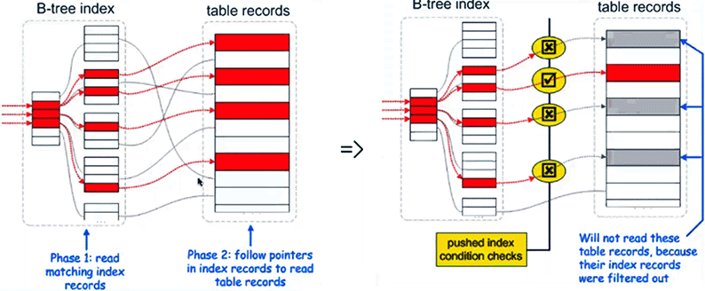

# ICP,Index Condition Pushdown 

> 理解ICP特性前，先去前面理解MRR特性，了解where条件中的三阶段提取： index key、index filter、table filter。
>
> 传送门：[SQL 执行过程和where条件提取过程](./4.0.SQL 执行过程和where条件提取过程.md)

MySQL 5.6以上支持，在index filter阶段生效。是一种使用索引从表中检索行数据的优化方式。

被ICP优化时，执行计划显示Using index condition

## ICP作用

- 减小server层数据集，减少数据传输，提高处理效率。

- ICP能减少引擎层访问基表的次数和  Server层访问存储引擎的次数。减少从基表中读取操作的数量，在引擎层面对索引列条件进行更多的提取，从而降低IO操作。

- 支持range、ref、eq_ref、eq_or_null类型查询。

  > 传送门： [类型及执行计划](../../../9.MySQL性能优化/0.性能优化总览/04.explain执行计划解读.md)

## ICP原理

- 在有ICP以前是把index key过滤后的全部记录（数据集较大）丢给<u>server层</u>进行index filter、table filter过滤。
- ICP特性可以把index filter过程下推(pushdown)到<u>引擎层</u>进行过滤，再将过滤后的（数据集较小）数据在server层进行table filter过滤。这样就减少了回表与返回MySQL Server层的记录交互开销，提高了SQL的执行效率。




### ICP特点

- MySQL 5.6中只支持 MyISAM、InnoDB、NDB cluster
- 从MySQL 5.7.3开始支持分区表的ICP
- 不支持主建索引的ICP（对于Innodb的聚集索引，完整的记录已经被读取到Innodb Buffer，此时使用ICP并不能降低IO操作）——*也就是说：对于InnoDB表，ICP只适用于辅助索引*
- 当 SQL 使用覆盖索引时但只检索部分数据时，ICP 无法使用
- ICP的加速效果取决于在存储引擎内通过ICP筛选掉的数据的比例

## ICP启用参数及依赖

- 数据库配置 optimizer_switch="index_condition_pushdown=on”;


## ICP使用场景举例

### 无ICP时的执行过程

- 场景1

  [SQL 执行过程和where条件提取过程](./4.0.SQL 执行过程和where条件提取过程.md)

  ```
  (a,b,c)
  select * from t where a=1 and b>=1 and b<=10 and c>10;
  
  引擎层：index key , 
  // index first key //
  // 索引第一个键a有 = 或 >= 吗？有，a=1。读取索引下一个键。
  // 下一个键b有 = 或 >= 吗？有，b>= 1。读取索引下一个键。
  // 下一个键c有 = 或 >= 吗？没有。有 > 吗？有，c>10。结束first key提取。
  // 最终first key = （a=1，b>=1，c>10）
  // index last ket //
  // 索引第一个键a为 = ，跳过第一个键，读取索引下一个键。
  // 索引第二个键b有 <= 吗？有，b <= 10。读取索引下一个键。
  // 索引第三个键c没有范围结束值，结束提取。
  // 最终last key = （b<=10）
  
  最终index key为：a=1 and b>=1 and b<=10  
  [1,1]
  ..
  [1,10]
  10 rows
  
  server层：index filter, 
  // 根据where条件提取规则：
  // 条件第一列为范围（后面的索引键按照第一列的规则继续提取），则跳过这一列，因为这个被index key拿走啦，然后把其他所有[有索引的]列的条件都拿过来。
  // 因此，索引第一列为等值&索引第二列条件为范围，则跳过这两列（被index key拿走了），然后将其他所有属于索引键的条件都归给server层进行index filter。
  // 这样的话，c>10 归给index filter了。
  
  最终，index filter为c>10
  [1,1]
  [1,2]
  
  总结一下，就是引擎层使用index key筛选出10条结果给server层，server层通过index filter筛选出2条结果。
  ```

- 场景2

  通过二级索引中的值去表中取出所有a=1& b>=1&b<=10&c>10，然后对无索引列d='a'条件进行筛选。

  ```
  (a,b,c)
  select * from t where a=1 and b>=1 and b<=10 and c>10 and d='a';
  
  引擎层：index key , 
  // index first key //
  // 索引键第一键a为等值，a=1，继续读取下一个索引键。
  // 索引键第二键b为范围值，b>=1，继续读取下一个索引键。
  // 索引键第三键c为范围值，c>10。遇到第一个 > 逻辑，结束first key的提取。
  // index last key //
  // 索引键第一键a为等值，继续读取下一个索引键。
  // 索引键第二键b的范围结束值为 b<=10，继续读取下一个索引键。
  // 索引键第三键c的范围结束值不存在，没有下一个索引键，last key提取结束。
  
  最终，index key = （ a=1 and b>=1 and b<=10 and c>10 ）
  [1,1]
  ..
  [1,10]
  10 rows
  
  然后将这10条结果返回给server层。
  
  server层：index filter,
  // 根据where条件提取规则，索引第一列为等值&索引第二列条件为范围，则跳过这两列（被index key拿走了），然后将其他*所有属于索引键的条件*都归给server层进行index filter。
  // c列属于索引键，d列无索引，因此只有c>10归给server层进行index filter。
  
  最终，index filter为 c>10
  [1,1]
  [1,2]
  
  server层：table filter, 
  // 其他所有不属于索引键的条件都归给server层进行table filter
  // 这里只有d='a'了。
  
  最终，table filter为d='a'
  [1,1]
  
  总结一下，就是 引擎层筛选10条结果给server层，server层进行index filter后筛选出2条结果，再由server层进行table filter，得出最终结果——1条。
  ```


### ICP特性下的过程

Index Condition Pushdown

各环节提取逻辑和流程没有变化，区别只是index filter发生在引擎层面，不在server层面实现。

- 场景1 via ICP

  ```
  (a,b,c)
  select * from t where a=1 and b>=1 and b<=10 and c>10;
  
  引擎层：index key , a=1 and b>=1 and b<=10
  [1,1]
  ..
  [1,10]
  10 rows
  
  ICP
  引擎层：index filter, c>10
  [1,1]
  
  ~~server层：index filter, c>10~~就不需要了
  总结一下，就是引擎层返回给server层1条结果，结束。
  ```

- 场景2 via ICP

  ```
  (a,b,c)
  select * from t where a=1 and b>=1 and b<=10 and c>10 and d='a';
  
  引擎层：index key , a=1 and b>=1 and b<=10
  [1,1]
  ..
  [1,10]
  10 rows
  
  ICP
  引擎层：index filter, c>10
  [1,1]
  [1,2]
  
  server层：table filter, d='a'
  [1,1]
  
  总结一下，就是引擎层返回给server层2条结果，server层进行table filter，得出1条结果。
  ```

通过案例对比可以发现，ICP特性减少了从引擎层到server层之间不必要的数据结果传输，因此效率更高。