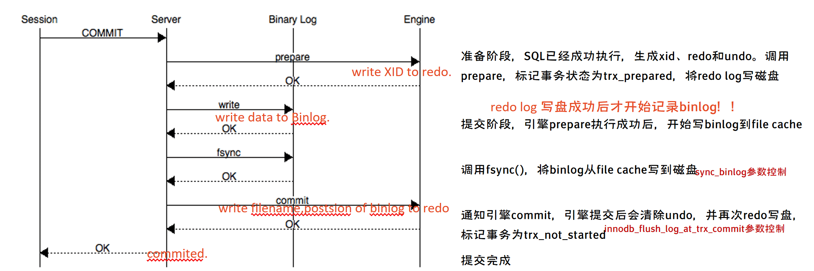
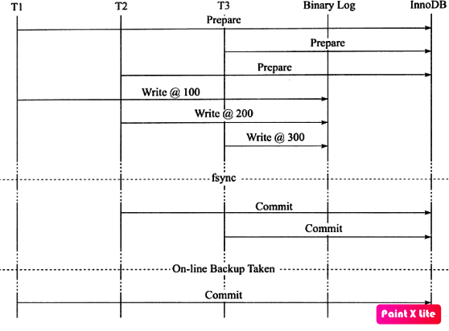

# 事务提交流程：

**commit; --> write XID to redo. --> write data to Binlog. --> write filename,postsion of binlog to redo. --> commited.**

*记录Binlog是在InnoDB引擎Prepare（即Redo Log写入磁盘）之后，这点至关重要。*

 



 

如果事务在不同阶段崩溃,recovery时会发——

| crash阶段                                                   | 事务状态                                                     | 事务结果                                                     |
| ----------------------------------------------------------- | ------------------------------------------------------------ | ------------------------------------------------------------ |
| 当事务在prepare阶段crash                                    | 该事务未写入Binary  log，引擎层也未写redo到磁盘。            | 该事务rollback。                                             |
| 当事务在binlog写阶段crash                                   | 此时引擎层redo已经写盘，但Binlog日志还没有成功写入到磁盘中。 | 该事务rollback。                                             |
| 当事务在binlog日志写磁盘后crash，但是引擎层没有来得及commit | 此时引擎层redo已经写盘，server层binlog已经写盘，但redo中事务状态未正确结束。 | 读出binlog中的xid，并通知引擎层提交这些XID的事务。引擎提交这些后，会回滚其他的事务，使引擎层redo和binlog日志在事务上始终保持一致。事务通过recovery自动完成提交。 |

 

- 总结起来说就是如果一个事务在prepare阶段中落盘成功，并在MySQL Server层中的binlog也写入成功，那这个事务必定commit成功。（redolog 写成功 && binlog 写成功 == commit，缺一不可。）
- 如果redo中已经有XID，但是事务未被标记为trx_not_started，此时相当于已经处于prepare状态，恢复时会先扫描最后一个binlog，看该XID是否存在：
  - 如果存在，表示这条日志已经写到binlog，那么该事务直接commit。 
  - 如果不存在，则表示事务未成功写入binlog，那么该事物回滚。

```
# at 232
#200328 23:46:33 server id 10243306 end_log_pos 387 CRC32 0x9825c7a4  Query  thread_id=12  exec_time=0   error_code=0   Xid = 9
SET TIMESTAMP=1585410393/*!*/;
SET @@session.pseudo_thread_id=12/*!*/;
SET @@session.foreign_key_checks=1, @@session.sql_auto_is_null=0, @@session.unique_checks=1, @@session.autocommit=1/*!*/;
SET @@session.sql_mode=1168113696/*!*/;
SET @@session.auto_increment_increment=1, @@session.auto_increment_offset=1/*!*/;
/*!\C utf8mb4 *//*!*/;
SET @@session.character_set_client=255,@@session.collation_connection=255,@@session.collation_server=255/*!*/;
SET @@session.lc_time_names=0/*!*/;
SET @@session.collation_database=DEFAULT/*!*/;
/*!80011 SET @@session.default_collation_for_utf8mb4=255*//*!*/;
ALTER USER 'rep'@'192.168.188.%' IDENTIFIED WITH 'mysql_native_password'
/*!*/;
# at 387
#200328 23:50:47 server id 10243306 end_log_pos 434 CRC32 0x79d45635  Rotate to mysql-bin.000003 pos: 4
SET @@SESSION.GTID_NEXT= 'AUTOMATIC' /* added by mysqlbinlog */ /*!*/;
```

 

# 事务两阶段提交

事务的提交主要分为两个主要步骤：

1. 准备阶段（Storage Engine（InnoDB）     Transaction Prepare Phase）

	此时SQL已经成功执行，并生成xid信息及redo和undo的内存日志。然后调用prepare方法完成第一阶段，papare方法实际上什么也没做，将事务状态设为TRX_PREPARED，并将redo log刷磁盘。

1. 提交阶段(Storage     Engine（InnoDB）Commit Phase)

   1. 记录Binlog日志。

      > 由参数sync_binlog控制fsync操作，确保binlog 落盘

      如果事务涉及的所有存储引擎的prepare都执行成功，则调用TC_LOG_BINLOG::log_xid方法将SQL语句写到binlog。

      （write()将binary log内存日志数据写入文件系统缓存，fsync()将binary log文件系统缓存日志数据永久写入磁盘）。

      此时，事务已经铁定要提交了。否则，调用ha_rollback_trans方法回滚事务，而SQL语句实际上也不会写到binlog。

   2. 告诉引擎做commit。

      > 由参数innodb_flush_log_at_trx_commit 控制fsync操作，确保redo落盘

      最后，调用引擎的commit完成事务的提交。会清除undo信息，刷redo日志，将事务设为TRX_NOT_STARTED状态。

      这一步包含两个动作：

      ​	a. 修改内存中事务对应的信息，并将日志写入redo log buffer

      ​	b. 调用fsync，确保日志都从redo log buffer写入到了磁盘

   

# 两阶段提交的性能演化

- 为了提高fsync性能，数据库使用了group commit功能，即：一次fsync可以刷新确保多个事务日志被写入文件。

  > 就是repilcate主从复制：并行复制MTS 中的binlog group commit的远古实现方式。

- 为了保证binlog环节中，binlog的写入顺序和InnoDB层事务提交顺序一致。
   - MySQL5.6之前，由于binlog并不能group commit，为了保证binlog写入顺序与InnoDB层事务提交顺序，内部使用了prepare_commit_mutex锁，启用这个锁之后，动作a不可以在其他事务执行步骤b时进行，从而导致日志无法利用好group commit机制将多个事务的redo 通过一次fsync操作刷新到磁盘了，这也是早期版本开启二进制日志后，InnoDB存储引擎的group commit功能失效的原因。
   - 而binlog的写入顺序与InnoDB引擎层事务提交顺序一致，才能满足在线备份恢复、以及建立主从复制的需求。如果binlog的顺序是乱序，就有重放事务丢失的问题发生。

  

  [^回放binlog来建立复制时，由于检测到事务T3已经在server和引擎层完成提交，便不再执行恢复，这样一来事务T1就丢失了。]: 因此通过锁prepare_commit_mutex，以串行的方式来保证顺序性。但这就会使group commit无法生效了。

  

   - MySQL5.6 之后，移除了prepare_commit_mutex锁，采用了类似的实现方式使binlog也可以组提交，称为 binary log group commit，这样就可以配合InnoDB本身就支持的InnoDB group commit来更好的发挥性能了。

## BLGC（binary log group commit）

### 原理

- server层提交时首先按顺序将事务放入一个队列中，队列中第一个事务称为leader，其他事务为follower。leader控制follower的行为。

- Flush阶段，将每个事务的binlog写入内存

- Sync阶段，将内存中的binlog刷新到磁盘。如果队列中有多个事务，那么只需要一次fsync操作就完成了binlog的写入

- Commit阶段，leader根据顺序去调用引擎层事务提交动作，InnoDB本身就支持group commit。

  > 5.6之前的版本由于使用了prepare_commit_mutex，导致InnoDB本身的group commit无法发挥。
  >
  > 5.6版本开始算是修复了这个问题——取消了prepare_commit_mutex，改用BLGC。

- 当有一组事务进行Commit阶段时，其他新的事务可以进行Flush阶段。

- 提交的事务越多，Group commit效果越明显。

### 相关参数

- `binlog_max_flush_queue_time` **参数已从5.7开始弃用，这里仅做了解。现在由binlog group commit机制来实现这个特性。`binlog_max_flush_queue_time` **参数控制flush阶段中等待的时间，即使前一组事务已经完成了提交，当前事务组也不马上进入sync阶段，而是至少等待参数配置的时间。这样的好处时使group commit的事务数量更多，但是也会导致事务的响应时间变慢。默认值为0，推荐值也为0。

 [[老叶茶馆\] - 2020-02-20 《叶问》第21期.html]()