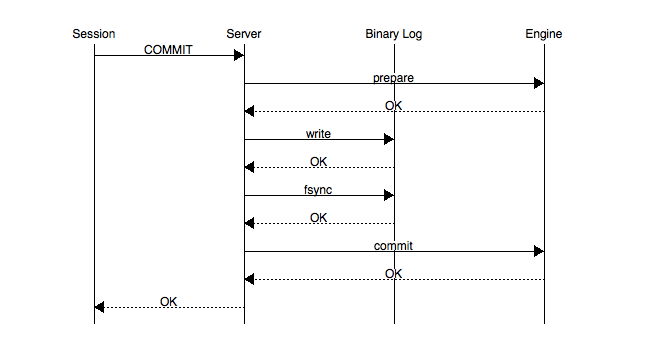
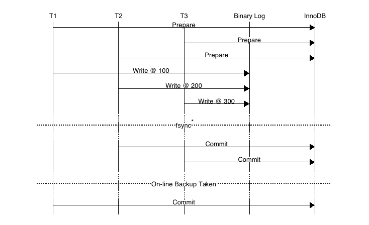
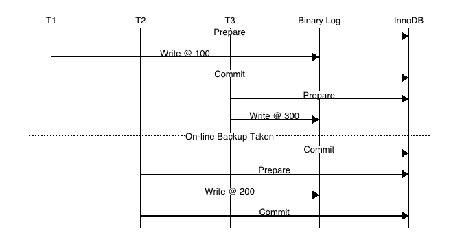
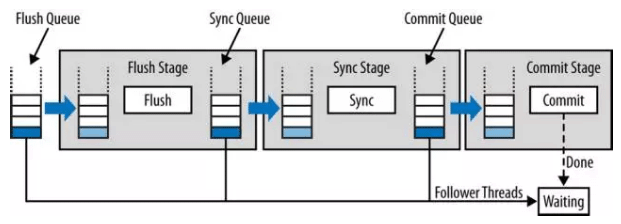
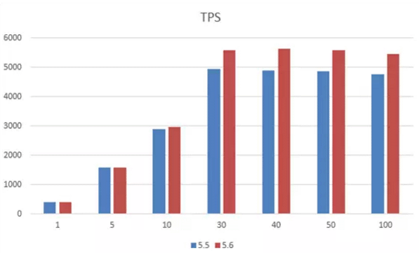

已剪辑自: https://www.cnblogs.com/mao3714/p/8734838.html

# 首先，我们知道在MySQL中，二进制日志是server层的，主要用来做主从复制和即时点恢复时使用的。而事务日志（redo log）是InnoDB存储引擎层的，用来保证事务安全的。现在我们来讨论一下MySQL主从复制过程中的一些细节问题，有关于主从复制可以看具体的章节。

在了解了以上基础的内容后，我们可以带着以下的几个问题去学习复制到底是怎样工作的。

- 为什么MySQL有binlog，还有redo log？
- 事务是如何提交的？事务提交先写binlog还是redo     log？如何保证这两部分的日志做到顺序一致性？
- 为了保障主从复制安全，故障恢复是如何做的？
- 为什么需要保证二进制日志的写入顺序和InnoDB层事务提交顺序一致性呢？

**为什么MySQL有binlog，还有redo log?**

这个是因为MySQL体系结构的原因，MySQL是多存储引擎的，不管使用那种存储引擎，都会有binlog，而不一定有redo log，简单的说，binlog是MySQL Server层的，redo log是InnoDB层的。

**事务是如何提交的？事务提交先写binlog还是redo log？如何保证这两部分的日志做到顺序一致性？**

MySQL Binary log在MySQL 5.1版本后推出主要用于主备复制的搭建，我们回顾下MySQL在开启/关闭Binary Log功能时是如何工作的。

**MySQL没有开启Binary log的情况下？**

首先看一下什么是CrashSafe？CrashSafe指MySQL服务器宕机重启后，能够保证：

– 所有已经提交的事务的数据仍然存在。

– 所有没有提交的事务的数据自动回滚。

Innodb通过Redo Log和Undo Log可以保证以上两点。为了保证严格的CrashSafe，必须要在每个事务提交的时候，将Redo Log写入硬件存储。这样做会牺牲一些性能，但是可靠性最好。为了平衡两者，InnoDB提供了一个innodb_flush_log_at_trx_commit系统变量，用户可以根据应用的需求自行调整。

innodb_flush_log_at_trx_commit = 0|1|2

0 – 每N秒将Redo Log Buffer的记录写入Redo Log文件，并且将文件刷入硬件存储1次。N由innodb_flush_log_at_timeout控制。

1 – 每个事务提交时，将记录从Redo Log Buffer写入Redo Log文件，并且将文件刷入硬件存储。

2 – 每个事务提交时，仅将记录从Redo Log Buffer写入Redo Log文件。Redo Log何时刷入硬件存储由操作系统和innodb_flush_log_at_timeout决定。这个选项可以保证在MySQL宕机，而操作系统正常工作时，数据的完整性。

通过redo日志将所有已经在存储引擎内部提交的事务应用redo log恢复，所有已经prepare但是没有commit的transactions将会应用undo log做rollback。然后客户端连接时就能看到已经提交的数据存在数据库内，未提交被回滚地数据需要重新执行。

**MySQL开启Binary log的情况下？**

MySQL为了保证master和slave的数据一致性，就必须保证binlog和InnoDB redo日志的一致性（因为备库通过二进制日志重放主库提交的事务，而主库binlog写入在commit之前，如果写完binlog主库crash，再次启动时会回滚事务。但此时从库已经执行，则会造成主备数据不一致）。所以在开启Binlog后，如何保证binlog和InnoDB redo日志的一致性呢？为此，MySQL引入二阶段提交（two phase commit or 2pc），MySQL内部会自动将普通事务当做一个XA事务（内部分布式事物）来处理：

– 自动为每个事务分配一个唯一的ID（XID）。

– COMMIT会被自动的分成Prepare和Commit两个阶段。

– Binlog会被当做事务协调者(Transaction Coordinator)，Binlog Event会被当做协调者日志。

想了解2PC，可以参考文档：https://en.wikipedia.org/wiki/Two-phase_commit_protocol

Binlog在2PC中充当了事务的协调者（Transaction Coordinator）。由Binlog来通知InnoDB引擎来执行prepare，commit或者rollback的步骤。事务提交的整个过程如下：

以上的图片中可以看到，事务的提交主要分为两个主要步骤：

\1. 准备阶段（Storage Engine（InnoDB） Transaction Prepare Phase）

此时SQL已经成功执行，并生成xid信息及redo和undo的内存日志。然后调用prepare方法完成第一阶段，papare方法实际上什么也没做，将事务状态设为TRX_PREPARED，并将redo log刷磁盘。

\2. 提交阶段(Storage Engine（InnoDB）Commit Phase)

2.1 记录协调者日志，即Binlog日志。

如果事务涉及的所有存储引擎的prepare都执行成功，则调用TC_LOG_BINLOG::log_xid方法将SQL语句写到binlog（write()将binary log内存日志数据写入文件系统缓存，fsync()将binary log文件系统缓存日志数据永久写入磁盘）。此时，事务已经铁定要提交了。否则，调用ha_rollback_trans方法回滚事务，而SQL语句实际上也不会写到binlog。

2.2 告诉引擎做commit。

最后，调用引擎的commit完成事务的提交。会清除undo信息，刷redo日志，将事务设为TRX_NOT_STARTED状态。

PS：记录Binlog是在InnoDB引擎Prepare（即Redo Log写入磁盘）之后，这点至关重要。

由上面的二阶段提交流程可以看出，一旦步骤2中的操作完成，就确保了事务的提交，即使在执行步骤3时数据库发送了宕机。此外需要注意的是，每个步骤都需要进行一次fsync操作才能保证上下两层数据的一致性。步骤2的fsync参数由sync_binlog=1控制，步骤3的fsync由参数innodb_flush_log_at_trx_commit=1控制，俗称“双1”，是保证CrashSafe的根本。

参数说明如下：

innodb_flush_log_at_trx_commit（redo）

- 0： log buffer每秒一次地写入log     file中，且进行flush操作。InnoDB日志刷新频率由控制     innodb_flush_log_at_timeout，它允许你将日志刷新频率设置为N秒（其中N是1 … 2700，默认值为1）。
- 1：每次事务提交时都会把log buffer的数据写入log     file，并进行flush操作。
- 2：每次事务提交时MySQL都会把log     buffer的数据写入log file，不进行flush操作。

sync_binlog （binlog）

- 0：刷新binlog_cache中的信息到磁盘由os决定。
- N：每N次事务提交刷新binlog_cache中的信息到磁盘。

事务的两阶段提交协议保证了无论在任何情况下，事务要么同时存在于存储引擎和binlog中，要么两个里面都不存在，这就保证了主库与从库之间数据的一致性。如果数据库系统发生崩溃，当数据库系统重新启动时会进行崩溃恢复操作，存储引擎中处于prepare状态的事务会去查询该事务是否也同时存在于binlog中，如果存在就在存储引擎内部提交该事务（因为此时从库可能已经获取了对应的binlog内容），如果binlog中没有该事务，就回滚该事务。例如：当崩溃发生在第一步和第二步之间时，明显处于prepare状态的事务还没来得及写入到binlog中，所以该事务会在存储引擎内部进行回滚，这样该事务在存储引擎和binlog中都不会存在；当崩溃发生在第二步和第三步之间时，处于prepare状态的事务存在于binlog中，那么该事务会在存储引擎内部进行提交，这样该事务就同时存在于存储引擎和binlog中。

为了保证数据的安全性，以上列出的3个步骤都需要调用fsync将数据持久化到磁盘。由于在引擎内部prepare好的事务可以通过binlog恢复，所以通常情况下第三个fsync是可以省略的。

另外，MySQL内部两阶段提交需要开启innodb_support_xa=true，默认开启。这个参数就是支持分布式事务两段式事务提交。redo和binlog数据一致性就是靠这个两段式提交来完成的，如果关闭会造成事务数据的丢失。

**为了保障主从复制安全，故障恢复是如何做的？**

开启Binary log的MySQL在crash recovery时：MySQL在prepare阶段会生成xid，然后会在commit阶段写入到binlog中。在进行恢复时事务要提交还是回滚，是由Binlog来决定的。

– 事务的Xid_log_event存在，就要提交。

– 事务的Xid_log_event不存在，就要回滚。

恢复的过程非常简单：

– 从Binlog中读出所有的Xid_log_event

– 告诉InnoDB提交这些XID的事务

– InnoDB回滚其它的事务

总结一下，基本顶多会出现下面是几种情况：

- 当事务在prepare阶段crash，数据库recovery的时候该事务未写入Binary     log并且存储引擎未提交，将该事务rollback。
- 当事务在binlog阶段crash，此时日志还没有成功写入到磁盘中，启动时会rollback此事务。
- 当事务在binlog日志已经fsync()到磁盘后crash，但是InnoDB没有来得及commit，此时MySQL数据库recovery的时候将会读出二进制日志的Xid_log_event，然后告诉InnoDB提交这些XID的事务，InnoDB提交完这些事务后会回滚其它的事务，使存储引擎和二进制日志始终保持一致。

总结起来说就是如果一个事务在prepare阶段中落盘成功，并在MySQL Server层中的binlog也写入成功，那这个事务必定commit成功。

**为什么需要保证二进制日志的写入顺序和InnoDB层事务提交顺序一致性呢？**

上面提到单个事务的二阶段提交过程，能够保证存储引擎和binary log日志保持一致，但是在并发的情况下怎么保证InnoDB层事务日志和MySQL数据库二进制日志的提交的顺序一致？当多个事务并发提交的情况，如果Binary Log和存储引擎顺序不一致会造成什么影响？

这是因为备份及恢复需要，例如通过xtrabackup或ibbackup这种物理备份工具进行备份时，并使用备份来建立复制，如下图：

如上图，事务按照**T1、T2、T3**顺序开始执行，将二进制日志（按照T1、T2、T3顺序）写入日志文件系统缓冲，调用fsync()进行一次group commit将日志文件永久写入磁盘，但是**存储引擎**提交的顺序为T2、T3、**T1。**当T2、T3提交事务之后，若通过在线物理备份进行数据库恢复来建立复制时，因为在InnoDB存储引擎层会检测事务T3在上下两层都完成了事务提交，不需要在进行恢复了，此时主备数据不一致（搭建Slave时，change master to的日志偏移量记录T3在事务位置之后）。

为了解决以上问题，在早期的MySQL 5.6版本之前，通过prepare_commit_mutex锁以串行的方式来保证MySQL数据库上层二进制日志和Innodb存储引擎层的事务提交顺序一致，然后会导致组提交（group commit）特性无法生效。为了满足数据的持久化需求，一个完整事务的提交最多会导致3次fsync操作。为了提高MySQL在开启binlog的情况下单位时间内的事务提交数，就必须减少每个事务提交过程中导致的fsync的调用次数。所以，MySQL从5.6版本开始加入了binlog group commit技术（MariaDB 5.3版本开始引入）。

MySQL数据库内部在prepare redo阶段获取prepare_commit_mutex锁，一次只能有一个事务可获取该mutex。通过这个臭名昭著prepare_commit_mutex锁，将redo log和binlog刷盘串行化，串行化的目的也仅仅是为了保证redo log和Binlog一致，继而无法实现group commit，牺牲了性能。整个过程如下图：

上图可以看出在prepare_commit_mutex，只有当上一个事务commit后释放锁，下一个事务才可以进行prepare操作，并且在每个事务过程中**Binary log没有fsync()的调用**。由于内存数据写入磁盘的开销很大，如果频繁fsync()把日志数据永久写入磁盘数据库的性能将会急剧下降。此时MySQL数据库提供sync_binlog参数来设置多少个binlog日志产生的时候调用一次fsync()把二进制日志刷入磁盘来提高整体性能。

上图所示MySQL开启Binary log时使用prepare_commit_mutex和sync_log保证二进制日志和存储引擎顺序保持一致，prepare_commit_mutex的锁机制造成高并发提交事务的时候性能非常差而且二进制日志也无法group commit。

这个问题早在2010年的MySQL数据库大会中提出，Facebook MySQL技术组，Percona公司都提出过解决方案，最后由MariaDB数据库的开发人员Kristian Nielsen完成了最终的”完美”解决方案。在这种情况下，不但MySQL数据库上层二进制日志写入是group commit的，InnoDB存储引擎层也是group commit的。此外还移除了原先的锁prepare_commit_mutex，从而大大提高了数据库的整体性。MySQL 5.6采用了类似的实现方式，并将其称为BLGC（Binary Log Group Commit），并把事务提交过程分成三个阶段，Flush stage、Sync stage、Commit stage。

 

### BLGC（Binary Log Group Commit）

### 组提交后如何保证事务记录到binlog的顺序和 事务提交到存储引擎的一致性呢？ 

MySQL 5.6 BLGC技术出现后，在这种情况下，不但MySQL数据库上层二进制日志写入是group commit的，InnoDB存储引擎层也是group commit的。此外还移除了原先的锁prepare_commit_mutex，从而大大提高了数据库的整体性。其事务的提交（commit）过程分成三个阶段，Flush stage、Sync stage、Commit stage。如下图：

**Binlog组提交的基本思想是，引入队列机制保证Innodb commit顺序与binlog落盘顺序一致**，并将事务分组，组内的binlog刷盘动作交给一个事务进行，实现组提交目的。在MySQL数据库上层进行提交时首先按顺序将其放入一个队列中，队列中的第一个事务称为leader，其他事务称为follow，leader控制着follow的行为。

从上图可以看出，每个阶段都有一个队列，每个队列有一个mutex保护，约定进入队列第一个线程为leader，其他线程为follower，所有事情交由leader去做，leader做完所有动作后，通知follower刷盘结束。BLGC就是将事务提交分为了3个阶段，FLUSH阶段，SYNC阶段和COMMIT阶段。

- Flush Stage

将每个事务的二进制日志写入内存中。

1) 持有Lock_log mutex [leader持有，follower等待]。

2) 获取队列中的一组binlog(队列中的所有事务)。

3) 将binlog buffer到I/O cache。

4) 通知dump线程dump binlog。

- Sync Stage

将内存中的二进制日志刷新到磁盘，若队列中有多个事务，那么仅一次fsync操作就完成了二进制日志的写入，这就是BLGC。

1) 释放Lock_log mutex，持有Lock_sync mutex[leader持有，follower等待]。

2) 将一组binlog 落盘(sync动作，最耗时，假设sync_binlog为1)。

- Commit Stage

**leader根据顺序调用存储引擎层事务的提交**，Innodb本身就支持group commit，因此修复了原先由于锁prepare_commit_mutex导致group commit失效的问题。

1) 释放Lock_sync mutex，持有Lock_commit mutex[leader持有，follower等待]。

2) 遍历队列中的事务，逐一进行innodb commit。

3) 释放Lock_commit mutex。

4) 唤醒队列中等待的线程。

说明：由于有多个队列，每个队列各自有mutex保护，队列之间是顺序的，约定进入队列的一个线程为leader，因此FLUSH阶段的leader可能是SYNC阶段的follower，但是follower永远是follower。

当有一组事务在进行commit阶段时，其他新事物可以进行Flush阶段，从而使group commit不断生效。当然group commit的效果由队列中事务的数量决定，若每次队列中仅有一个事务，那么可能效果和之前差不多，甚至会更差。但当提交的事务越多时，group commit的效果越明显，数据库性能的提升也就越大。

MySQL提供了一个参数binlog_max_flush_queue_time（MySQL 5.7.9版本失效），默认值为0，用来控制MySQL 5.6新增的BLGC（binary log group commit），就是二进制日志组提交中Flush阶段中等待的时间，即使之前的一组事务完成提交，当前一组的事务也不马上进入Sync阶段，而是至少需要等待一段时间，这样做的好处是group commit的事务数量更多，然而这也可能会导致事务的响应时间变慢。该参数默认为0表示不等待，且推荐设置依然为0。除非用户的MySQL数据库系统中有大量的连接（如100个连接），并且不断地在进行事务的写入或更新操作。

MySQL 5.7 Parallel replication实现主备多线程复制基于主库BLGC（Binary Log Group Commit）机制，并在Binary log日志中标识同一组事务的last_commited=N和该组事务内所有的事务提交顺序。为了增加一组事务内的事务数量提高备库组提交时的并发量引入了binlog_group_commit_sync_delay=N和binlog_group_commit_sync_no_delay_count=N

注：binlog_max_flush_queue_time在MySQL的5.7.9及之后版本不再生效）参数，**MySQL等待binlog_group_commit_sync_delay毫秒直到达到binlog_group_commit_sync_no_delay_count事务个数时，将进行一次组提交。**

下面是提供测试组提交的一张图，可以看到组提交的TPS高不少。

