不知不觉中，performance_schema系列快要接近尾声了，今天将带领大家一起踏上系列第六篇的征程(全系共7个篇章)，在这一期里，我们将为大家全面讲解performance_schema中的复制状态与变量统计表。下面，请跟随我们一起开始performance_schema系统的学习之旅吧～


**01**

### 复制信息统计表

通常，DBA或相关数据库运维人员在查看从库的复制相关的信息，都习惯性的使用show slave  status语句查看。也许你会说，我也会用performance_schema下的表查看一些复制报错信息什么的。但是，你知道show slave  status语句、mysql系统库下的复制信息记录表、performance_schema系统库下的复制信息记录表之间有什么区别吗？不知道？别急，本文即将为你详细介绍show slave status语句与performance_schema系统库下的复制信息记录表的区别（mysql系统库下的复制表区别详见后续  "mysql系统库全方位介绍"系列）。

在开始详细介绍每一张复制信息表之前，我们先花费一些篇幅来整体认识一下这些表。

performance_schema 系统库下提供了如下几个与复制状态相关的表（表含义详见本文后续小节）：

- replication_applier_configuration
- replication_applier_status
- replication_applier_status_by_coordinator
- replication_applier_status_by_worker
- replication_connection_configuration
- replication_connection_status
- replication_group_member_stats
- replication_group_members

这些复制表中记录的信息生命周期如下(生命周期即指的是这些表中的信息什么时候写入，什么时候会被修改，什么时候会被清理等）：

- 在执行CHANGE MASTER TO之前，这些表是空的
- 执行CHANGE MASTER  TO之后，在配置参数表replication_applier_configuration和replication_connection_configuration中可以查看到配置信息了。此时，由于并没有启动复制，所以表中THREAD_ID列为NULL，SERVICE_STATE列的值为OFF（这两个字段存在与表replication_applier_status、replication_applier_status_by_coordinator、replication_applier_status_by_worker、replication_connection_status几个表中）
- 执行START SLAVE后，可以看到连接线程和协调器线程，工作线程状态表中的THREAD_ID字段被分配了一个值，且SERVICE_STATE字段被修改为ON了，THREAD_ID字段值与show processlist语句中看到的线程id相同。 
  \*  如果IO线程空闲或正在从主库接收binlog时，线程的SERVICE_STATE值会一直为ON，THREAD_ID线程记录线程ID值，如果IO线程正在尝试连接主库但还没有成功建立连接时，THREAD_ID记录CONNECTING值，THREAD_ID字段记录线程ID，如果IO线程与主库的连接断开，或者主动停止IO线程，则SERVICE_STATE字段记录为OFF，THREAD_ID字段被修改为NULL
- 执行 STOP  SLAVE之后，所有复制IO线程、协调器线程、工作线程状态表中的THREAD_ID列变为NULL，SERVICE_STATE列的值变为OFF。注意：停止复制相关线程之后，这些记录并不会被清理 ，因为复制意外终止或者临时需要会执行停止操作，可能需要获取一些状态信息用于排错或者其他用途。
- 执行RESET SLAVE之后，所有记录复制配置和复制状态的表中记录的信息都会被清除。但是show slave  status语句还是能查看到一些复制状态和配置信息，因为该语句是从内存中获取，RESET  SLAVE语句并没有清理内存，而是清理了磁盘文件、表（还包括mysql.slave_master_info和mysql.slave_relay_log_info两个表）中记录的信息。如果需要清理内存里报错的复制信息，需要使用RESET SLAVE ALL;语句
- 注意：对于replication_applier_status_by_worker、replication_applier_status_by_coordinator表（以及mysql.slave_wroker_info表）来说，如果是以单线程复制运行，则replication_applier_status_by_worker表记录一条WORKER_ID=0的记录，replication_applier_status_by_coordinator表与mysql.slave_wroker_info表为空(使用多线程复制，该表中才有记录)。即，如果slave_parallel_workers系统变量大于0，则在执行START SLAVE时这些表就被填充相应多线程工作线程的信息

performance_schema 系统库中保存的复制信息与SHOW SLAVE STATUS输出的信息有所不同（performance_schema  中记录的一些复制信息是show slave status语句输出信息中没有的，但是也仍然有一些show slave  status语句输出的复制信息是performance_schema  中没有的），因为这些表面向全局事务标识符（GTID）使用，而不是基于binlog pos位置，所以这些表记录server  UUID值，而不是server ID值。show slave status语句输出的信息在performance_schema  中缺少的内容如下：

用于引用binlog file、pos和relay log file、pos等信息选项，在performance_schema表中不记录 。

PS1：如下系统状态变量被移动到了这些复制状态表中进行记录(MySQL 5.7.5版之前使用以下状态变量查看）：

- Slave_retried_transactions
- Slave_last_heartbeat
- Slave_received_heartbeats
- Slave_heartbeat_period
- Slave_running

PS2：对于组复制架构，组复制的监控信息散布在如下几张表中

- replication_group_member_stats
- replication_group_members
- replication_applier_status
- replication_connection_status
- threads

通过以上内容，我们从整体上能够大致了解了performance_schema中的复制信息表记录了什么信息，下面依次详细介绍这些复制信息表。

#### 1.replication_applier_configuration表

该表中记录从库线程延迟复制的配置参数（延迟复制的线程被称为普通线程，比如CHANNEL_NAME和DESIRED_DELAY字段记录某个复制通道是否需要执行延迟复制，如果是MGR集群，则记录组复制从节点的延迟复制配置参数），该表中的记录在Server运行时可以使用CHANGE MASTER TO语句进行更改，我们先来看看表中记录的统计信息是什么样子的。

```
# 如果是单主或多主复制，则该表中会为每个复制通道记录一条类似如下信息
admin@localhost : performance_schema 02:49:12> select * from replication_applier_configuration;
+--------------+---------------+
| CHANNEL_NAME | DESIRED_DELAY |
+--------------+---------------+
|              |            0 |
+--------------+---------------+
1 row in set (0.00 sec)
# 如果是MGR集群，则该表中会记录类似如下MGR集群信息
root@localhost : performance_schema 10:56:49> select * from replication_applier_configuration;
+----------------------------+---------------+
| CHANNEL_NAME | DESIRED_DELAY |
+----------------------------+---------------+
| group_replication_applier | 0 |
| group_replication_recovery | 0 |
+----------------------------+---------------+
2 rows in set (0.00 sec)
```


表中各字段含义及与show slave status输出字段对应关系如下：

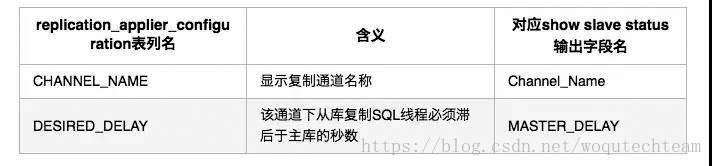

对于replication_applier_configuration表，不允许执行TRUNCATE TABLE语句。

#### 2. replication_applier_status表

该表中记录的是从库当前的一般事务执行状态（该表也记录组复制架构中的复制状态信息）

- 此表提供了所有线程binlog重放事务时的普通状态信息。线程重放事务时特定的状态信息保存在replication_applier_status_by_coordinator表（单线程复制时该表为空）和replication_applier_status_by_worker表（单线程复制时表中记录的信息与多线程复制时的replication_applier_status_by_coordinator表中的记录类似）

我们先来看看表中记录的统计信息是什么样子的。

```
# 单线程复制和多线程复制时表中的记录相同，如果是多主复制，则每个复制通道记录一行信息
admin@localhost : performance_schema 02:49:28> select * from replication_applier_status;
+--------------+---------------+-----------------+----------------------------+
| CHANNEL_NAME | SERVICE_STATE | REMAINING_DELAY | COUNT_TRANSACTIONS_RETRIES |
+--------------+---------------+-----------------+----------------------------+
|              | ON            |            NULL |                          0 |
+--------------+---------------+-----------------+----------------------------+
1 row in set (0.00 sec)
# 如果是MGR集群，则该表会记录如下MGR集群信息
root@localhost : performance_schema 10:58:33> select * from replication_applier_status;
+----------------------------+---------------+-----------------+----------------------------+
| CHANNEL_NAME | SERVICE_STATE | REMAINING_DELAY | COUNT_TRANSACTIONS_RETRIES |
+----------------------------+---------------+-----------------+----------------------------+
| group_replication_applier | ON | NULL | 0 |
| group_replication_recovery | OFF | NULL | 0 |
+----------------------------+---------------+-----------------+----------------------------+
2 rows in set (0.00 sec)
```


表中各字段含义及与show slave status输出字段对应关系如下：

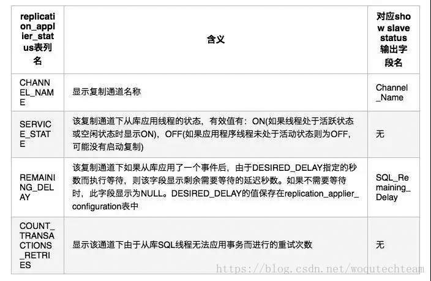

对于replication_applier_status表，不允许执行TRUNCATE TABLE语句。

#### 3. replication_applier_status_by_coordinator表

该表中记录的是从库使用多线程复制时，从库的协调器工作状态记录，当从库使用多线程复制时，每个通道下将创建一个协调器和多个工作线程，使用协调器线程来管理这些工作线程。如果从库使用单线程，则此表为空（对应的记录转移到replication_applier_status_by_worker表中记录），我们先来看看表中记录的统计信息是什么样子的。

```
# 单线程主从复制时，该表为空，为多线程主从复制时表中记录协调者线程状态信息，多主复制时每个复制通过记录一行信息
admin@localhost : performance_schema 02:49:50> select * from replication_applier_status_by_coordinator;
+--------------+-----------+---------------+-------------------+--------------------+----------------------+
| CHANNEL_NAME | THREAD_ID | SERVICE_STATE | LAST_ERROR_NUMBER | LAST_ERROR_MESSAGE | LAST_ERROR_TIMESTAMP |
+--------------+-----------+---------------+-------------------+--------------------+----------------------+
|              |        43 | ON            |                0 |                    | 0000-00-00 00:00:00  |
+--------------+-----------+---------------+-------------------+--------------------+----------------------+
1 row in set (0.00 sec)
# 如果是MGR集群，则该表中会记录类似如下MGR集群信息
root@localhost : performance_schema 11:00:11> select * from replication_applier_status_by_coordinator;
+---------------------------+-----------+---------------+-------------------+--------------------+----------------------+
| CHANNEL_NAME | THREAD_ID | SERVICE_STATE | LAST_ERROR_NUMBER | LAST_ERROR_MESSAGE | LAST_ERROR_TIMESTAMP |
+---------------------------+-----------+---------------+-------------------+--------------------+----------------------+
| group_replication_applier | 91 | ON | 0 | | 0000-00-00 00:00:00 |
+---------------------------+-----------+---------------+-------------------+--------------------+----------------------+
1 row in set (0.00 sec)
```


表中各字段含义及与show slave status输出字段对应关系如下：

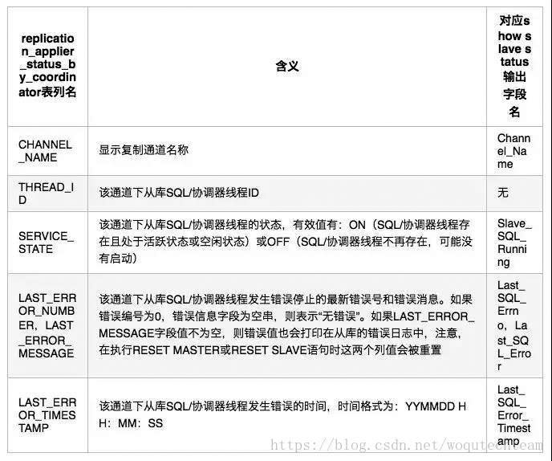

对于replication_applier_status_by_coordinator表，不允许执行TRUNCATE TABLE语句。

#### 4. replication_applier_status_by_worker表

如果从库是单线程，则该表记录一条WORKER_ID=0的SQL线程的状态。如果从库是多线程，则该表记录系统参数slave_parallel_workers指定个数的工作线程状态(WORKER_ID从1开始编号)，此时协调器/SQL线程状态记录在replication_applier_status_by_coordinator表，每一个通道都有自己独立的工作线程和协调器线程（每个通道的工作线程个数由slave_parallel_workers参数变量指定，如果是MGR集群时，则该表中记录的工作线程记录为slave_parallel_workers个group_replication_applier线程+1个group_replication_recovery线程），我们先来看看表中记录的统计信息是什么样子的。

```
# 单线程主从复制时表中记录的内容如下
root@localhost : performance_schema 12:46:10> select * from replication_applier_status_by_worker;
+--------------+-----------+-----------+---------------+-----------------------+-------------------+--------------------+----------------------+
| CHANNEL_NAME | WORKER_ID | THREAD_ID | SERVICE_STATE | LAST_SEEN_TRANSACTION | LAST_ERROR_NUMBER | LAST_ERROR_MESSAGE | LAST_ERROR_TIMESTAMP |
+--------------+-----------+-----------+---------------+-----------------------+-------------------+--------------------+----------------------+
| | 0 | 82 | ON | | 0 | | 0000-00-00 00:00:00 |
+--------------+-----------+-----------+---------------+-----------------------+-------------------+--------------------+----------------------+
1 row in set (0.00 sec)
# 多线程主从复制时表中的记录内容如下（如果是多主复制，则每个复制通道记录slave_parallel_workers参数指定个数的worker线程信息）
admin@localhost : performance_schema 02:50:18> select * from replication_applier_status_by_worker;
+--------------+-----------+-----------+---------------+-----------------------+-------------------+--------------------+----------------------+
| CHANNEL_NAME | WORKER_ID | THREAD_ID | SERVICE_STATE | LAST_SEEN_TRANSACTION | LAST_ERROR_NUMBER | LAST_ERROR_MESSAGE | LAST_ERROR_TIMESTAMP |
+--------------+-----------+-----------+---------------+-----------------------+-------------------+--------------------+----------------------+
|              |        1 |        44 | ON            |                      |                0 |                    | 0000-00-00 00:00:00  |
|              |        2 |        45 | ON            |                      |                0 |                    | 0000-00-00 00:00:00  |
|              |        3 |        46 | ON            |                      |                0 |                    | 0000-00-00 00:00:00  |
|              |        4 |        47 | ON            |                      |                0 |                    | 0000-00-00 00:00:00  |
+--------------+-----------+-----------+---------------+-----------------------+-------------------+--------------------+----------------------+
4 rows in set (0.00 sec)
# 如果是MGR集群，则该表中会记录类似如下MGR集群信息
root@localhost : performance_schema 11:00:16> select * from replication_applier_status_by_worker;
+----------------------------+-----------+-----------+---------------+------------------------------------------------+-------------------+--------------------+----------------------+
| CHANNEL_NAME | WORKER_ID | THREAD_ID | SERVICE_STATE | LAST_SEEN_TRANSACTION | LAST_ERROR_NUMBER | LAST_ERROR_MESSAGE | LAST_ERROR_TIMESTAMP |
+----------------------------+-----------+-----------+---------------+------------------------------------------------+-------------------+--------------------+----------------------+
| group_replication_recovery | 0 | NULL | OFF | | 0 | | 0000-00-00 00:00:00 |
| group_replication_applier | 1 | 92 | ON | aaaaaaaa-aaaa-aaaa-aaaa-aaaaaaaaaaaa:104099082 | 0 | | 0000-00-00 00:00:00 |
| group_replication_applier | 2 | 93 | ON | | 0 | | 0000-00-00 00:00:00 |
......
+----------------------------+-----------+-----------+---------------+------------------------------------------------+-------------------+--------------------+----------------------+
17 rows in set (0.00 sec)
```


表中各字段含义及与show slave status输出字段对应关系如下：

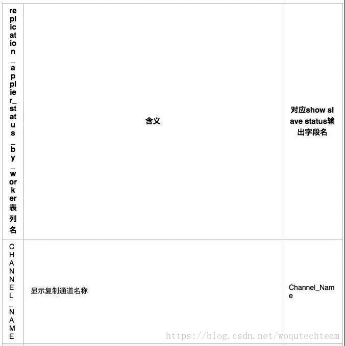


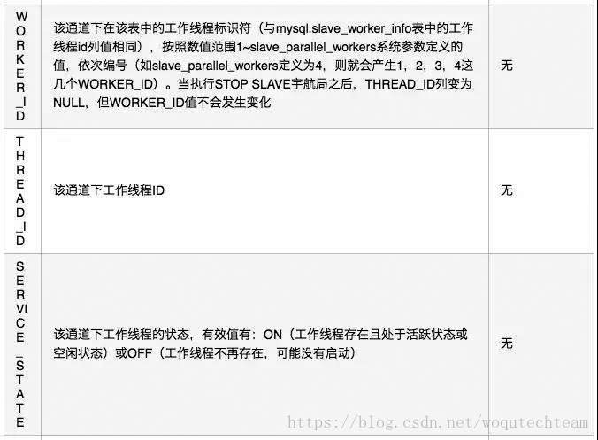


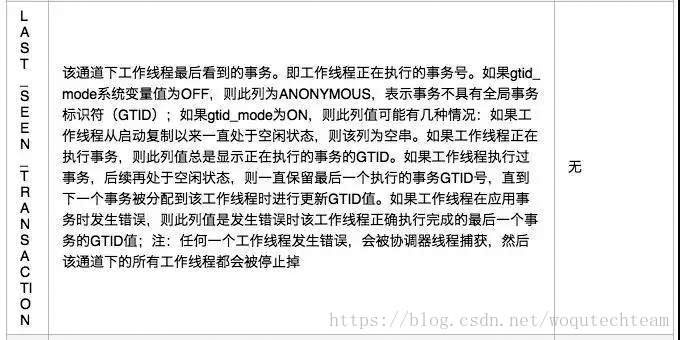

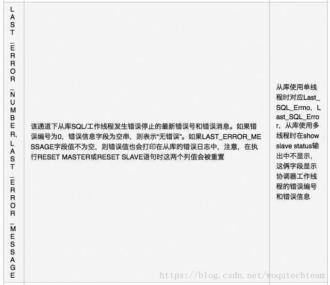

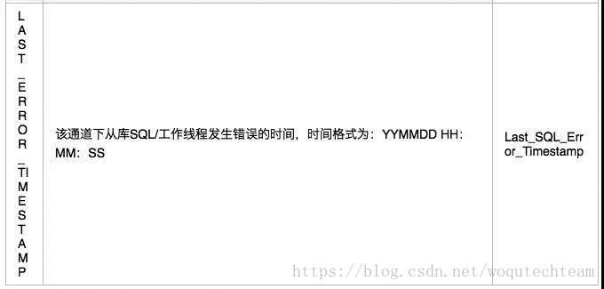

对于replication_applier_status_by_worker表，不允许执行TRUNCATE TABLE语句。

#### 5. replication_connection_configuration表

该表中记录从库用于连接到主库的配置参数，该表中存储的配置信息在执行change master语句时会被修改

- 与replication_connection_status表相比，replication_connection_configuration更改频率更低。因为它只包含从库连接到主库的配置参数，在连接正常工作期间这些配置信息保持不变的值，而replication_connection_status中包含的连接状态信息，只要IO线程状态发生变化，该表中的信息就会发生修改（多主复制架构中，从库指向了多少个主库就会记录多少行记录。MGR集群架构中，每个节点有两条记录，但这两条记录并未记录完整的组复制连接配置参数，例如：host等信息记录到了replication_group_members表中）。

我们先来看看表中记录的统计信息是什么样子的。

```
# 单线程、多线程主从复制时表中记录的内容相同，如果是多主复制，则每个复制通道各自有一行记录信息
admin@localhost : performance_schema 02:51:00> select * from replication_connection_configuration\G;
*************************** 1. row ***************************
            CHANNEL_NAME: 
                    HOST: 10.10.20.14
                    PORT: 3306
                    USER: qfsys
        NETWORK_INTERFACE: 
            AUTO_POSITION: 1
              SSL_ALLOWED: NO
              SSL_CA_FILE: 
              SSL_CA_PATH: 
          SSL_CERTIFICATE: 
              SSL_CIPHER: 
                  SSL_KEY: 
SSL_VERIFY_SERVER_CERTIFICATE: NO
            SSL_CRL_FILE: 
            SSL_CRL_PATH: 
CONNECTION_RETRY_INTERVAL: 60
  CONNECTION_RETRY_COUNT: 86400
      HEARTBEAT_INTERVAL: 5.000
              TLS_VERSION: 
1 row in set (0.00 sec)
# 如果是MGR集群，则该表中会记录类似如下MGR集群信息
root@localhost : performance_schema 11:02:03> select * from replication_connection_configuration\G
*************************** 1. row ***************************
             CHANNEL_NAME: group_replication_applier
                     HOST: <NULL>
......
*************************** 2. row ***************************
             CHANNEL_NAME: group_replication_recovery
                     HOST: <NULL>
......
2 rows in set (0.00 sec)
```


表中各字段含义以及与change master to语句的选项对应关系如下：

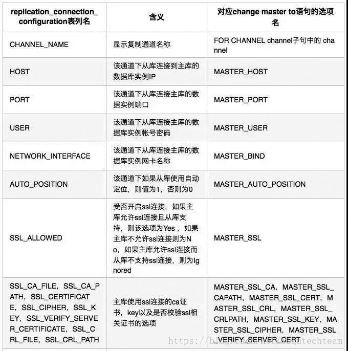

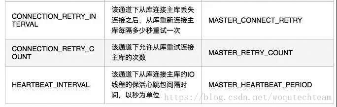

注意：对于replication_connection_configuration表，不允许执行TRUNCATE TABLE语句。

#### 6. replication_connection_status表

该表中记录的是从库IO线程的连接状态信息（也记录组复制架构中其他节点的连接信息，组复制架构中一个节点加入集群之前的数据需要使用异步复制通道进行数据同步，组复制的异步复制通道信息在show slave status中不可见），我们先来看看表中记录的统计信息是什么样子的。

```
# 多线程和单线程主从复制时表中记录相同，如果是多主复制，则每个复制通道在表中个记录一行信息
root@localhost : performance_schema 12:55:26> select * from replication_connection_status\G
*************************** 1. row ***************************
         CHANNEL_NAME: 
           GROUP_NAME: 
          SOURCE_UUID: ec123678-5e26-11e7-9d38-000c295e08a0
            THREAD_ID: 101
        SERVICE_STATE: ON
COUNT_RECEIVED_HEARTBEATS: 136
LAST_HEARTBEAT_TIMESTAMP: 2018-06-12 00:55:22
RECEIVED_TRANSACTION_SET: 
    LAST_ERROR_NUMBER: 0
   LAST_ERROR_MESSAGE: 
 LAST_ERROR_TIMESTAMP: 0000-00-00 00:00:00
1 row in set (0.00 sec)
# 如果是MGR集群，则该表中会记录类似如下MGR集群信息
root@localhost : performance_schema 10:56:40> select * from replication_connection_status\G
*************************** 1. row ***************************
         CHANNEL_NAME: group_replication_applier
           GROUP_NAME: aaaaaaaa-aaaa-aaaa-aaaa-aaaaaaaaaaaa
          SOURCE_UUID: aaaaaaaa-aaaa-aaaa-aaaa-aaaaaaaaaaaa
            THREAD_ID: NULL
        SERVICE_STATE: ON
COUNT_RECEIVED_HEARTBEATS: 0
LAST_HEARTBEAT_TIMESTAMP: 0000-00-00 00:00:00
RECEIVED_TRANSACTION_SET: aaaaaaaa-aaaa-aaaa-aaaa-aaaaaaaaaaaa:104099082
    LAST_ERROR_NUMBER: 0
   LAST_ERROR_MESSAGE: 
 LAST_ERROR_TIMESTAMP: 0000-00-00 00:00:00
*************************** 2. row ***************************
         CHANNEL_NAME: group_replication_recovery
......
2 rows in set (0.00 sec)
```


表中各字段含义及与show slave status输出字段对应关系如下：

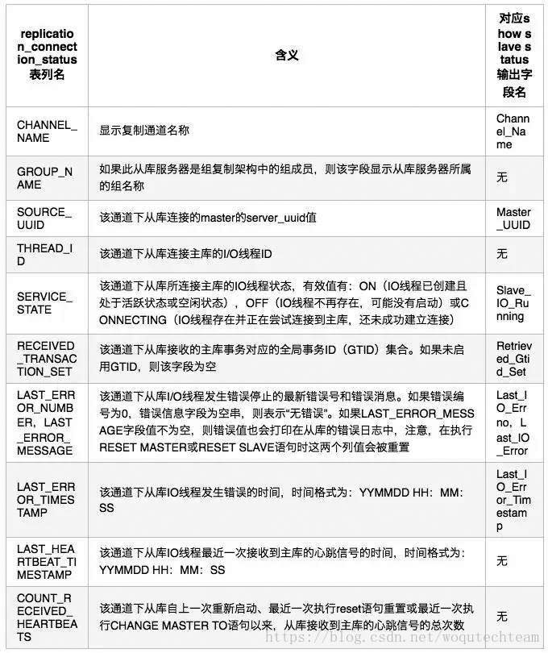

对于replication_connection_status表，不允许执行TRUNCATE TABLE语句。

#### 7. replication_group_member_stats表

该表中记录了MySQL组复制成员的统计信息。仅在组复制组件运行时表中才会有记录，我们先来看看表中记录的统计信息是什么样子的。

```
root@localhost : performance_schema 11:02:10> select * from replication_group_member_stats\G
*************************** 1. row ***************************
                  CHANNEL_NAME: group_replication_applier
                       VIEW_ID: 15287289928409067:1
                     MEMBER_ID: 5d78a458-30d2-11e8-a66f-5254002a54f2
   COUNT_TRANSACTIONS_IN_QUEUE: 0
    COUNT_TRANSACTIONS_CHECKED: 0
      COUNT_CONFLICTS_DETECTED: 0
COUNT_TRANSACTIONS_ROWS_VALIDATING: 0
TRANSACTIONS_COMMITTED_ALL_MEMBERS: 0a1e8349-2e87-11e8-8c9f-525400bdd1f2:1-148826,
2d623f55-2111-11e8-9cc3-0025905b06da:1-2,
aaaaaaaa-aaaa-aaaa-aaaa-aaaaaaaaaaaa:1-104099082
LAST_CONFLICT_FREE_TRANSACTION: 
1 row in set (0.00 sec)
```


表中各字段含义如下：

- CHANNEL_NAME：组成员所在组所使用的复制通道名称，通道名称为：group_replication_applier
- VIEW_ID：组成员所在组的当前视图标识符
- MEMBER_ID：显示当前组成员server的UUID，组成员实例的UUID相同。组中的每个节点具有不同的值（因为是使用的组成员实例的UUID，该UUID随机生成，保证全局唯一）且唯一
- COUNT_TRANSACTIONS_IN_QUEUE：表示当前队列中等待冲突检查的事务数（等待全局事务认证的事务数），一旦冲突检测通过，他们将排队等待应用
- COUNT_TRANSACTIONS_CHECKED：表示已通过冲突检查机制检查的事务数（已通过全局事务认证的事务数，从节点加入组复制时开始计算）
- COUNT_CONFLICTS_DETECTED：表示未通过冲突检测机制检查的事务数（在全局事务认证时未通过的事务数）
- COUNT_TRANSACTIONS_ROWS_VALIDATING：表示冲突检测数据库的当前大小（用于存放每个经过验证的事务的数据库），可用于认证新事务，但尚未被垃圾回收的可用行数
- TRANSACTIONS_COMMITTED_ALL_MEMBERS：显示已在当前视图中的所有成员上成功提交的事务(类似所有成员实例的gtid_executed集合的交集)，该值固定时间间隔更新（所以并不实时）
- LAST_CONFLICT_FREE_TRANSACTION：显示最后一次无冲突校验检查的事务标识符(最后一个没有冲突的事务的GTID)

对于replication_group_member_stats表，不允许执行TRUNCATE TABLE语句。

#### 8. replication_group_members表

该表记录组复制架构中，组成员的网络和状态信息。仅在组复制组件运行时表中才会有记录，我们先来看看表中记录的统计信息是什么样子的。

```
root@localhost : performance_schema 11:03:38> select * from replication_group_members;
+---------------------------+--------------------------------------+-------------+-------------+--------------+
| CHANNEL_NAME | MEMBER_ID | MEMBER_HOST | MEMBER_PORT | MEMBER_STATE |
+---------------------------+--------------------------------------+-------------+-------------+--------------+
| group_replication_applier | 5d78a458-30d2-11e8-a66f-5254002a54f2 | node1 | 3306 | ONLINE |
+---------------------------+--------------------------------------+-------------+-------------+--------------+
1 row in set (0.00 sec)
```


表中各字段含义如下：

- CHANNEL_NAME：组复制架构中使用的通道名称，通道名称为：group_replication_applier
- MEMBER_ID：组复制架构中，组成员的ID，与组成员实例的server UUID相同
- MEMBER_HOST：组复制架构中，组成员的网络地址（主机名或IP地址，与成员实例的hostname或report_host系统变量的值相同）
- MEMBER_PORT：组复制架构中，组成员的侦听端口，与组成员实例的port或report_port系统变量的值相同
- MEMBER_STATE：组复制架构中，组成员的状态 有效状态如下： 
  \* OFFLINE：组复制成员已经安装组复制插件，但未启动 
  \* RECOVERING：组复制成员已经加入到组复制架构中，正在从组中接收数据，即正在加入集群 
  \* ONLINE：组复制成员处于正常运行状态 
  \* PS：组复制架构中，如果组成员的组复制状态发生错误，无法正常从组中接收数据是，可能会变成ERROR状态。如果发生网络故障或者其他成员宕机，那么剩余存活的孤立节点的状态可能会变为UNREACHABLE

对于replication_group_members表，不允许执行TRUNCATE TABLE语句。


**02**

### 用户自定义变量记录表

performance_schema提供了一个保存用户定义变量的user_variables_by_thread表（该表也保存由mysql内部连接线程创建的变量）。这些变量是在特定会话中定义的变量，变量名由@字符开头。

我们先来看看表中记录的统计信息是什么样子的。

```
admin@localhost : performance_schema 01:50:16> select * from user_variables_by_thread;
+-----------+-------------------------+--------------------------------------+
| THREAD_ID | VARIABLE_NAME          | VARIABLE_VALUE                      |
+-----------+-------------------------+--------------------------------------+
|        45 | slave_uuid              | 4b0027eb-6223-11e7-94ad-525400950aac |
|        45 | master_heartbeat_period | 5000000000                          |
|        45 | master_binlog_checksum  | CRC32                                |
+-----------+-------------------------+--------------------------------------+
3 rows in set (0.01 sec)
```


表中各字段含义如下：

- THREAD_ID：定义变量的会话的线程标识符（ID）
- VARIABLE_NAME：定义的变量名称，在该表中去掉了@字符的形式显式
- VARIABLE_VALUE：定义的变量值

user_variables_by_thread表不允许使用TRUNCATE TABLE语句


**03**

### system variables记录表

MySQL server维护着许多系统变量，在performance_schema中提供了对全局、当前会话、以及按照线程分组的系统变量信息记录表：

- global_variables：全局系统变量。只需要全局系统变量值的应用程序可以从该表中获取
- session_variables：当前会话的系统变量。只需要获取自己当前会话的系统变量值可以从该表中获取（注意，该表中包含了无会话级别的全局变量值，且该表不记录已断开连接的系统变量）
- variables_by_thread：按照线程ID为标识符记录的会话系统变量。想要在当前线程中查询其他指定线程ID的会话级别系统变量时，应用程序可以从该表中获取（注意，该表中仅包含有会话级别的系统变量）

我们先来看看表中记录的统计信息是什么样子的。


```
# global_variables表
admin@localhost : performance_schema 09:50:31> select * from global_variables limit 5;
+--------------------------+----------------+
| VARIABLE_NAME            | VARIABLE_VALUE |
+--------------------------+----------------+
| auto_increment_increment | 2              |
| auto_increment_offset    | 2              |
......
5 rows in set (0.01 sec)
# session_variables表（查询结果与global_variables 表类似）
admin@localhost : performance_schema 09:50:40> select * from session_variables limit 5;
.............
# variables_by_thread表
admin@localhost : performance_schema 09:50:52> select * from variables_by_thread limit 5;  # 可以看到比前面两张表多了个THREAD_ID 字段来记录线程ID
+-----------+-----------------------------------------+----------------+
| THREAD_ID | VARIABLE_NAME                          | VARIABLE_VALUE |
+-----------+-----------------------------------------+----------------+
|        45 | auto_increment_increment                | 2              |
|        45 | auto_increment_offset                  | 2              |
......
5 rows in set (0.00 sec)
```


global_variables和session_variables表字段含义如下：

- VARIABLE_NAME：系统变量名
- VARIABLE_VALUE：系统变量值。对于global_variables，此列包含全局值。对于session_variables，此列包含当前会话生效的变量值

variables_by_thread表字段含义如下：

- THREAD_ID：会话级别系统变量对应的线程ID
- VARIABLE_NAME：会话级别系统变量名
- VARIABLE_VALUE：会话级别系统变量值

performance_schema记录系统变量的这些表不支持TRUNCATE TABLE语句

PS：

- show_compatibility_56系统变量的值会影响这些表中的信息记录
- 会话变量表（session_variables，variables_by_thread）仅包含活跃会话的信息，已经终止的会话不会记录
- variables_by_thread表仅包含关于前台线程的会话级别系统变量信息。且只记录拥有会话级别的系统变量，另外，如果在该表中有不能够被记录的会话级别系统变量，那么将增加状态变量Performance_schema_thread_instances_lost的值


**04**

### status variables统计表

MySQL server维护着许多状态变量，提供有关其内部相关操作的信息。如下一些performance_schema表中记录着状态变量信息：

- global_status：全局状态变量。如果只需要全局状态变量值的应用程序可以查询此表，中断的会话状态变量值会被聚合在此表中
- session_status：当前会话的状态变量。如果只希望查询自己会话的所有状态变量值的应用程序可以查询此表（注意：该表包含没有会话级别的全局状态变量），只记录活跃会话，不记录已中断的会话
- status_by_thread：按照线程ID作为标识符记录每个活跃会话的状态变量。如果需要在某个会话中查询其他会话的状态变量值可以查询此表（注意：该表不包含只具有全局级别的状态变量），只记录活跃会话，不记录中断的会话

我们先来看看表中记录的统计信息是什么样子的。


```
# global_status表
admin@localhost : performance_schema 11:01:51> select * from global_status limit 5;
+----------------------------+----------------+
| VARIABLE_NAME              | VARIABLE_VALUE |
+----------------------------+----------------+
| Aborted_clients            | 0              |
| Aborted_connects          | 0              |
......
5 rows in set (0.00 sec)
# session_status表（记录内容与global_status 表类似）
admin@localhost : performance_schema 11:02:21> select * from session_status limit 5;
............
# status_by_thread 表
admin@localhost : performance_schema 11:02:49> select * from status_by_thread limit 5;
+-----------+-------------------------+----------------+
| THREAD_ID | VARIABLE_NAME          | VARIABLE_VALUE |
+-----------+-------------------------+----------------+
|        45 | Bytes_received          | 0              |
|        45 | Bytes_sent              | 2901          |
......
5 rows in set (0.00 sec)
```


global_status和session_status表字段含义如下：

- - VARIABLE_NAME：状态变量名称
  - VARIABLE_VALUE：状态变量值。对于global_status，此列包含全局状态变量值。对于session_status，此列包含当前会话的状态变量值（同时包含无会话级别的全局状态变量值，且只包含活跃会话的状态变量值）。

status_by_thread表包含每个活跃线程的状态。字段含义如下：

- THREAD_ID：与该状态变量相关联的线程ID
- VARIABLE_NAME：有会话级别的状态变量名称
- VARIABLE_VALUE：与线程ID相关的会话级别状态变量值

performance_schema允许对这些状态变量信息统计表执行TRUNCATE TABLE语句：

- global_status：执行truncate会重置线程、帐户、主机、用户相关的全局状态变量值，但不会重置一些从不重置的全局状态变量值，同时会影响到status_by_account表中的状态变量值
- session_status：不支持执行truncate语句
- status_by_thread：将所有线程的状态变量值聚合到全局状态变量表(global_status)和帐户状态变量表(status_by_account)，然后重置线程状态变量表。如果不收集帐户相关的统计信息，则会在status_by_user和status_by_host中单独收集主机和用户的状态变量值，是否收集host，user，account的状态变量值，可以使用系统变量performance_schema_accounts_size，performance_schema_hosts_size和performance_schema_users_size在server启动之前分别进行设置，设置为0，则表示不收集，大于0则表示要收集（注意，这些系统变量原本是用于控制accounts、hosts、users表中的行数，但是status_by_account，status_by_user，status_by_host中的account，user，host值是来自于accounts、hosts、users表，so…你懂的）

FLUSH STATUS语句会把所有活跃会话的状态变量值聚合到全局状态变量值中，然后重置所有活跃会话的状态变量值，并在account，host和user状态变量对应的统计表中重置已断开连接的状态变量聚合值。


PS：

- status_by_thread表仅包含前台线程的状态变量信息。该表记录数量自动计算，不建议手工指定系统变量perform_schema_max_thread_instances的值，如果手工指定，务必要大于后台线程数量*2，否则可能造成因为该变量的限制没有足够的intruments thread instances容量导致无法创建，进而无法监控前台线程的状态变量统计信息，如果无法监控前台线程的状态变量统计信息时，该表为空
- show_compatibility_56系统变量的值会影响这些表中的信息记录
- performance_schema执行状态变量收集时，对于全局级别的状态变量，如果threads表中INSTRUMENTED列值为“yes”则执行收集，否则不收集。但对于会话级别的状态变量，无论threads表的INSTRUMENTED字段值是否为yes，始终执行收集
- performance_schema不会在状态变量表中收集Com_xxx状态变量的统计信息。要获取全局和每个会话语句的相关执行计数，请分别使用events_statements_summary_global_by_event_name和events_statements_summary_by_thread_by_event_name表进行查询。例如：SELECT EVENT_NAME, COUNT_STAR FROM  events_statements_summary_global_by_event_name WHERE EVENT_NAME LIKE  'statement/sql/%';
- 对于按帐户，主机名和用户名聚合的状态变量信息。详见下文。


**05**

### 按照帐号、主机、用户统计的状态变量统计表

按照帐号、主机名、用户名为分组对状态变量进行分类数据，例如：按照帐号表统计的表分组列为host和user列，聚合列当然就是状态变量本身（该功能是MySQL 5.7版本新增的），有如下几张表：

- status_by_account：按照每个帐户进行聚合的状态变量
- status_by_host：按照每个主机名进行聚合的状态变量
- status_by_user：按照每个用户名进行聚合的状态变量

我们先来看看表中记录的统计信息是什么样子的。


```
# status_by_account表
admin@localhost : performance_schema 04:08:36> select * from status_by_account where USER is not null limit 5;
+-------+-----------+-------------------------+----------------+
| USER  | HOST      | VARIABLE_NAME          | VARIABLE_VALUE |
+-------+-----------+-------------------------+----------------+
| admin | localhost | Bytes_received          | 6049          |
| admin | localhost | Bytes_sent              | 305705        |
.......
5 rows in set (0.00 sec)
# status_by_host表
admin@localhost : performance_schema 04:08:43> select * from status_by_host where HOST is not null limit 5;
+-----------+-------------------------+----------------+
| HOST      | VARIABLE_NAME          | VARIABLE_VALUE |
+-----------+-------------------------+----------------+
| localhost | Bytes_received          | 6113          |
| localhost | Bytes_sent              | 306310        |
......
5 rows in set (0.00 sec)
# status_by_user表
admin@localhost : performance_schema 04:08:58> select * from status_by_user where USER is not null limit 5;
+-------+-------------------------+----------------+
| USER  | VARIABLE_NAME          | VARIABLE_VALUE |
+-------+-------------------------+----------------+
| admin | Bytes_received          | 6177          |
| admin | Bytes_sent              | 306781        |
......
5 rows in set (0.00 sec)
```


表中各字段含义

- VARIABLE_NAME：状态变量名称
- 与VARIABLE_VALUE：状态变量值，要注意：该段值包括活跃和已终止的会话的状态变量统计值
- USER：用户名
- HOST：主机名或IP

状态变量摘要表允许执行TRUNCATE TABLE语句，执行truncate语句时活动会话的状态变量不受影响：

- status_by_account：终止的会话在account聚合表中的状态变量值将被聚合到用户和主机聚合表中的状态变量计数器中，然后重置帐户聚合表中的状态变量值
- status_by_host：终止的会话对应的状态变量被重置
- status_by_user：终止的会话对应的状态变量被重置

FLUSH STATUS将会话状态从所有活动会话添加到全局状态变量，然后重置所有活动会话的状态变量值，并在按照account、host、user分类聚合表中重置已断开连接的状态变量值。

PS：

- 当会话终止时收集的account相关状态变量会添加到全局状态变量表的计数器和accounts表的相关计数器中。如果account分类关闭了收集而host和user分类开启了收集，则会针对主机和用户分类聚合相应的状态变量值，同时将会话状态添加到hosts和users表中的相关计数器中
- 如果将performance_schema_accounts_size，performance_schema_hosts_size和performance_schema_users_size系统变量分别设置为0，则不会收集帐户，主机和用户分类的统计信息
- show_compatibility_56系统变量的值会影响这些表中的统计信息


**06**

### host_cache表

host_cache表保存连接到server的主机相关信息缓存，其中包含客户机主机名和IP地址信息，可以用于避免DNS查找。该表可以使用SELECT语句进行查询，但需要在server启动之前开启performance_schema参数，否则表记录为空。

我们先来看看表中记录的统计信息是什么样子的。

```
root@localhost : performance_schema 10:35:47> select * from host_cache\G;
*************************** 1. row ***************************
                                    IP: 192.168.2.122
                                  HOST: NULL
                        HOST_VALIDATED: YES
                    SUM_CONNECT_ERRORS: 0
            COUNT_HOST_BLOCKED_ERRORS: 0
      COUNT_NAMEINFO_TRANSIENT_ERRORS: 0
      COUNT_NAMEINFO_PERMANENT_ERRORS: 1
                  COUNT_FORMAT_ERRORS: 0
      COUNT_ADDRINFO_TRANSIENT_ERRORS: 0
      COUNT_ADDRINFO_PERMANENT_ERRORS: 0
                  COUNT_FCRDNS_ERRORS: 0
                COUNT_HOST_ACL_ERRORS: 0
          COUNT_NO_AUTH_PLUGIN_ERRORS: 0
              COUNT_AUTH_PLUGIN_ERRORS: 0
                COUNT_HANDSHAKE_ERRORS: 0
              COUNT_PROXY_USER_ERRORS: 0
          COUNT_PROXY_USER_ACL_ERRORS: 0
          COUNT_AUTHENTICATION_ERRORS: 0
                      COUNT_SSL_ERRORS: 0
    COUNT_MAX_USER_CONNECTIONS_ERRORS: 0
COUNT_MAX_USER_CONNECTIONS_PER_HOUR_ERRORS: 0
        COUNT_DEFAULT_DATABASE_ERRORS: 0
            COUNT_INIT_CONNECT_ERRORS: 0
                    COUNT_LOCAL_ERRORS: 0
                  COUNT_UNKNOWN_ERRORS: 0
                            FIRST_SEEN: 2017-12-30 22:34:51
                            LAST_SEEN: 2017-12-30 22:35:29
                      FIRST_ERROR_SEEN: 2017-12-30 22:34:51
                      LAST_ERROR_SEEN: 2017-12-30 22:34:51
1 row in set (0.00 sec)
```


表中各字段含义如下：

- IP：连接到server的客户端的IP地址，以字符串形式记录
- HOST：该客户端IP解析的DNS主机名，如果没有计息记录，则该字段为NULL
- HOST_VALIDATED：某个IP的客户端的'IP-主机名称-IP'的解析是否成功。如果HOST_VALIDATED为YES，则HOST列被当作与之相关的IP使用，以避免使用DNS解析。当HOST_VALIDATED为NO时，对于每个连会反复地尝试DNS解析，直到最终返回有效的解析结果或者返回一个错误。可以利用该信息来在server所使用的DNS服务器故障期间避免执行DNS解析
- SUM_CONNECT_ERRORS：该字段记录的连接错误数量被认为是“正在阻塞中”的连接数（此时你可能需要关注下max_connect_errors系统变量值，一旦该列值超过该变量的值，则后续的连接将直接被拒绝）。只对协议握手错误进行计数，并且仅对通过验证的主机（HOST_VALIDATED = YES）进行计数
- COUNT_HOST_BLOCKED_ERRORS：由于SUM_CONNECT_ERRORS超出了max_connect_errors系统变量的值而被阻塞的连接数
- COUNT_NAMEINFO_TRANSIENT_ERRORS：从IP到主机名称的DNS解析期间的短暂错误的数量，例如第一次解析失败，第二次解析成功
- COUNT_NAMEINFO_PERMANENT_ERRORS：从IP到主机名称DNS解析期间的永久性错误的数量，解析DNS直到不再尝试重新解析的错误
- COUNT_FORMAT_ERRORS：主机名格式错误的数量。  对于主机名（DNS中的主机名），MySQL不会在mysql.user表中重试执行与主机列匹配操作，例如：1.2.example.com（主机名部分是数字是错误的格式）。但是如果直接使用IP地址时则前缀是数字的不会被识别为错误格式，会使用IP格式匹配而不是DNS格式
- COUNT_ADDRINFO_TRANSIENT_ERRORS：从主机名称到IP反向DNS解析过程中的短暂错误数量
- COUNT_ADDRINFO_PERMANENT_ERRORS：从主机名称到IP反向DNS解析期间的永久性错误的数量
- COUNT_FCRDNS_ERRORS：DNS反向解析发生错误的数量。当IP-主机名称-IP的解析发生了解析的结果IP与发起请求的客户端原始IP不匹配时，就产后了这个错误
- COUNT_HOST_ACL_ERRORS：某个主机没有有权限的用户可登录server时，从这个主机尝试登录server会发生这个错误。在这种情况下，server返回ER_HOST_NOT_PRIVILEGED错误
- COUNT_NO_AUTH_PLUGIN_ERRORS：由于请求的身份验证插件不可用而导致的错误数量。例如：某个身份验证插件并未加载，那么这个插件被请求时就会发生这个错误
- COUNT_AUTH_PLUGIN_ERRORS：身份认证插件报告的错误数。验证插件可以报告不同的错误代码，以指出故障的根本原因。根据错误类型，相应地增加对应错误类型的错误计数列值(COUNT_AUTHENTICATION_ERRORS、COUNT_AUTH_PLUGIN_ERRORS、COUNT_HANDSHAKE_ERRORS），未知的插件错误在COUNT_AUTH_PLUGIN_ERRORS列中计数
- COUNT_HANDSHAKE_ERRORS：在握手协议级别检测到的错误数
- COUNT_PROXY_USER_ERRORS：代理用户A在代理不存在的另一用户B时检测到的错误数
- COUNT_PROXY_USER_ACL_ERRORS：当代理用户A被代理给另一个存在但是对于A没有PROXY权限的用户B时，检测到的错误数量
- COUNT_AUTHENTICATION_ERRORS：认证失败造成的错误次数
- COUNT_SSL_ERRORS：由于SSL问题导致的错误数量
- COUNT_MAX_USER_CONNECTIONS_ERRORS：超出每个用户连接配额造成的错误数
- COUNT_MAX_USER_CONNECTIONS_PER_HOUR_ERRORS：超出每用户连接每小时配额造成的错误数量
- COUNT_DEFAULT_DATABASE_ERRORS：与默认数据库相关的错误数。例如：数据库不存在或用户没有权限访问
- COUNT_INIT_CONNECT_ERRORS：由init_connect系统变量加载的文件中的语句执行失败引起的错误数
- COUNT_LOCAL_ERRORS：server本地执行相关操作时的错误数量，与网络、身份验证、授权无关的错误。例如，内存不足的情况属于这一类别
- COUNT_UNKNOWN_ERRORS：其他未知错误的数量，该列保留供将来使用
- FIRST_SEEN：对于某个IP客户端，第一次尝试连接发生的时间
- LAST_SEEN：对于某个IP客户端，最后一次尝试连接发生的时间
- FIRST_ERROR_SEEN：对于某个IP客户端，第一次尝试连接发生错误的时间
- LAST_ERROR_SEEN：对于某个IP客户端，最后一次尝试连接发生错误的时间

FLUSH HOSTS和TRUNCATE TABLE  host_cache具有相同的效果：它们清除主机缓存。host_cache表被清空并解除阻塞任何因为错误记录数量超过限制而被阻塞的主机连接。FLUSH HOSTS需要RELOAD权限。 TRUNCATE TABLE需要host_cache表的DROP权限。

PS：如果启动选项 skip_name_resolve 设置为ON，则该表不记录任何信息，因为该表的作用就是用于避免、加速域名解析用于，跳过域名解析功能时则该表记录的信息用途不大。


**- END -**