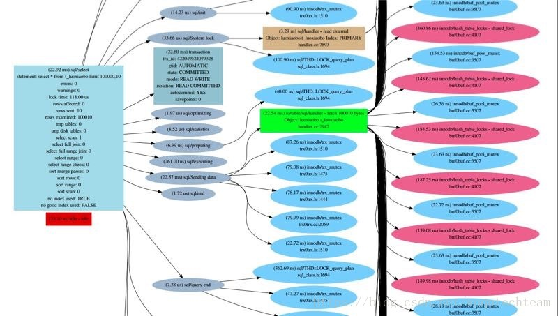

在上一篇[《用于查看配置的存储过程 | 全方位认识 sys 系统库》](http://mp.weixin.qq.com/s?__biz=MzU0MTczNzA1OA==&mid=2247484299&idx=1&sn=9fe9e85a77841d0617864f8ea78bb99f&chksm=fb242a86cc53a390b1e0d2f2c6583d863c92269a116c859fbe99b22de757abb29652ea97787e&scene=21#wechat_redirect)中，我们介绍了sys 系统库中用于查看performance_schema配置信息的快捷存储过程，本期给大家介绍sys 系统库中不太好归类的一些存储过程，这也是本系列最后一个篇幅介绍存储过程。
PS：下文中如果存储过程定义文本较短的会列出部分存储过程的定义文本，以便大家更直观地学习它们。过长的存储过程定义文本请自行按照[《初相识 | 全方位认识 sys 系统库》](http://mp.weixin.qq.com/s?__biz=MzU0MTczNzA1OA==&mid=2247484142&idx=1&sn=403b0d50e012c7dc60834b6401326935&chksm=fb242be3cc53a2f514ee15ba39cb8c3b2f3a62fe536149992a68ef56f21dbf5c900eff26312f&scene=21#wechat_redirect)一文中介绍的下载路径下载查看。
 
### **01.create_synonym_db()**
创建一个指定库的同义词库，例如：call  create_synonym_db('information_schema','is');，该存储过程会查询information_schema库下的所有表字段信息来创建一个is库，并在is库下一一创建与information_schema下的表名同名的视图，对is库下视图的查询其实就相当于是在查询information_schema下的表。
传参定义
- in_db_name VARCHAR(64)：代表需要为哪个schema创建一个同义词库，该schema必须存在，否则报Unknown database错误
- in_synonym VARCHAR(64)：代表同义词库的schema名称，该schema必须不存在，否则报Can\'t create database ', in_synonym, '; database exists错误
调用示例
```sql
admin@localhost : sys 01:29:25> call create_synonym_db('information_schema','info');
+-----------------------------------------+
| summary                                |
+-----------------------------------------+
| Created 61 views in the `info` database |
+-----------------------------------------+
1 row in set (0.92 sec)
 
Query OK, 0 rows affected (0.92 sec)
 
admin@localhost : sys 03:02:44> SHOW FULL TABLES FROM info;
+---------------------------------------+------------+
| Tables_in_info                        | Table_type |
+---------------------------------------+------------+
| character_sets                        | VIEW      |
| collation_character_set_applicability | VIEW      |
| collations                            | VIEW      |
...
61 rows in set (0.01 sec)
```
###  
### **02.diagnostics()**
收集系统诊断信息（该存储过程较为复杂，同学们耐心咯），数据来源：sys.metrics以及直接查询一些表获取数据写到临时表中再加工处理输出，会更新performance_schema的threads、setup_consumers、setup_instruments，会调用sys.sys_get_config()获取sys  schema配置、sys.ps_setup_disable_thread()关闭connection_id()线程、sys.ps_setup_save()保存sys schema配置等等一些列相关的sys schema对象，会修改sql_log_bin = 0，执行select  ...@@variables_name形式查询一些全局系统变量，查询information_schema的ENGINES、TABLES、GLOBAL_VARIABLES，查询information_schema的GLOBAL_VARIABLES、replication_*表等，查询mysql的slave_master_info、slave_relay_log_info等，然后把这些查询到的值保存到一个临时表tmp_sys_views_delta中进行一些数据处理再输出：
- 需要SUPER权限，因为该存储过程在执行期间会在会话级别修改sql_log_bin系统变量禁用二进制日志记录
- 在MySQL 5.7.9和MySQL 5.6中新增。对于MySQL 5.6，需要MySQL 5.6.10或更高版本。对于MySQL 5.7，需要MySQL 5.7.9或更高版本
diagnostics()存储过程收集的数据包括以下几个方面：
- 来自sys  schema中其他一些视图的信息，如：sys.version、sys.processlist、sys.latest_file_io、sys.memory_by_host_by_current_bytes、sys.memory_by_thread_by_current_bytes、sys.memory_by_user_by_current_bytes、sys.memory_global_by_current_bytes、sys.schema_object_overview、sys.metrics、sys.with_runtimes_in_95th_percentile
- 来自ndbinfo schema中的信息(如果MySQL server是NDB Cluster的一部分时会查询ndb相关的信息)
- 复制状态信息(包括主从的一些信息)，直接从相关表中获取：mysql.slave_master_info，mysql.slave_relay_log_info，mysql.slave_worker_info，performance_schema下的replication_* 表
- 此外，还调用了一些存储过程（协助diagnostics()过程获取数据、执行语句、备份和恢复配置信息等），如：sys.statement_performance_analyzer()、sys.ps_setup_save()、sys.execute_prepared_stmt()、sys.ps_statement_avg_latency_histogram()、sys.ps_setup_reload_saved()、sys.ps_setup_enable_thread()
在diagnostics()存储过程执行时打印的信息中，视图输出的信息中有些是基于初始值计算、有些是基于总体值计算、有些是基于增量值计算的：
- 初始视图(start视图)：指的是在diagnostics()存储过程开始执行时执行的视图，用于存储过程开始执行时收集数据。输出值与增量视图的起始值相同且输出值也用于增量视图。如果diagnostics.include_raw配置选项为ON，则diagnostics()存储过程执行时才会包含初始视图，另外执行时也会同时打印sys.metrics视图的原始数据(与在临时表中经过加工处理后再输出的值不同)
- 总体视图(end视图)：指的是在diagnostics()存储过程执行结束时执行的视图，用于存储过程结束执行时收集数据。输出值与增量视图的结束值相同且输出值也用于增量视图。在diagnostics()存储过程执行时总是包含总体视图
- 增量视图(delta 视图)：包含从diagnostics()存储过程执行的开始到结束之间的差值的视图。最小值和最大值分别是从end  视图中获取的最小值和最大值。delta  视图不一定需要精确反映监测期间的最小值和最大值。除了metrics视图之外(因为该视图的实现本身是基于MySQL固有的统计变量做计算的)，增量值仅在第一次和最后一次输出信息之间计算差值
参数：
- in_max_runtime INT UNSIGNED：以秒为单位的最大数据收集时间。使用NULL值时会使用默认值，默认为60秒，否则，请指定一个大于0的值
- in_interval INT UNSIGNED：以秒为单位的数据收集间隔时间。使用NULL值会使用默认值，默认为30秒。否则，请指定一个大于0的值
- in_auto_config ENUM（'current'，'medium'，'full'）：要使用的performance_schema配置。允许的值为： 
   \* current：使用当前的instruments和consumers设置，不做任何修改 
   \* medium：会开启一些instruments和consumers配置（开启除了  '%_history%'之外的所有consumers、开启除了'wait/synch/%'之外的所有instruments的采集项和计时器功能），修改前会使用临时表来保存当前的配置，当diagnostics()存储过程执行完成时会使用临时表中的配置来进行恢复，两个工作又两个存储过程完成：sys.ps_setup_save()、sys.ps_setup_reload_saved() 
   \* full：启用所有instruments和consumers设置 
   \* 注意： 
   ** 启用越多的instruments和consumers设置，对MySQL server性能的影响越大。要注意medium设置，尤其是full设置，对性能的影响很大。另外，使用medium和full设置值需要有SUPER权限 
   ** 当该参数不为current时，无论medium还是full值，都会在threads表中开启除了执行该存储过程的当前线程之外其他所有线程的监控功能
配置选项（这里指的是与sys_config表相关的配置选项），可以使用以下配置选项或其相应的用户定义变量修改diagnostic()的操作行为：
- debug，@sys.debug：如果此选项为ON，则产生调试信息输出，默认为OFF
- diagnostics.allow_i_s_tables，@sys.diagnostics.allow_i_s_tables：如果此选项为ON，则diagnostics()存储过程会在INFORMATION_SCHEMA.TABLES表上执行表扫描。如果有很多表，该操作可能比较耗时，默认为OFF
- diagnostics.include_raw，@sys.diagnostics.include_raw：如果此选项为ON，则diagnostics()存储过程输出信息中包括sys.metrics的原始信息输出，默认为OFF
- statement_truncate_len，@sys.statement_truncate_len：format_statement()函数返回的语句的最大长度。超过该配置选项值长度的语句将被截断，默认值为64
示例
```sql
# 120秒收集时间内每30秒打印一次收集到的相关性能、状态信息，\
current表示收集这些信息基于performance_schema、sys schema的当前配置不变做收集，\
如果设置为medium则会启用除了history后缀的consumers表\
和wait/sync/%前缀的instruments之外的配置 (具体修改了什么请看存储过程定义语句)，\
如果设置为full，则会把所有的instruments和consumers，sys.sys_config中的配置全部打开，全力做性能数据采集工作，\
当然，输出结果相当之多，直接call调用打印在客户端连接终端上恐怕看起来比较费劲
root@localhost : sys 12:56:14> CALL diagnostics(120, 30, 'current');
 
# 可以使用mysql客户端命令tee把结果拷贝一份重定向到磁盘文件上，如下：
root@localhost : sys 12:56:14> tee /tmp/diag.txt;
root@localhost : sys 12:56:14> CALL diagnostics(120, 30, 'current');
root@localhost : sys 12:56:14> notee;
```
**PS：**
- mysql-command参考链接：https://dev.mysql.com/doc/refman/5.7/en/mysql-commands.html
 
### **03.execute_prepared_stmt()**
执行prepare语句，调用该存储过程时传入一个SQL语句字符串，会创建一个prepare语句使用prepare的方式来执行该SQL语句，执行该SQL文本结束之后就会释放掉为该SQL文本创建的prepare语句，所以这个prepare语句不能被重用(因此该存储过程主要用于动态地一次性地执行SQL语句，在其他存储过程、函数中也大量地用于执行收集相关性能数据的语句)
- 存储过程内部使用sys_execute_prepared_stmt作为prepare语句的名称。所以，调用该存储过程时如果名为sys_execute_prepared_stmt的prepare语句存在，则需要先将其销毁
- 该存储过程在MySQL 5.7.9中新增
参数：
- in_query LONGTEXT CHARACTER SET utf8：要执行的SQL语句文本字符串
配置选项：
- debug，@sys.debug：如果此选项为ON，则输出调试信息， 默认为OFF
示例
```sql
admin@localhost : sys 09:47:41> call execute_prepared_stmt('select * from xiaoboluo.test limit 2;');
+----+---------------------+
| id | test                |
+----+---------------------+
|  1 | 2017-09-07 10:01:28 |
|  2 | 2017-09-07 10:01:28 |
+----+---------------------+
2 rows in set (0.01 sec)
 
Query OK, 0 rows affected (0.01 sec)
```
###  
### **04.ps_statement_avg_latency_histogram()**
显示跟踪performance_schema.events_statements_summary_by_diges表中所有经过标准化格式转换的语句执行平均延迟时间的文本直方图，代表语句平均执行时间分布，通过查询sys.x$ps_digest_avg_latency_distribution视图进行一些数据处理实现
- 该存储过程执行时无需任何传入参数
示例
```sql
admin@localhost : sys 12:45:44> call ps_statement_avg_latency_histogram();
 
| Performance Schema Statement Digest Average Latency Histogram                                                                                                                                                
# 注意，. = 1 unit的意思是一个点号字符代表一个单位，即一个语句（但并不代表次数，如下输出信息中，\
时间段分布之后紧贴的数字代表语句执行次数），*和#字符串含义以此类推
. = 1 unit
* = 2 units
# = 3 units
 
(0 - 2ms)  17 | ......
(2 - 3ms)  4  | ....
(3 - 5ms)  3  | ...
(5 - 6ms)  1  | .
(6 - 8ms)  0  | 
(8 - 10ms)  0  | 
(10 - 11ms) 0  | 
(11 - 13ms) 0  | 
(13 - 15ms) 0  | 
(15 - 16ms) 0  | 
(16 - 18ms) 0  | 
(18 - 19ms) 0  | 
(19 - 21ms) 0  | 
(21 - 23ms) 0  | 
(23 - 24ms) 0  | 
(24 - 26ms) 0  | 
 
Total Statements: 26; Buckets: 16; Bucket Size: 2 ms;
 
1 row in set (0.02 sec)
 
Query OK, 0 rows affected (0.02 sec)
```
###  
### **05.ps_trace_statement_digest()**
用于Trace给定digest值（第一个传参）的语句的Performance  Schema监控过程，根据传入的采集时间和采集间隔（第二第三传参），定期从performance_schema的events_statements_history_long和events_stages_history_long表中采集数据，分别创建两张临时表stmt_trace、stmt_stages，从两张consumers表中使用insert ...  select...语句分别插入两张临时表，每个采集间隔时间操作一次该语句，然后通过查询各种统计聚合要求从这两张表中执行查询并打印，期间会关闭后台线程和执行该存储过程调用的线程的instruments采集和binlog记录功能(需要SUPER权限)，第四个传参控制是否在执行trace数据收集前清空两个历史事件记录表，第五个传参控制是否自动开启需要的consumers表
- 如果在performance_schema.events_statements_summary_by_digest表找到了你想要执行追踪分析的语句，可以通过调用该存储过程传入其语句的DIGEST列值，并指定执行追踪时长和间隔，执行完成之后会打印该语句的相关统计信息报告
- 该存储过程还会尝试执行EXPLAIN操作，但此尝试可能会失败，因为超长的SQL语句可能在存入performance_schema.events_statements_summary_by_digest表时已经被截断了
参数：
- in_digest VARCHAR（32）：要追踪分析的语句在events_statements_summary_by_digest表中的DIGEST列值
- in_runtime INT：该语句需要追踪收集多长时间的数据，单位秒
- in_interval DECIMAL（2,2）：在追踪收集期间尝试拍摄快照(其实就是执行一次从两个历史表查询数据并写入查询数据到临时表的操作)的分析间隔时间（以秒为单位，值可以是小数）
- in_start_fresh BOOLEAN：是否在该存储过程开始执行之前清空performance_schema下的events_statements_history_long和events_stages_history_long表
- in_auto_enable  BOOLEAN：是否自动启用所需的配置(如果没有开启对应的配置，则会在threads、setup_consumers、setup_instruments表中自动对所需要的配置进行开启，在执行结束时自动恢复配置)，注意：如果是执行该存储过程时才开启，对应的consumers表中可能没有指定语句的数据，所以，你最好提前单独开启'%_history'、'events_wait%'、 'events_transactions%'的consumers配置，'statement/%'  、'stage/%'的instruments配置，开启对应的线程监控配置
示例
```sql
# 会话一执行存储过程
root@localhost : sys 10:23:17>  select DIGEST from performance_schema.events_statements_summary_by_digest where SCHEMA_NAME is not null and DIGEST_TEXT regexp 'delete|select|update|insert|alter' \
order by COUNT_STAR desc limit 1 into @x;
Query OK, 1 row affected (0.00 sec)
 
root@localhost : sys 10:23:21> call ps_trace_statement_digest(@x,10,0.1,true,true);
+-------------------+
| summary          |
+-------------------+
| Disabled 1 thread |
+-------------------+
1 row in set (0.01 sec)
 
# 会话二执行对应的语句（注意：这里是手工传入digest值，该存储过程可能更多时候用于嵌套在其他存储过程中查询某个资源消耗最多的SQL的digest）
root@localhost : luoxiaobo 10:26:15> select * from t_luoxiaobo limit 100;  #这里执行了10次
+-----+------+---------------------+-------+
| id  | test | datet_time          | test1 |
+-----+------+---------------------+-------+
|  5 | 1    | 2017-07-04 00:13:14 | NULL  |
|  7 | 2    | 2017-07-04 00:13:14 | NULL  |
......
 
# 回到会话一 10秒后查看结果
......
+--------------------+
| SUMMARY STATISTICS |
+--------------------+
| SUMMARY STATISTICS |
+--------------------+
1 row in set (9.91 sec)
 
+------------+-----------+-----------+-----------+---------------+---------------+------------+------------+
| executions | exec_time | lock_time | rows_sent | rows_affected | rows_examined | tmp_tables | full_scans |
+------------+-----------+-----------+-----------+---------------+---------------+------------+------------+
|          7 | 1.38 ms  | 488.00 us |      700 |            0 |          700 |          0 |          7 |
+------------+-----------+-----------+-----------+---------------+---------------+------------+------------+
1 row in set (9.93 sec)
 
+--------------------------------+-------+-----------+
| event_name                    | count | latency  |
+--------------------------------+-------+-----------+
| stage/sql/Sending data        |    7 | 532.58 us |
| stage/sql/starting            |    6 | 279.46 us |
| stage/sql/init                |    7 | 93.88 us  |
| stage/sql/Opening tables      |    7 | 70.64 us  |
| stage/sql/query end            |    7 | 53.42 us  |
| stage/sql/preparing            |    7 | 50.81 us  |
| stage/sql/statistics          |    7 | 45.71 us  |
| stage/sql/freeing items        |    6 | 45.26 us  |
| stage/sql/checking permissions |    9 | 36.30 us  |
| stage/sql/System lock          |    7 | 34.39 us  |
| stage/sql/closing tables      |    7 | 22.69 us  |
| stage/sql/optimizing          |    7 | 18.91 us  |
| stage/sql/end                  |    7 | 4.35 us  |
| stage/sql/cleaning up          |    7 | 3.04 us  |
| stage/sql/executing            |    7 | 1.41 us  |
+--------------------------------+-------+-----------+
15 rows in set (9.93 sec)
 
+---------------------------+
| LONGEST RUNNING STATEMENT |
+---------------------------+
| LONGEST RUNNING STATEMENT |
+---------------------------+
1 row in set (9.93 sec)
 
+-----------+-----------+-----------+-----------+---------------+---------------+------------+-----------+
| thread_id | exec_time | lock_time | rows_sent | rows_affected | rows_examined | tmp_tables | full_scan |
+-----------+-----------+-----------+-----------+---------------+---------------+------------+-----------+
|        48 | 344.39 us | 114.00 us |      100 |            0 |          100 |          0 |        1 |
+-----------+-----------+-----------+-----------+---------------+---------------+------------+-----------+
1 row in set (9.93 sec)
 
+-------------------------------------+
| sql_text                            |
+-------------------------------------+
| select * from t_luoxiaobo limit 100 |
+-------------------------------------+
1 row in set (9.93 sec)
 
+--------------------------------+-----------+
| event_name                    | latency  |
+--------------------------------+-----------+
| stage/sql/starting            | 75.62 us  |
| stage/sql/checking permissions | 12.90 us  |
| stage/sql/Opening tables      | 19.51 us  |
| stage/sql/init                | 20.83 us  |
| stage/sql/System lock          | 13.88 us  |
| stage/sql/optimizing          | 993.00 ns |
| stage/sql/statistics          | 6.74 us  |
| stage/sql/preparing            | 16.79 us  |
| stage/sql/executing            | 269.00 ns |
| stage/sql/Sending data        | 148.06 us |
| stage/sql/end                  | 716.00 ns |
| stage/sql/query end            | 15.88 us  |
| stage/sql/closing tables      | 3.48 us  |
| stage/sql/freeing items        | 7.28 us  |
| stage/sql/cleaning up          | 456.00 ns |
+--------------------------------+-----------+
15 rows in set (9.93 sec)
 
+------------------+
| summary          |
+------------------+
| Enabled 1 thread |
+------------------+
1 row in set (10.17 sec)
 
Query OK, 0 rows affected (10.17 sec)
```
###  
### **06.ps_trace_thread()**
用于trace指定 thread  ID的事件信息，一共7个传参，第一个为线程ID，第二个为打印信息输出文件路径(该存储过程可以把监控线程的性能数据导出到一个.dot格式文件中，记录格式为用于生成图形的描述语言)，第三个为收集数据最大时长（指定Null默认为60秒），第四个为采集间隔(指定null默认为1秒)，第五个为在执行数据收集之前是否清空所有performance_schema历史事件数据，第六个为是否关闭除了自己外的其他线程及其开启所有的instruments和consumers，第七个为是否打印event_name对应的源文件和代码行号，最后会打印dot转换为PDF和PNG的命令（注：dot命令为graphviz的rpm包安装），dot命令会为每条sql语句生成一个资源消耗树
- 查询wait、stage、statuments、transaction几个事件类型的history_long表保存到临时表tmp_events中(按照第四个传参间隔采集)，然后使用select查询tmp_events临时数据表输出到第二个传参指定的文件中，然后删除临时表
- 如果第六个传参为TRUE，则在修改配置前会调用sys.ps_setup_save(0);保存配置到临时表，数据收集完成之后会调用CALL sys.ps_setup_reload_saved();从临时表中恢复配置表
- 此存储过程需要SUPER权限，因为它会在执行期间会话级别关闭sql_log_bin系统变量禁用二进制日志记录功能，另外，还需要FILE权限，执行过程中的数据会写入到一个文件dot格式文件中保存
参数：
- in_thread_id INT：要跟踪的线程ID，注意：这是内部线程ID，不是进程ID
- in_outfile VARCHAR（255）：导出的.dot输出文件的路径和名称
- in_max_runtime DECIMAL（20,2）：收集数据的最大时长（单位秒，可以是小数），如果使用NULL值，则存储过程会使用默认值60秒
- in_interval DECIMAL（20,2）：收集数据的间隔时长（单位秒，可以是分数），如果使用NULL值，则存储过程会使用默认值1秒
- in_start_fresh BOOLEAN：是否在执行数据收集之前清空所有的performance_schema数据
- in_auto_setup  BOOLEAN：是否在执行数据收集之前禁用所有其他线程并启用所有instruments和consumers，注意：虽然在存储过程执行完成时会还原配置，但是开启所有的instruments和consumers会明显拉低性能，除非必须，否则不建议使用TRUE值
- in_debug BOOLEAN：是否在执行数据收集时同时输出instruments所在的文件名和代码行号信息
示例
```sql
# 会话1查询connection_id()对应的thread_id
root@localhost : luoxiaobo 10:49:06> select thread_id from performance_schema.threads where processlist_id=connection_id();
+-----------+
| thread_id |
+-----------+
|        48 |
+-----------+
1 row in set (0.00 sec)
 
# 会话2使用这个ID值调用存储过程ps_trace_thread()
root@localhost : sys 10:50:14> CALL sys.ps_trace_thread(48, CONCAT('/tmp/stack-', REPLACE(NOW(), ' ', '-'), '.dot'), NULL, NULL, TRUE, TRUE, TRUE); 
+-------------------+
| summary          |
+-------------------+
| Disabled 1 thread |
+-------------------+
1 row in set (0.02 sec)
 
+---------------------------------------------+
| Info                                        |
+---------------------------------------------+
| Data collection starting for THREAD_ID = 48 |
+---------------------------------------------+
1 row in set (0.03 sec)
 
# 回到会话1中执行一些DML语句
root@localhost : luoxiaobo 11:01:01> select * from t_luoxiaobo limit 100000,10;
+--------+------+---------------------+-------+
| id    | test | datet_time          | test1 |
+--------+------+---------------------+-------+
| 331043 | 1    | 2017-07-04 00:13:34 | NULL  |
| 331045 | 2    | 2017-07-04 00:13:34 | NULL  |
| 331047 | 1    | 2017-07-04 00:13:34 | NULL  |
| 331049 | 2    | 2017-07-04 00:13:34 | NULL  |
| 331051 | 1    | 2017-07-04 00:13:34 | NULL  |
| 331053 | 2    | 2017-07-04 00:13:34 | NULL  |
| 331055 | 1    | 2017-07-04 00:13:34 | NULL  |
| 331057 | 2    | 2017-07-04 00:13:34 | NULL  |
| 331059 | 1    | 2017-07-04 00:13:34 | NULL  |
| 331061 | 2    | 2017-07-04 00:13:34 | NULL  |
+--------+------+---------------------+-------+
10 rows in set (0.03 sec)
......
 
# 回到会话2中，等待结果返回
......
+-----------------------------------------------------------+
| Info                                                      |
+-----------------------------------------------------------+
| Stack trace written to /tmp/stack-2017-09-08-23:23:43.dot |
+-----------------------------------------------------------+
1 row in set (1 min 0.15 sec)
 
+-------------------------------------------------------------------+
| Convert to PDF                                                    |
+-------------------------------------------------------------------+
| dot -Tpdf -o /tmp/stack_48.pdf /tmp/stack-2017-09-08-23:23:43.dot |
+-------------------------------------------------------------------+
1 row in set (1 min 0.15 sec)
 
+-------------------------------------------------------------------+
| Convert to PNG                                                    |
+-------------------------------------------------------------------+
| dot -Tpng -o /tmp/stack_48.png /tmp/stack-2017-09-08-23:23:43.dot |
+-------------------------------------------------------------------+
1 row in set (1 min 0.15 sec)
 
+------------------+
| summary          |
+------------------+
| Enabled 1 thread |
+------------------+
1 row in set (1 min 0.38 sec)
 
Query OK, 0 rows affected (1 min 0.38 sec)
```
拷贝下如上所示的两句命令进行格式转换
```sql
[root@localhost ~]# dot -Tpdf -o /tmp/stack_48.pdf /tmp/stack-2017-09-08-23:23:43.dot 
[root@localhost ~]# ls -lh /tmp/stack_48.pdf 
-rw-r--r-- 1 root root 118K 9月  8 23:29 /tmp/stack_48.pdf
[root@localhost ~]# dot -Tpng -o /tmp/stack_48.png /tmp/stack-2017-09-08-23:23:43.dot
[root@localhost ~]# ls -lh /tmp/stack_48.png 
-rw-r--r-- 1 root root 5.8M 9月  8 23:29 /tmp/stack_48.png
```
打开这两个文件瞧瞧

PS：注意：
- 语句时间超过10秒的生成PDF和PNG的时间可能会超级长（根据服务器硬件配置而定，dot命令可能效率也不是很高，特别是PNG格式可能会无法处理）
- 如果只是想从历史记录表中查询数据来生成开销树，可以把第五、六个传参设置为FALSE（前提是wait、stage、statuments、transaction几个事件类型的history_long表已经启用，否则dot结果文件无数据），如：CALL sys.ps_trace_thread(48, CONCAT('/tmp/stack-', REPLACE(NOW(), ' ', '-'), '.dot'), NULL, NULL, FALSE,FALSE, TRUE);
 
### **07.ps_truncate_all_tables()**
清空performance_schema下的%summary%和%history%表(即表名包含summary和history关键字的表)，有一个传参，表示是否在每一张表执行清空前打印表名，如果为FALSE，则不打印，只在执行操作完成最后打印总操作表数量，否则会打印每一个被执行truncate表的相关信息（类似：Running: TRUNCATE TABLE performance_schema.tb_name）
参数：
- in_verbose BOOLEAN：是否在执行清空每一个表的内容之前显示每个TRUNCATE TABLE语句
示例
```sql
mysql> CALL sys.ps_truncate_all_tables(false);
+---------------------+
| summary |s+---------------------+
| Truncated 44 tables |
+---------------------+
1 row in set (0.10 sec)
 
Query OK, 0 rows affected (0.10 sec)
```
###  
### **08.statement_performance_analyzer()**
创建一个当前服务器中正在执行的语句的分析报告(server根据总体或者增量活动进行计算)，该报告是根据在performance_schema.events_statements_summary_by_digest中的总数据或者performance_schema.events_statements_summary_by_digest表中的增量数据进行计算的，使用该存储过程步骤较为复杂，完整步骤为7个，最少步骤为3个，使用过程中可以使用临时表保存中间数据（根据三个传参具体值而定），然后基于中间数据做对比来输出总体、增量数据报告等
- 该存储过程在diagnostics()存储过程中作为辅助存储过程使用，算是在MySQL 5.7.18版本中使用起来最为复杂的一个存储过程
- 执行该存储过程需要SUPER权限，因为它在执行期间修改会话级别的sql_log_bin系统变量禁用二进制日志记录功能
- 该存储过程在MySQL 5.7.9中新增
参数：
- in_action ENUM（'snapshot'，'overall'，'delta'，'create_tmp'，'create_table'，'save'，'cleanup'）：该存储过程执行时需要采取什么action。action有效值如下： 
   \*  snapshot：保存一个快照，默认情况是创建performance_schema.events_statements_summary_by_digest表的当前内容的快照，通过设置in_table参数，在执行'save'的action时会通过insert into  ...select..语句把快照拷贝到in_table参数指定的表中(如果in_table参数给定的一个具体的表名，而不是NULL值或者now()函数的话)，快照存储在sys.tmp_digests临时表中 
   \* overall：overall  action根据in_table参数指定的表中的内容进行总体分析报告（当in_table参数指定一个具体的表名时，overall  action才会在in_table参数指定的表中查询数据做分析，如果指定NULL值，则overall  action会使用指定表在sys.tmp_digests临时表中的最后一个快照来做分析----使用NULL值时如果不存在任何快照则会重新创建一个新的快照，如果使用NOW()函数，则overall  action会在sys.tmp_digests临时表中创建一个新的快照来覆盖已经存在的快照数据并用来做分析），in_views参数值和statement_performance_analyzer.limit配置选项会影响此存储过程的操作 
   \*  delta：生成增量分析报告。在in_table参数指定的引用表和快照数据之间进行计算(该快照必须存在，增量分析报告必须先执行snapshot  action先生成一个初始快照，然后执行save  action保存初始快照到in_table参数指定的表中，然后隔一段时间之后，再使用snapshot产生一个新的快照数据覆盖sys.tmp_digests临时表中的快照数据，再对in_table指定的表和sys.tmp_digests临时表之间的初始快照和结束快照时间做差值计算并保存到sys.tmp_digests_delta临时表)。计算增量分析报告在输出时查询sys.tmp_digests_delta临时表代替sys.tmp_digests表。in_views参数和statement_performance_analyzer.limit配置选项影响此过程的操作。 
   \* create_table：创建一个常规表(基表)供之后用于存储快照数据（例如：增量计算需要基于in_table参数指定的表内容和in_table参数指定的表中的快照数据之间进行差异计算得出） 
   \* create_tmp：创建一个临时表供之后用于存储快照数据（例如：增量计算需要基于in_table参数指定的表内容和in_table参数指定的表中的快照数据之间进行差异计算得出） 
   \* save：将sys.tmp_digests临时表中的快照数据保存到由in_table指定的表中。该表必须存在并具有正确的结构。如果sys.tmp_digests临时表中没有存在的快照，则会先创建一个新的快照 
   \* cleanup：删除用于保存快照和增量计算数据的临时表
- in_table  VARCHAR（129）：用于由in_action参数指定的某些action操作需要的表参数。使用格式为：db_name.tbl_name或tbl_name，不使用任何反引号（`）标识符引用字符。数据库名和表名字符串内不支持点号（'.'），in_table值的含义在各个in_action值描述中有详细说明
- in_views  SET（'with_runtimes_in_95th_percentile'，'analysis'，'with_errors_or_warnings'，'with_full_table_scans'，'with_sorting'，'with_temp_tables'，'custom'）：该存储过程执行会基于哪些视图做分析报告(可以理解为statement_performance_analyzer存储过程分析内容最终以哪个视图来输出)，此参数是一个SET类型值，因此传入参数值可以包含多个视图名称，以逗号分隔(但需要引号把整个字符串引起来)。如果传入为NULL值，则使用默认值，默认值是除custom之外的所有视图（'with_runtimes_in_95th_percentile,analysis,with_errors_or_warnings,with_full_table_scans,with_sorting,with_temp_tables'），如下： 
   \* with_runtimes_in_95th_percentile：使用statements_with_runtimes_in_95th_percentile视图输出报告内容 
   \* analysis：使用statement_analysis视图输出报告内容 
   \* with_errors_or_warnings：使用statements_with_errors_or_warnings视图输出报告内容 
   \* with_full_table_scans：使用statements_with_full_table_scans视图输出报告内容 
   \* with_sorting：使用statements_with_sorting视图输出报告内容 
   \* with_temp_tables：使用statements_with_temp_tables视图输出报告内容 
   \* custom：使用自定义视图输出报告内容。该视图必须实现自己创建好且需要使用statement_performance_analyzer.view配置选项先指定，然后才能调用statement_performance_analyzer()存储过程
配置选项：
- 详见[《配置表 | 全方位认识 sys 系统库》](http://mp.weixin.qq.com/s?__biz=MzU0MTczNzA1OA==&mid=2247484167&idx=1&sn=8190449e4552eb1d7aaeb1e214e3b87e&chksm=fb242a0acc53a31ca1464c3891b90b8301f9dabdd7268eb183af0f0ab262110c46c629c57f8f&scene=21#wechat_redirect)
示例（以最复杂的步骤为例）
```sql
root@localhost : sys 12:13:01> CALL statement_performance_analyzer('create_tmp', 'luoxiaobo.tmp_digests_ini', NULL);
+-------------------+
| summary          |
+-------------------+
| Disabled 1 thread |
+-------------------+
1 row in set (0.01 sec)
 
+------------------+
| summary          |
+------------------+
| Enabled 1 thread |
+------------------+
1 row in set (0.04 sec)
 
Query OK, 0 rows affected (0.04 sec)
 
# 这里可以到其他会话里执行一些语句
 
root@localhost : sys 01:03:06> CALL statement_performance_analyzer('snapshot', NULL, NULL);
+-------------------+
| summary          |
+-------------------+
| Disabled 1 thread |
+-------------------+
1 row in set (0.00 sec)
 
+------------------+
| summary          |
+------------------+
| Enabled 1 thread |
+------------------+
1 row in set (0.03 sec)
 
Query OK, 0 rows affected (0.03 sec)
 
root@localhost : sys 01:03:25> CALL statement_performance_analyzer('save', 'luoxiaobo.tmp_digests_ini', NULL);
+-------------------+
| summary          |
+-------------------+
| Disabled 1 thread |
+-------------------+
1 row in set (0.00 sec)
 
+------------------+
| summary          |
+------------------+
| Enabled 1 thread |
+------------------+
1 row in set (0.02 sec)
 
Query OK, 0 rows affected (0.02 sec)
 
root@localhost : sys 01:03:36> DO SLEEP(60);
Query OK, 0 rows affected (59.99 sec)
 
# 这里可以到其他会话里执行一些语句
 
root@localhost : sys 01:07:56> CALL statement_performance_analyzer('snapshot', NULL, NULL);
+-------------------+
| summary          |
+-------------------+
| Disabled 1 thread |
+-------------------+
1 row in set (0.02 sec)
 
+------------------+
| summary          |
+------------------+
| Enabled 1 thread |
+------------------+
1 row in set (0.13 sec)
 
Query OK, 0 rows affected (0.13 sec)
 
root@localhost : sys 01:11:22> CALL statement_performance_analyzer('overall', NULL, 'with_runtimes_in_95th_percentile')\G;
*************************** 1. row ***************************
summary: Disabled 1 thread
1 row in set (0.01 sec)
 
*************************** 1. row ***************************
Next Output: Queries with Runtime in 95th Percentile
1 row in set (0.02 sec)
 
*************************** 1. row ***************************
        query: SELECT * FROM `t_luoxiaobo` WHERE `id` > ? ORDER BY `test` 
          db: luoxiaobo
    full_scan: 
  exec_count: 1
    err_count: 1
  warn_count: 0
total_latency: 2.68 m
  max_latency: 2.68 m
  avg_latency: 2.68 m
    rows_sent: 0
rows_sent_avg: 0
rows_examined: 33569902
rows_examined_avg: 33569902
  first_seen: 2017-09-09 01:11:11
    last_seen: 2017-09-09 01:11:11
      digest: 16161a958d360be1efa81886eb2057ee
*************************** 2. row ***************************
        query: CALL `sys` . `ps_trace_thread` ... , ... , TRUE , FALSE , TRUE ) 
          db: sys
    full_scan: 
  exec_count: 1
    err_count: 0
  warn_count: 0
total_latency: 1.00 m
  max_latency: 1.00 m
  avg_latency: 1.00 m
    rows_sent: 0
rows_sent_avg: 0
rows_examined: 0
rows_examined_avg: 0
  first_seen: 2017-09-09 00:13:02
    last_seen: 2017-09-09 00:13:02
      digest: 6c0b94107d35e627268233db0810b042
*************************** 3. row ***************************
        query: DO `SLEEP` (?) 
          db: sys
    full_scan: 
  exec_count: 1
    err_count: 0
  warn_count: 0
total_latency: 1.00 m
  max_latency: 1.00 m
  avg_latency: 1.00 m
    rows_sent: 0
rows_sent_avg: 0
rows_examined: 0
rows_examined_avg: 0
  first_seen: 2017-09-09 01:04:43
    last_seen: 2017-09-09 01:04:43
      digest: 624e28afd2bdb6c3dade7145a8b4b873
3 rows in set (0.03 sec)
 
*************************** 1. row ***************************
summary: Enabled 1 thread
1 row in set (0.04 sec)
 
Query OK, 0 rows affected (0.04 sec)
 
ERROR: 
No query specified
 
root@localhost : sys 01:12:19> CALL statement_performance_analyzer('delta', 'luoxiaobo.tmp_digests_ini', 'with_runtimes_in_95th_percentile')\G;
*************************** 1. row ***************************
summary: Disabled 1 thread
1 row in set (0.00 sec)
 
*************************** 1. row ***************************
Next Output: Queries with Runtime in 95th Percentile
1 row in set (0.02 sec)
 
*************************** 1. row ***************************
        query: SELECT * FROM `t_luoxiaobo` WHERE `id` > ? ORDER BY `test` 
          db: luoxiaobo
    full_scan: 
  exec_count: 1
    err_count: 1
  warn_count: 0
total_latency: 2.68 m
  max_latency: 2.68 m
  avg_latency: 2.68 m
    rows_sent: 0
rows_sent_avg: 0
rows_examined: 33569902
rows_examined_avg: 33569902
  first_seen: 2017-09-09 01:11:11
    last_seen: 2017-09-09 01:11:11
      digest: 16161a958d360be1efa81886eb2057ee
*************************** 2. row ***************************
        query: DO `SLEEP` (?) 
          db: sys
    full_scan: 
  exec_count: 1
    err_count: 0
  warn_count: 0
total_latency: 1.00 m
  max_latency: 1.00 m
  avg_latency: 1.00 m
    rows_sent: 0
rows_sent_avg: 0
rows_examined: 0
rows_examined_avg: 0
  first_seen: 2017-09-09 01:04:43
    last_seen: 2017-09-09 01:04:43
      digest: 624e28afd2bdb6c3dade7145a8b4b873
2 rows in set (0.04 sec)
 
*************************** 1. row ***************************
summary: Enabled 1 thread
1 row in set (0.05 sec)
 
Query OK, 0 rows affected (0.05 sec)
```
###  
### **09.table_exists()**
检查指定表是否存在且是否是普通表、临时表、视图，传入两个入参(in类型)和一个出参(out类型)，入参为库名和表名，出参为返回表类型，如果表存在则会返回该表的类型（TEMPORARY、BASE TABLE、VIEW），如果不存在或者不是临时表、不是基表、不是视图则返回空值
- 该存储过程也作为部分存储过程的辅助存储过程来返回表是否存在，以及返回表的类型
- 此存储过程在MySQL 5.7.9中新增
- 注意：如果同时存在给定名称的基表和临时表，则会返回给定表名是一个临时表(不光是该存储过程是这样，show create table等语句也是优先返回临时表的信息)
参数：
- in_db VARCHAR（64）：表示要检查的表所在的数据库的名称
- in_table VARCHAR（64）：表示要检查是否存在的表名称
- out_exists ENUM（''，'BASE  TABLE'，'VIEW'，'TEMPORARY'）：返回值。这是一个OUT类型参数，因此它必须是一个可以存储表类型值的变量(虽然该参数是出参，但是在调用存储过程时需要使用变量的形式传入)，返回值有以下几种： 
   \* 空值：表不存在，或者该表不是基表、临时表、视图 
   \* BASE TABLE：给定表名经过检查发现是一个基表（永久表） 
   \* VIEW：给定表名经过检查发现是一个视图 
   \* TEMPORARY：给定表名经过检查发现是一个临时表
示例
```sql
mysql> CREATE DATABASE db1;
Query OK, 1 row affected (0.07 sec)
 
mysql> use db1;
Database changed
mysql> CREATE TABLE t1 (id INT PRIMARY KEY);
Query OK, 0 rows affected (0.08 sec)
 
mysql> CREATE TABLE t2 (id INT PRIMARY KEY);
Query OK, 0 rows affected (0.08 sec)
 
mysql> CREATE view v_t1 AS SELECT * FROM t1;
Query OK, 0 rows affected (0.00 sec)
 
mysql> CREATE TEMPORARY TABLE t1 (id INT PRIMARY KEY);
Query OK, 0 rows affected (0.00 sec)
 
mysql> CALL sys.table_exists(''db1'', ''t1'', @exists); SELECT @exists;
Query OK, 0 rows affected (0.00 sec)
 
+------------+
| @exists |
+------------+
| TEMPORARY |
+------------+
1 row in set (0.00 sec)
 
mysql> CALL sys.table_exists(''db1'', ''t2'', @exists); SELECT @exists;
Query OK, 0 rows affected (0.00 sec)
 
+------------+
| @exists |
+------------+
| BASE TABLE |
+------------+
1 row in set (0.01 sec)
 
mysql> CALL sys.table_exists(''db1'', ''v_t1'', @exists); SELECT @exists;
Query OK, 0 rows affected (0.00 sec)
 
+---------+
| @exists |
+---------+
| VIEW |
+---------+
1 row in set (0.00 sec)
 
mysql> CALL sys.table_exists(''db1'', ''t3'', @exists); SELECT @exists;
Query OK, 0 rows affected (0.01 sec)
 
+---------+
| @exists |
+---------+
| |
+---------+
1 row in set (0.00 sec)
```
本期内容就介绍到这里，本期内容参考链接如下：
- https://dev.mysql.com/doc/refman/5.7/en/sys-table-exists.html
- https://dev.mysql.com/doc/refman/5.7/en/sys-diagnostics.html
- https://dev.mysql.com/doc/refman/5.7/en/sys-execute-prepared-stmt.html
- https://dev.mysql.com/doc/refman/5.7/en/sys-ps-statement-avg-latency-histogram.html
- https://dev.mysql.com/doc/refman/5.7/en/sys-ps-trace-statement-digest.html
- https://dev.mysql.com/doc/refman/5.7/en/sys-ps-trace-thread.html
- https://dev.mysql.com/doc/refman/5.7/en/sys-ps-truncate-all-tables.html
- https://dev.mysql.com/doc/refman/5.7/en/sys-statement-performance-analyzer.html
- https://dev.mysql.com/doc/refman/5.7/en/sys-create-synonym-db.html
 