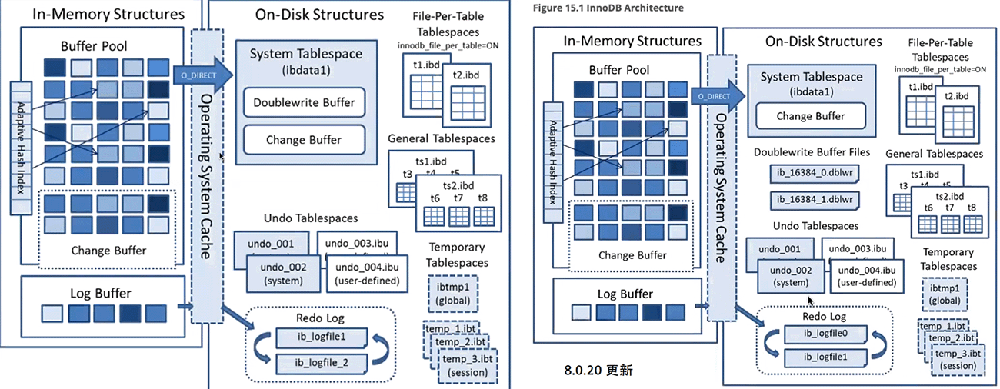
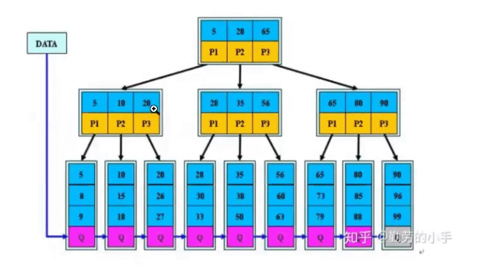
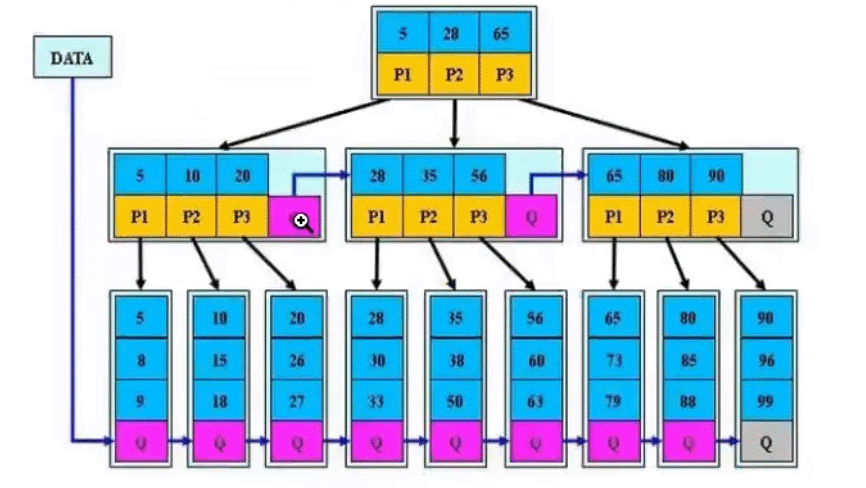
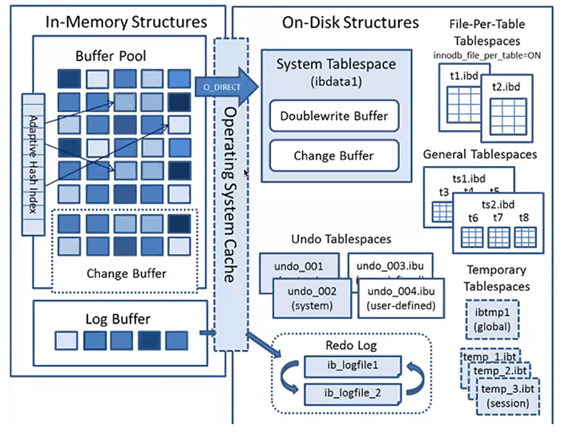
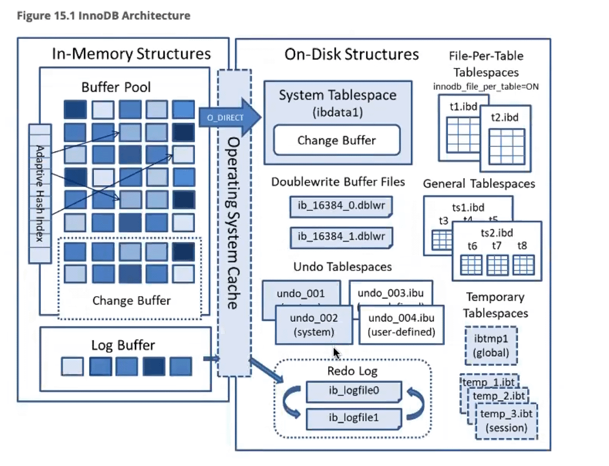
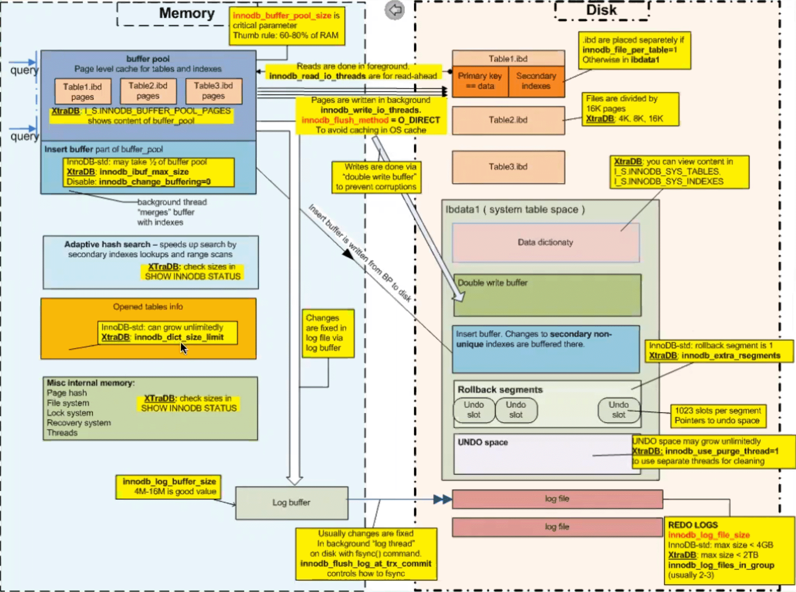

[TOC]

# InnoDB引擎体系结构

#  

# InnoDB简介

- 和oracle很相似

- 基于B+树的聚集索引的IOT表

  - InnoDB索引是B+树
  - InnoDB Data page是B*树

- 支持行锁（基于索引实现）

- 支持ACID、MVCC、Crash Recovery特性

- 支持4种事务隔离级别，RR级别下可以避免幻读

- 支持外键、全文检索

- 支持多种文件格式及数据压缩

- 高性能、高并发、高效的buffer pool管理

 

 

- Innodb索引是B+ ，非叶子节点相互之间没有指针

- innodb data page是B* ，非叶子节点相互之间有指针

 

## 体系结构 before MySQL 8.0.20

 

## 8.0.20 更新

## percona的体系结构图

 