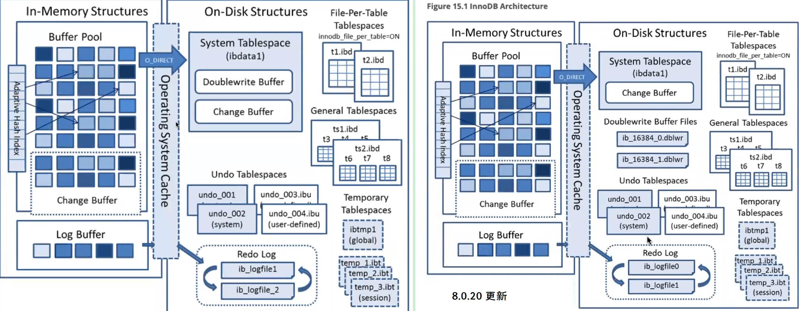
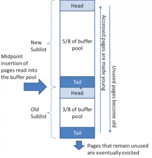
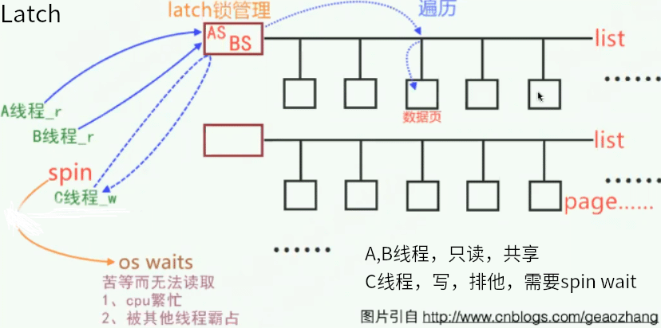

[TOC]



# InnoDB 内存结构

InnoDB内存结构主要分为4个部分：

- Buffer Pool

  - Database pages
  - Modified db pages
  - Free buffers

- Change Pool

- Log Buffer

- Adaptive Hash Index

 

InnoDB Buffer Pool 怎么设置才合理？理解InnoDB的内存管理机制。


# innodb_buffer_pool_instance

将 buffer pool 分成几个区，每个区用独立的锁保护，这样就减少了访问 buffer pool 时需要上锁的粒度，以提高性能。

```
mysql> show global variables like "%innodb_buffer_pool_instances%";
+------------------------------+-------+
| Variable_name        | Value |
+------------------------------+-------+
| innodb_buffer_pool_instances | 1   |
+------------------------------+-------+
1 row in set (0.01 sec)
```


5.6以后引入的特性。5.6以前整个buffer pool是统一管理的，不管多少个并发，都是由全局mutex进行全局保护，因此并发性能会受到一些影响。


如果一大块内存分配给buffer pool ，还是有些大

可以使buffer pool拆分成小块，如 64G/8 = 8G ， 管理起来会好很多

8.0以前，虽然已经支持多个Innodb instance，但是还是由统一的全局mutex进行保护，因此瓶颈依旧。

 

 该特性源自于percona，percona从5.5 5.6左右便支持独立mutex，官方版本8.0才支持。

每一个buffer pool instance都有自己的mutex来保护自己。

 

 

# InnoDB 内存结构


page hash计算后根据结果分配到不同的buffer pool instance

并发锁管理，表空间管理（文件子系统）

数据字典缓存，recovery恢复子系统


## 查看buffer pool中共有多少page

```
mysql> select count(*) from information_schema.innodb_buffer_page;
+----------+
| count(*) |
+----------+
|   6400 |
+----------+
1 row in set (0.57 sec)
```

 

## 查看buffer pool的组成

```
mysql> select page_type,sum(data_size)/1024/1024 as size_MB
  -> from information_schema.innodb_buffer_page 
  -> group by page_type 
  -> order by 2 desc;
+-------------------+-------------+
| page_type     | size_MB   |
+-------------------+-------------+
| INDEX       | 60.27621174 |
| SDI_INDEX     | 0.00360012 |
| UNKNOWN      | 0.00000000 |
| UNDO_LOG     | 0.00000000 |
| ALLOCATED     | 0.00000000 |
| FILE_SPACE_HEADER | 0.00000000 |
| SYSTEM      | 0.00000000 |
| IBUF_INDEX    | 0.00000000 |
| INODE       | 0.00000000 |
| TRX_SYSTEM    | 0.00000000 |
| LOB_FIRST     | 0.00000000 |
| IBUF_BITMAP    | 0.00000000 |
+-------------------+-------------+
12 rows in set (0.06 sec)
```

 

## 统计buffer pool里每个索引情况

```
mysql> select table_name, index_name, count(*) as page_count, sum(data_size)/1024/1024 as size_MB
  -> from information_schema.innodb_buffer_page
  -> group by table_name,index_name
  -> order by size_MB desc;
+------------------------------------+------------------------------+------------+-------------+
| table_name             | index_name          | page_count | size_MB   |
+------------------------------------+------------------------------+------------+-------------+
| `kk`.`bigints`           | PRIMARY           |    3994 | 57.23098183 |
| NULL                | NULL             |    2175 | 1.02862930 |
| `mysql`.`columns`         | PRIMARY           |     51 | 0.66825008 |
| `mysql`.`tables`          | PRIMARY           |     37 | 0.44656277 |
| `test`.`kk`            | PRIMARY           |     19 | 0.24991226 |
| `mysql`.`help_topic`        | PRIMARY           |     9 | 0.10731983 |
| `mysql`.`columns`         | table_id           |     8 | 0.06247616 |
| `mysql`.`index_column_usage`    | index_id           |     6 | 0.05046463 |
......
......
```

 

 

# InnoDB buffer pool 队列

 

innodb buffer pool 分成两部分， 一部分是young，有一部分是old

 

队列形态：

- 一个新的请求进来后，将数据从磁盘读取到内存后，先插入到old sublist的head区域。

- 如果长时间不被访问，会被逐渐推到old sublist的tail区域，根据LRU规则清理掉。

- 如果一段时间（默认1s）后，如果page再次被访问，那么会移动到young的tail部分里，如果page被频繁访问，那么page的位置会不断向前提升，越来越热。

 

page cache，上面为new，也就是young，下面是old。



```
mysql> pager cat - | less -i -n -S
```

 

 

 

# InnoDB 内存管理

- InnoDB Buffer Pool 一般最高设置物理内存的50%~70% ，实际使用值还会上浮约10%~15%。

  - 一般的，在多实例情况下，buffer pool可以参考设定为总物理数据的20%左右。
  - 为何实际分配为何会上浮10%- 15%？ 因为除了buffer pool 还有其他的内存区域会有开销。

- IBP是innodb_buffer_pool_chunk_size（默认128MB）的整数倍

- 从5.7开始，可以在线动态调整IBP，因此不建议一开始就设置过大

- 设置过大还可能会导致swap问题

- 使用多个instance降低并发内存征用

- page采用hash算法分配到多个IBP instance中读写

- 每个缓冲区池管理其自己的数据

- innodb_buffer_pool_instances不可动态调整

- 每个IBP instance管理自己的free list、flush list、LRU list及其他，并由各自的buffer pool mutex 负责并发控制

- 每个IBP instance也有各自的doubluewrite

 

## 动态resize

- 加大buffer pool

  - 以chunk_size为单位，分配新的内存pages
  - 扩展AHI(adaptive hash index)链表，将新分配的pages包含进来
  - 将新分配的pages添加到free list中

- 缩减buffer pool

  - 重整buffer pool，准备回收pages（等待这些page里的脏页刷新完毕）
  - 以chunk_size为单位，释放删除这些pages。这个过程会有一点点耗时。
  - 调整AHI链表，使用新的内存地址

 

## IBP的加载和导出

 

|  load  |  innodb_buffer_pool_load_at_startup   |  innodb启动时要不要加载 数据目录的ib_buffer_pool文件。    该文件为文本文件，存储着  tbs_id.page_No 格式的记录信息，预热数据页。  |
| ------ | ------------------------------------- | ------------------------------------------------------------ |
|        |  innodb_buffer_pool_load_now          |  当前立即进行一次load（set global innodb_buffer_pool_load_now = 1;）  |
|        |                                       |                                                              |
|  dump  |  innodb_buffer_pool_dump_at_shutdown  |  innodb实例关闭时要不要将buffer pool里的热点数据dump出来。   |
|        |  innodb_buffer_pool_dump_now          |  当前立即进行一次dump（set global innodb_buffer_pool_dump_now = 1;）  |
|        |  innodb_buffer_pool_dump_pct          |  默认dump25%                                                 |
|        |  innodb_buffer_pool_filename          |  默认文件名ib_buffer_pool                                    |

 

## 预读

- 随机预读

  - 同一个extent里有13个热点page，就预读整个extent
  - young list的前1/4算热点数据
  - innodb_random_read_ahead
  - 不稳定，所以5.5开始就默认禁用

- 线性预读

  - 一个extent中有连续56个page都被顺序访问，则预读下一个extent
  - innodb_read_ahead_threshold

 

 

## 预写 innodb_flush_neighbors

- 脏页刷盘钱检查相邻页是否也是脏页，一起刷盘
- SSD设备上通常关闭，没必要预写
- SSD设备上建议禁用
  - 0 turns innodb_flush_neighbors off and no other dirty pages are flushed from the     buffer pool.
  - 1 flushes contiguous dirty pages in the same extent from the buffer pool. 
  - 2 flushes dirty pages in the same extent from the buffer pool.


## buffer pool刷新机制

```
innodb_flush_method = O_DIRECT
绕过OS的cache
```

 

# IBP在MySQL8.0的新变化

- 拆分buffer pool mutex，以前是使用一个全局mutex保护多个IBP instances

现在拆分到各个不同链表中，分为

|  LRU_list_mutex     |  for  LRU_list                             |
| ------------------- | ------------------------------------------ |
|  zip_free mutex     |  for  zip_free arrays                      |
|  zip_hash mutex     |  for  zi_hash hash and in_zip_hash flag    |
|  free_list_mutex    |  for  free_list and withdraw list          |
|  flush_state_mutex  |  for  init_flush ,n_flush,no_flush arrays  |

 

- redo log 系统采用lock-free机制，redo log ckpt不再是顺序的，redo支持并发的checkpoint，可能是在某个日志的中间，给崩溃恢复带来了一定的复杂度（需要回溯日志）
- 新增选项innodb_fsync_threshold，在创建或truncate文件之类的操作时调用，标是每写到这么多个字节时，要fsync一次，避免对系统产生冲击。

 

 

 

 

# Latch

 

## 作用

内存锁，在内存中保护list的内存锁结构

## 种类

mutex:

​	lock_sys、trx_sys、log_sys，X，串行访问。

rw-lock:

​	S、X、XS，类似行锁的并行访问（读写互斥，读读并行）


## 机制

- 想要获得latch(rounds)，需要先spin wait(spins)，如果获取不到会进入sleep状态(OS waits)
- innodb_spin_wait_delay，两次spin wait之间的随机等待时间。设置为0可禁止等待间隙
- 热门mutex，如log_sys mutex 、fil_system mutex

 

## 查看

```
查看当前latch争用情况
mysql> show engine innodb mutex;
+--------+----------------------------+-----------+
| Type  | Name            | Status  |
+--------+----------------------------+-----------+
| InnoDB | rwlock: dict0dict.cc:2452 | waits=2  |
| InnoDB | rwlock: dict0dict.cc:2452 | waits=11 |
| InnoDB | rwlock: fil0fil.cc:3109  | waits=1  |
| InnoDB | rwlock: dict0dict.cc:1035 | waits=1  |
| InnoDB | sum rwlock: buf0buf.cc:781 | waits=251 |
+--------+----------------------------+-----------+
5 rows in set (0.00 sec)
```

 

## 处理

如何降低latch争用？

- 优化、提高SQL效率，减少持有latch的数量
- 事务尽快结束，缩短持有latch时长
- 适当调高IBP instances，缩短latch list长度，降低搜索开销

 

 

 



 

SQL效率低会导致AB线程持有latch过久，或事务长时间不提交

InnoDB一旦发现等待过久，InnoDB会自动进行crash……

如果发现有事务长时间不结束，尽快去处理掉。
