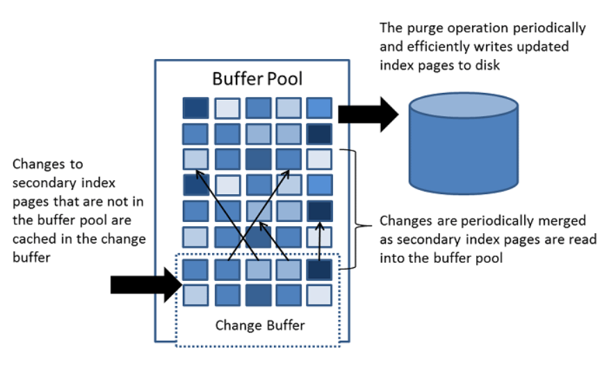

# change buffer/insert buffer

insert buffer以前只针对insert行为进行缓冲，后来扩展了范围，也对update、delete行为缓冲，也更改了称呼



[MySQL索引的更新策略](.\MySQL索引的更新策略.md)

[一定要看！！！MySQL写入缓冲区在数据库中的作用( Change Buffer )](.\MySQL写入缓冲区在数据库中的作用( Change Buffer ).md)

Change Buffer是一种用于缓存辅助索引页变化的区域，是buffer pool中一块独立的区域。

当需要修改的辅助索引页不在缓冲池中而在磁盘中时，会将这些索引页的变化缓存在change buffer中。

对索引的更新先缓存在change buffer中，然后由master thread做merge——将修改数据合并到buffer pool，然后刷新到磁盘

insert buffer以前只针对insert行为进行缓冲，后来扩展了范围，也更改了称呼。


- 将辅助索引上的DML操作从随机IO变成顺序IO，提高IO效率
- 工作机制

  - 先判断要修改的非聚集索引页（辅助索引页）是否在buffer pool中
  - 存在，则直接修改然后将结果临时存放在change buffer中
    - 不存在，直接将更改缓存到change buffer中（注意，并不通过IO读入，而是直接将修改缓存在change buffer）
    
  - change buffer 也是B+树结构

  - 每次change buffer最多缓存2KB记录

  - 与聚集索引不同，二级索引通常是不唯一的，并且二级索引中的插入以相对随机的顺序发生。      同样，删除和更新可能会影响索引树中不相邻的二级索引页。

  - 当通过其他操作将受影响的页读入buffer pool时，change buffer 中该页的修改将合并至buffer pool，避免从磁盘将辅助索引页读入buffer pool所需的大量随机IO

  - 定时清理，并将更新的辅助索引页写入磁盘
- 内存较大，数据量小的时候，没必要开change buffer
- 不支持倒序索引


- 参数：
  - innodb_change_buffer_max_size      ，默认最大允许25%
  - innodb_change_buffering
- 基本上change buffer不用管。只需要控制max_size 不要设置太高就ok，innodb会自行适应。

 **哪些场景会触发刷写缓冲中的数据呢？**

- **有一个后台线程，认为数据库空闲时；**
- **数据库缓冲池不够用时；**
- **数据库正常关闭时；**
- **redo log写满时；**

> **PS：**redo log一般不会被写满的，如果整个数据库处于无法写入和不可用的状态。

 

查看

- 查看change buffer 效率

```
-------------------------------------
INSERT BUFFER AND ADAPTIVE HASH INDEX
-------------------------------------
Ibuf: size 275, free list len 1624, seg size 1900, 163450962 merges
merged operations:
 insert 712953363, delete mark 12502466, delete 6026438
discarded operations:
 insert 0, delete mark 0, delete 0
-------------------------------------
```

解析：

- size 275: 正在使用的page
- free list len     1624：空闲的page
- seg size 1900： size + free list len + 1 =      275+1624+1 = 1900 
- change buffer的效果 = merges/(insert+delete mark+delete) = 163450962/(712953363+12502466+6026438)=0.2235 =22.35%


计算后， 大约5（22.35%）次修改做一次merge。百分比比例越低越好


- 查看change buffer 占用 buffer pool 比例

```
root@localhost [(none)]>
select (select count(*) from information_schema.innodb_buffer_page where page_type like 'IBUF%') as change_buffer_pages,
  (select count(*) from information_schema.innodb_buffer_page) as total_pages,
  (select ((change_buffer_pages/total_pages)*100)) as change_buffer_page_percentage;
+---------------------+-------------+-------------------------------+
| change_buffer_pages | total_pages | change_buffer_page_percentage |
+---------------------+-------------+-------------------------------+
|         330 |    6400 |            5.1563 |
+---------------------+-------------+-------------------------------+
1 row in set (0.08 sec)
```