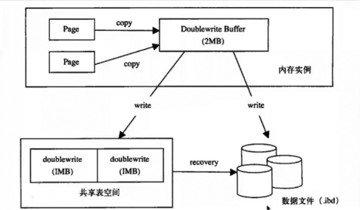

# Double write

作用：保证数据写入的可靠性（防止数据页损坏，又无从修复）

 

因为InnoDB有partial write问题：

- 16K的页值写入了部分数据时发生crash
- redo里记录的是逻辑操作，不是物理块，无法通过redo log 恢复


怎么解决partial write问题？

- double write
- 2个1M的空间，共2M，既有磁盘文件，也有内存空间
- 页在刷新时首先顺序低写入到double write buffer
- 然后再刷新回磁盘

 

早期硬件不支持原子写，因此在刷脏页之前把脏页拷贝到double write buffer，刷新到double write后再刷新脏页。如果刷新脏页出现问题，可以在double write buffer中再复制出对应page，以进行恢复。

 

double write buffer分为两部分， 一部分在内存，一部分在磁盘。脏页拷贝到dblwr内存时，会要求这份double write buffer先刷新到磁盘，再写脏页到磁盘，保证double write buffer先于脏页刷新到磁盘。



 

 

- 在可以保证原子写的硬件设备或文件系统下，double write可以被关闭
- 在slave上也可以关闭
- double write是顺序写入，性能损失很小。在SSD设备商损失则相对较大，因为SSD设备对随机写入很强。
- MySQL5.7开始，linux系统下采用fusion-io的NVMFS设备（支持原子写）会自动关闭 double write     buffer。另外在这种情况下，innodb_flush_method最好设置为O_DIRECT获得更好的性能。

 

- 参数

  ```
  innodb_doublewrite =1/0 
  ```

- show global status 查看

  - Innodb_dblwr_pages_written
  - Innodb_dblwr_writes

> Innodb_dblwr_pages_written/Innodb_dblwr_writes ≈64:1 ，代表一次可刷新64个脏页。当系统写入压力并不是很高时，应小于64:1。

 