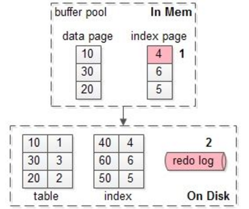
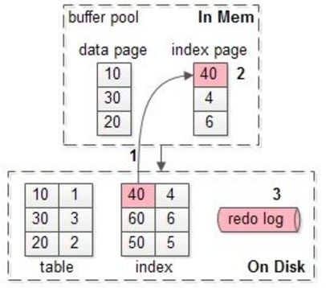
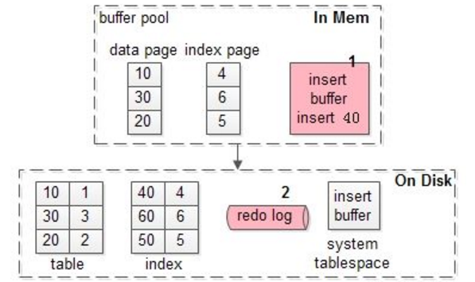
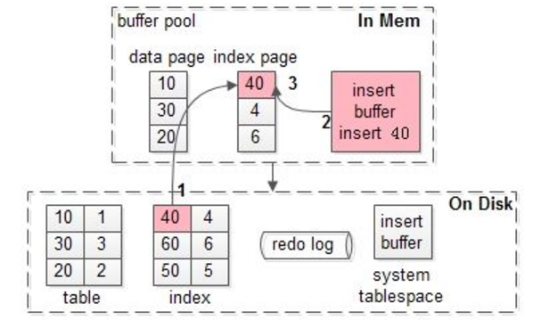

# MySQL写入缓冲区在数据库中的作用( Change Buffer )

介绍另外一种重要的数据变更日志，也就是InnoDB change buffer。 Change buffer的主要目的是将对二级索引的数据操作缓存下来，以此减少二级索引的随机IO，并达到操作合并的效果。

- 本期我们介绍另外一种重要的数据变更日志，也就是`InnoDB change buffer`。 `Change buffer`的主要目的是将对二级索引的数据操作缓存下来，以此减少二级索引的随机IO，并达到操作合并的效果。
- 内存缓冲池(`buffer pool`)以页为单位，缓存最热的数据页(`data page`)与索引页(`index page`)；
- InnoDB以变种LRU算法管理缓冲池，并能够解决“`预读失效`”与“`缓冲池污染`”的问题；
- 毫无疑问，对于读请求，缓冲池能够减少磁盘IO，提升性能。问题来了，那写请求呢？

#### 2. Mysql写入数据原理-无 Change Buffer

##### 示例一

- 假如要修改页号为4的索引页，而这个页正好在缓冲池内。



1. 直接修改缓冲池的数据页，一次内存操作。
2. 写入redo log日志数据变化，一次磁盘顺序写操作。

> **PS：**1. 像写redo log日志这种顺序IO写操作，每秒几万次都没有什么问题！
>
> **什么时候缓冲池中的页，会刷到磁盘上呢 ？**
>
> 1. 定期刷磁盘，而不是每次刷磁盘，能够降低磁盘IO，提升MySQL的性能。

##### 示例二

- 假如要修改页号为40的索引页，而这个页正好不在缓冲池内。



1. 先把数据页号为40的索引页，从磁盘加载到缓冲池中，一次磁盘随机读操作。
2. 修改内存缓冲池的数据页，一次内存操作。
3. 写入redo log日志数据变换，一次磁盘顺序写操作。

#### 3. Mysql写入数据原理-有 Change Buffer

- **没有命中缓冲池的时候，至少产生一次磁盘IO，对于写多读少的业务场景，是否还有优化的空间呢？**
- 下面介绍`Change Buffer`，从名字容易看出，写缓冲是降低磁盘IO，提升数据库写性能的一种机制。

##### 什么是InnoDB的写缓冲？

- 在MySQL`5.5`之前，叫插入缓冲(`insert buffer`)，只针对insert做了优化；现在对`delete`和`update`也有效，叫做写缓冲(`change buffer`)。
- 它是一种应用在`非唯一普通索引页`(non-unique secondary index  page)不在缓冲池中，对页进行了写操作，并不会立刻将磁盘页加载到缓冲池，而仅仅记录缓冲变更(buffer  changes)，等未来数据被读取时，再将数据合并(merge)恢复到缓冲池中的技术。写缓冲的目的是降低写操作的磁盘IO，提升数据库性能。

##### 示例三

- **InnoDB加入写缓冲优化，上文“示例二”流程会有什么变化？**
- 假如要修改页号为40的索引页，而这个页正好不在缓冲池内。



1. 在写缓冲区（ Change Buffer ）中记录这个操作，一次内存操作。
2. 写入redo log日志数据变化，一次磁盘顺序写操作。

> **PS：**可以看到，数据页号为40这一页，并没有加载到缓冲池中。
>
> 此时如果MySQL Crash，可以从redo log日志恢复数据。
>
> 写缓冲区（ Change Buffer ）不是一个内存结构，它也会被定期执行刷新操作，写入缓冲`系统表空间`。

##### 示例四

- **数据读取时，有另外的流程，将数据合并到缓冲池；**
- 基于`示例三`后的一个短时间内，有请求查询索引页40的数据。



1. 加载数据页号为40的索引页到缓冲池中，缓冲池未命中，这次磁盘IO无法避免。
2. 然后从缓冲池中读取数据页号为40的数据信息。
3. 将数据页号为40的索引页，放到缓冲池LRU内（ LRU算法管理缓冲池 ）

> **PS：**可以看到，40这一页，在真正被读取时，才会被加载到缓冲池中。

#### 为什么写缓冲优化，仅适用于非唯一普通索引页呢？

- 如果索引设置了唯一(unique)属性，在进行修改操作时，InnoDB必须进行唯一性检查。也就是说，索引页即使在缓冲池，磁盘上的数据页读取无法避免(否则怎么校验是否唯一？)，此时就应该直接把相应的页放入缓冲池再进行修改，而不应该再搞写缓冲池这个东东。

#### 哪些场景会触发刷写缓冲中的数据呢？

- 有一个后台线程，认为数据库空闲时；
- 数据库缓冲池不够用时；
- 数据库正常关闭时；
- redo log写满时；

> **PS：**redo log一般不会被写满的，如果整个数据库处于无法写入和不可用的状态。

#### 什么业务场景，适合开启InnoDB的写缓冲机制？

##### 适合场景

- 数据库大部分是非唯一索引。
- 业务是写多读少，不是写入数据后要立刻读取的。

> **PS：**将原本每次写入都需要进行磁盘IO的SQL，优化定期批量写磁盘。
>
> **场景：**例如账单流水业务、用户行为记录

##### 不适合场景

- 数据库大部分是唯一索引。
- 写入一个数据后，会立刻读取它。

> **PS：**如果写入数据后立刻要读取，反而写缓存反倒成了负担，增加了复杂度。
>
> **场景：**银行卡余额

#### 对应InnoDB里哪些参数？

```shell
root@localhost:mysql.sock 16:09:59[(none)]> show variables like 'innodb_change%';
+-------------------------------+-------+
| Variable_name                 | Value |
+-------------------------------+-------+
| innodb_change_buffer_max_size | 25    |
| innodb_change_buffering       | all   |
+-------------------------------+-------+
2 rows in set (0.01 sec)
```

- `innodb_change_buffer_max_size` 配置写缓冲的大小，占整个缓冲池的比例，默认值是25%，最大值是50%。
- `innodb_change_buffering` 配置哪些写操作启用写缓冲，可以设置成all/none/inserts/deletes等。