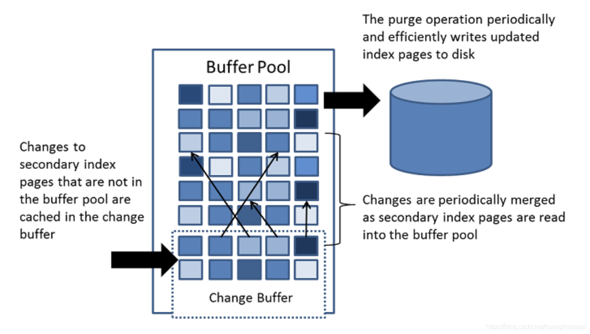

对于数据的每一次更新，MySQL并不会每次都会更新索引(针对非唯一性索引而言)，索引的更新策略是这样的：

在InnoDB中，增删改都会立刻修改主键or唯一索引，但是不会rebuild全局索引，而是对这些索引增加值(或移除值)。
 对于非唯一性索引，InnoDB会进行change buffering操作。将更改排入队列，之后再在后台将其合并到索引中。甚至，为了后续物理更新更加高效，会将变更进行合并。
 这种特性不需要手动开启，而是默认开启的。在MySQL5.1版本，change buffering操作仅仅适用于insert。而在MySQL5.5版本之后，change buffering操作则扩展到update和delete里。

对于change buffering，是这样定义的：
 change  buffer是一个特殊的数据结构。对于那些不在缓存池内的二级索引有修改时，对应的修改会被缓存在change  buffer里（二级索引就是非聚集索引）。对二级索引有修改的场景包括：对数据的插入、更新和删除操作。之后如果有读操作时，会将这些二级索引页加载到缓存池里时，此时才会将change buffer里的修改与二级索引页合并。

跟聚集索引不同，二级索引往往是不唯一的，并且数据会以一种相对随机的顺序插入二级索引。类似的，删除和更新操作也会往往会影响索引树上的不相邻的二级索引页。因此采取：当被变更的二级索引页从磁盘中被读入缓存池时，才进行合并工作。这种将更改延后进行合并的操作，能够避免大量的随机磁盘读取IO操作。

这种清洗工作往往在系统处于空闲时周期进行，或者通过一段短暂的shutdown来将更新的索引页写入磁盘。这种清洗工作将一系列索引值写入磁盘块，会比来一个写一次快得多。

当存在很多被影响的行，存在很多需要更新的二级索引时，change  buffer的合并工作往往会消耗几个小时。在这段时间内，磁盘IO数量激增，会导致对于磁盘的查询操作宕机。另外，change  buffer的合并工作会在事务提交后进行，甚至会在服务器的关闭重启后进行。

在内存中，change buffer占用了缓冲池的一部分。在磁盘上，change buffer是系统表空间的一部分，当数据库服务器被关闭时，索引的更改将会被缓存在其中。

你可以自定义最大的change buffer的大小。详情可见：https://dev.mysql.com/doc/refman/8.0/en/innodb-change-buffer.html#innodb-change-buffer-configuration

参考资料：

\1. https://stackoverflow.com/questions/23435361/does-mysql-update-the-index-on-all-inserts-can-i-make-it-update-after-every-x-i

\2. https://dev.mysql.com/doc/refman/8.0/en/innodb-change-buffer.html