**innodb_buffer_pool_instances 是如何影响性能的-爱可生** 

2020-05-18 11:16 

**问题：**

我们都知道 innodb_buffer_pool_instances 参数，将 buffer pool 分成几个区，每个区用独立的锁保护，这样就减少了访问 buffer pool 时需要上锁的粒度，以提高性能。

**那么我们如何观察它是如何影响性能呢？**

**实验：**

准备一个空数据库，

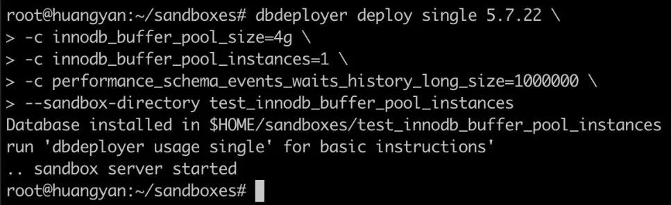

在这里我们将 performance_schema_events_waits_history_long_size 调大，是为了让之后实验数据能采集的更多，在此不多做介绍。

使用 sysbench，准备一些数据，

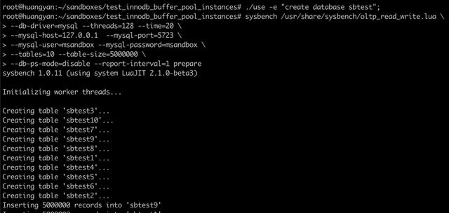

对数据进行预热 60s，可以看到预热期间的性能会不太稳定，预热后会比较稳定，

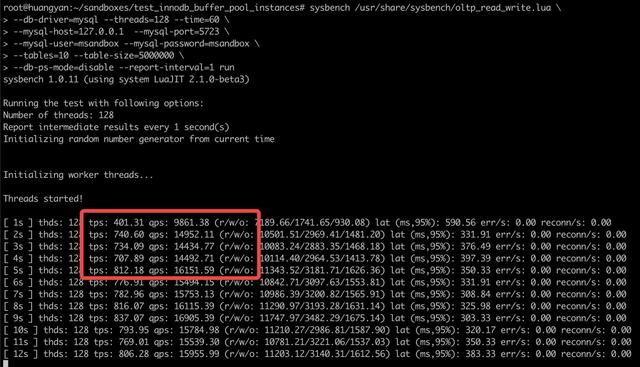

设置 performance_schema，这次我们将仅开启观察项（生产者）hash_table_locks，并开启 waits 相关收集端（消费者）。（相关介绍参看 **实验 03**）

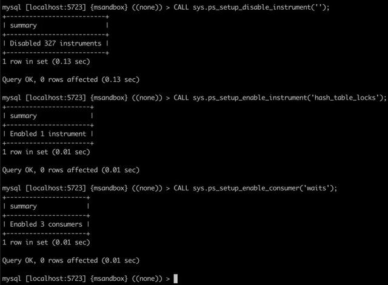

 

为什么我们知道观察项应该选择 hash_table_locks？

在 performance_schema.setup_instruments 表中，列出了所有观察项，但我们很难从中选出我们应观察哪个观察项。

这时候，可以将所有观察项都启用，然后设计一些对比实验，比如使用几种不同的 SQL，观察这些操作影响了哪些观察项，找到共性或者区。

还有一种高效的方式是搜索别人的经验，或者阅读 MySQL 源码。

本例中 hash_table_locks 隐藏的比较深，使用了阅读 MySQL 源码和对比试验结合的方法。

由于 MySQL 有一些后台进程会使用 buffer pool，比如刷盘线程，会影响我们的观察，所以需要将 MySQL 的后台线程排除在外。

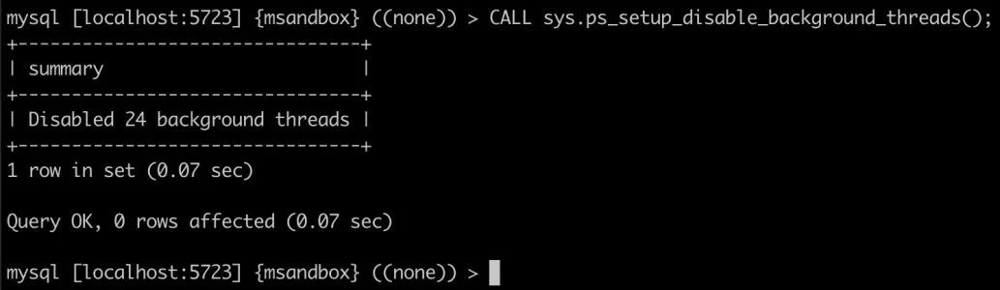

万事就绪，再运行一次 sysbench 压力。运行前记得将已有的观察结果清除：

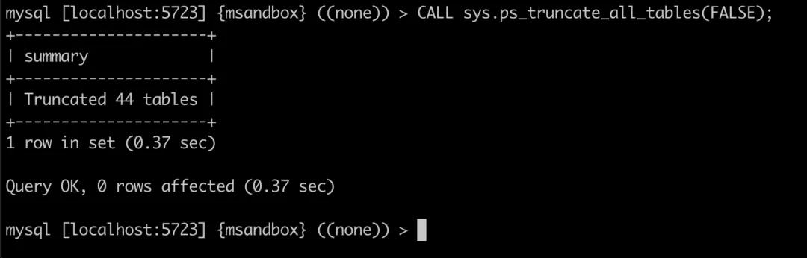

运行 sysbench 压力，持续60秒，

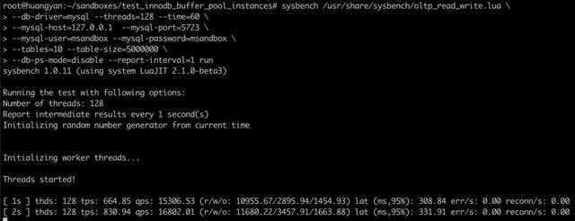

等待压力结束后，对 performance_schema 中记录的数据进行分析。

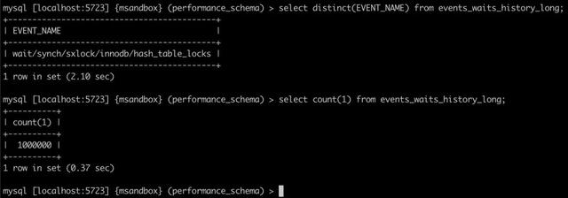

确实采集了 100 万条对 hash_table_locks 的观测数据。

我们取其操作时长的平均值，90% 分位数，99% 分位数：

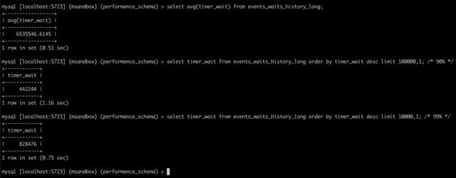

整理到如下表格，但我们先忽略其时间单位，放到最后讨论，

我们按照如上方法，分别再测试 innodb_buffer_pool_instances 为 2 和 4 的情况（记得多测几次，取平均值会更为准确，本实验由于偷懒，只测预热后的一次结果）。

表格更新为：

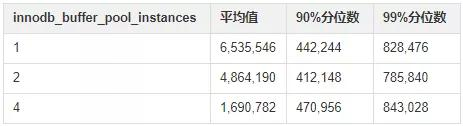

可以看到如下结：

1. 平均值都在 99%     分位数以上，意味着有极大的数据严重影响的平均值（有几次对 buffer pool 锁的获取，等待了非常久）。
2. 随着     innodb_buffer_pool_instances 增大，这种严重的影响会逐渐减小。
3. 在实验的场景中，innodb_buffer_pool_instances     的增大，对 90% 和 99% 分位数影响都不大，即不会影响到大部分 SQL 对 buffer pool 锁的获取时间。

**重要说明：**

1. 本实验以介绍实验手法为目的，实验的结论不可作为参考。
2. 如果大家多做几次实验，会发现在同一个配置下，平均值的变化很大，也就是说**那几次非常久的等待时间**非常不稳定，受到其他因素影响。
3. 如果更换数据压力或者更换测试环境，会看到不同的现象。

我们再来看看这些时间的单位是什么？

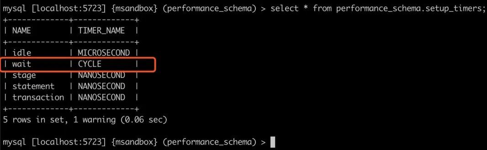

可以看到 wait 一族的观察项，单位是 cycle，那么 cycle 又是多少秒？

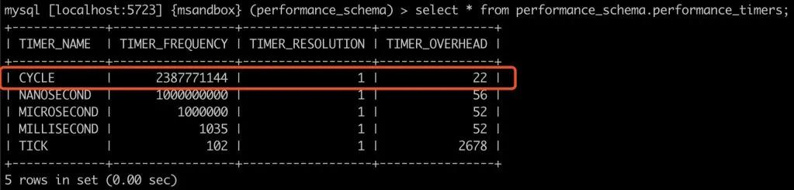

可以看到，1 cycle = 1/2387771144 秒。

我们重新看一下 innodb_buffer_pool_instances=1 时，获取 buffer pool 锁的平均时间是 6535546 cycle，大约是 2.7 ms。

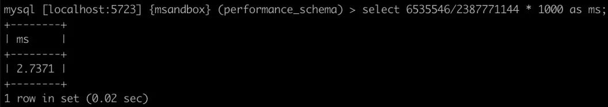

2.7 ms，还是比较长的一段时间（我的虚拟机配置比较一般）。

**结论**

本次实验介绍了对 innodb_buffer_pool_instances 参数对性能影响的观测手法，大家可以在进行压力测试时，使用此方法观察 innodb_buffer_pool_instances 的取值对性能的影响，从而决定应该取值多少。

参数设置一直是个平衡问题，innodb_buffer_pool_instances 设置太小，锁冲突集中；设置太大，维护成本升高。

再次强调，本次实验仅介绍手法，结果不足取信。不同压力，不同 buffer pool 配置，不同环境会呈现效果，唯有手法是可以传承的。

按照正常实验的规则，95% 分位数以上的极值可看作是实验误差，但对于本次实验中的极大值进行进一步分析后，我们认为可以用于说明实验效果。

**关于 MySQL 的技术内容，你们还有什么想知道的吗？赶紧留言告诉小编吧！**

关于爱可生

爱可生成立于2003年，依托于融合、开放、创新的数据处理技术和服务能力，为大型行业用户的特定场景提供深度挖掘数据价值的解决方案。

公司持续积累的核心关键技术，覆盖到分布式数据库集群、云数据平台、数据库大体量运管平台、海量数据集成于存储、清洗与治理、人工智能分析挖掘、可视化展现、安全与隐私保护等多个领域。

公司已与多个行业内的专业公司建立了长期伙伴关系，不断促进新技术与行业知识相结合，为用户寻求新的数据驱动的价值增长点。公司已在金融、能源电力、广电、政府等行业取得了众多大型用户典型成功案例，获得了市场的认可和业务的持续增长。

 

来自 <https://www.sohu.com/a/395919307_120426623> 

 