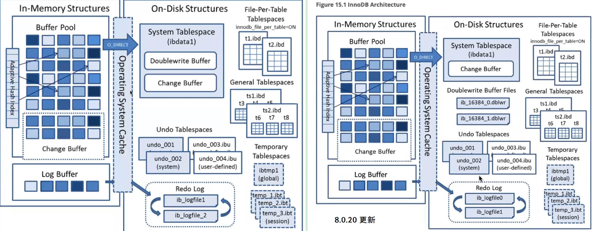
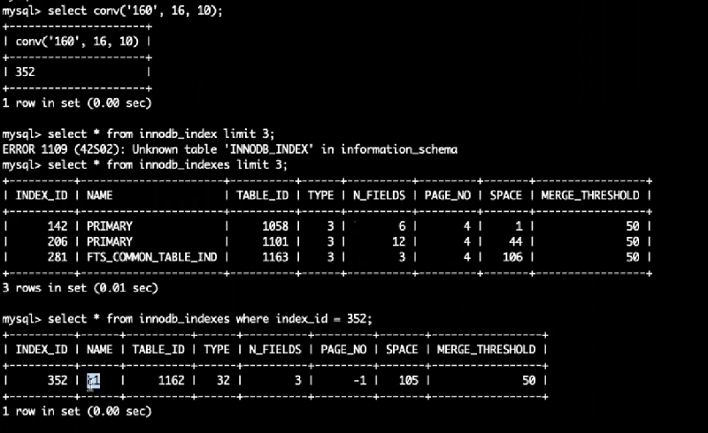
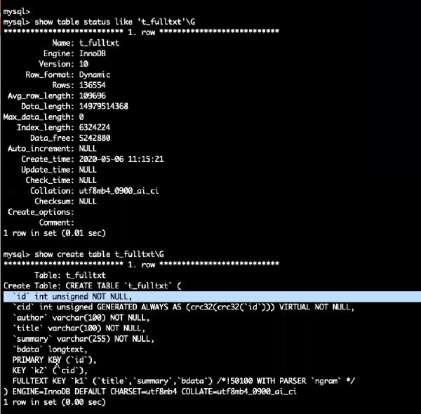
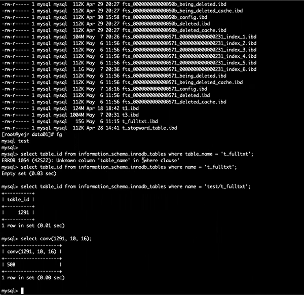
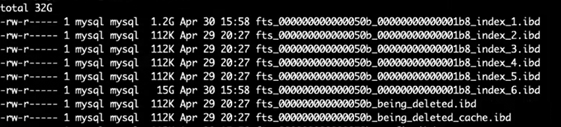
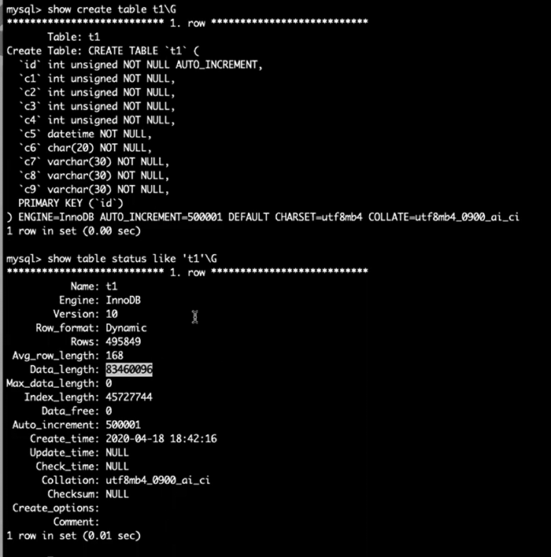
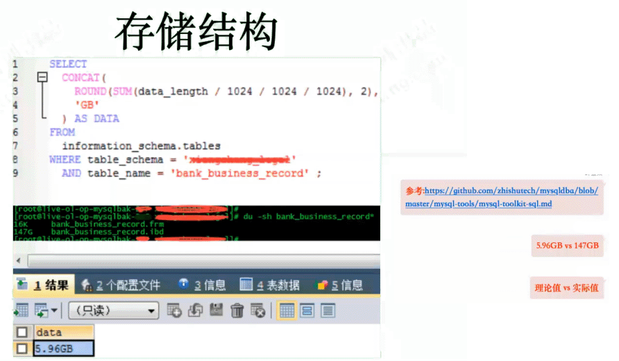

[TOC]

 

# InnoDB 存储结构

- 系统表空间(ibdata*)

  - Change Buffer
  - Doublewrite Buffer(before      8.0.20)
  - System Undo(before 5.7)
  - Lock System
  - Data Dictionary

- 通用表空间(*.ibd)

- 独立表空间(*.ibd)

- 临时表空间

  - 全局临时表(ibtmp1)
  - 会话临时表(*.ibt)

- Undo表空间

  - 全局Undo System Undo
  - 用户定义Undo(*.ibu)

- Redo log

- Doublewrite Buffer Files(*.dblwr) (since 8.0.20)

- 全文索引fts*ibd

- Buffer Pool Dump File

- InnoDB Status File

 

  

还有8.0.20开始的double write buffer 

 

 

 

 

 

 

 

 

 

 

 

 

 

 

全文索引并不在indexlength计算范围，length只计算B+树索引。

 

6个索引文件 15+G

 

 

 

\----------------

索引长度是数据长度的一般，不太正常。 表只有一个主键索引。

 

 

[0.innblock 工具 InnoDB page观察利器.md](innblock 工具 InnoDB page观察利器.md)