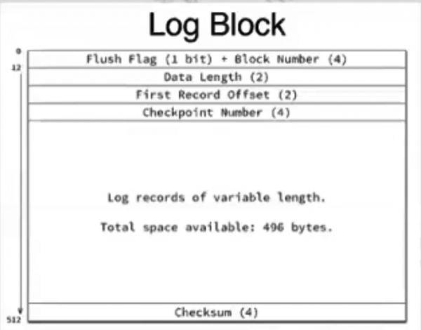
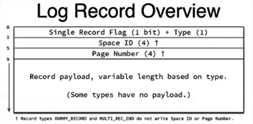
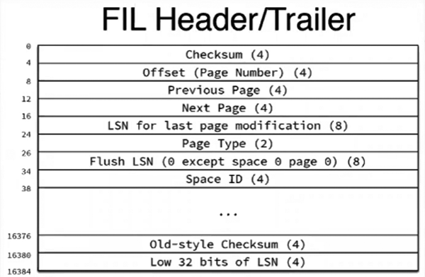

# InnoDB Redo知识

- LSN: log sequence number. 
  ```
show engine innodb status\G 

  能够发现与LSN相关的数据（LSN数字的单位为bytes）
因此，可以根据LSN估算出每小时的redo数据量，评估redo当前设定是否合适。
  ```


## 估算redo数据量：

取一个LSN，再间隔一小时取LSN。
  ```
( t2.lsn - t1.lsn ) bytes * 60 / 1024 / 1024 = X (MB)
  ```
  ```
show global variables like "%log%" -->
  ```
  ```
innodb_log_file_size * innodb_log_files_in_group = redo 总大小 （文件大小*几个而已）

last checkpoint 显著缩短了实例恢复时扫描redo的工作量（和oracle一样）
  ```


## Redo日志块数据结构：

mysql redo 默认每块512bytes，找到first record offset位置后，读512bytes便是这一条记录。

- Block Number:     LOG_BLOCK_HDR_NO，4 bytes，根据该快的SN转换成block no.
- Data Length:     LOG_BLOCK_HDR_DATA_LEN， 2 bytes，写入该redo block的日志长度
- First Record     Offset: LOG_BLOCK_FIRST_REC_GROUP, 2 bytes, 写到该redo block的第一个mtr日志在block内的长度（说的都是什么玩意）。如果一个mtr日志横跨多个block时，只设置最后一个block。
- CheckPoint Number:     LOG_BLOCK_CHECKPOINT_NO, 4 bytes, 当一个block写满时，或者该block是写到文件时的最后一个block，会在这里写入 log_sys -> Next_checkpoint_no
- 日志记录部分
- CheckSum:     LOG_BLOCK_CHECKSUM, 4 bytes, 存储该redo block的校检和。

 



 

## Redo日志读取

- Single Recoder     Flag: 该事务记录是否为单log block ，如果为否，那么该记录存储在多个log block中。
- Space     ID: 该事务对应哪个space
- Page     Number: 事务对应的Page Number，在哪个Page上。
- 事务的变更记录内容。




## Page数据结构：


 

## Page头数据结构：

- CheckSum：Page的校检和
- Offset：就是Page Number
- Previous Page：前一个page id
- Next Page：后一个Page id
- Last：最后一次更改的LSN
- Page Type：
- Flush LSN：最新的LSN刷新的位置
- Space ID：该page属于哪个space（多用于共享表空间。）
- Low LSN：checkpoint lsn



 