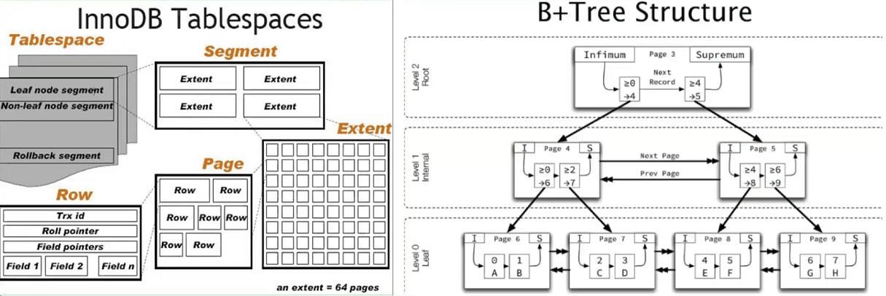
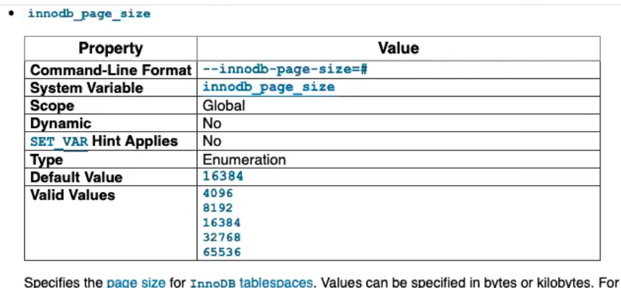

表空间 tablespace → 段 segment →区 extent→页 page→行 row

 

 

 

data page 是B*树，一个page里是单向链表，包含两个虚拟记录。page间是双向链表。

 

# 基础概念：

## 表空间 tablespace

- 所有的数据都要存储在表空间里
- 表存储对象
- 每个tablespace都至少包含2中segment（叶子/非叶子 page file segment）

 

## 段 segment

- 对象单位，如 rollback segment,     undo segment, index segment等
- 每个segment由若干个extent以及32个零散page组成
- segment最小以extent为单位扩展
- 一次分配至少增加一个extent ，创建一个空表至少需要96kb

 

## 区 extent

- 空间管理单位
- 每个extent为1/2/4MB，由若干个page组成
- 一个extent默认64个page，64*16kb=1MB

 

## 页 page

- 最小I/O单位，默认16KB。

- MySQL整个实例都只有一个page size，不像oracle有nK表和nK buffer cache。

- MySQL5.6起可以自定义page size

  - MySQL5.6可以自定义为4K、8K，不能调大
  - MySQL5.7可以改成32K、64K
  - page size为全局选项，无法在运行过程中动态修改，实例初始化后也无法再修改，只能重建实例，使用逻辑备份方式导入导出。
  - updat t1 set c1 =      'a' where id = 1 ; 哪怕只写一个字符，也用上一个page

- InnoDB page 内使用的是B+ tree，page间使用的是B* tree

- 行溢出

  - 16k page size
  - 一条数据长度超过8k左右，就会溢出
    
  - 4k page size

    - 一条数据长度超过2k左右，就会溢出

 

