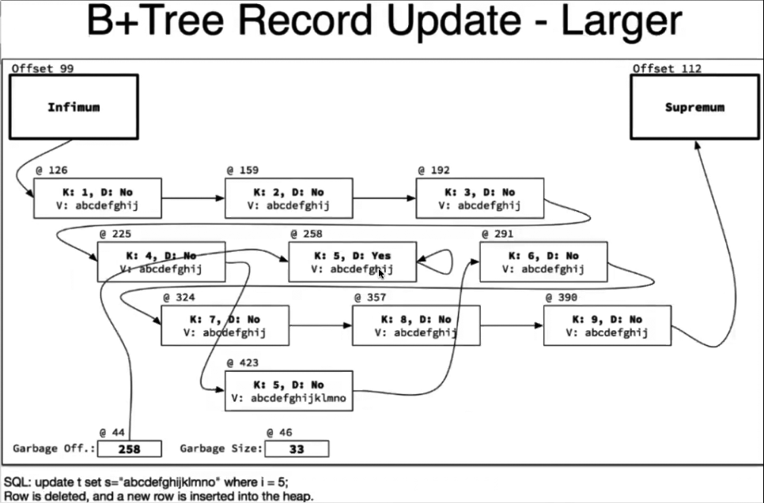

[TOC]

# InnoDB DataPage 数据结构和DML的动作、空间重用原则


## InnoDB 数据页结构示意图


 

 


 

- 行迁移（行溢出）后的数据，至少占据一个page，也就是说，是以page为最小分配单位存储溢出数据的。
  - 也就是默认16k的pagesize下，超出8k数据就几乎一定会发生行迁移。

 

 


 


- 直接实际操作一下看：

  ```
  mysql> create database ino;
  Query OK, 1 row affected (0.19 sec)
   
  mysql> use ino
  Database changed
  mysql> create table t(i int not null primary key , s char(10));
  Query OK, 0 rows affected (1.00 sec)
   
  mysql> show create table t\G
  *************************** 1. row ***************************
  		Table: t
   Create Table: CREATE TABLE `t` (
   `i` int NOT NULL,
   `s` char(10) DEFAULT NULL,
   PRIMARY KEY (`i`)
  ) ENGINE=InnoDB DEFAULT CHARSET=utf8mb4 COLLATE=utf8mb4_0900_ai_ci
  1 row in set (0.00 sec)
   
  mysql> insert into t (i,s) values(0,"A"),(1,"B"),(2,"C");
  Query OK, 3 rows affected (0.18 sec)
  Records: 3 Duplicates: 0 Warnings: 0
  ```

  ```
  [14:38:01] root@ms85:ino # innblock /data/mysql/mysql3306/data/ino/t.ibd scan 16
  ----------------------------------------------------------------------------------------------------
  Welcome to use this block analyze tool:
  [Author]:gaopeng [Blog]:blog.itpub.net/7728585/abstract/1/ [QQ]:22389860
  [Review]:yejinrong@zhishutang [Blog]:imysql.com [QQ]:4700963
  ----------------------------------------------------------------------------------------------------
  Datafile Total Size:114688
  ===INDEX_ID:200
  level0 total block is (1)
  block_no:     4,level:  0|*|  ----聚集索引的第一个page是4
   
  [14:38:25] root@ms85:ino # innblock /data/mysql/mysql3306/data/ino/t.ibd 3 16  
  ----------------------------------------------------------------------------------------------------
  Welcome to use this block analyze tool:
  [Author]:gaopeng [Blog]:blog.itpub.net/7728585/abstract/1/ [QQ]:22389860
  [Review]:yejinrong@zhishutang [Blog]:imysql.com [QQ]:4700963
  ----------------------------------------------------------------------------------------------------
  File: an_block.h, Line: 00558: bloch check error not b+ block!
  File: main.cpp, Line: 00112: block info check error!
   
  #8.0.20有变化，block 4才对，下面是聚集索引记录的情况。
  [14:39:29] root@ms85:ino # innblock /data/mysql/mysql3306/data/ino/t.ibd 4 16
  ----------------------------------------------------------------------------------------------------
  Welcome to use this block analyze tool:
  [Author]:gaopeng [Blog]:blog.itpub.net/7728585/abstract/1/ [QQ]:22389860
  [Review]:yejinrong@zhishutang [Blog]:imysql.com [QQ]:4700963
  ----------------------------------------------------------------------------------------------------
  ==== Block base info ====
  block_no:4     space_id:33      index_id:200     
  slot_nums:2     heaps_rows:5     n_rows:3     
  heap_top:222    del_bytes:0      last_ins_offset:195    
  page_dir:2     page_n_dir:2     
  leaf_inode_space:33     leaf_inode_pag_no:2     
  leaf_inode_offset:626    
  no_leaf_inode_space:33   no_leaf_inode_pag_no:2     
  no_leaf_inode_offset:434    
  last_modify_lsn:1632964592
  page_type:B+_TREE level:0     
  ==== Block list info ====
  -----Total used rows:5 used rows list(logic):         --------5行记录逻辑存放方式
  (1) INFIMUM record offset:99 heapno:0 n_owned 1,delflag:N minflag:0 rectype:2    --最小虚拟记录
  (2) normal record offset:127 heapno:2 n_owned 0,delflag:N minflag:0 rectype:0   ---161-127=34, 单行记录占用了33bytes，比图上分析多了一个，可能是头id(record header)有变化。见下面：[奇怪的header id长度释疑：]()。因此如果插入的记录不是字符，而是数字，header id长度就是5了。
  (3) normal record offset:161 heapno:3 n_owned 0,delflag:N minflag:0 rectype:0
  (4) normal record offset:195 heapno:4 n_owned 0,delflag:N minflag:0 rectype:0
  (5) SUPREMUM record offset:112 heapno:1 n_owned 4,delflag:N minflag:0 rectype:3   --最大虚拟记录
  -----Total used rows:5 used rows list(phy):           ------记录的物理存放方式
  (1) INFIMUM record offset:99 heapno:0 n_owned 1,delflag:N minflag:0 rectype:2
  (2) SUPREMUM record offset:112 heapno:1 n_owned 4,delflag:N minflag:0 rectype:3
  (3) normal record offset:127 heapno:2 n_owned 0,delflag:N minflag:0 rectype:0
  (4) normal record offset:161 heapno:3 n_owned 0,delflag:N minflag:0 rectype:0
  (5) normal record offset:195 heapno:4 n_owned 0,delflag:N minflag:0 rectype:0
  -----Total del rows:0 del rows list(logic):
  -----Total slot:2 slot list:
  (1) SUPREMUM slot offset:112 n_owned:4   ----最大虚拟记录的偏移量，以及包含自己在内前面有4条记录
  (2) INFIMUM slot offset:99 n_owned:1    ----最小虚拟记录的偏移量，以及包含自己在内前面有1条记录
  [14:39:34] root@ms85:ino # 
  ```

  

- 奇怪的header id长度释疑：

   [[老叶茶馆\] - 2019-08-10 浅析InnoDB Record Header及page overflow.html]()

### 简言之，记住几条**关键规则**

- 一条记录的record header，至少是5字节
- 对record header影响最大的是变长列数量，及其是否允许为NULL的属性


### 关于变长列

- 每个变长列，如果列长度 <128 字节，则需要额外1字节
- 每个变长列，如果列长度 >=128 字节，则需要额外2字节
- 如果没有任何变长列，则无需这额外的1-2字节

- **变长类型为char/varchar/text/blob等**

> char为什么也当做变长类型了？
>
> 这是因为，当字符集非latin1时，最大存储长度可能会超过255字节，例如 char(65) utf8mb4 最长就可以存储260字节，此时在record header中需要用2字节来表示其长度，因此也被当做变长类型了

 

 


slot array 记录间隔的page的偏移量。

下图中加粗黑线框的就是偏移量的关键块（这个词不太对），会将这些关键块的位置记录在page的slot array中。

每个加粗黑线框的记录中，N_Owner值都是包含记录本身向前，直到前一个slot为止的记录总数（不好理解的话，看图吧。）


 

 

#  DML操作时记录的分配变化

 

 

## 1. 先写入9条数据


 

 

## 2. 删除数据

---

### 删除一条数据@258。

  - 行记录delete mark 为yes，等待被purge。
  - Garbage off指向删除队列的最新记录位置，也就是总是指向最后一次删除的记录的位置，该记录下一记录也指向自己本身。
  - Garbage size记录了回收的记录的累计长度 33字节，
  - 第四条记录@225将下一条指针指向到原第六条记录@291 

 


---

### 再次删除一条记录@225

  - 行记录delete mark 为yes，等待被purge。
  - Garbage off 指向@225，队列中，@225下一条记录指向上一次删除的记录的位置（是根据删除顺序，还是根据物理块位置？待确认）
  - Garbage size记录了回收的记录的累计长度 66字节，
  - 第三条记录@192将下一条指针指向到@291  

 


 

## 3. 变长更新

### 更新为更短的数据

- 原10bytes长度的记录改为5bytes

- 产生5bytes垃圾空间（碎片），记录在Garbage size中。

 


 

 

### 更新为更长的数据

- 原有记录的空间存不下新数据，
- 需要新开辟一个空间存储数据，并将原先指向记录的指针修改为指向新记录位置，且回收掉原记录的空间占用。（也就是在形式上insert之后把老记录给删了）
- 原记录的空间占用加入到Garbage off指向队列，
- 原记录的空间占用记入到Garbage size回收尺寸。

- 变长更新代价很大。

 



 

## 空间回收和重用

- 目前已经delete了两行数据，Garbage off 指向最新删除的page@225， Garbage size 为 2*33 = 66 bytes
- 现在，再删除一行长度为 30 bytes的记录，此时 Garbage size 为 2*33+30=96 bytes
- 然后新增一条长度为 31 bytes的记录，这行记录会重用Garbage size 里的96 bytes 空间么？
  - 不可以。新增的数据<=30Bytes 都可以重用。

 

### 重用原则

- 每次删除的最新记录（garbage off指针指向的记录位置）长度是否能够容纳新写入的数据长度，如果可以便重用，否则不能重用。

 注意：purge后就是全新的空间了，所以不算重用，此时属于全新的未分配空间。

 

