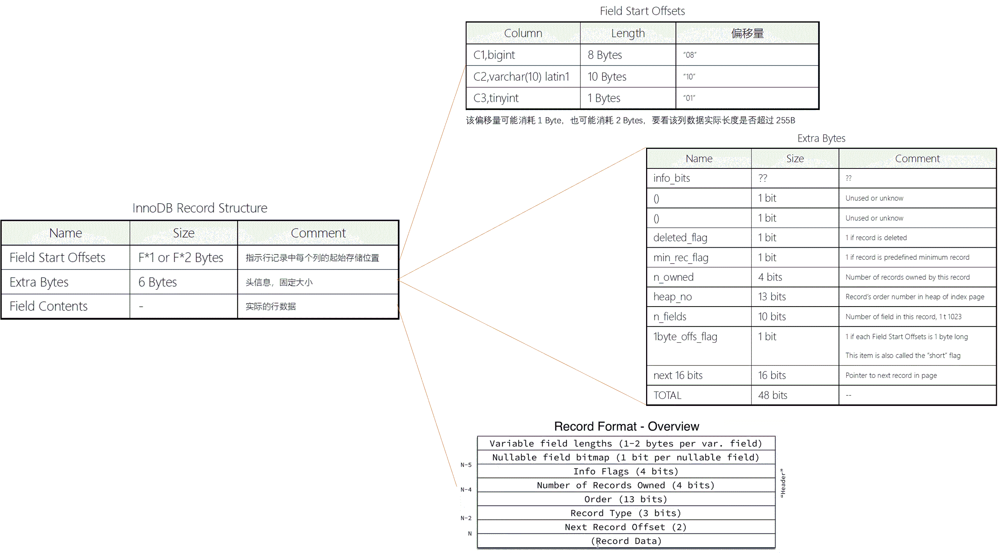
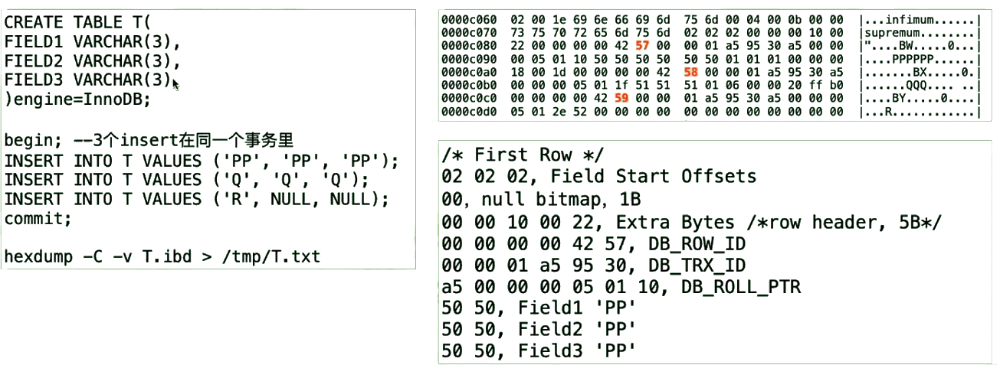
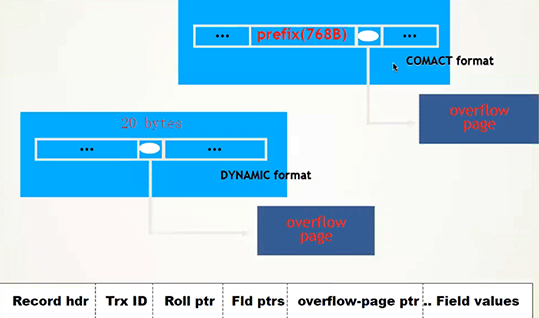

[TOC]

# InnoDB 行记录结构



 

 

- 数据结构

  - 没有显式索引，因此使用的是聚集索引rowid来标识唯一

  - 使用vim 进入了十六进制查看

    ```
    vim -b filename
    
    :%! xxd
    ```

    尝试自行使用16进制方式解析文件数据




 

 

# 行格式和行溢出

## 行格式 row-format

- Redundant，最早的行格式

- Compact，5.0之后默认行格式。将长字段长度超过768字节的部分由off-page存储

- Dynamic，5.7之后默认行格式。遇到长字段则只记录20字节的指针信息，指针指向off-page的第一个page，将长字段完全由off-page存储。

- Compressed，将data、index pages进行压缩，但buffer pool中的page则不压缩。

  - 压缩比约为1:2，5.1版本tps下降到10%，影响巨大。5.7性能相差不大。决定使用前自行做一下测试看效果。压缩后内存中存放内容多，读写到的内容就多，所以可能会提升一些。

 

- 查看行格式：show table status ;     或者查看元数据。

  - MyISAM会被识别为fixed

 

- Compact与Dynamic区别在于大对象存储逻辑、以及max index length不同：dynamic最长3072B，compact只能768B

  - 8.0以前可以用参数 innodb_large_prefix = 1 时，max index length 可以扩展为3072B，否则是768B。
  - 5.7开始  innodb_large_prefix = 1 且行格式为Dynamic，才支持max index length 3072B。

 



 

zabbix可以使用compressed这种格式。

- innodb compressed row（学习成本最低）
- toku db（长远来看会被抛弃的方案）
- clickhouse（学习成本最高）

 

## 行溢出（行链接、行迁移） overflow

- 行记录长度大约超过page size一半时，依次的将最长的列拆分到做个page存储，直到不再超过page size的一半为止。

- 溢出的列放在一个page中依旧不够时，还会继续放在新的page中

- compact格式下，溢出的列只存储前768Bytes

- dynamic格式下，溢出的列只存储20Bytes指针，列内容存储在新的page中

- select * 会同时读取这些溢出的列，因此代价很高

  - 对于select* ， 如果某些列超长， 可以不用select * ， 可以针对常规列做select col1 ， col2 的方式避免由于行链接带来的大量IO
  - 如果没有发生行链接，那是否使用select *，IO都一样，因为每次读都要读整个page，一个列和多个列是一样的——因为数据是以行方式存放在page里的。

- 行迁移直接会影响存储的碎片。

- text列上出现filesort或temporary table时，一般都无法在内存中进行排序，需要变成disk tmp table ，I/O代价更高。

 

## 行格式总结

- 默认采用dynamic格式即可
- 少用或者不用blob\text长字段类型
- 少用或者不用select *

 

- 案例：将多个text列拆分、重组到子表后，整体表空间尺寸减少了75%