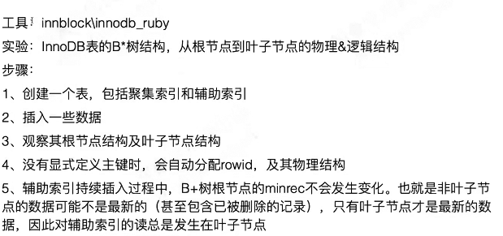

 

[Change Buffer(insert buffer)](1.系统表空间拓扑.md)

1. 修改一条数据的时候除了要改primary key字段，还有其他字段。对primary key的修改会立即刷新到磁盘，但是对辅助索引的修改，尤其是非唯一的辅助索引， 对这种索引的修改会存在很多个版本的修改状态（中间状态） ，这些版本不会都立即刷新到磁盘。
2. InnoDB mvcc是基于主键的id（rowid，pkid） 去读这条数据的。读到这条数据的时候便包含了辅助索引列的内容（整条嘛！）InnoDB的辅助索引是单独存储在另一个索引B+树中的（当然，依然在同一个表空间）
3. 为了满足多版本读、当前读， 只需要读聚集索引树就可以，无需实时读取辅助索引树，所以辅助索引树的更新允许有延迟。 也因此，辅助索引树的修改可以先缓存，再写盘。