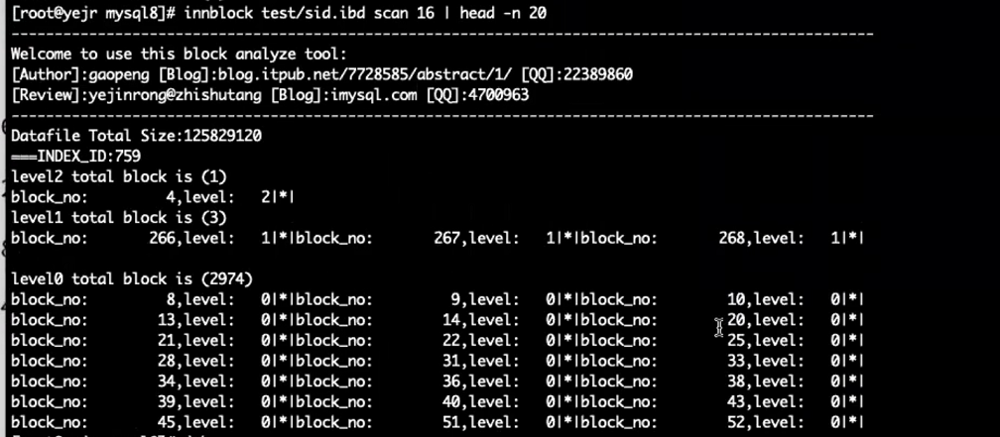

表空间文件的数据结构：

表空间

fsp_hdr:

ibuf:

inode: 对应extent

xdes对应extent

ibuf对应pages

xdes对应extent

ibuf对应pages

 

 

系统表空间数据结构

 

系统表空间 整个实例的信息

fsp:系统表空间分配情况。

。。。。看图理解吧

8.0.20开始双写buffer独立出去了。

 

 

 

ibd文件数据结构

inode：表空间文件里所有page的索引信息。 

 

 

 

 

 

 

 

 

 

 

 

 

 