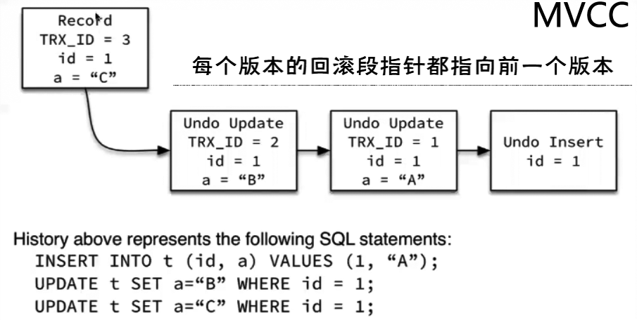
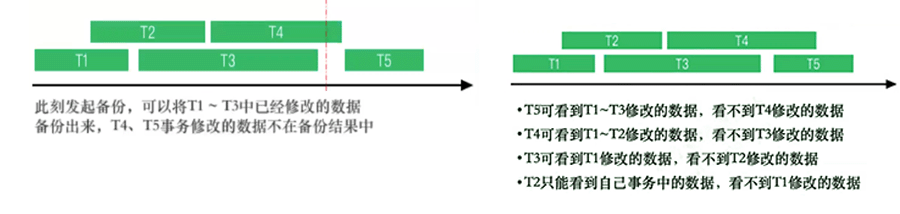

[TOC]

> 在事务中修改数据之后的生命历程是怎样的，理解MVCC、undo、redo机制

MVCC：多版本依靠事务ID和undo，并发控制依靠行锁

- MVCC每个版本存储的是整条数据，数据存储在undo log中， 回滚段指针相当于undo log的索引，undo log存储在undo表空间。
- InnoDB 靠undo保存旧版本数据，再利用回滚段指针查找旧版本数据，查找过程中通过事务ID判断数据版本可见性（事务ID逻辑对比，隔离级别）

  

# MVCC机制

每行记录有几个隐藏列：ROW_ID、TRX_ID、ROLL_PTR

- ROW_ID：没有显式创建聚集索引时才会分配ROW_ID，如果已经指定了显式聚集索引，或not null 的uniq索引，那么ROW_ID就不存在了。

- TRX_ID：事务ID，用于标识最后插入或更新这个行的最新版本。删除也被认为是一个更新，因为它在提交前只是在行上做一个[deleted-mark](..\3.存储对象数据结构\4.InnoDB 行记录结构、行格式和行溢出.md)。

  - 事务ID是一个递增值，每开启一个事务便生成一个新的事务ID，事务ID是一条数据多次更新的时间点，类似时间戳的概念，基本上可以理解为事务ID是InnoDB数据最后一个版本的更新时间

- ROLL_PTR：回滚段指针，对应事务ID和在该事务ID更新之前的版本。

  - 更新之前，innodb先将旧数据复制到undo，然后回滚段指针指向undo的这个位置，再将这个指针存储在这条数据最新版本的头部信息里面。

- UNDO LOG：存储了更改前的数据镜像，若该事务未提交，对隔离级别大于等于RC的其他事务，它们不会看到未提交的数据，而应该一直读取老版本的数据。*利用这个机制来构建MVCC多版本*。

  - 需要访问旧版本数据时，通过ROLL_PTR找到对应的undo log版本，再根据TRX_ID来判断该版本记录的可见性
  - **当旧版本记录中的TRX_ID指示对当前事务不可见时，则继续向前查找更旧的TRX_ID，直到找到符合可见性条件的记录。**
  - 如果做搜索的话，先判断当前事务（id）和当前读到的数据的最新版本，按照隔离级别，进行判断数据版本是否可见，如：事务ID=9 ，数据最新版本=10 ， 隔离级别大于等于RC时，版本10的数据版本是不可见的。

 

 

 

**当旧版本记录中的TRX_ID指示对当前事务不可见时，则继续向前查找更旧的TRX_ID，直到找到符合可见性条件的记录。**

最常见场景：备份

一般的，我们发起备份时间在负载较低的时间段。

- 如果当前实例里并发事务量很高，发起备份后，有可能同一条数据被更新过很多版本，等备份进程读取到这条数据时，要根据回滚段指针向前寻找很多版本的旧数据。
- 如果备份时间足够久、备份期间产生的事务足够多，那么备份读取旧版本数据的代价是很大的。
- 而且备份期间新产生的事务的undo都不能被清理掉，老版本时undo在ibdata中，会导致ibdata超级大。

 

# MVCC对于可见性的判断

可见性判断

- 并不是简单的直接拿当前事务的TRX_ID与表中每行记录的TRX_ID比较，去判断可见性。
- 在事务开始时，将当前系统中的所有活跃事务copy到一个列表中（及read view快照），根据read view最早一个TRX_ID和最晚一个TRX_ID来做比较
- 当前事务之前还未提交的事务的数据变化，以及当前事务启动后的其他事务的数据变更，在当前事务中均不可见

 
