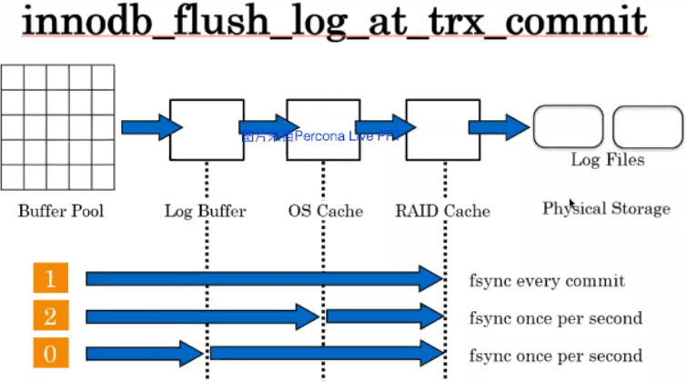

[TOC]

# Redo

> undo用于保证事务原子性
>
> redo用于保证事务持久性

## Redo概念

- redo log用于记录事务操作变化，记录的是数据被修改之后的值。（tbs space id + page     no + action）
- 失误提交前，redo log先写磁盘，即WAL——write ahead logging
- redo记录的是逻辑操作，类似binlog，不像oracle那样记录数据块，因此，无法利用redo log进行某个是损坏的data page修复。这时候需要用double write buffer进行data page修复。（刷新脏页前会先将脏页复制一份到double write buffer）
- redo和binlog的区别

  - redo是物理逻辑日志（tbs space id +      page no + action），binlog是逻辑日志
  - redo是发起时间顺序存储，binlog是按照事务提交时间顺序存储
  - redo log file循环使用，binlog每次新增一个文件
  - binlog更像oracle的arch

 

- 至少要有2个redo log，文件名序号从0开始，从ib_logfile0到ib_logfileN

- redo log顺序写入，循环使用。redo文件切换时，会执行一次ckpt（刷redo，刷dirty page）

- 每个redo log file前2048字节存放文件头信息

- redo日志中，由日志块组成，每个块默认512字节（实际可用496字节），循环顺序写入

  > *早先时代，根据磁盘每个扇区**512bytes**，为避免块损坏，就设置了**512byte**。*

  

- LSN，Log Sequence Number用于记录日志序号，会不断递增，每次增量都是事务产生的字节数

  > 当前SCN：10240 ，新事物长度200，新的SCN（LSN）：10440

​	切换日志会发生ckpt，代价略高，因此日志文件大一些，减少循环次数。5.5以后，redo log size 对实例恢复时间几乎没有影响

 

- redo会先放在log buffer（innodb_log_buffer_size定义的内存区域）中，而不是理解写入到磁盘

- 每次写redolog后是否flush到磁盘，由参数innodb_flush_log_at_trx_commit控制

- redo log buffer什么情况下sync到磁盘

  - 事务提交时（trx_commit=1）
  - master thread每一秒刷新一次
  - redo log buffer使用大于1/2时刷新
  - innodb_flush_log_at_timeout，默认1秒
  - checkpoint事件
  - binlog切换
  - 实例shutdown

 

# redo相关参数

1. innodb_flush_log_at_trx_commit
2. innodb_log_buffer_size
3. innodb_log_file_size
4. innodb_log_files_in_group

 

## 参数innodb_flush_log_at_trx_commit

	- 安全程度上来说，2和0某种程度上一样

  - 强烈建议设置为1，结合sync_binlog=1，保证数据可靠性
  
- 重点关注0和1

  - 0 要求把事务数据写入到logbuffer

    - 1 要求把事务数据写入到存储

      

    - 设置为1的好处，保证数据可靠性，但是理论上无法保证100% ， 真需要100%的话，还需要一个增强半同步（无损同步）的实例做slave，但是slave也会有同时宕机的可能性。

    - 设置为0 的问题，在系统负载很高的时候不一定能保证每秒刷新， 虽然每秒会发起调度，但是系统资源未必能足够响应调度。

     

  

  

  

 

## 参数innodb_log_buffer_size

一般32M足够了，假设一个事务平均2KB，则可以支持16384TPS

 

## 参数innodb_log_file_size

  实例启动时会根判断参数是否发生变化，如果发生变化则会重建redo log file

  建议设置为1-4GB

  如果redo file文件过小，或log buffer过小，可能会遇到innodb_log_waits等待事件

  > Innodb_log_waits
  >
  > The number of times that the log buffer was too small and a wait was required for it to be flushed before continuing.

 

## 参数innodb_log_files_in_group

  redo log file的个数（别看名字就以为和oracle一样了）

  建议设置为3-8个

 

 

# 8.0版本中优化了redo写性能

- 支持并行写入

- 无锁化处理，不再需要由锁来控制写入顺序

- 每个MTR（MTR：mini trx）写入前，事先预分配写入的偏移量

- 存在大LSN已写完但小LSN还没写完的情况，即空洞

- 有一个新的log writen线程负责扫描log buffer，找到未写完的MTR，再将其刷新到redo log中