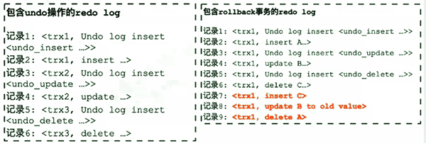
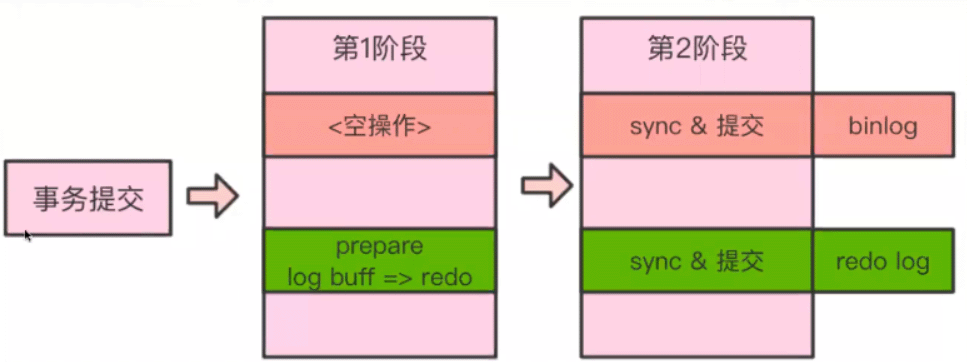

[TOC] 

1. 保证事务提交后不丢数据
2. 双1模式的意义
3. 两阶段提交是什么？

 

# 事务的完整过程

1. 事务更新前先记录undo，事务更新后记录redo，
2. 事务提交前，redo先写redo log buffer，buffer写到redo logfile，持久化redo。
3. 提交时将脏页复制一份到doublewritebuffer，再刷新脏页。

   不管redo还是undo，在数据被修改提交前都需要先持久化存储。都先于数据持久化到磁盘。

- undo和redo对应的都是事务、数据行。
- double write是要写入磁盘的内存page。
- 一个double write buffer     存放64个page，刷脏页前要将脏页的page复制到double write buffer     中

 

# 事务中 undo + redo的协同

1. 事务中更新数据前，先记录undo
2. 数据更新后，记录redo
3. 事务提交前，日志先写磁盘，保证持久化
4. undo和redo都需要先于数据持久化到磁盘
5. undo要早于redo写磁盘
6. undo和redo在写磁盘前都存放在内存中
7. undo用于保证事务原子性
8. redo用于保证事务持久性

 

例子：

假设有A、B两行数据，原值分别为1、2：

1. 事务开始
2. 记录A=1到undo log的buffer
3. 内存中修改A=3
4. 记录A=3到redo log的buffer
5. 记录B=2到undo log的buffer
6. 内存中修改B=4
7. 记录B=4到redo log的buffer
8. 将undo log的buffer写磁盘
9. 将redo log的buffer写磁盘
10. 事务提交

 

# Redo log设计原则

- redo log是连续存储，以追加方式写入的。

- 写redo log时，先写log buffer ，而后批量flush到磁盘文件

- 并发事务会共用同一段redo log区间，因此一段redo log提交时，可能会把其他还未提交的事务日志也一并提交。（这个提交指的是flush disk？感觉是。）

    > 记录1： <trx1, insert ...>
    >
    > 记录2： <trx2, update ...>
    >
    > 记录3： <trx3, delete ...>
    >
    > 记录4： <trx4, update ...>
    >
    > 记录5： <trx5, insert ...>

- 因为redo log是顺序追加写入的，那么在需要进行回滚时，实际上是将回滚操作当做正常事务再次写一遍redo log。

- 为简化recovery逻辑，对undo的操作实际上也会同时记录在redo一份。因此recovery时，只需要按照顺序扫描redo并进行恢复就可以了。

 

 

# 事务两阶段提交

- [2.5 事务提交流程]()
- 把binlog和redo log的提交当做一个XA事务来处理
- 两个日志使用同一个事务ID，称为XID，在实例级别具备全局唯一性
- 事务提交分成prepare、commit两个阶段
- binlog当做事务协调者，协调binlog和redo log的提交。
- 由binlog通知InnoDB引擎执行事务的prepare、commit、rollback

 

 

 

- prepare阶段

  - binlog自身什么都不做
  - redo log写prepare标记
  - InnoDB将redo log buffer 写入redo log（OS层面写，会先write，再fsync）

- commit级阶段

  - 刷新binlog
  - 刷新redo log
  - redo log写commit标记
  - 在redo log中记录binlog写成功的标记
  - 在InnoDB提交事务

 

 

# 如何保证主从数据一致性

- 若binlog写入完成，则主库从库都会正常完成事务
- binlog没有写入的，则主库从库都不会完成事务
- 不会出现褚总不一致的问题，除非trx_commit=0/2才有风险

| **GTID** | **MASTER_AUTO_POSITION** | **relay_log_recovery** | **relay_log_info_repository** | **Crash type** | **Recovery guaranteed** | **Relay log impact** |
| -------- | ------------------------ | ---------------------- | ----------------------------- | -------------- | ----------------------- | -------------------- |
| off      | any                      | 1                      | TABLE                         | Server         | Yes                     | lost                 |
| off      | any                      | 1                      | any                           | OS             | No                      | lost                 |
| off      | any                      | 0                      | TABLE                         | Server         | Yes                     | Remains              |
| off      | any                      | 0                      | TABLE                         | OS             | No                      | Remains              |
| on       | on                       | any                    | any                           | any            | Yes                     | lost                 |
| on       | off                      | 0                      | TABLE                         | Server         | Yes                     | Remains              |
| on       | off                      | 0                      | any                           | OS             | No                      | Remains              |

 

## 结论

1. 最好打开GTID
2. relay_log_info_repo尽量用table
3. binlog_format=row

 

 