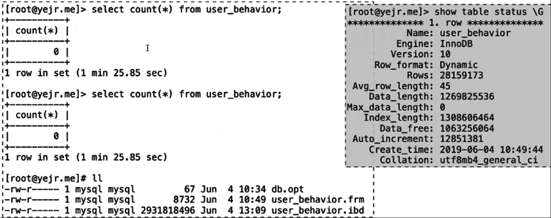

[TOC]

# purge 线程

负责垃圾回收

## 职责

- 删除辅助索引中不存在的记录

- 删除已被打了delete-marked标记的记录

- 删除不再需要的undo log


- 从5.6开始，purge线程独立
  - innodb_purge_threads=1
  - innodb_max_purge_lag=0
  - innodb_purge_batch_size=300


## 一个案例：删除大量旧数据后，统计min()很慢：

- 一个大表删除大量数据，但是还没来得及purge时，做min()函数，需要扫描很多回滚段并判断版本，取出数据。但是max()函数是没问题的。
  - 因为大量删除后，没来得及purge，purge队列很长， query需要扫描大量旧版本数据造成的查询缓慢。

## 又一个案例：大数据量事务取消操作造成大量回滚

- 大量insert 或load过程中取消操作（ctrl+c）， 造成大量历史数据需要回滚。
  - 因为统计时扫描回滚段，发现大量数据都是要回滚的……所以不断查询旧版本，耗费大量时间。




## InnoDB的purge过程

- 确认可见性（创建readview）

- 确认需要purge的记录，哪些是旧的事务（可以purge）
- 执行purge
- 清理history list，释放undo segment
  - 要时刻关注innodb未被purge的history list length。

    ```
    mysql> show engine innodb status \G
    
    ------------
    TRANSACTIONS
    ------------
    Trx id counter 1544
    Purge done for trx's n:o < 1540 undo n:o < 0 state: running but idle
    History list length 3
    LIST OF TRANSACTIONS FOR EACH SESSION:
    ---TRANSACTION 421388424571496, not started
    0 lock struct(s), heap size 1136, 0 row lock(s)
    ---TRANSACTION 421388424570624, not started
    0 lock struct(s), heap size 1136, 0 row lock(s)
    ```

  - 通过查询information schema

    ```
    mysql> select * from information_schema.innodb_metrics where name = 'trx_rseg_history_len'\G
    *************************** 1. row ***************************
          NAME: trx_rseg_history_len
       SUBSYSTEM: transaction
         COUNT: 3
       MAX_COUNT: 3
       MIN_COUNT: 3
       AVG_COUNT: NULL
      COUNT_RESET: 3
    MAX_COUNT_RESET: 3
    MIN_COUNT_RESET: 3
    AVG_COUNT_RESET: NULL
      TIME_ENABLED: 2020-08-17 16:11:45
     TIME_DISABLED: NULL
      TIME_ELAPSED: 85027
       TIME_RESET: NULL
         STATUS: enabled
          TYPE: value
        COMMENT: Length of the TRX_RSEG_HISTORY list
    1 row in set (0.00 sec)
    ```

    


## 一个思考：write thead和read thread的工作是什么？

- InnoDB从磁盘读取数据到内存时哪个线程负责的？将内存数据写入磁盘是哪个线程负责的？

- 和默认的4个read thread，4个write thread有关系吗？如果没有关系，那么write thead和read thread的工作是什么呢？

 

- innodb_read_io_thread负责从磁盘读数据到buffer pool
- innodb_write_io_thread负责从buffer pool写数据到磁盘

```
mysql> show global variables like '%thread%';
+----------------------------+-------+
| Variable_name              | Value |
+----------------------------+-------+
| innodb_purge_threads       | 4 |
| innodb_read_io_threads     | 4 |
| innodb_write_io_threads    | 4 |
```