#                  [     InnoDB存储引擎        ](https://www.cnblogs.com/allenhu320/p/11365080.html)             

## 不同引擎对比

 

### MyRocks

FB基于LevelDB实现RocksDB，移植到MySQL后，称为MyRocks，其本质是一个KVDB

在FB内部被广泛使用 ，大有取代InnoDB趋势

**MyRocks复制特点**

也是基于binlog实现，但MyRocks引擎不能和binlog实现XA协同

异常crash可能丢数据，所以主备环境建议开启semi-sync 

由于gap lock支持不健全(仅在PK上支持)，使用SBR会导致主从不一致，因此建议使用RBR

**MyRocks备份**

支持mysqldump逻辑备份

开源热备工具MyRocks_hotbackup，支持流式备份，但不支持增量备份

**MyRocks事务&锁特点**

支持行锁，锁信息都存在内存中。支持MVCC，通过快照的方式实现，类似PG

目前只支持两种隔离级别，RC和RR。RC表现和InnoDB不同

只会对主键和唯一索引加锁，普通索引不会加锁

按主键锁定查找不存在的行时，会对不存在的行主键加X锁

按二级索引查找时，只会对主键加锁，不会对二级索引加锁

无索引时，一开始锁全部行，但最后只锁住实际命中的行

**MyRocks不足**

不支持分区表、OnlineDDL、外键、全文索引、空间索引、表空间transport、MRR、O_DIRECT模式、savepoint

由于gap lock支持不健全(仅在PK上支持)，使用SBR会导致主从不一致，因此建议使用RBR

order by比较慢

最好不要和InnoDB混用，否则可能会出现未知风险/错误

**MyRocks与InnoDB的 比较**

InnoDB常规的B+ Tree相对浪费空间，自带的compressed格式也没好多少，MyRocks压缩比更高

InnoDB写放大问题比MyRocks严重，因为MyRocks是基于LSM结构，采用append only方式写入

MyRocks的索引前缀相同值会压缩存储，InnoDB则无此功能

MyRocks存储效率比InnoDB更高，存储更少的额外信息

若无主键，MyRocks会增加隐式主键

 

### TokuDB

一个MySQL的大数据存储引擎，开源GPL协议，现在归Percona公司收购

基于Fractal Tree Index设计

高速数据写入/追加的业务场景

大数据场景，高效压缩节省空间

是一个可以让你的成本节省一倍以上的备选方案

支持MVCC、OnlineDDL

支持 xtrabackup直接备份

加入ZST压缩算法

支持binlog group commit

引入性能计数器show engine tokudb status

**适用场景**

大规模数据，1TB+

需要归档数据

频繁增减字段

**不适用场景**

数据量小单表1千万以下

存储图片等大对象

有大量update&长事务

 

### MariaDB ColumnStore

在MariaDB基础上移植了InfiniDB构建的分布式、高可用、高压缩、并行计算的开源列式存储引擎

用于大数据离线分析，目标是取代Hadoop

MariaDB认为ColumnStore是数据仓库的未来明星

可以存储大量数据并快速分析

 

## InnoDB简介

基本上就是一个小型的Oracle

基于B+树的聚集索引组织表

基于索引的行锁实现 

完整支持ACID、MVCC、Crash Recovery等特性

支持4种事务隔离级别

支持外键、全文检索

支持多种文件格式及数据压缩

高性能、高并发、高效的buffer pool管理

 

## InnoDB架构

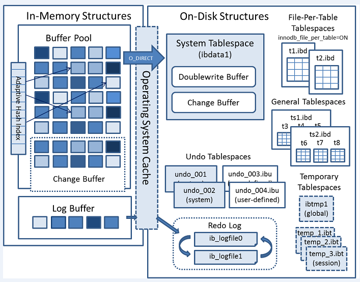

 

### InnoDB是聚集索引组织表 

基于B+树

数据以聚集索引(clustered index)逻辑顺序存储

聚集索引优先选择显示定义的主键

  其次选择第一个非NULL的唯一主键

  再次使用隐藏的ROWID

  聚集索引叶子节点存储整行数据

普通索引同时存储主键索引键值

**InnoDB主键**

最好是自增属性，INT/BIGINT UNSIGNED最佳

数据类型长度小，性能更佳

数据顺序写入也是顺序的，不会离散

也更有利于将更多普通索引放在buffer page中

主键尽量不要更新，否则更新主键时，辅助索引也要跟着更新

 

## 存储结构

系统表空间文件ibdata*

通用表空间文件

用户表空间文件*.ibd

全文索引fts*ibd

全局undo log、用户自定义undo log *.ibu

redo log

全局、会话级临时表空间文件(ibtmp1、*.ibt)

buffer pool dump file

innodb status file

**系统表空间**

总是必须的

文件名ibdata1、ibdata2、...ibdataN

由选项innodb_data_file_path定义路径、初始化大小、自动扩展策略

innodb_data_file_path = /data/mysql_3306/ibdata1:100M:autoextend

随着undo space分离出去，初始化大小100M左右就够了

主要存储对象：

Data Dictionary

Double wirte buffer

insert buffer/change buffer

**通用表空间，general tablespace**

类似Oracle的做法

多个table放在同一个表空间中

可以定义多个通用表空间，并且分别放在不同磁盘上

可以减少metadata的存储开销

和系统表空间类似，已分配占用的表空间无法收缩归还给操作系统(全部需重建)

8.0后 ，所有metadata都存储在mysql这个通用表空间中

mysql> show create table user\G
*************************** 1. row ***************************
    Table: user
Create Table: CREATE TABLE `user` (
 `Host` char(60) COLLATE utf8_bin NOT NULL DEFAULT '',
 `User` char(32) COLLATE utf8_bin NOT NULL DEFAULT '',
 ...
 PRIMARY KEY (`Host`,`User`)
) /*!50100 **TABLESPACE `mysql`** */ ENGINE=InnoDB DEFAULT CHARSET=utf8 COLLATE=utf8_bin STATS_PERSISTENT=0 COMMENT='Users and global privileges'
1 row in set (0.00 sec)

**用户独立表空间**

innodb_file_per_table = 1 (默认)

存储聚集索引(row data)以及辅助普通索引数据

每个table都有各自的x.ibd文件

doublewrite buffer，change buffer等仍存储在系统表空间文件里

表空间可更方便回收

透明表空间文件迁移

不过需要更多的file handler，当table数量很大(尤其是有很多表分区)时，可能会是个麻烦

删除大表时的代价也更大

**临时表空间，Tempory Tablespace**

独立表空间文件ibtmp1，默认12M

实例关闭后，文件会被删除；实例启动后，文件重新创建

无需参与crash recovery，因此也不会记录redo log

当临时表空间扩张后，无法在线收缩，需要重启才能释放

由innodb_temp_data_file_path定义

通用临时表create temporary table和SQL执行过程中产生的内部临时表(using temporary table)会共用这个临时表空间

**会话级临时表空间，Session Tempory Tablespaces**

会话级临时表空间(池)初始共有10个，会随着用户连接数及创建临时表的情况按需增加。实例重启后删除这些文件

每个session随机分配到某个临时表空间中，例如A用户连接后分配到temp_1.ibt，B用户连接后分配到temp_2.ibt

每个session最多分配两个临时表空间，一个用于存储用户主动创建的临时表(create temporary table)，另一个用于存储用于执行sql过程中生成的内部(磁盘)临时表

session断开后，会话级用户临时表空间会直接释放，不用再担心撑爆磁盘

**undo表空间，undo Tablespace**

管理回滚段和undo log

实例初始化时，默认创建两个undo表空间，最大127个

可以在线被truncate，因此最少需要两个undo表空间

选项innodb_rollback_segments用于定义每个undo表空间中的回滚段数量，默认是128个

支持undo表空间加密

8.0.14后，可以在线手动创建新的undo表空间

create undo tablespace undo_02 add datafile ''undo_02.ibu;

实例启动时，会自动扫描数据目录下的undo表空间文件

select * from information_schema.innodb_tablespaces\G

select * from information_schema.files\G

手动在线删除undo表空间

alter undo tablespace undo_02 set inactive;   #先设置不活跃

drop undo tablespace undo_02;  #而后再删除

**查看确认碎片**

data_length + index_length，对比物理ibd文件实际大小

或者rows * avg_row_length，对比物理ibd文件实际大小

5.7.5开始增加选项innodb_fill_factor，可以设置填充率

**消除碎片**

alter table xx engine = innodb;

或者optimize table xx;

尽量用pt-osc来操作

**回收表空间**

独立表空间：alter table xx engine = innodb;

共享表空间：重新导出、导入

尽量用pt-osc来操作

**表空间文件迁移**

目标服务器上：alter table xx discard tablespace;

源服务器上：flush table x for export，备份过去

目标服务器上：alter table xx import tablespace;

表结构务必一致

innodb_page_size也要一致

 

**page，页**

最小I/O单元，16KB，5.6版本起可自定义page size，全局选项，无法在运行过程中动态修改

实际可用16338字节(去掉38-bytes FIL header和8-bytes trailer)

**extent，簇/区**

空间管理单位

每个extent为1/2/4M，由N个page组成

**segment，段**

对象单位，例如rollback seg,undo seg,index seg等

每个segment由N个extent以及32个零散page组成

segment最小以extent为单位扩展

**tablespace，表空间**

表存储对象

每个tablespace都至少包含2种segment(叶子/非叶子 page file segment)

 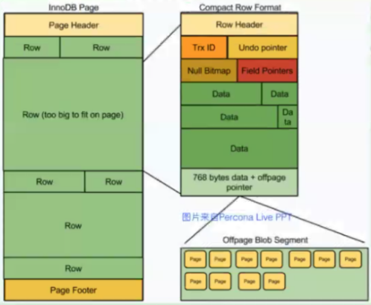

 

 

**行格式**

Redundant，最早的行格式

Compact，将长字段超过768字节的部分off-page存储，5.0之后的默认行格式

Dynamic，将长字段完全off-page存储，5.7之后的默认行格式

Compressed，将data、index pages进行压缩，但buffer pool中的page则不压缩

默认采用dynamic格式即可

少用blob/text长字段类型

少用select * 

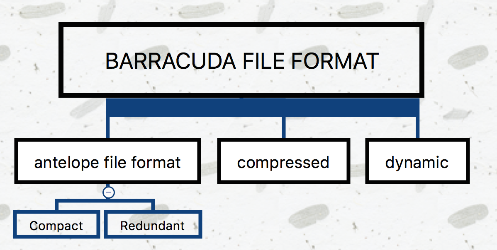

**行溢出，overflow**

行记录长度大约超过page一半时，依次将最长的列拆分到多个page存储，直到不再超过page的一半为止

溢出的列放在一个page中不够的话，还会继续放在新的page中

compact格式下，溢出的列只存储前768字节

dynamic格式下，溢出的列只存储前20字节(指针)

select * 会同时读取这些溢出的列，因此代价很高

text列上出现filesort或temporary table时，一般都无法放在内存中，需要变成disk tmp table，I/O代价更高

**每个row中至少存储几个基本信息**

DB_ROW_ID，6 bytes，指向对应行记录，每次写新数据该ID自增。如果已有显示声明的主键，则不需要存储DB_ROW_ID

DB_TRX_ID，6 bytes，每个事务的唯一标识符

DB_ROLL_PTR，7 bytes，指向undo log的回滚指针

用于实现MVCC

**InnoDB表数据字典有2份**

server层，frm文件

DDL过程中crash的话，有可能会来不及刷新，导致元数据不一致，sync_frm = 1

8.0起全部存储在InnoDB引擎中

InnoDB层 

InnoDB_SYS_DATAFILES 

InnoDB_SYS_TABLESTATS

InnoDB_SYS_INDEXES

InnoDB_SYS_FIELDS

InnoDB_SYS_TABLESPACES

InnoDB_SYS_FOREIGN_COLS

InnoDB_SYS_FOREIGN

InnoDB_SYS_TABLES

InnoDB_SYS_COLUMNS

 

## 内存管理

查看buffer pool中共有多少个page

select count(*) from information_schema.innodb_buffer_page; 

查看buffer pool的组成 

select page_type as Page_Type，sum(data_size)/1024/1024 as Size_in_MB  from information_schema.innodb_buffer_page group by page_type order by  Size_in_MB desc;

**内存管理**

IBP(innodb buffer pool)一般最高设置物理内存的50%~70%

IBP是innodb_buffer_pool_chunk_size(默认128M)的整数倍

从5.7开始，可以在线动态调整IBP，因此不建议一开始设置过大

设置过大还有可能会导致swap问题

使用多个instance降低并发内存争用

page采用hash算法分配到多个instance中读写

每个缓冲区池管理其自己的数据：

  选项innodb_buffer_pool_instances不可动态调整

  每个instance管理自己的free list、flush list、LUR list及其他，并由各自的buffer pool mutex负责并发控制

**在线修改buffer pool size**

加大buffer pool

  以innodb_buffer_pool_chunk_size为单位，分配新的内存pages

  扩展buffer pool的AHI(adaptive hash index)链表，将新分配的pages包含进来

  将新分配的pages添加到free list中

缩减buffer pool

  重整buffer pool，准备回收pages

  以innodb_buffer_pool_chunk_size为单位，释放删除这些pages(这个过程会有一点点耗时)

  调整AHI链表，使用新的内存地址

 

**latch的作用**

内存锁，在内存中保护list的内存锁结构

**两种latch**

mutex: lock_sys/trx_sys/log_sys，X，串行访问

rw-lock: S、X、SX，类似行锁的并行访问(读写互斥、读读并行)

想要获得latch(rounds)，需要先spin wait(spins)，如果获取不到会进入sleep状态(OS waits)

innodb_spin_wait_delay，两次spin wait之间的随机等待时间，设置为0可禁止等待间隙

热门mutex如log_sys->mutex、fil_system->mutex

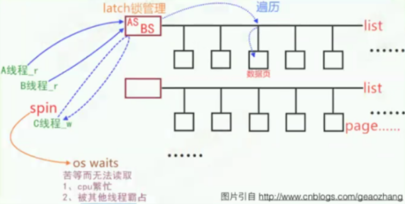

A、B线程，只读，共享 

C线程，写，排他，需spin wait 

**latch监控**

mysql> show engine innodb status\G

SEMAPHORES
\----------
OS WAIT ARRAY INFO: reservation count 3891375
OS WAIT ARRAY INFO: signal count 6936656
Mutex spin waits 11925030, rounds 30527304, OS waits 254602
RW-shared spins 5767502, rounds 75735214, OS waits 1259357
RW-excl spins 2928733, rounds 88052215, OS waits 2321910
Spin rounds per wait: 2.56 mutex, 13.13 RW-shared, 30.06 RW-excl

rounds，表示spin一次空转多少圈，也就是返回询问的次数

OS waits，表示sleep，当突然增长比较快时，说明latch争用比较严重

1.如果OS waits值比较高，说明出现latch争用，异常SQL

2.获取latch的代价：13.13 RW-shared, 30.06 RW-excl

**查看当前latch争用情况**

mysql> show engine innodb mutex;
+--------+--------------------------+------------------+
| Type  | Name           | Status      |
+--------+--------------------------+------------------+
| InnoDB | trx0purge.cc:132     | os_waits=1    |
| InnoDB | trx0rseg.cc:196     | os_waits=180   |
| InnoDB | ibuf0ibuf.cc:530     | os_waits=1    |
| InnoDB | dict0dict.cc:1026    | os_waits=2    |
| InnoDB | trx0sys.cc:594      | os_waits=293   |
| InnoDB | buf0dblwr.cc:146     | os_waits=282   |
| InnoDB | lock0lock.cc:611     | os_waits=149   |
| InnoDB | log0log.cc:844      | os_waits=37749  |
| InnoDB | buf0buf.cc:1362     | os_waits=1    |
| InnoDB | fil0fil.cc:1690     | os_waits=6103  |
| InnoDB | srv0srv.cc:936      | os_waits=33778  |
+--------+--------------------------+------------------+

**如何降低latch**

优化、提高SQL效率，减少latch耗时

事务尽快结束

适当调高innodb_buffer_pool_instances(8)

 

**内存管理**

**在启动时预装入buffer pool**

innodb_buffer_pool_load_at_startup

innodb_buffer_pool_dump_at_shutdown

**设置buffer pool刷新机制**

innodb_flush_method = O_DIRECT

**buffer pool管理**

LRU机制

两个列表，Young，Old

热点数据放在Young队列

超过innodb_old_blocks_time后移入Old队列

Old队列默认占比innodb_old_blocks_pct = 37 (3/8)

**预读**

随机预读

同一个extent里有13个热点page，就预读整个extent

young list的前1/4算热点数据

innodb_random_read_ahead

线性预读

一个extent中有连续56个page都被顺序访问，则预读下一个extent

innodb_read_ahead_threshold

**预写**

脏页刷盘前检查相邻页是否也是脏页，一起刷盘

SSD设备上通常关闭，没必要采用预写

SSD设备上建议禁用innodb_flush_neighbors 

**buffer pool预载&导出**

innodb_buffer_pool_load_now

innodb_buffer_pool_load_at_startup

innodb_buffer_pool_dump_pct

innodb_buffer_pool_filename

innodb_buffer_pool_dump_now

innodb_buffer_pool_dump_at_shutdown

 

**Redo**

ib_logfile文件个数由innodb_log_files_in_group配置决定(至少>=2)，文件名序号从0开始，从ib_logfile0到ib_logfileN

文件为顺序写入，循环使用。当达到最后一个文件末尾时，会从第一个文件开始顺序复用，redo文件切换时，会执行一次checkpoint(刷redo log，刷dirty page)

每个redo log file前2048字节存放文件头信息

redo日志中，由日志块组成，每个块默认512字节(实际可用496字节)，循环顺序写入

LSN(Log Sequence Number)用于记录日志序号，会不断递增，每次增量都是事务产生的字节数 

redo log用于记录事务操作变化，记录的是数据被修改之后的值(undo记录的是数据被修改之前的值)

不会记录临时表上的变化(5.7起开始有独立的临时表空间)

redo记录的是逻辑操作，类似binlog，不像Oracle是块记录。它需要应用到一个正确的page上面，如果该page本身被破坏了，则无法恢复出正确的数据，所以需要用到double write buffer

redo会先放在log buffer(innodb_log_buffer_size)中，而不是立即写磁盘

每次写盘后是否flush，由参数innodb_flush_log_at_trx_cmmit控制 

**redo log buffer写文件**

  事务提交时(trx_commit=1)

  master thread每秒刷新

  redo log buffer使用大于1/2进行刷新

  设置innodb_flush_log_at_timeout(默认1秒)

  checkpoint

  binlog切换

  实例shutdown 

**redo和binlog的区别：**

redo是物理逻辑日志，binlog是逻辑日志

redo是发起时间顺序存储，而binlog是按事务提交时间顺序存储

redo log file循环使用，binlog每次新增一个文件

binlog更像是Oracle里的redo归档

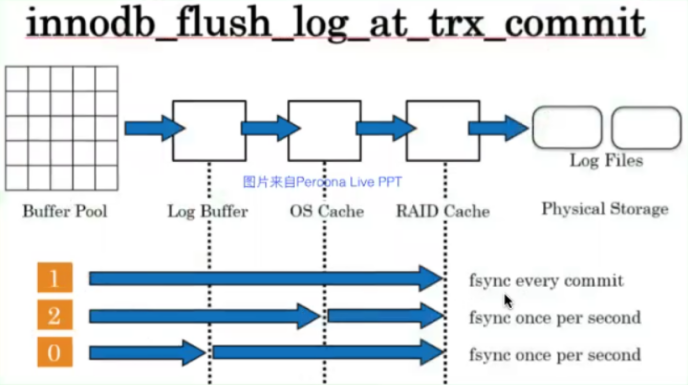

innodb_flush_log_at_trx_commit, 0、1、2 三个值，强烈建议使用默认值1

innodb_log_buffer_size，通常8~32M足够了

innodb_log_file_size，一般设置为512M~4G，设置太小可能导致性能问题及事务丢失

5.5起，较大的redo log并不影响crash recovery耗时，但可以降低checkpoint频率，减少I/O次数 

5.6起，自动判断redo log size是否变化，实例重启时自动重建redo log

innodb_log_files_in_group建议设置为4~8 

MySQL8.0优化redo写性能，支持并行写入

  无锁化处理，不再需要由锁来控制写入顺序

  每个MTR写入前，事先预分配写入的偏移量

  存在大LSN已写完但小LSN还没写完的情况，即空洞

  有一个新的log writer线程负责扫描log buffer，找到未写完的MTR，再将其刷新到redo log中

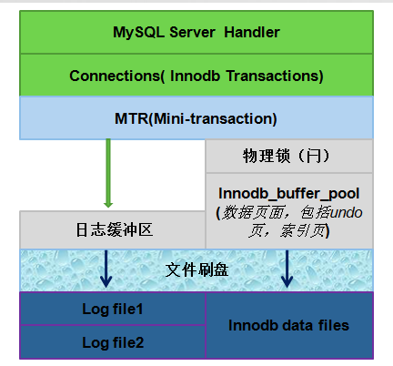

 

**Undo** 

Undo记录默认被记录到系统表空间中(ibdata*)中，但从5.6开始，可以使用独立的Undo表空间

大多数对数据的变更操作包括insert/delete/update

其中insert操作在事务提交前只对当前事务可见，因此产生的Undo日志可以在事务提交后直接删除，归类为insert_undo

而对于update/delete则需要维护多版本信息，在InnoDB里，update和delete操作产生的Undo日志被归成一类，即update_undo。在一致性读的时候需要使用，如果当前没有更早的事务需要再读取回滚段中的旧版本记录时 ，这些记录就可以删除了 

innodb_undo_directory，设置独立undo log存储路径

innodb_undo_tablespaces设置undo log文件树，每个文件默认10M，默认初始化为2个undo log，最小为2(小于2的话，就无法在线truncate了)，最大127。8.0.14后不能再配置了，后面会删除该选项

innodb_rollback_segments，设置undo tablespace中回滚段数量，比如将2G的undo tablespace，切分成多少份rollback seg。默认128个，每个undo log seg可以最多存放1024个事务

系统表空间总是需要1个undo回滚段，临时表空间总是需要32个undo回滚段。因此，undo回滚段总是必须大于33个，循环使用

可以被在线truncate

当undo超过innodb_max_undo_log_size时，会触发truncate工作

purge执行innodb_purge_rseg_truncate_frequency(128)次后，也会触发truncate工作

innodb_max_purge_lag = 0 (不建议设置非0)

innodb_max_purge_lag_delay = 0 (不建议设置非0)

innodb status里的History list length是已提交的事务，但未purge的update undo log

 

## 事务中undo + redo协同

事务中更新数据前，先记录undo

数据更新后，记录redo

事务提交前日志先写磁盘，保证持久化

undo/redo都需要先于数据持久化到磁盘

undo要早于redo写磁盘

undo/redo写磁盘前，都先放在内存中

undo用于保证事务原子性

redo用于保证事务持久性

 

### redo log设计原则

redo log是连续存储的，追加方式写入

不立即写文件，而是先写log buffer，而后批量刷新

并发事务会共用同一段redo log区间，因此一段redo log提交时，可能会把其他还未提交的事务日志也一并提交

因为redo log是顺序追加写入的，那么在需要进行回滚时，实际上是将回滚操作当作正常事务再次写一遍redo log

为简化recovery逻辑，实际上对undo的操作，也会同时记录一份在redo中

因此recovery时，只需按顺序扫描redo并恢复即可

 

## **MVCC (Multi-Version Concurrency Control)**

InnoDB的多版本使用undo&回滚段来构建

InnoDB是聚集索引组织表，每个行记录有3个额外属性：ROW_ID、TRX_ID、ROLL_PTR

undo记录了更改前的数据镜像，若事务未提交，对隔离级别大于等于read commit的其他事务，它们不应该看到已修改(未提交)的数据，而应一直读取老版本的数据 

 在修改聚集索引记录时，总是同时存储了ROLL_PTR和TRX_ID，可通过该ROLL_PTR找到对应的undo记录，通过TRX_ID来判断该记录的可见性

当旧版本记录中的TRX_ID指示对当前事务不可见时，则继续向前(更新的TRX_ID)构建，直到找到一个可见的记录

InnoDB在表空间中保存行的旧版本信息，这些信息被保存在回滚段中

**事务标识符(DB_TRX_ID)**指示最后插入或更新这个行的事务标识符，删除标志也被认为是一个更新，因为它在提交前只是在行上做了一个标记

**回滚段指针(DB_ROLL_PTR)**指向一个由回滚段写入的undo日志记录。如果一个行被更新了，undo日志记录包含了重建这行更新前信息的一些必要数据

回滚段中的undo日志分为**插入日志(主要是insert操作)**和**更新日志(包含update和delete)**。插入日志仅在事务回滚的时候有用，事务提交之后就可以马上删除掉。更新日志在一致性读的时候需要使用，如果当前没有事务再可能使用回滚段中的记录的时候，这些记录就可以删除掉了。因此，最好以适当频率提交事务，否则InnoDB不能删除掉过期更新日志，回滚段越来越大

回滚段中undo日志记录的物理大小要比其对应的插入或更新的行要小

当删除某一行时，该行并不会马上从数据库的物理文件上删除。只有当InnoDB可以清除更新日志记录的时候，那些行及其对应的索引记录才会真正从物理上删掉。这个清除操作称为purge.

**可见性判断**

不是简单的直接拿当前事务的TRX_ID与表中每行记录的TRX_ID比较判断可见性

事务开始时，将当前系统中的所有活跃事务copy到一个列表中(即read view)，根据read view最早一个TRX_ID和最晚一个TRX_ID来做比较

当前事务之前还未提交的事务数据变更，以及当前事务启动后的其他事务的数据变更，在当前事务中均不可见

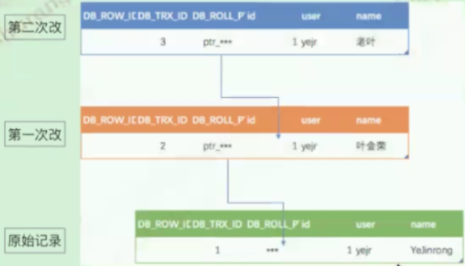

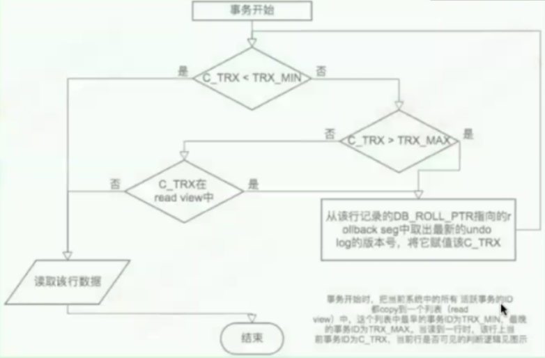

 

## 事务两阶段提交 

把binlog和redo log的提交当作一个XA事务来处理

两个日志使用同一个事务ID，称为XID，实例全局唯一

事务提交分为prepare、commit两个阶段

binlog当作事务协调者，协调binlog和redo log的提交。由binlog通知InnoDB引擎执行事务的prepare、commit、rollback

**prepare阶段**

  binlog自身什么也不做

  redo log写prepare标记

  InnoDB将redo log buffer写入redo log

**commit阶段**

  刷新binlog

  刷新redo log

  redo log写commit标记

  在redo log中记录binlog写成功标记

  InnoDB提交事务

若binlog写入完成，则主从库都会正常完成事务；binlog没有写入完成，则主从库都不会完成事务。不会出现主从不一致的问题，除非trx_commit=0/2才有这个风险

 

### 如何保证主从数据一致性：

双1，GTID，slave上relay_log_info_repository="TABLE",master_info_repository="TABLE",relay_log_recovery=1

slave采用半(强)同步复制

从专用slave做恢复

 

## 后台线程

select thread_id,name,type from performance_schema.threads where name like '%innodb%' group by name;

master thread

IO thread

  read/write thread

  insert buffer thread

  log io thread

lock monitor thread

error monitor thread

purge thread

page cleaner thread

 

**master thread (主线程)的线程优先级最高**

其内部由几个循环(loop)组成：主循环(loop)，后台循环(background loop)，刷新循环(flush loop)，暂停循环(suspend loop)

会根据数据运行的状态在loop，background loop，flush loop和suspend loop中进行切换

**master thread 每秒要做的事**

  刷新dirty page到磁盘

  执行change buffer merge

  刷redo log buffer到磁盘

  checkpoint

  检查dict table cache，判断有无要删除table cache对象

**master thread 每10秒要做的事**

  刷新dirty page到磁盘

  执行change buffer merge

  刷redo log buffer到磁盘

  undo purge

  checkpoint

**master thread 实例关闭时**

  刷redo log到磁盘

  change buffer merge

  执行checkpoint

  innodb_fast_shutdown (0,slow,full purge,change buffer merge;  1,默认,fast,skip these operations; 2,flushes logs,cold shuts,like crashed)

**master thread 优化建议**

  避免dirty page堆积，适当调整innodb_max_dirty_pages_pct (<=50)

  避免undo堆积，适当调大innodb_purge_batch_size

   及时checkpoint，调整innodb_flush_log_at_trx_commit,innodb_adaptive_flushing,innodb_adaptive_flushing_lwm,innodb_flush_neighbors,innodb_flush_avg_loops

  保持事务持续平稳提交，不要瞬间大事务，或者高频率小事务

 

**checkpoint**

定期确认redo log落盘，避免数据丢失，并提高crash recovery效率

buffer pool脏数据太多，把 脏页刷到磁盘，释放内存

redo log快用完了，把脏页刷到磁盘

redo log切换时，需要执行checkpoint

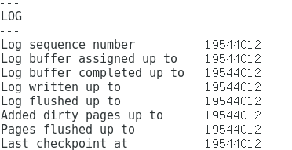

Log sequence number - Last checkpoint at = checkpoint lag 

sharp checkpoint：

  将所有的脏页都刷新回磁盘 

  刷新时系统hang住

  比较暴力，只有在需要干净重启时(innodb_fast_shutdown=0)才需要

fuzzy checkpoint：

  持续将脏页刷新回磁盘

  对系统影响较小，但可能刷新较慢，会有迟滞

  innodb_max_dirty_pages_pct = 50

  innodb_max_dirty_pages_pct_lwm = 0

什么情况下innodb_fast_shutdown要设为0，同时innodb_max_dirty_pages_pct = 0

  实例升级版本

  主从切换

  实例迁移

  物理关机/重启

持有log_sys->mutex锁，并获取flush list上未刷新的最老LSN

表空间头部信息打上checkpoint标记

fsync redo log

写入checkpoint状态到redo log头部信息(写入到redo log的第一个文件)

crash recovery时，扫描第一个redo log的头部信息中checkpoint状态

在以前，当有带blob的大事务时，可能会覆盖redo log。5.6.22之后，新增限制：未checkpoint的redo log的大小超过total redo log的10%时报错

不过，上述限制在5.7.5之后，又给取消了。调整为每修改4个page，就会检查一次redo log是否够用，不够就checkpoint

 

**Page cleaner (flushing)**

将脏页(dirty page)刷新落地到磁盘

有两种方式：

  LRU Flushing，基于LRU_list(基于最后访问时间的排序)的刷新顺序

  Adaptive Flushing，基于flush_list(严格按照最后修改时间的排序，LSN)的刷新顺序，innodb_adaptive_flushing = 1

扫描列表，并找到邻居页面(innodb_flush_neighbors=1,机械盘适用，SSD盘可关闭)，一起刷新

  将脏页拷到double wirte buffer

  将double write buffer写文件并sync到磁盘

  将dirty page写到数据文件并sync到磁盘

告警：page_cleaner：1000ms intended loop took **ms. The settings might not be optimal. (flushed="**",during the time.)怎么办

原因：本次刷新时间 - 上次刷新时间 > (1秒(睡眠时间)+3秒)

有可能是因为IO能力不足 ，或参数不合理

建议：

  检查innodb_io_capacity是否过高

  检查innodb_max_dirty_pages_pct是否过高

  检查innodb_max_dirty_pages_pct_lwm是否过高

  检查innodb_io_capacity_max是否过高

  目的是减少每次刷新的I/O负担，让每次刷新I/O块数更平均。避免page cleaner线程集中刷新脏数据，阻塞IO通道，反而使得刷新变慢了

 

**purge**

简单说，就是做GC(garbage collection)

purge都做啥？

  删除辅助索引中不存在的记录

  删除已被打了delete-marked标记的记录

  删除不再需要的undo log

从5.6开始，将purge thread独立出来

  innodb_purge_threads = 1

  innodb_max_purge_lag = 0

  innodb_purge_batch_size = 300

InnoDB的purge过程

update_undo产生的日志会放到history list中，当这些旧版本无人访问时，需要进行清理操作

另外页内标记删除的操作也需要从物理上清理掉

后台purge线程负责这些工作

具体过程：

  确认可见性(创建readview)

  确认需要purge的记录(确认哪些是旧事务，可purge的)

  执行purge

  清理history list，释放undo segment

造成unpurge list特别大的原因：

  大的一致性查询/很久的备份

  mysqld重启

  高并发事务

  不合理的innodb_max_purge_lag值

要时刻关注innodb未被purge的History list length值，大于5000要注意

 

**insert buffer/change buffer**

将非唯一辅助索引上的IUD操作从随机变成顺序I/O，提高I/O效率

工作机制：

先判断要修改的非聚集索引页是否在缓冲池中，若在，则直接修改

若不在，则先放入到一个change buffer对象中，change buffer也是棵B+树，每次最多缓存2K的记录 

innodb_change_buffer_max_size(25)

innodb_change_buffering

内存大、数据量小的时候，就没必要开change buffer了 

不支持倒序索引 

 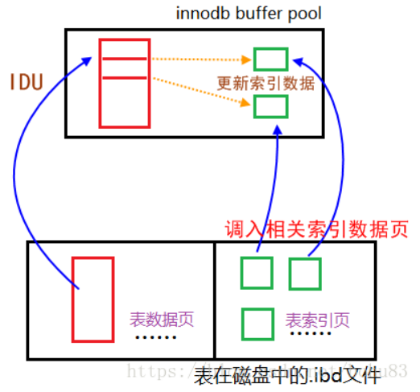

 

 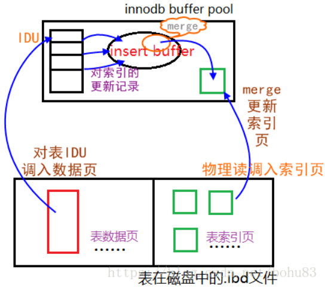

 

**double wirte，双写**

作用：保证数据写入的可靠性(防止数据页损坏，又无从修复)

因为InnoDB有partial write问题：

  16k的页只写入了部分数据时发生crash

   redo里记录的是逻辑操作，不是物理块，无法通过redo log恢复

怎么解决partial write问题：

  双写，double write

  2个1M的空间，共2M(既有磁盘文件，也有内存空间)

  页在刷新时首先顺序的写入到double write buffer

  然后再刷新回磁盘

在可以保证原子写的硬件设备或文件系统下，可以被关闭

slave上也可关闭

doublewirte写入是顺序的，性能损失很小(SSD设备上损失则比较大)

MySQL5.7起，Linux系统下采用Fusion-io NVMFS设备(支持原子写)时，会自动关闭double write buffer

innodb_flush_method最好设置为O_DIRECT获得更好性能

 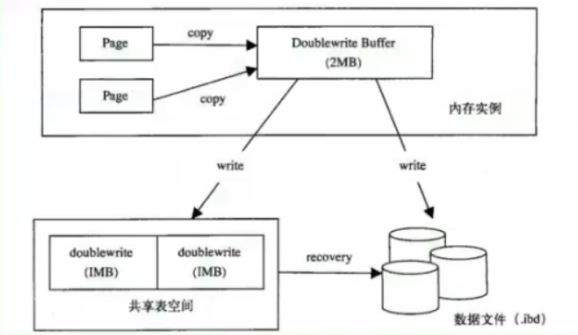

 

**adaptive hash index (AHI)**

目的：缓存索引中的热点数据，提高检索效率，O(1) vs O(N)

对热点buffer pool建立AHI，非持久化

初始化为ibp的1/64，会随着ibp动态调整

只支持等值查询：

  idx_a_b(a,b)

  where a=?

  where a=? and b=?

  where a in(?)

  where a !=?

 AHI很可能是部分长度索引，并非所有查询都能有效果

设置innodb_adaptive_hash_index = 0 关闭

设置innodb_adaptive_hash_index_parts 使用AHI分区/分片降低竞争提高并发

个别场景下，开了AHI后，可能导致spin_wait lock比较大，可以关闭掉 

基于主键的搜索，几乎都是hash searches

基于普通索引的搜索，大部分是non-hash searches，小部分是hash searches

 

## Crash Recovery

crash步骤：

redo结束后，mysqld开始对外提供服务，后面的过程放在后台线程继续工作

当实例从崩溃中恢复时，需要将活跃的事务从undo中提取出来，对于ACTIVE状态的事务直接回滚，对于Prepare状态的事务，如果该事务对应的binlog已经记录，则提交，否则回滚事务

change buffer merge

purge

xa recovery

事务恢复步骤：

实例重启

读取redo log，确认是否干净

若不干净，则扫描redo log，得到active和prepare的事务列表

直接回滚active状态的事务 

读取最后一个binlog，获取相应的xid

结合prepare事务列表和binlog xid，对比判断，已有binlog的，再次提交事务，没有记录binlog的，回滚事务 

加快crash recovery速度

升级到5.5以后的版本

提高I/O设备性能

适当调低innodb_max_dirty_pages_pct，50以下

设置innodb_flush_log_at_trx_commit=1，让每个事务尽快提交，避免有其他事务等待，产生大量的undo，增加purge工作量

5.7又进一步改进，crash  recovery时无需扫描所有数据文件并创建内存对象(数据文件巨多时会产生严重性能问题)，而只检查checkpoint+那些标记为被修改过的文件，从一个checkpoint点开始，可以找到所有崩溃恢复需要打开的文件，从而避免扫描数据目录 

 

## 重点参数

innodb_buffer_pool_size

  最大的内存块，建议为物理内存的50%~80%

innodb_max_dirty_pages_pct

  buffer pool中dirty page最大占比，建议不超过50%

innodb_log_buffer_size

  redo log buffer，能缓存5秒左右产生的redo log就够，32M基本够用

innodb_thread_concurrency

  不要限制innodb内部并发线程数

innodb_lock_wait_timeout

  行锁等待超时阈值，推荐值10

innodb_max_purge_lag

  不要设置该值非0，除非明确想控制InnoDB的并发

innodb_log_file_size

  建议每个redo log都至少1G，并且至少3个redo log，加大有助于减小checkpoint频率，提高tps

innodb_flush_log_at_trx_commit

  redo log刷新机制，1最安全，0性能最好，2折中

innodb_io_capacity，innodb_io_capacity_max

  innodb后台线程最大iops上限

innodb_autoinc_lock_mode = 1

  auto-inc锁模式，推荐1. 明确binlog_format=row模式下，可以设置为2

 

## InnoDB监控

show engine innodb status

  OS waits/rounds 如果比例过高要发出告警

  History list length > 5000 要告警

  一个事务ACTIVE时间过长要告警

sys.innodb_lock_waits & sys.schema_table_lock_waits

pfs.data_locks

pfs.data_lock_waits

pfs.metadata_locks

 

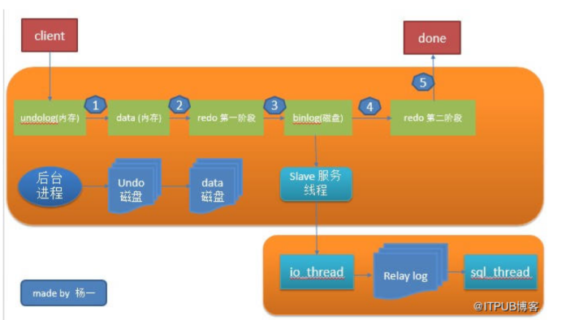

 

 

 

### 总结：

系统表空间和redo log都不宜过小，使用独立表空间，独立undo空间

每行存储长度不宜过大，容易导致行溢出，对性能影响较大

对row data增删改查时，要适当利用InnoDB存储引擎的特性，降低影响

innodb dirty page刷新速率尽量保持平稳，避免I/O抖动

max-dirty-page-pct不宜过高，降低瞬间刷大量dirty page的几率

事务尽早提交，降低undo log history list

启用innodb buffer pool预热功能