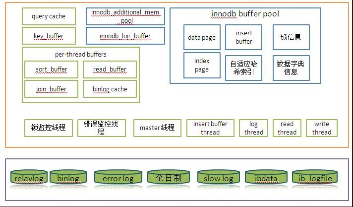

已剪辑自: https://www.cnblogs.com/kissdb/p/4009614.html

**内存结构：**

**Mysql 内存分配规则是：用多少给多少，最高到配置的值，不是立即分配**

图只做大概参考

全局缓存包括：

global buffer(全局内存分配总和) =

  innodb_buffer_pool_size            -- InnoDB高速缓冲，行数据、索引缓冲，以及事务锁、自适应哈希等

+innodb_additional_mem_pool_size   -- InnoDB数据字典额外内存，缓存所有表数据字典

+innodb_log_buffer_size            -- InnoDB REDO日志缓冲，提高REDO日志写入效率

+key_buffer_size                  -- MyISAM表索引高速缓冲，提高MyISAM表索引读写效率

+query_cache_size                 -- 查询高速缓存，缓存查询结果，提高反复查询返回效率

+thread_cache_size                --Thread_Cache 中存放的最大连接线程数

+table_cahce                     -- 表空间文件描述符缓存，提高数据表打开效率

+table_definition_cache             -- 表定义文件描述符缓存，提高数据表打开效率

会话缓存包括：

 total_thread_buffers= max_connections * (

 read_buffer_size       -- 顺序读缓冲，提高顺序读效率

+read_rnd_buffer_size  -- 随机读缓冲，提高随机读效率

+sort_buffer_size      -- 排序缓冲，提高排序效率

+join_buffer_size      -- 表连接缓冲，提高表连接效率

+binlog_cache_size    -- 二进制日志缓冲，提高二进制日志写入效率

+tmp_table_size       -- 内存临时表，提高临时表存储效率

+thread_stack         -- 线程堆栈，暂时寄存SQL语句/存储过程

+thread_cache_size    -- 线程缓存，降低多次反复打开线程开销，模拟连接池

)

 

**内存相关配置参数介绍：**

**全局内存部分：**

innodb_buffer_pool
 • InnoDB高速缓冲（简称IBP），对Innodb很重要。

• 应该把它设置得大一些，单实例，建议设置为可用RAM的50~80%。
 • InnoDB不依赖OS，而自己缓存了所有数据，包括索引数据，行数据，等等。这点跟MyISAM有差别。
 • 查询或更新需要对IBP加锁，影响并发
 • IBP有一块buffer用于插入缓冲。在插入的时候，先写入内存，之后再合并后顺序写入磁盘。在命并到磁盘上的时候，会引发较大的IO操作，对实时操作造成影响(看上去是抖动,tps变低)
 • show global status like ‘innodb_buffer_pool_%’ 查看IBP状态，单位是page(16kb)
 • Innodb_buffer_pool_wait_free 如果较大，需要加大IBP设置
 • InnoDB会定时（约每10秒）将脏页刷新到磁盘，默认每次刷新10页；
 • 要是脏页超过了指定数量（innodb_max_dirty_pages_pct），InnoDB则会每秒刷100页脏页 

• innodb_buffer_pool_instances可以设置pool的数量

• show engine innodb status\G  可以查看innodb引擎状态

mysql> show global status like 'innodb_buffer_%';

+---------------------------------------+---------+

| Variable_name             | Value  |

+---------------------------------------+---------+

| Innodb_buffer_pool_pages_data     | 154   |

| Innodb_buffer_pool_bytes_data     | 2523136 |

| Innodb_buffer_pool_pages_dirty     | 0    |          脏数据

| Innodb_buffer_pool_bytes_dirty     | 0    |

| Innodb_buffer_pool_pages_flushed    | 1    |

| Innodb_buffer_pool_pages_free     | 8038   |        空闲，要乘以16k

| Innodb_buffer_pool_pages_misc     | 0    |

| Innodb_buffer_pool_pages_total     | 8192   |

| Innodb_buffer_pool_read_ahead_rnd   | 0    |

| Innodb_buffer_pool_read_ahead     | 0    |  预读的页数

| Innodb_buffer_pool_read_ahead_evicted | 0    |  预读的页数，但是没有被读取就从缓冲池中被替换的页的数量，一般用来判断预读的效率。

| Innodb_buffer_pool_read_requests    | 563   |  从缓冲池中读取的次数。

| Innodb_buffer_pool_reads        | 155   |  表示从物理磁盘读取的页数

| Innodb_buffer_pool_wait_free      | 0    |

| Innodb_buffer_pool_write_requests   | 1    |

+---------------------------------------+---------+

15 rows in set (0.00 sec)

Innodb_data_read：总共读入的字节数。
 Innodb_data_reads：发起读请求的次数，每次读取可能需要读取多个页。

 buffer pool利用率：

ib_bp_hit=(1 - Innodb_buffer_pool_reads/Innodb_buffer_pool_read_requests)*100%

 buffer poo命中率 

= (Innodb_buffer_pool_read_requests)/(Innodb_buffer_pool_read_requests + Innodb_buffer_pool_read_ahead + Innodb_buffer_pool_reads)

 平均每次读取的字节数 = Innodb_data_read/Innodb_data_reads

 

 innodb_additional_mem_pool_size
 数据字典以及内部数据结构缓存，表数量越多，相应的内存需要越大。
 默认8M，通常设置为8~32M足够，一般建议设置为16M，如果确实不够用，那么会从系统中请求增加分配内存，并且错误日志中会提醒，目前至少还未发生过。

 

 innodb_log_buffer_size
 show global status 查看 Innodb_log_waits 是否大于0，是的话，就需要提高 innodb_log_buffer_size，否则维持原样。
 show global stauts 查看30~60秒钟 Innodb_os_log_written 的间隔差异值，即可计算出 innodb_log_buffer_size 设置多大合适。
 默认8M，一般设置为16 ~ 64M足够了。

1. Innodb_log_waits，可用log buffer不足，等待释放次数，数量较大时需要加大log buffer
2. Innodb_log_write_requests, log写请求次数
3. Innodb_log_writes, log物理写次数
4. Innodb_os_log_fsyncs, log写入时，调用rsync()次数 
5. Innodb_os_log_pending_fsyncs，log文件等待fsync()操作次数 
6. Innodb_os_log_pending_writes, log写等待次数
7. Innodb_os_log_written, log写入总字节数
8. innodb log buffer作用：InnoDB log随机IO

整合率Innodb_log_write_requests/ Innodb_log_writes

 

key_buffer_size ：myisam引擎中表的索引  的缓存大小，默认值  =  16M，单个key_buffer_size最大只有4G（32-bit系统下最大4G，64-bit下可以超过）

 若主要使用myisam，设置最高不超过物理内存的20%~50%，即便全是innodb表,没用MyISAM，也有必要设置该值用于缓存临时表之索引，推荐32MB，（如果内存tmp_table_size（Created_tmp_tables）不够的话，内部的临时磁盘表是MyISAM表（Created_tmp_disk_tables）（新版本可能是innodb表））。

可以使用检查状态(show global status)值'created_tmp_disk_tables'得知详情。

| Created_tmp_disk_tables          | 0      |
 | Created_tmp_files             | 5      |
 | Created_tmp_tables            | 4      |

 Key_read_requests    myisam引擎上总读取请求次数

Key_reads            myisam从物理硬盘上读索引的次数

Key_write_requests    myisam引擎上总写入请求次数

Key_writes            myisam从物理硬盘上写索引的次数

 key buffer命中率
 读命中率key_buffer_read_hits = (1 - key_reads/key_read_requests) * 100%
 写命中率key_buffer_write_hits = (1 - key_writes/key_write_requests) * 100%

 

 query_cache_size
 • 建议直接关闭不使用

• MySQL高速查询缓存池（简称QC）。
 • 将SELECT语句和查询结果存放在缓冲区中，若有同样的SELECT语句（区分大小写），将直接从缓冲区中读取结果。
 • show global status like ‘Qcache_%‘ 查看QC，可以知道QC设置是否合理
   如果 Qcache_lowmem_prunes 的值非常大，则表明经常出现缓冲不够的情况

   如果 Qcache_hits 的值非常大，则表明查询缓冲使用非常频繁，此时需要增加缓冲大小

   如果 Qcache_hits 的值不大，则表明你的查询重复率很低，这种情况下使用查询缓冲反而会影响效率，那么可以考虑不用查询缓冲

• 在SELECT语句中加入SQL_NO_CACHE可以明确表示不使用查询缓冲
 • query_cache_limit = 2M，不缓存超过2M的查询结果
 query_cache_min_res_unit = 512K，设置每个QC单元大小，提高QC利用率（Qcache_queries_in_cache不大，但Qcache_free_memory较大，就需要减小query_cache_min_res_unit ）

 query cache命中率：

Query_cache_hits = 1 – (qcache_hits / (qcache_hits + com_select)) * 100%

 

thread_cache_size
 Thread_Cache 中存放的最大连接线程数。
 在短连接的应用中Thread_Cache的功效非常明显,因为在应用中数据库的连接和创建是非常频繁的,如果不使用 Thread_Cache那么消耗的资源是非常可观的!在长连接中虽然带来的改善没有短连接的那么明显,但是好处是显而易见的。
 但并不是越大越好，有可能大了反而浪费资源。

thread cache命中率：
 Thread_Cache_Hit=(Connections-Thread_created)/Connections*100%

 

TABLE_OPEN_CACHE(5.1.3及以前版本名为TABLE_CACHE)

由于MySQL是多线程的机制，为了提高性能，每个线程都是独自打开自己需要的表的文件描述符，而不是通过共享已经打开的.针对不同存储引擎处理的方法当然也不一样。

在MyISAM表引擎中，数据文件的描述符(descriptor)是不共享的，但是索引文件的描述符却是所有线程共享的。

Innodb中和使用表空间类型有关，假如是共享表空间那么实际就一个数据文件，当然占用的数据文件描述符就会比独立表空间少。

 几个关于table_cache的状态值:
 Open_tables：当前打开的表的数量
 Opened_tables：历史上全部已经打开的表总数，如果 Opened_tables 较大，table_open_cache 值可能需要加大。

 

如果Open_tables的值已经接近table_cache的值，且Opened_tables还在不断变大，则说明mysql正在将缓存的表释放以容纳新的表，此时可能需要加大table_cache的值。对于大多数情况。通常比较适合的建议值：

 Open_tables / table_open_cache <= 0.95

 

 table_definition_cache
 从MySQL 5.1开始，数据表文件描述符被分开为数据文件及数据表定义文件两部分。表定义文件缓存可以放在专属的 table_definition_cache 中。
 表定义文件缓存相比表文件描述符缓存所消耗的内存更小，其默认值是 400。

 状态值：
 Open_table_definitions：表定义文件 .frm 被缓存的数量
 Opened_table_definitions：历史上总共被缓存过的 .frm 文件数量。

 

其它几个小内存，内存计算公式：
 • adaptive index hash, size= innodb_buffer_pool / 64，自适应哈希索引，用来管理buffer pool的哈希索引。随着buffer的频繁更新，会随之上升

• system dictionary hash, size = innodb_buffer_pool_size / 256，基本固定，数据字典信息
 • memory for sync_array, which is used for syncronization primitives, size = OS_THREADS * 152
 • memory for os_events, which are also used for syncronization primitives, OS_THREADS * 216
 • memory for locking system, size=5 * 4 * NBLOCKS（NBLOCKS，innodb buffer pool的block数量），随着并发/行锁增加，会随之上升

**其中** 

•OS_THREADS = 
 如果 innodb_buffer_pool_size >= 1000Mb，则为：50000
 否则如果 innodb_buffer_pool_size >= 8Mb，则为：10000
 否则为： 1000 (*nixes平台下通用)
 • NBLOCKS = innodb_buffer_pool_size/8192

 

 **会话级内存部分：****
** 

tmp_table_size(相当于pga)

是MySQL的临时表缓冲大小。所有联合在一个DML指令内完成，并且大多数联合甚至可以不用临时表即可以完成。大多数临时表是基于内存的(HEAP)表。具有大的记录长度的临时表 (所有列的长度的和)或包含BLOB列的表存储在硬盘上。如果某个内部heap（堆积）表大小超过tmp_table_size，MySQL可以根据需要自动将内存中的heap表改为基于硬盘的MyISAM表。还可以通过设置tmp_table_size选项来增加临时表的大小。也就是说，如果调高该值，MySQL同时将增加heap表的大小，可达到提高联接查询速度的效果。(Using temporary)

不负责限制 MEMORY/HEAP表最大容量，如果执行SQL产生临时表超过 tmp_table_size/max_heap_table_size，则会产生基于磁盘的MyISAM表。

一般64~128m就可以.

排序时sort_buffer_size放不下时，要用到内存tmp_table_size，还是磁盘临时表？

 tmp table命中率
 每次使用临时表都会增大 **Created_tmp_tables**;基于磁盘的表也会增大 **Created_tmp_disk_tables**。
 对于这个比率，并没有什么严格的规则，因为这依赖于所涉及的查询。长时间观察 Created_tmp_disk_tables 会显示所创建的磁盘表的比率，您可以确定设置的效率。 
 tmp_table_size 和 max_heap_table_size 都可以控制临时表的最大大小，因此请确保在 my.cnf 中对这两个值都进行了设置。

 

 max_heap_table_size
 这个变量定义了用户可以创建的内存表(memory table)的大小.这个值用来计算内存表的最大行数值。
 这个变量支持动态改变，即set @max_heap_table_size=#，但是对于已经存在的内存表就没有什么用了，除非这个表被重新创建(create table)或者修改(alter table)或者truncate table。
 服务重启也会设置已经存在的内存表为全局max_heap_table_size的值。
 这个变量和tmp_table_size一起限制了内部内存表的大小。

它和tmp_table_size的区别是，负责设置MEMORY/HEAP表最大容量，不管其他执行SQL产生的临时表，如果内存不够用，则不允许写入新的数据，MEMORY/HEAP表也不会转成磁盘表，只会告警超限后拒绝写入。

一般它和tmp_table_size设置一样就可以了。

 

 binlog_cache_size
 （dml在执行commit前，将日志写入缓存。如果语句大于该值，线程则打开临时文件来保存事务。线程结束后临时文件被删除。commit时，mysqld将事务写入binlog文件。）

在事务过程中容纳二进制日志SQL 语句的缓存大小。二进制日志缓存是服务器支持事务存储引擎并且服务器启用了二进制日志(—log-bin 选项)的前提下为每个客户端分配的内存。
 如果系统中经常会出现多语句事务的话，可以尝试增加该值的大小，以获得更好的性能。当然，**我们可以通过MySQL 的以下两个状态变量来判断当前的binlog_cache_size 的状况：Binlog_cache_use 和Binlog_cache_disk_use**。“max_binlog_cache_size”：和"binlog_cache_size"相对应，但是所代表的是binlog 能够使用的最大cache 内存大小。当我们执行多语句事务的时候，max_binlog_cache_size 如果不够大的话，系统可能会报出“ Multi-statement transaction required more than 'max_binlog_cache_size' bytes ofstorage”的错误。

binlog cache命中率

binlog hit ratio = (Binlog_cache_use)/( Binlog_cache_use + Binlog_cache_disk_use) ，一般要大于98%
 Binlog_cache_use状态变量显示了使用该缓冲区(也可能是临时文件)保存语句的事务的数量。
 Binlog_cache_disk_use状态变量显示了这些事务中实际上有多少必须使用临时文件。

DML 在 commit后，发现这2个值会有变化

 

bulk_insert_buffer_size（每线程分配，MyISAM特有，表的插入缓存）

专用于MyISAM引擎，用一个特别的类似树形结构体缓存，用以提高 INSERT ... SELECT, INSERT ... VALUES (...), (...) 以及 LOAD DATA写数据到非空表的情景。

每个线程分配，默认8M，可以设置为 0 来关闭这个buffer。

 

 

myisam_sort_buffer_size(用到才分配，MyISAM特有)
 MyISAM表在做修复时，用于提高索引文件修复效率的buffer，或者用以创建索引时提高效率。
 默认值8M，一般128M ~ 256M 足够了。

下面几个buffer size，一般设置为128K ~ 2M足够。如果单进程需求量大，set read_buffer_size = 128 * 1024 * 1024;

read_buffer_size 顺序读buffer

是MySQL读入缓冲区大小。对表进行顺序扫描的请求将分配一个读入缓冲区，MySQL会为它分配一段内存缓冲区。read_buffer_size变量控制这一缓冲区的大小。如果对表的顺序扫描请求非常频繁，并且你认为频繁扫描进行得太慢，可以通过增加该变量值以及内存缓冲区大小提高其性能。

Handler_read_next / Com_select 得出了表扫描比率

 

read_rnd_buffer_size  随机读buffer

是MySQL的随机读缓冲区大小。当按任意顺序读取行时(例如，按照排序顺序)，将分配一个随机读缓存区。进行排序查询时，MySQL会首先扫描一遍该缓冲，以避免磁盘搜索，提高查询速度，如果需要排序大量数据，可适当调高该值。但MySQL会为每个客户连接分配该缓冲区，所以应尽量适当设置该值，以避免内存开销过大。

[上面有可能不准，看下面这段]

当执行完根据索引排序操作后，按照一定排序顺序读取数据时，这些数据会放在 read_rnd_buffer 中以避免的磁盘搜索。不是指随机读取的缓冲。

 

 

sort_buffer_size
 是MySQL执行排序使用的缓冲大小。如果想要增加ORDER BY的速度，首先看是否可以让MySQL使用索引而不是额外的排序阶段。如果不能，可以尝试增加sort_buffer_size变量的大小（执行计划中，如果显示using filesort，就说明会用到sort buffer）。

Sort_merge_passes 包括两步。MySQL 首先会尝试在内存中做排序，使用的内存大小由系统变量 Sort_buffer_size 决定，如果它的大小不够把所有的记录都读到内存中，MySQL 就会把每次在内存中排序的结果存到临时文件中，等 MySQL 找到所有记录之后，再把临时文件中的记录做一次排序。**这个临时文件也会增加Created_tmp_disk_tables吗？
 再次排序就会增加 Sort_merge_passes.实际上，MySQL 会用另一个临时文件来存再次排序的结果，所以通常会看到 Sort_merge_passes 增加的数值是建临时文件数的两倍。
 因为用到了临时文件，所以速度可能会比较慢，增加 Sort_buffer_size 会减少 Sort_merge_passes 和 创建临时文件的次数。但不能盲目增加 Sort_buffer_size ，因为并不一定能提高速度。

** 

join_buffer_size

应用程序经常会出现一些两表（或多表）JOIN的操作需求，MySQL在完成某些 Join 需求的时候（all row join/ all index join/ range index scan join），为了减少参与JOIN的“被驱动表”的读取次数以提高性能，需要使用到 JOIN Buffer 来协助完成 JOIN操作。当 JOIN Buffer 太小，MySQL 不会将该 Buffer 存入磁盘文件，而是先将Join Buffer中的结果集与需要 Join 的表进行 Join 操作，然后清空 Join Buffer 中的数据，继续将剩余的结果集写入此 Buffer 中，如此往复。这势必会造成被驱动表需要被多次读取，成倍增加 IO 访问，降低效率。(执行计划中，如果显示Using join buffer，就说明会用到JOIN Buffer).

 

 多种JOIN情况：plain index scans(普通索引扫描), range index scans(范围索引扫描), do not use indexes and thus perform full table scans(没有索引的全表扫描)
 最好是添加适当的索引，而不是纯粹的加大 join_buffer_size。
 任何两个表间的全表 join 就会分配一次 join buffer，也就是说，如果有3个表join，就会分配2次join buffer。

 

Select_full_join，表关联时，由于没有索引产生的扫描次数，大于0时，需要注意检查是否有合适的索引
 Select_full_range_join，表关联时，驱动表使用范围扫描次数

 

 thread_stack 

主要用来存放每一个线程自身的标识信息，如线程id，线程运行时基本信息等等，我们可以通过 thread_stack 参数来设置为每一个线程栈分配多大的内存。一般默认的256KB就足够了。

 

net_buffer_length（每线程分配）

每个客户端连接时，用以维持连接缓冲以及读取结果缓冲。初试分配预设值，在有需要时，则会自动扩大到 max_allowed_packet 大小，然后再回收到预设的 net_buffer_length 大小。

最小1K，最大1M，默认值是16K。

 