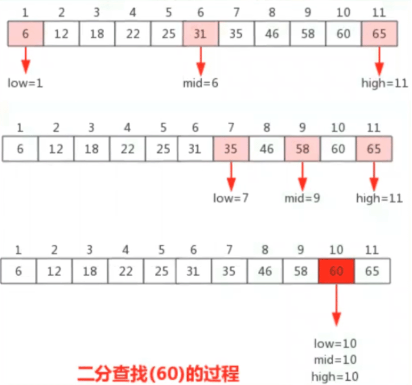

[TOC]

# 二分查找（折半查找） binary search

一种在有序数组中查找某一特定元素的搜索算法

- 优点是：比较的次数少，查找速度快，平均性能好。（对折几次就出结果了）

- 缺点是：要求带查表为有序表，且插入删除困难

因此，二分查找方法**适用于不经常变动而查找频繁的**有序列表。

 

- 二分查找保证效率的方式：保证新插入值为最大，这样就在后面追加， 而不会造成分裂。

 