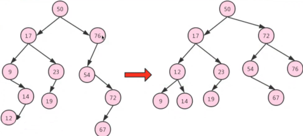

[TOC]

# 平衡树，平衡二叉树 Self-balancing binary search tree

改进的二叉树。

一般的二叉树的查询复杂度是跟目标节点到根的距离（即深度）有关，因此当节点的深度普遍较大时，查找的均摊复杂度会上升，为了更高效的查询，有了平衡树。

 

平衡二叉树的特点

- 是一棵空树或其左右两个子树的高度差的绝对值不超过1，且左右两个子树也是平衡二叉树。
- 不平衡树会通过自旋，变成平衡树。
- 平衡树和二叉查找树最大的区别：前者是平衡的，后者未必。

 

非平衡二叉树通过自旋演变成平衡二叉树

 

