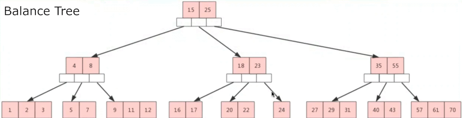
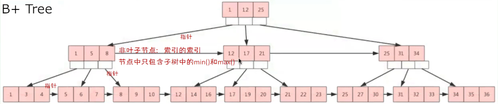
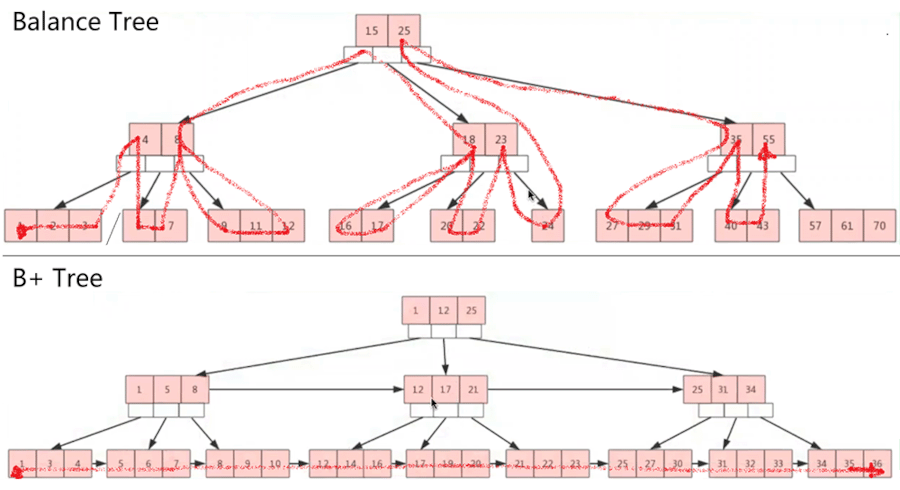

[TOC]

# B 树，B tree,B- tree,B_tree, balanced tree

又称B-树，B_树

- B树，一个节点可以拥有多于2个子节点的多叉查找树。

- 适合大量数据的读写操作，普遍运用在数据库和文件系统。

- 一棵m阶（比如m=4）的B树满足下列条件：

  - 树中的每个节点至多有m个（4个）子节点
  - 除根节点和叶子节点外，其他每个节点至少有m/2个（2个）子节点
  - 若根节点不是叶子结点，则至少有2个子节点
  - 所有叶子节点都出现在同一层，叶子节点不包含任何键值信息
  - 有k个子节点的非叶子节点恰好包含有k-1个键值（索引节点）  ------这句没看懂。

  

  

 

 

# B+ 树，B+ tree

B+树是B树的变体，也是多路搜索树，其定义基本与B树相同。

如图，3阶B+ 树，每个节点至多有3个子节点。

  

 

B+树特点（与B树的不同点）：

- 有n棵子树的节点（node）中含有n-1个关键字（key），每个关键字不保存数据，只用来索引。所有数据都保存在叶子结点。
- 所有的叶子节点中，包含**全部**关键字的信息，以及指向含这些关键字记录的指针。叶子结点本身依关键字的大小而自小而大顺序链接。（对比B树：叶子节点不包含任何键值信息）
- 所有的非叶子节点可以看成是索引（就是……表的索引的索引），节点中仅含其子树中的最大（或最小）关键字。
- 在MySQL中，为了方便，B+树都写成BTREE，但是实际上是B+树，这一点要注意。

 

 

- B+树广泛应用于数据库系统、文件系统，是非常优秀的基础数据结构

- B+树有个经典的**数据更新/插入热块问题**，因此在InnoDB中才<u>建议选用自增ID当主键索引（聚集索引），避免page分裂。同时利用change buffer 避免辅助索引的分裂</u>

 

### B+树容量

假设有一个表，只有一个INT列，且该列设置为pk。

B+树中，

| 每个非叶子节点开销                | (row  header) 6B + (int类型主键) 4B + (指向叶子结点的指针) 4B = 14B |                                                              |
| --------------------------------- | ------------------------------------------------------------ | ------------------------------------------------------------ |
| 每行数据开销                      | (叶子结点开销) 14B + (DB_TRX_ID) 6B +  (DB_ROLL_PTR) 7B = 27B | *( [ + (rowid ,**如果表未设置主键的话**) ]*                  |
| 每个非叶子节点page存储量约为      | ( 16*1024 - 128 ) / 14 = 1161行记录                          | *(**一个**page 16k -* *每*[*个**page**的必要占用* *128B*]()*) /* *每个非叶子节点开销* *14B* |
| 每个叶子结点page存储量约为        | ( 16*1024 - 128 ) / 27 = 600行记录                           | *(**一个**page 16k -* *每个**page**的必要占用* *128B) /* *每行数据开销* *27B* |
| 一个三层高的B+树，最多数据量约    | 1161 * 1161 * 600 ≈ 8亿行记录                                | *根节点存储量* *** *非叶子节点存储量* *** *叶子结点数据量*   |
|                                   |                                                              |                                                              |
| 叶子节点每行INT only数据占用      | (init 类型 4B) +  (DB_TRX_ID 6B) + (DB_ROLL_PTR 7B) + (record header 5B) = 22B |                                                              |
| 每4条记录一个slot，每个slot 2B    |                                                              |                                                              |
| 叶子节点每个page可以存放N条记录   | N*22 +  N/4 * 2 = 16*1024 -128                22.5N=16256                    N=722.48 | *128**为每*[*个**page**的必要占用* *128B*]()*。*             |
| 非叶子节点数据占用                | (每个指向叶子节点的指针 4B) + (int类型 4B) + (record header 5B) = 14B |                                                              |
| 非叶子节点每个page可以存放N条记录 | N*14 +  N/4 * 2 = 2 16*1024 - 128             14.5N=16256                N=1121 | *这个不一定对。没找到非叶子节点的结构图，先猜测*             |

 

[[老叶茶馆\] - 2019-08-10 浅析InnoDB Record Header及page overflow.html]()

 

 

# B树和B+树顺序扫描对比

 

顺序扫描对比：从1扫描到50。

 

思考：

粗略估算一下，当前线上的关键热表，大概是几层高度。