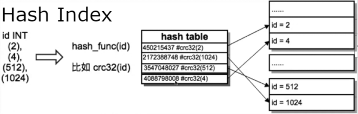
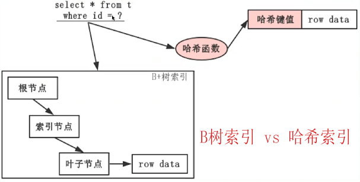

[TOC] 

# hash索引

也叫散列索引

- 建立在hash表的基础上，它只适用于等值精确查找，其他场景（排序、范围查询、模糊查询）都会菜的一笔。

- 对于每一行，存储引擎计算出了被索引的hash code，它是一个较小的值，并且有可能和其他行的hash code相同。

- 把hash code保存在索引中，并且保存了一个指向hash表中的每一行的指针


 

 

 

# hash索引和B+树索引对比

- hash索引在大量唯一值的精确条件查找（等值查找）时，效率高的一笔！（前提是：数据重复量较小。如果重复较多，那么需要多次判断，效率反而很低（B+ 树反而效率高））
- hash索引不支持范围查询（B+树支持的不错）
- hash索引不支持模糊查询（模糊查询也是一种范围查询）
- hash索引不支持排序（B+树天生有序）
- hash索引不支持最左匹配规则（b+树可以最左匹配前导列，但是hash索引不支持。）
- hash索引只能在HEAP/MEMORY、NDB表中【显式】的应用。即使在InnoDB中显式指定为hash索引，实际上存储的也是B+tree索引。

 



 

## 最左匹配规则

索引列(a,b,c)

- B+tree索引

  - where a=? and b=? and c=?  #完全索引扫描
  - where a=? and b=? #B+tree索引可以使用最左匹配查询规则，来使用该索引完成查询

- Hash索引

  - where a=? and b=? and c=?  #Hash完全索引扫描，索引对(a,b,c)一起做的hash code，效率理论上优于B+tree
  - where a=? and b=?  #无法用到该Hash索引，因为索引值是hash(a,b,c)，区分不出前导列来。

 


## 其他区别

- 哈希索引局限性较大，应用场景较少，但在InnoDB内部的自适应哈希索引（AHI）中用处也很大，后续会讲到。
- B+树广泛应用于数据库系统、文件系统，是非常优秀的基础数据结构。
- B+树有个经典的“数据更新/插入热块问题”，因此在InnoDB中才建议选用自增ID当主键索引（聚集索引），避免page分裂。同时利用change buffer避免辅助索引的分裂。

 

##  对HASH索引的支持性

- MySQL 5.6在`show create table`中能看到InnoDB表对hash索引的定义，但是依然存储的是B+tree

  ```
  mysql> show create table ha\G
  *************************** 1. row ***************************
         Table: ha
  Create Table: CREATE TABLE `ha` (
    `id` int(11) DEFAULT NULL,
    `c1` varchar(10) DEFAULT NULL,
    `c2` varchar(10) DEFAULT NULL
  ) ENGINE=InnoDB DEFAULT CHARSET=utf8mb4
  1 row in set (0.00 sec)
  
  mysql> alter table ha add index(c2) using hash;
  Query OK, 0 rows affected (0.66 sec)
  Records: 0  Duplicates: 0  Warnings: 0
  
  mysql> show create table ha\G
  *************************** 1. row ***************************
         Table: ha
  Create Table: CREATE TABLE `ha` (
    `id` int(11) DEFAULT NULL,
    `c1` varchar(10) DEFAULT NULL,
    `c2` varchar(10) DEFAULT NULL,
    KEY `c2` (`c2`) USING HASH
  ) ENGINE=InnoDB DEFAULT CHARSET=utf8mb4
  1 row in set (0.00 sec)
  # 能看到hash索引的定义
  
  mysql> mysql> show index from ha;
  +-------+------------+----------+--------------+-------------+-----------+-------------+----------+--------+------+------------+---------+---------------+
  | Table | Non_unique | Key_name | Seq_in_index | Column_name | Collation | Cardinality | Sub_part | Packed | Null | Index_type | Comment | Index_comment |
  +-------+------------+----------+--------------+-------------+-----------+-------------+----------+--------+------+------------+---------+---------------+
  | ha    |          1 | c2       |            1 | c2          | A         |           0 |     NULL | NULL   | YES  | BTREE      |         |               |
  +-------+------------+----------+--------------+-------------+-----------+-------------+----------+--------+------+------------+---------+---------------+
  1 row in set (0.00 sec)
  # 但是存储的依然是B+tree
  ```

  

- MySQL 8.0在`show create table`中无法再看到InnoDB表对hash索引的声明了。

  ```
  mysql> create table ha(id int,c1 varchar(100),c2 varchar(20));
  Query OK, 0 rows affected (0.79 sec)
  
  mysql> alter table ha add index(c1) using hash;
  Query OK, 0 rows affected, 1 warning (0.82 sec)
  Records: 0  Duplicates: 0  Warnings: 1
  
  mysql> show create table ha \G
  *************************** 1. row ***************************
         Table: ha
  Create Table: CREATE TABLE `ha` (
    `id` int DEFAULT NULL,
    `c1` varchar(100) DEFAULT NULL,
    `c2` varchar(20) DEFAULT NULL,
    KEY `c1` (`c1`)
  ) ENGINE=InnoDB DEFAULT CHARSET=utf8mb4 COLLATE=utf8mb4_0900_ai_ci
  1 row in set (0.00 sec)
  # 8.0版本在show create table中看不到对hash索引的定义了
  
  
  mysql> mysql> show index from ha;
  +-------+------------+----------+--------------+-------------+-----------+-------------+----------+--------+------+------------+---------+---------------+---------+------------+
  | Table | Non_unique | Key_name | Seq_in_index | Column_name | Collation | Cardinality | Sub_part | Packed | Null | Index_type | Comment | Index_comment | Visible | Expression |
  +-------+------------+----------+--------------+-------------+-----------+-------------+----------+--------+------+------------+---------+---------------+---------+------------+
  | ha    |          1 | c1       |            1 | c1          | A         |           0 |     NULL |   NULL | YES  | BTREE      |         |               | YES     | NULL       |
  +-------+------------+----------+--------------+-------------+-----------+-------------+----------+--------+------+------------+---------+---------------+---------+------------+
  1 row in set (0.00 sec)
  # 但是8.0里存储的也是B+tree
  ```


思考：

- 再复习一下索引的几个重要基础知识
- 一般索引采用B+树结构会有什么问题？
