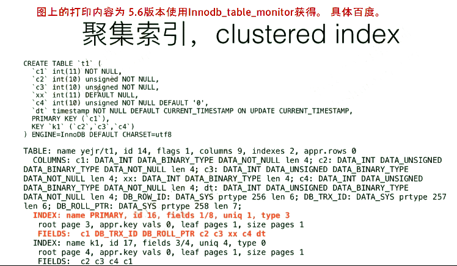

[TOC]

# 聚集索引，clustered index

- 聚集索引是一种索引，该索引中键值的逻辑顺序决定了表数据行的物理顺序
- 除了TokuDB引擎之外，其他引擎表每张表只能建一个聚集索引。
- InnoDB中，InnoDB表为索引组织表（IoT），聚集索引即是表，表也就是聚集索引。（见图↓，InnoDB表聚集索引的叶子节点总是存储了整行数据。）
- MyISAM没有聚集索引的概念，相当于Oracle的堆表。

 


 

 

## InnoDB创建聚集索引的建议

聚集索引有限选择列

- INT/BIGINT
- 数据连续（单调顺序的）递增/自增

不建议的聚集索引

- 修改频繁的列（可以修改，但是不能频繁）
- 新增的数据太过于离散随机（太大可以在右侧追加，但是出现中间值，则代价很高。）

 

## InnoDB聚集索引的次序原则

1. 显式声明的主键
2. 第一个Not NULLABLE的唯一索引
3. DB_ROW_ID（实例级别，6B）

 

- 主键索引一定是聚集索引
- 聚集索引不一定是主键索引
- InnoDB表一定有聚集索引

 


 

 

## InnoDB表聚集索引的定义理解



 

| 字段        | 值                                        | 说明                                                 |
| ----------- | ----------------------------------------- | ---------------------------------------------------- |
| Index  name | primary                                   | 索引名                                               |
| id          | 16                                        | 索引id                                               |
| fields      | 1/8                                       | 聚集索引一共有8个列，被声明作为主键索引的列有1个列。 |
| fields      | c1,  db_trx_id,db_roll_ptr,c2,c3,xx,c4,dt | 聚集索引的所有的列 ，第一个为key                     |
|             | db_trx_id，                               | InnoDB表专有列，最新的事务id                         |
|             | db_roll_ptr                               | 最新的回滚段指针                                     |
|             | 其他列                                    |                                                      |
| uniq        | 1                                         | 是唯一索引？ 1 or 0                                  |
| type        | 3                                         | 是主键索引（1），也是唯一索引（2），1 + 2 = 3        |
|             |                                           | 0：普通索引  1：主键索引  2：唯一索引                |

InnoDB表聚集索引的叶子节点总是存储了整行数据。

 

 


 

 

## InnoDB和TokuDB在聚集索引上的区别对比


 

 

 

# 聚集索引和非聚集索引的适用场景

| 场景               | 使用聚集索引 | 使用非聚集索引 |
| ------------------ | ------------ | -------------- |
| 列经常被分组排序   | 建议         | 建议           |
| 返回某范围内的数据 | 建议         | 不建议         |
| 一个或极少不同值   | 不建议       | 不建议         |
| 小数目的不同值     | 建议         | 不建议         |
| 大数目的不同值     | 建议         | 建议           |
| 频繁更新的列       | 不建议       | 建议           |
| 主键列             | 建议         | 建议           |
| 外键列             | 建议         | 建议           |

 

# DB_ROW_ID 和 _rowid

- 当InnoDB表选择INT类型做聚集索引时，如果符合下面两种情况，可以用`_rowid`来指代相应的聚集索引列——也就是alias别名。
  - 显示定义的主键，INT类型且单列
  - 没有显示定义的主键，会选择 Not Null UK INT 列作为聚集索引，且单列。
  - 不支持多列聚集索引
  - 并不是DB_ROW_ID概念，也不是类似oracle的row number概念

 


 

亲测， 有主键时候就是主键的别名

```
 
mysql> show create table t1\G
*************************** 1. row ***************************
Table: t1
Create Table: CREATE TABLE `t1` (
`c1` int NOT NULL AUTO_INCREMENT,
`c2` int DEFAULT NULL,
`c3` int unsigned NOT NULL,
`xx` int DEFAULT NULL,
`c4` int unsigned NOT NULL DEFAULT '0',
`dt` timestamp NOT NULL DEFAULT CURRENT_TIMESTAMP ON UPDATE CURRENT_TIMESTAMP,
PRIMARY KEY (`c1`),
KEY `c2` (`c2`,`c3`),
KEY `c2_2` (`c2`,`c3`)
) ENGINE=InnoDB AUTO_INCREMENT=66 DEFAULT CHARSET=utf8mb4 COLLATE=utf8mb4_0900_ai_ci
1 row in set (0.00 sec)
 
 
mysql> select c1,_rowid from t1;
+----+--------+
| c1 | _rowid |
+----+--------+
| 58 | 58 |
| 62 | 62 |
| 59 | 59 |
| 16 | 16 |
| 10 | 10 |
| 18 | 18 |
| 49 | 49 |
| 65 | 65 |
| 12 | 12 |
| 55 | 55 |
| 34 | 34 |
| 35 | 35 |
| 13 | 13 |
| 64 | 64 |
| 29 | 29 |
| 40 | 40 |
| 51 | 51 |
| 9 | 9 |
| 42 | 42 |
| 27 | 27 |
| 2 | 2 |
| 17 | 17 |
| 5 | 5 |
| 4 | 4 |
| 50 | 50 |
| 25 | 25 |
| 15 | 15 |
| 41 | 41 |
| 6 | 6 |
| 22 | 22 |
| 28 | 28 |
| 52 | 52 |
| 39 | 39 |
| 53 | 53 |
| 33 | 33 |
| 63 | 63 |
| 19 | 19 |
| 20 | 20 |
| 23 | 23 |
| 11 | 11 |
| 37 | 37 |
| 8 | 8 |
| 14 | 14 |
| 31 | 31 |
| 54 | 54 |
| 61 | 61 |
| 30 | 30 |
| 48 | 48 |
| 36 | 36 |
| 32 | 32 |
| 60 | 60 |
| 38 | 38 |
| 46 | 46 |
| 56 | 56 |
| 26 | 26 |
| 45 | 45 |
| 24 | 24 |
| 57 | 57 |
| 47 | 47 |
| 1 | 1 |
| 3 | 3 |
| 44 | 44 |
| 43 | 43 |
| 7 | 7 |
| 21 | 21 |
+----+--------+
65 rows in set (0.00 sec)
```