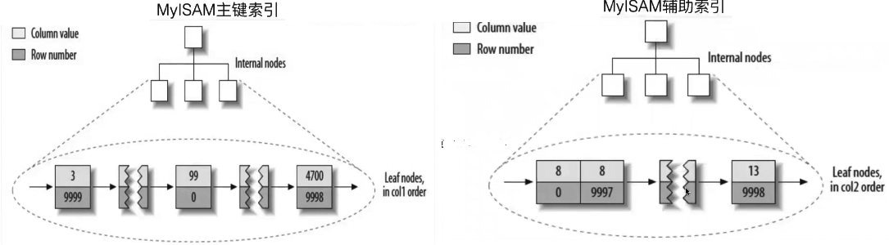
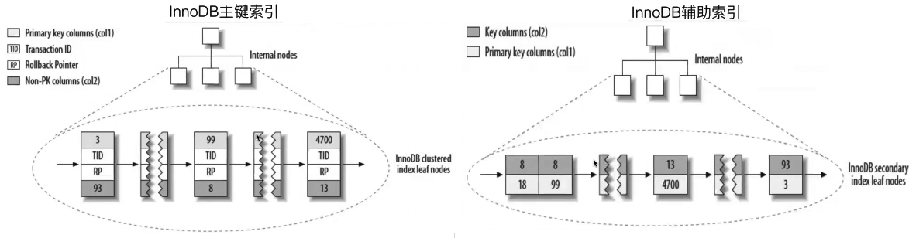
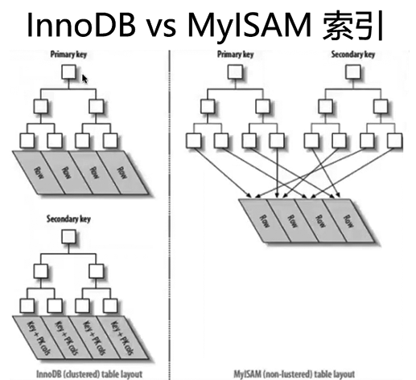

[TOC]

# MyISAM索引结构

- MyISAM表为堆表（想想oracle）
- MyISAM的主键、唯一、普通索引的结构是一样的。

 

- MyISAM索引的叶子节点数据结构为：

行数据对应的文件指针：索引值

- 通过索引查找数据的流程：

先从索引文件中查找到索引节点，从中拿到数据的文件指针，再到数据文件中通过文件指针定位了具体的数据。

 

 

# InnoDB索引结构

- InnoDB表为索引组织表（IoT）
- InnoDB表的主键索引，包含了行的所有列数据，以及事务ID、回滚段指针。
- InnoDB表的辅助索引，包含了索引列的数据，以及所在行的主键索引的键值数据。

 

 

InnoDB索引可以理解为是索引组织表的索引（索引的索引），通过覆盖索引可以实现免回表读，传送门：[InnoDB回表读示意]()

 

