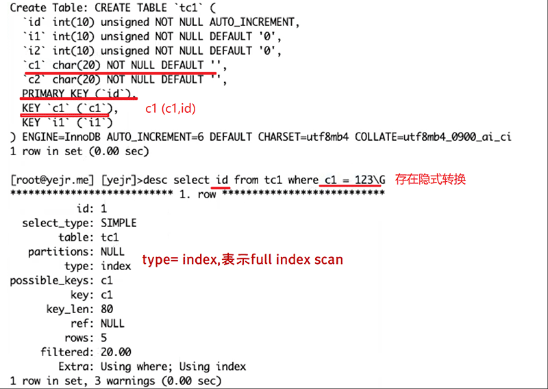
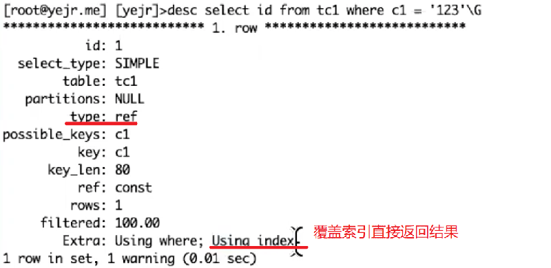
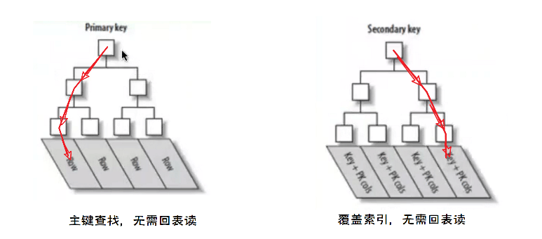
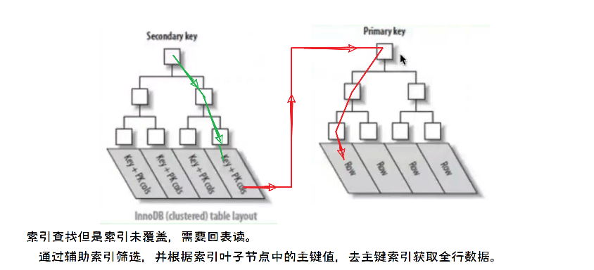
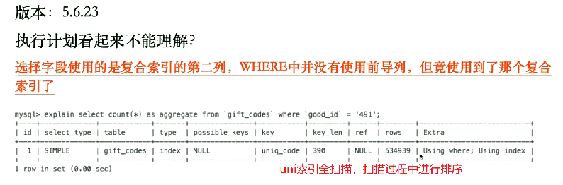

[TOC]

# 覆盖索引 Covering indexes

- 通过索引数据结构即可直接返回要查询的数据结果，不需要回表读
- 使用覆盖索引时，在执行计划中，extra列会显示关键字 using index
- 建议合理利用覆盖索引特性，减少回表请求

 

### 案例：

索引全扫描 && 覆盖索引直接返回结果

- 类型隐式转换导致索引全扫描

 

 

- 避免隐式转换后，覆盖索引直接返回结果（extra： using index， type：ref）

 

# InnoDB回表读示意

 

 

 

