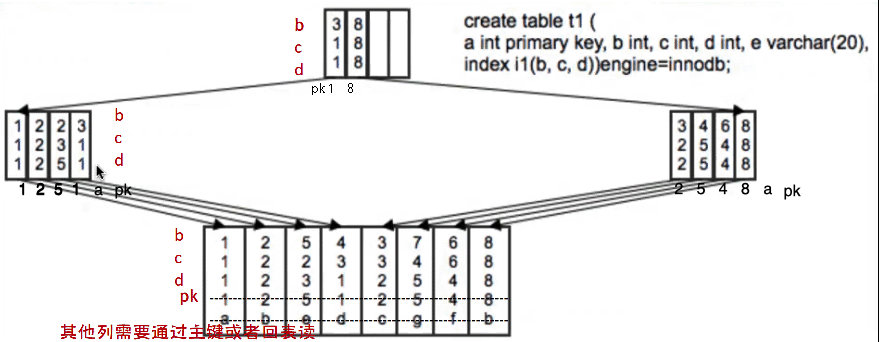
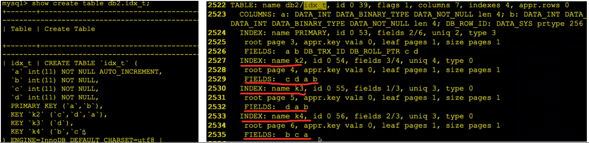

[TOC]

# 联合索引/多列索引 Combined Indexes， Multiple-Column Indexes

- 多列组成的索引
- 适合where条件中的多列条件组合
- 有时候还可以用于避免回表（覆盖索引）
- MySQL8.0起支持多列不同排序规则（e.g. (a,b desc)）

## 联合索引建议：

- where条件中，经常同时出现的列放在联合索引中

- 把选择性大（过滤性大/基数大）的列放在联合索引的最左边
- 联合索引选择要有取舍，业务上也尽量做妥协，一般不建议超过5列

 

## 联合索引详解

联合索引 idx_abc(a,b,c) 相当于索引 (a),(a,b),(a,b,c)，一定程度上，(a),(a,b) 索引就可能是多余的，但是在index extension特性下，(a),(a,b) 索引依然有必要性。

e.g.

idx_abc(a,b,c) 

- 可以在下列条件场景下被**完整使用**：

  - where a=?
  - where a=? and b=?
  - where a=? and b=? and c=?
  - where a=? and b in (x,y) and      c=?
  - where a=? and b=? order by c
  - where a=? order by b,c
  - where 1=1 order by a,b,c

 

- 但是在下列场景下便**不能完整利用**：（[联合索引最左匹配原则]()、[ICP]()）

  - where a=? order by pk
  - where a=? and b=? order by      pk

 

 

- 而在下列场景中，**完全用不上**该索引：

  - where b=?
  - where b=? and c=?
  - where b=? and c>=?
  - where 1=1 order by b
  - where 1=1 order by b,a

 

原因是：

- idx_abc(a,b,c) 索引实际存储列为(a,b,c,pk)，前导列和pk之间非连续，无法使用索引pk列排序
- idx_a索引实际存储列为(a,pk)，可以使用index extension特性使用索引pk列排序
- idx_ab索引实际存储列为(a,b,pk)，可以使用index extension特性使用索引pk列排序

 

## 联合索引最左匹配原则

下面几个SQL的情况，只能用到索引 idx_abc(a,b,c)的部分索引，或者利用5.6版本开始的ICP特性：

1. b=? and     a=? #(a,b)
2. a in (x,y) and b=? #(a,b)     & ICP
3. (a between x and y) and b=?     #(a,b) & ICP
4. a=? and b in (x,y) #(a,b)     & ICP
5. a=? and (b between x and y)     and c=? #(a,b,c) & ICP
6. a=? and c=? #(a) & ICP
7. a=? and c>=? #(a) &     ICP
8. a in (x,y,z) order by b,c     #(a) & ICP & filesort
9. a>? order by b #(a) &     ICP & filesort
10. a>? order by a #(a)

 

也可以伪造条件，来符合索引最左匹配，但是效率不一定更好。

- idx(gender,country)

  - where country='USA'  # type=ALL ,*索引跳扫有可能会发生
  - where gender in ('F','M')      and country='USA'  # type=range ,      ICP

 

# ICP, index condition pushdown

传送门：[ICP特性](..\..\5.MySQL体系结构\1.MySQL体系结构\2.server层服务层SQL层\4.SQL 执行过程 及(8.0) ICP 特性.md)

ICP是MySQL5.6的新特性，机制会让索引的其他部分也参与过滤，减少引擎层和server层之间的数据传输和回表请求，通常情况下可大幅提升查询效率。

 

 

## 联合索引结构示意图

 

 

 

## 联合索引定义解析

 

 

- 主键是联合索引(a,b)，主键索引结构为 a,b,     db_trx_id,db_roll_ptr,c,d   
- 辅助索引k2(c,d,a)也是联合索引，辅助索引k2结构为 c,d,a , b     ##因为a已经在前导列了，所以只有b被附加。
- 辅助索引k3(d)是普通索引，索引k3结构为 d,a,b
- 辅助索引k4(b,c)是联合索引，辅助索引k4结构为 b,c,a  ##因为b已经在前导列了，所以只有a被附加。