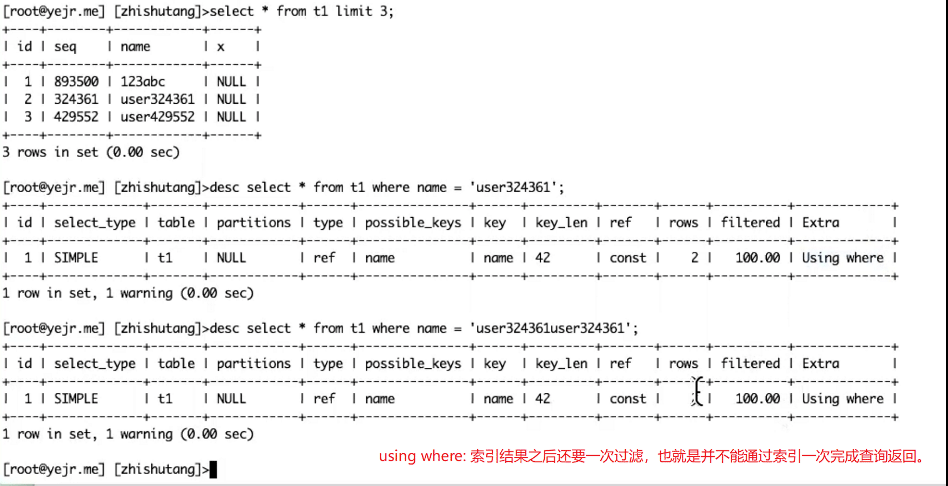
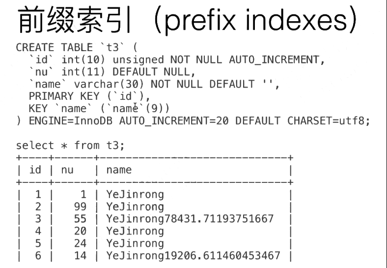
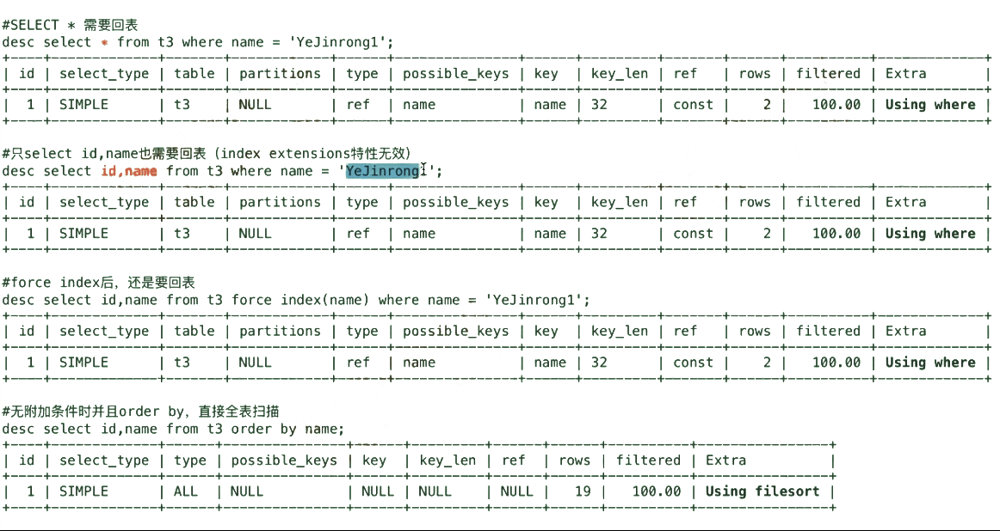
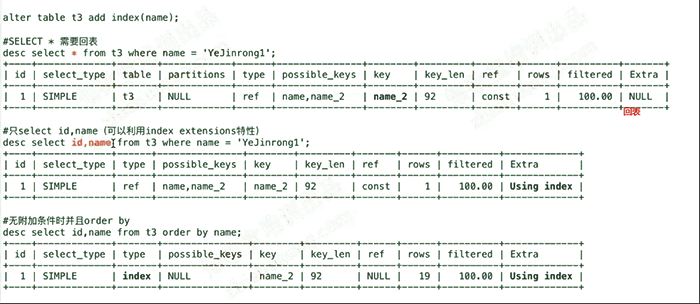

[TOC]

# 部分索引的目的

- 针对字符串类型，提高索引效率

  - char/varchar列太长，全部做索引的话，效率太差，且存在极大的空间浪费
  - 索引建立是按照char或varchar的定义长度来进行的，即使数据填充长度不够，也分配相当的空间。

- BLOB/text类型不能整列作为索引列，因此需要前缀索引

- 一般索引长度建议不超过100 bytes（key_len不超过100）

# 部分索引的建议

- 统计平均值

  - 满足80%~90%覆盖度就够

- 建议字符串列默认采用前缀索引

 

# 部分索引的缺点：

无法利用前缀索引完成排序——排序可能不准确，优化器可能选择不走索引。即使走索引，一次索引访问也不能完成结果返回。

```
select length(c1) as len from t1 order by len desc limit 2;

select count(*) from t1 where length(c1)>=20;

总数100万
length(c1)>=20  -- 1万，1%

select avg(length(c1)) from t1;


varchar(30)
<=15

alter table t1 add index(c1(15))
```

 

# 部分索引




# 前缀索引



 



 



 

 
