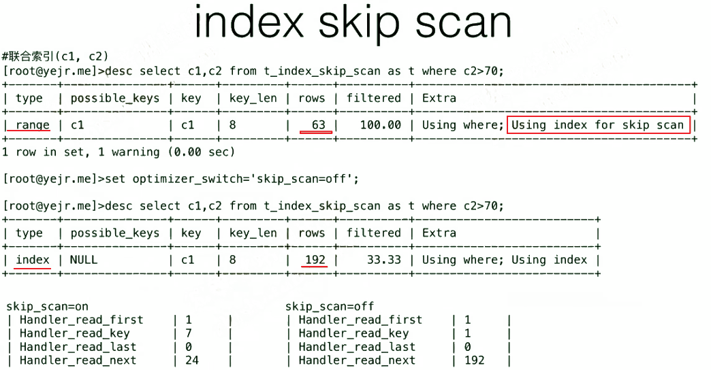
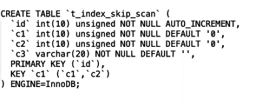
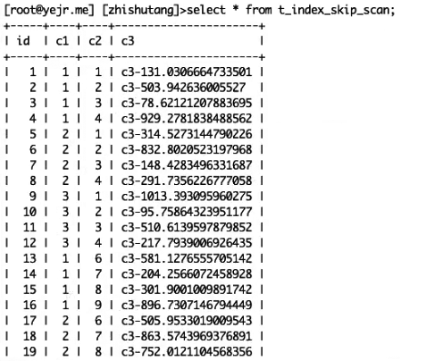

[TOC]

# 索引跳跃扫描 index skip scan

多列联合索引中，第一列的唯一值很少，且在where条件中未被用到时，有可能发生索引跳跃扫描。

- 8.0.13开始支持skip index scan
- 执行计划的extra会显示 using index for     skip scan
- 跳扫针对单表，不支持多表join
- SQL中不能有group by或者distinct

 

 

 

 

 

 
