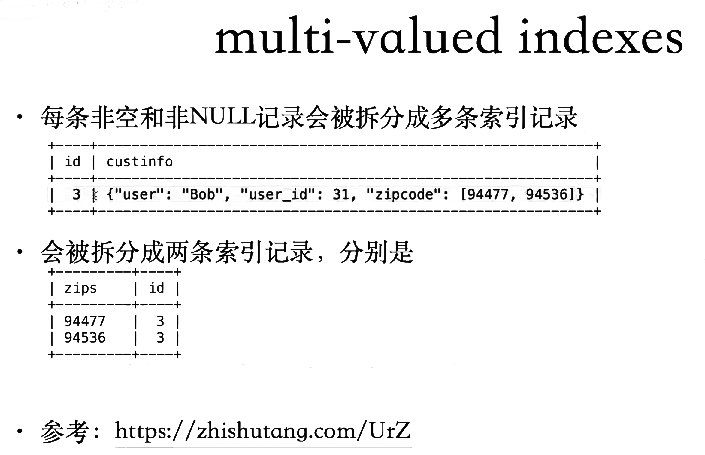

[TOC]

# 多值索引 multi-valuedindexes

- 主要是支持json。
- 只能用来做条件筛选，目前无法做到覆盖索引。
- 支持唯一约束
- 是functional index的一种变体，本质上也是基于虚拟列
- 一个多值索引上，只能有一个多值列
- 数组中的所有数据类型必须一致，只支持DECIMAL/INTEGER/DATETIME/VARCHAR/CHAR等类型
- 不支持：倒序索引、外键、前缀索引
- 不能onlineddl
- （在B+树中，分成多条记录存储，因此）DML时，可能会对应多次操作

参考：https://dev.mysql.com/doc/refman/8.0/en/create-index.html#create-index-multi-valued

 

 

