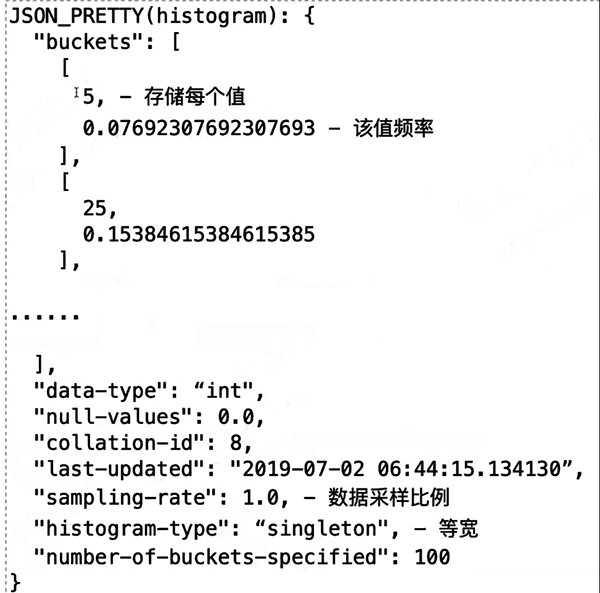
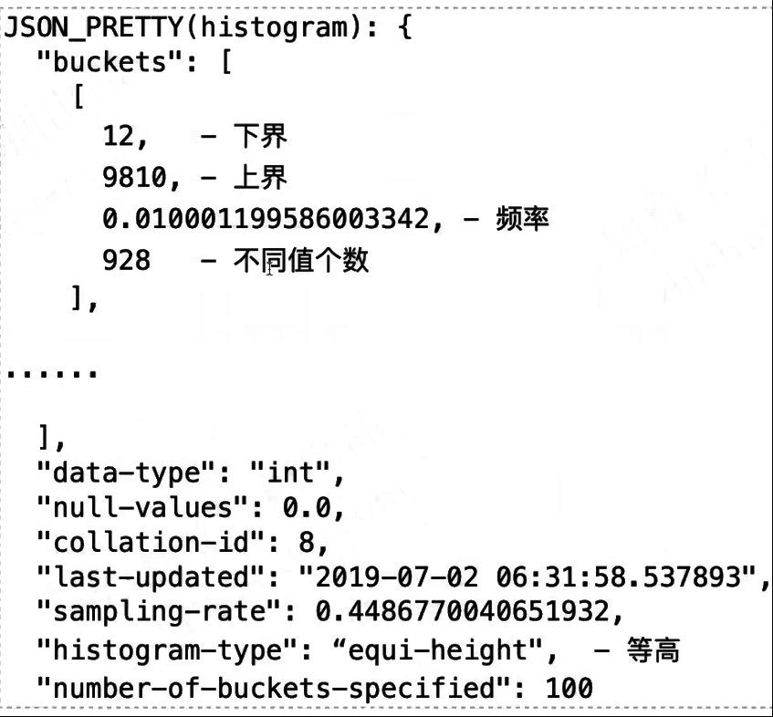
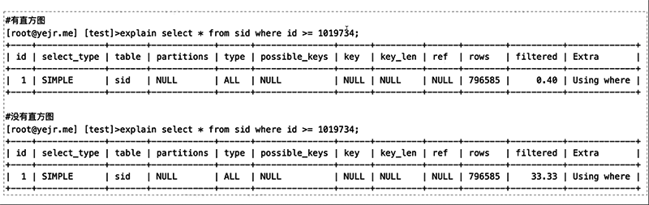
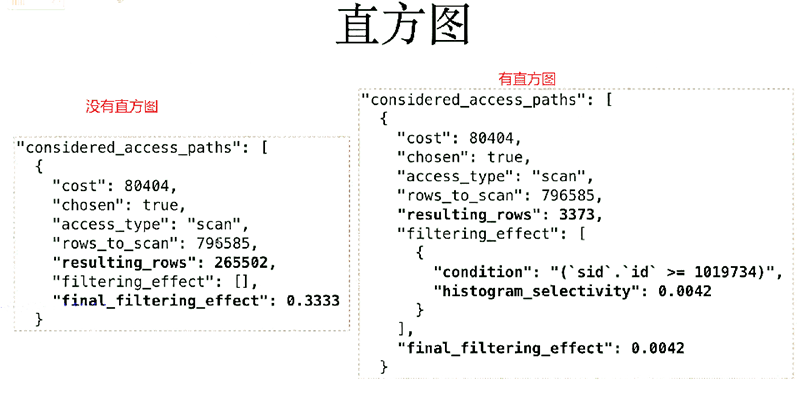

> - 统计结果中的sampling-rate表示采样比例，越高消耗内存越多
> - histogram_generation_max_mem_size可限制内存使用上限，默认20MB
> - 有了索引为什么还需要直方图？
>   - 索引维护代价高，而且要保持近乎实时的更新
>   - 直方图更新代价更低，由用户按需进行更新，可自定义更新时间
>
>  
>
> -  动手利用innodb_table_monitor观察索引存储结构的实验
> - 动手做一下倒序索引、函数索引、不可见索引、多值索引、直方图、跳跃索引扫描等练习 


# 直方图

- MySQL8.0开始支持，索引之外的数据分布统计信息可选项
- 指令 ANALYZE TABLE [table] UPDATE/DROP HISTOGRAM ON [column]

ANALYZE [NO_WRITE_TO_BINLOG | LOCAL]

  TABLE tbl_name

  UPDATE HISTOGRAM ON col_name [, col_name] ...

​    [WITH N BUCKETS]

 

ANALYZE [NO_WRITE_TO_BINLOG | LOCAL]

  TABLE tbl_name

  DROP HISTOGRAM ON col_name [, col_name] ...

 

- 统计信息持久化存储在mysql.column_statistics表中（不可见表）
- 可以从I_S.COLUMN_STATISTICS中引用查看

mysql>SELECT JSON_PRETTY(HISTOGRAM) FROM INFORMATION_SCHEMA.COLUMN_STATISTICS\G

 

## 支持两种直方图模式

- 等宽(singleton)

- - 每个桶只有一个值，保存该值和累积的频率

- 等高(equi-height)

- - 每个桶保存下上界、累积频率以及不同值的个数

 

 

## 直方图操作

 

### 表结构信息

```
mysql> desc kk.t1;
+-------+--------------+------+-----+-------------------+-----------------------------------------------+
| Field | Type     | Null | Key | Default      | Extra                     |
+-------+--------------+------+-----+-------------------+-----------------------------------------------+
| c1  | int     | NO  | PRI | NULL       | auto_increment                |
| c2  | int     | YES | MUL | NULL       |                        |
| c3  | int unsigned | NO  |   | NULL       |                        |
| xx  | int     | YES |   | NULL       |                        |
| c4  | int unsigned | NO  |   | 0         |                        |
| dt  | timestamp  | NO  |   | CURRENT_TIMESTAMP | DEFAULT_GENERATED on update CURRENT_TIMESTAMP |
+-------+--------------+------+-----+-------------------+-----------------------------------------------+
6 rows in set (0.00 sec)
 
```

### 查看当前直方图

```
mysql> SELECT JSON_PRETTY(HISTOGRAM) FROM INFORMATION_SCHEMA.COLUMN_STATISTICS\G
Empty set (0.00 sec)
 
```

### 查看表数据情况

```
mysql> select * from kk.t1;
+----+------+----+------+----+---------------------+
| c1 | c2  | c3 | xx  | c4 | dt         |
+----+------+----+------+----+---------------------+
| 1 | 912 | 8 |  0 | 0 | 2020-04-09 01:19:06 |
| 2 | 295 | 5 |  8 | 5 | 2020-04-09 01:19:38 |
| 3 | 942 | 1 |  6 | 9 | 2020-04-09 01:19:42 |
| 4 | 355 | 8 |  19 | 13 | 2020-04-09 01:19:43 |
| 5 | 327 | 14 |  9 | 3 | 2020-04-09 01:19:44 |
| 6 | 447 | 15 |  11 | 6 | 2020-04-09 01:19:44 |
| 7 | 991 | 0 |  2 | 7 | 2020-04-09 01:19:44 |
| 8 | 625 | 0 |  3 | 15 | 2020-04-09 01:19:45 |
| 9 | 256 | 1 |  10 | 6 | 2020-04-09 01:19:45 |
| 10 |  83 | 9 |  2 | 4 | 2020-04-09 01:19:46 |
| 11 | 612 | 9 |  10 | 3 | 2020-04-09 01:19:46 |
| 12 | 177 | 9 |  16 | 10 | 2020-04-09 01:19:46 |
| 13 | 245 | 13 |  12 | 2 | 2020-04-09 01:19:47 |
| 14 | 645 | 18 |  13 | 9 | 2020-04-09 01:19:47 |
| 15 | 392 | 11 |  13 | 12 | 2020-04-09 01:19:47 |
| 16 |  70 | 10 |  7 | 6 | 2020-04-09 01:19:48 |
| 17 | 300 | 13 |  8 | 1 | 2020-04-09 01:19:48 |
| 18 |  96 | 6 |  3 | 16 | 2020-04-09 01:19:48 |
| 19 | 552 | 8 |  7 | 10 | 2020-04-09 01:19:48 |
| 20 | 573 | 6 |  16 | 2 | 2020-04-09 01:19:49 |
| 21 | 1000 | 15 |  16 | 16 | 2020-04-09 01:19:49 |
| 22 | 459 | 19 |  8 | 3 | 2020-04-09 01:19:49 |
| 23 | 583 | 9 |  9 | 17 | 2020-04-09 01:19:50 |
| 24 | 888 | 19 |  0 | 6 | 2020-04-09 01:19:50 |
| 25 | 387 | 1 |  4 | 13 | 2020-04-09 01:19:50 |
| 26 | 842 | 4 |  8 | 10 | 2020-04-09 01:19:50 |
| 27 | 293 | 19 |  17 | 8 | 2020-04-09 01:19:51 |
| 28 | 475 | 3 |  8 | 10 | 2020-04-09 01:19:51 |
| 29 | 251 | 16 |  4 | 13 | 2020-04-09 01:19:52 |
| 30 | 691 | 9 |  5 | 18 | 2020-04-09 01:19:53 |
| 31 | 649 | 12 |  1 | 7 | 2020-04-09 01:19:54 |
| 32 | 767 | 14 |  6 | 6 | 2020-04-09 01:19:54 |
| 33 | 540 | 17 |  14 | 17 | 2020-04-09 01:19:54 |
| 34 | 213 | 10 |  17 | 15 | 2020-04-09 01:19:55 |
| 35 | 233 | 18 |  16 | 4 | 2020-04-09 01:19:55 |
| 36 | 739 | 1 |  0 | 19 | 2020-04-09 01:19:55 |
| 37 | 620 | 6 |  13 | 7 | 2020-04-09 01:19:56 |
| 38 | 784 | 18 |  1 | 10 | 2020-04-09 01:19:56 |
| 39 | 530 | 2 |  16 | 14 | 2020-04-09 01:19:56 |
| 40 | 252 | 2 |  13 | 2 | 2020-04-09 01:19:57 |
| 41 | 407 | 16 |  15 | 6 | 2020-04-09 01:19:57 |
| 42 | 268 | 9 |  10 | 2 | 2020-04-09 01:19:57 |
| 43 | 990 | 13 |  7 | 16 | 2020-04-09 01:19:58 |
| 44 | 989 | 10 |  10 | 2 | 2020-04-09 01:19:58 |
| 45 | 863 | 1 |  15 | 12 | 2020-04-09 01:19:58 |
| 46 | 810 | 4 |  10 | 17 | 2020-04-09 01:19:58 |
| 47 | 908 | 18 |  18 | 14 | 2020-04-09 01:19:59 |
| 48 | 719 | 11 |  13 | 13 | 2020-04-09 01:19:59 |
| 49 | 159 | 18 |  1 | 10 | 2020-04-09 01:19:59 |
| 50 | 368 | 7 |  12 | 0 | 2020-04-09 01:19:59 |
| 51 | 255 | 4 |  7 | 2 | 2020-04-09 01:20:00 |
| 52 | 519 | 5 |  13 | 10 | 2020-04-09 01:20:00 |
| 53 | 533 | 4 |  7 | 3 | 2020-04-09 01:20:00 |
| 54 | 654 | 17 |  7 | 5 | 2020-04-09 01:20:01 |
| 55 | 204 | 4 |  10 | 17 | 2020-04-09 01:20:01 |
| 56 | 829 | 11 |  4 | 6 | 2020-04-09 01:20:02 |
| 57 | 898 | 13 |  10 | 10 | 2020-04-09 01:20:02 |
| 58 |  14 | 12 |  19 | 20 | 2020-04-09 01:20:02 |
| 59 |  61 | 7 |  11 | 14 | 2020-04-09 01:20:03 |
| 60 | 769 | 16 |  14 | 3 | 2020-04-09 01:20:03 |
| 61 | 674 | 18 |  7 | 5 | 2020-04-09 01:20:03 |
| 62 |  27 | 9 |  3 | 8 | 2020-04-09 01:20:03 |
| 63 | 546 | 11 |  1 | 14 | 2020-04-09 01:20:03 |
| 64 | 249 | 4 |  4 | 7 | 2020-04-09 01:20:04 |
| 65 | 164 | 16 |  10 | 3 | 2020-04-09 01:20:05 |
+----+------+----+------+----+---------------------+
65 rows in set (0.00 sec)
```

 

### 对列进行直方图统计

```
mysql> analyze table kk.t1 update histogram on c3;
+-------+-----------+----------+-----------------------------------------------+
| Table | Op    | Msg_type | Msg_text                   |
+-------+-----------+----------+-----------------------------------------------+
| kk.t1 | histogram | status  | Histogram statistics created for column 'c3'. |
+-------+-----------+----------+-----------------------------------------------+
1 row in set (0.07 sec)
 
mysql> SELECT JSON_PRETTY(HISTOGRAM) FROM INFORMATION_SCHEMA.COLUMN_STATISTICS\G
*************************** 1. row ***************************
JSON_PRETTY(HISTOGRAM): {
 "buckets": [
  [
   0,
   0.03076923076923077
  ],
  [
   1,
   0.1076923076923077
  ],
  [
   2,
   0.13846153846153847
  ],
  [
   3,
   0.15384615384615385
  ],
  [
   4,
   0.24615384615384617
  ],
  [
   5,
   0.27692307692307694
  ],
  [
   6,
   0.3230769230769231
  ],
  [
   7,
   0.35384615384615387
  ],
  [
   8,
   0.4
  ],
  [
   9,
   0.5076923076923077
  ],
  [
   10,
   0.5538461538461539
  ],
  [
   11,
   0.6153846153846154
  ],
  [
   12,
   0.6461538461538462
  ],
  [
   13,
   0.7076923076923077
  ],
  [
   14,
   0.7384615384615385
  ],
  [
   15,
   0.7692307692307693
  ],
  [
   16,
   0.8307692307692308
  ],
  [
   17,
   0.8615384615384616
  ],
  [
   18,
   0.9538461538461539
  ],
  [
   19,
   1.0
  ]
 ],
 "data-type": "int",
 "null-values": 0.0,
 "collation-id": 8,
 "last-updated": "2020-04-14 05:35:25.463978",
 "sampling-rate": 1.0,
 "histogram-type": "singleton",
 "number-of-buckets-specified": 100
}
1 row in set (0.00 sec)
 
mysql> select count(*) ,c3 from kk.t1 group by c3 order by 1;
+----------+----+
| count(*) | c3 |
+----------+----+
|    1 | 3 |
|    2 | 0 |
|    2 | 15 |
|    2 | 14 |
|    2 | 5 |
|    2 | 12 |
|    2 | 2 |
|    2 | 17 |
|    2 | 7 |
|    3 | 6 |
|    3 | 19 |
|    3 | 10 |
|    3 | 8 |
|    4 | 16 |
|    4 | 13 |
|    4 | 11 |
|    5 | 1 |
|    6 | 4 |
|    6 | 18 |
|    7 | 9 |
+----------+----+
20 rows in set (0.00 sec)
 
mysql> 
```

 

------------------------------------这块发现问题，所谓‘频率’ 和实际并不符合。 由于直方图相关资料尚未整理，就此暂停。 回头研究。 ----2020.04.14

 

 



5出现的频率为 7.6% 

采样了100个桶

 



 

 



 

 



 

 

 
