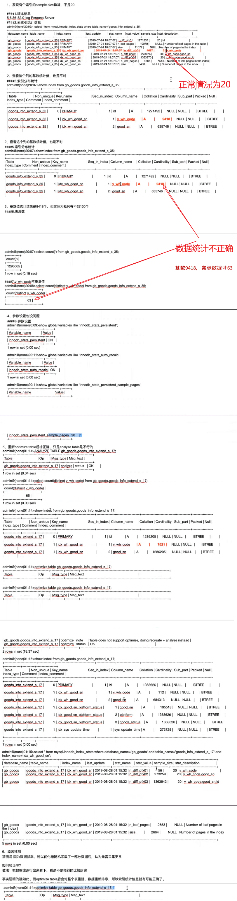

# 数据倾斜排查思路：

- 首先看采样数量是不是20pages ， 如果不够，加大。
- 然后手动做一次count(*) ，distinct以及 count(*) group by ， 看一下数据的总量以及唯一值的数量、索引基数是否正确

 

- 一般来说导致索引统计信息不准确的原因：

  - 严重数据倾斜
  - 采样page太小
  - 表碎片

- 小结

  - 默认的索引统计策略即可，基本无需调整
  - 当发现个别表索引选择不准确或统计信息不准确时，再具体分析
  - 一般可以通过加大sample size提高准确性
  - 如果数据倾斜的太厉害，可能需要重建整张表

 

 

 

OPTIMIZE TABLE XXXX;