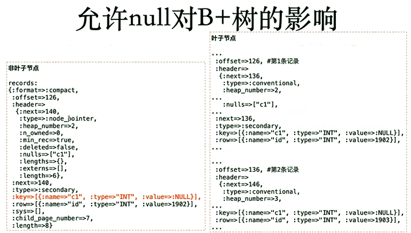

[TOC]


# 不建议允许NULL

## 允许为null时可能对DML带来的影响

当列nullable时——

- 索引查找、统计、值比较，会更加复杂

- 在B+tree中，所有null值放在最左侧，增加搜索代价

  - not null时，count(*)/count(1)代价一样
  - null会在索引树最左侧，允许null时， 一定是全索引扫描或全表扫描的，因为count(*) 不包含null， 需要扫描后总数量减去null的数量。

- 主从复制环境中，表中有Nullable Unique Key时，可能会发生严重的性能问题（见后面详情）。

 

## 实践：

- 5.7开始 count(*) 会尽量将数据加载到内存后再进行count，加快效率。但是当表数据量过大时，该特性无效。

- count() 趋向走二级索引
- [留个坑]optimize select table away 特性

 

### 表结构

```
CREATE TABLE `x1` (
  `id` int(10) unsigned NOT NULL AUTO_INCREMENT,
  `seq` int(10) unsigned NOT NULL DEFAULT '0',
  `name` varchar(20) NOT NULL DEFAULT '',
  `x` int(11) DEFAULT NULL,
  PRIMARY KEY (`id`)
) ENGINE=InnoDB DEFAULT CHARSET=utf8mb4
```

 

### 更新允许null的列

```
mysql> select count(*) from x1;
+----------+
| count(*) |
+----------+
|    18677 |
+----------+
1 row in set (0.01 sec)


mysql> update x1 set x= rand()*1048576 order by rand() limit 10000;
Query OK, 10000 rows affected (0.46 sec)
Rows matched: 10000  Changed: 10000  Warnings: 0
```

 

### 查看全表扫描执行计划

此时count(*)会直接走主键索引扫描。

```
mysql> desc select count(*) from x1;
+----+-------------+-------+------------+-------+---------------+---------+---------+------+-------+----------+-------------+
| id | select_type | table | partitions | type  | possible_keys | key     | key_len | ref  | rows  | filtered | Extra       |
+----+-------------+-------+------------+-------+---------------+---------+---------+------+-------+----------+-------------+
|  1 | SIMPLE      | x1    | NULL       | index | NULL          | PRIMARY | 4       | NULL | 18734 |   100.00 | Using index |
+----+-------------+-------+------------+-------+---------------+---------+---------+------+-------+----------+-------------+
1 row in set, 1 warning (0.00 sec)
```

 

### 修改表，为not null列seq创建辅助索引

count() 趋向走二级索引

```
mysql> alter table x1 add index(seq);
Query OK, 0 rows affected (1.13 sec)
Records: 0  Duplicates: 0  Warnings: 0

mysql> desc select count(*) from x1;
+----+-------------+-------+------------+-------+---------------+------+---------+------+-------+----------+-------------+
| id | select_type | table | partitions | type  | possible_keys | key  | key_len | ref  | rows  | filtered | Extra       |
+----+-------------+-------+------------+-------+---------------+------+---------+------+-------+----------+-------------+
|  1 | SIMPLE      | x1    | NULL       | index | NULL          | seq  | 4       | NULL | 18734 |   100.00 | Using index |
+----+-------------+-------+------------+-------+---------------+------+---------+------+-------+----------+-------------+
1 row in set, 1 warning (0.00 sec)
# count() 趋向走二级索引
```

 

### 查询表总行数，再统计允许null的count()。

18677行数据

count(x) 不统计null行，所以无索引的x列会进行全表扫描

```
mysql> desc select count(x) from x1;
+----+-------------+-------+------------+------+---------------+------+---------+------+-------+----------+-------+
| id | select_type | table | partitions | type | possible_keys | key  | key_len | ref  | rows  | filtered | Extra |
+----+-------------+-------+------------+------+---------------+------+---------+------+-------+----------+-------+
|  1 | SIMPLE      | x1    | NULL       | ALL  | NULL          | NULL | NULL    | NULL | 18734 |   100.00 | NULL  |
+----+-------------+-------+------------+------+---------------+------+---------+------+-------+----------+-------+
1 row in set, 1 warning (0.00 sec)
```

 

### where中加入对允许null的列的条件

count(*)走全索引扫描

```
mysql> desc select count(*) from x1 where seq >= 0;
+----+-------------+-------+------------+-------+---------------+------+---------+------+-------+----------+--------------------------+
| id | select_type | table | partitions | type  | possible_keys | key  | key_len | ref  | rows  | filtered | Extra                    |
+----+-------------+-------+------------+-------+---------------+------+---------+------+-------+----------+--------------------------+
|  1 | SIMPLE      | x1    | NULL       | range | seq           | seq  | 4       | NULL | 18997 |   100.00 | Using where; Using index |
+----+-------------+-------+------------+-------+---------------+------+---------+------+-------+----------+--------------------------+
1 row in set, 1 warning (0.00 sec)

mysql> select count(*) from x1;
+----------+
| count(*) |
+----------+
|    37354 |
+----------+
1 row in set (0.01 sec)

mysql> select count(*) from x1 where seq >= 0;
+----------+
| count(*) |
+----------+
|    37354 |
+----------+
1 row in set (0.01 sec)
```


count(x)走全表扫描，无索引可用

```
mysql> desc select count(x) from x1 where seq >= 0;
+----+-------------+-------+------------+------+---------------+------+---------+------+-------+----------+-------------+
| id | select_type | table | partitions | type | possible_keys | key  | key_len | ref  | rows  | filtered | Extra       |
+----+-------------+-------+------------+------+---------------+------+---------+------+-------+----------+-------------+
|  1 | SIMPLE      | x1    | NULL       | ALL  | seq           | NULL | NULL    | NULL | 37995 |    50.00 | Using where |
+----+-------------+-------+------------+------+---------------+------+---------+------+-------+----------+-------------+
1 row in set, 1 warning (0.00 sec)
```

 

### 看一下二者的效率对比

使用profling参数，分别进行count(*) 和count(x) 

得出结果并记录执行情况

```
mysql> flush status;
Query OK, 0 rows affected (0.04 sec)

mysql> set profiling = 1;
Query OK, 0 rows affected, 1 warning (0.00 sec)

mysql> select count(*) from x1 where seq >= 0;
+----------+
| count(*) |
+----------+
|    37354 |
+----------+
1 row in set (0.02 sec)

mysql> select count(x) from x1 where seq >= 0;
+----------+
| count(x) |
+----------+
|    37354 |
+----------+
1 row in set (0.02 sec)
```

查看记录的信息

```
mysql> show profiles;
+----------+------------+----------------------------------------+
| Query_ID | Duration   | Query                                  |
+----------+------------+----------------------------------------+
|        1 | 0.01992500 | select count(*) from x1 where seq >= 0 |
|        2 | 0.02072625 | select count(x) from x1 where seq >= 0 |
+----------+------------+----------------------------------------+
2 rows in set, 1 warning (0.00 sec)
```


```
mysql> show profile for query 1;
+----------------------+----------+
| Status               | Duration |
+----------------------+----------+
| starting             | 0.000146 |
| checking permissions | 0.000014 |
| Opening tables       | 0.000029 |
| init                 | 0.000046 |
| System lock          | 0.000019 |
| optimizing           | 0.000018 |
| statistics           | 0.000127 |
| preparing            | 0.000069 |
| executing            | 0.000008 |*
| Sending data         | 0.019356 |
| end                  | 0.000013 |
| query end            | 0.000020 |
| closing tables       | 0.000013 |
| freeing items        | 0.000029 |
| cleaning up          | 0.000020 |
+----------------------+----------+
15 rows in set, 1 warning (0.00 sec)

mysql> show profile for query 2;
+----------------------+----------+
| Status               | Duration |
+----------------------+----------+
| starting             | 0.000157 |
| checking permissions | 0.000014 |
| Opening tables       | 0.000025 |
| init                 | 0.000043 |
| System lock          | 0.000019 |
| optimizing           | 0.000018 |
| statistics           | 0.000104 |
| preparing            | 0.000026 |
| executing            | 0.000007 |*
| Sending data         | 0.020143 |
| end                  | 0.000012 |
| query end            | 0.000017 |
| closing tables       | 0.000014 |
| freeing items        | 0.000030 |
| logging slow query   | 0.000073 |
| cleaning up          | 0.000026 |
+----------------------+----------+
16 rows in set, 1 warning (0.00 sec)

```

数据量较少，因此对比、看不出巨大差异，加大数据量测试

```
mysql> select count(*) from x1;
+----------+
| count(*) |
+----------+
|  4781312 |
+----------+
1 row in set (3.47 sec)

mysql> select count(*) from x1 where seq >= 0;
+----------+
| count(*) |
+----------+
|  4781312 |
+----------+
1 row in set (1.10 sec)

mysql> select count(x) from x1 where seq >= 0;
+----------+
| count(x) |
+----------+
|  4781312 |
+----------+
1 row in set (2.66 sec)

mysql> show profiles;
+----------+------------+----------------------------------------+
| Query_ID | Duration   | Query                                  |
+----------+------------+----------------------------------------+
|        1 | 0.01992500 | select count(*) from x1 where seq >= 0 |
|        2 | 0.02072625 | select count(x) from x1 where seq >= 0 |
|        3 | 1.09922000 | select count(*) from x1 where seq >= 0 |
|        4 | 2.66259125 | select count(x) from x1 where seq >= 0 |
+----------+------------+----------------------------------------+
4 rows in set, 1 warning (0.00 sec)

mysql> show profile for query 3;
+----------------------+----------+
| Status               | Duration |
+----------------------+----------+
| starting             | 0.000146 |
| checking permissions | 0.000025 |
| Opening tables       | 0.000028 |
| init                 | 0.000047 |
| System lock          | 0.000018 |
| optimizing           | 0.000017 |
| statistics           | 0.000183 |
| preparing            | 0.000029 |
| executing            | 0.000007 |
| Sending data         | 1.098593 |*
| end                  | 0.000013 |
| query end            | 0.000012 |
| closing tables       | 0.000009 |
| freeing items        | 0.000021 |
| logging slow query   | 0.000059 |
| cleaning up          | 0.000014 |
+----------------------+----------+
16 rows in set, 1 warning (0.00 sec)

mysql> show profile for query 4;
+----------------------+----------+
| Status               | Duration |
+----------------------+----------+
| starting             | 0.000111 |
| checking permissions | 0.000011 |
| Opening tables       | 0.000021 |
| init                 | 0.000038 |
| System lock          | 0.000016 |
| optimizing           | 0.000015 |
| statistics           | 0.000169 |
| preparing            | 0.000024 |
| executing            | 0.000005 |
| Sending data         | 2.661917 |*
| end                  | 0.000027 |
| query end            | 0.000030 |
| closing tables       | 0.000026 |
| freeing items        | 0.000046 |
| logging slow query   | 0.000104 |
| cleaning up          | 0.000032 |
+----------------------+----------+
16 rows in set, 1 warning (0.00 sec)
```


 

 

 

 

 

## 允许为null时可能对复制架构带来的影响（BUG,bug#88847, fixed on 8.0.11）

主从复制环境中，表中有UK（含NULL），也有PK及其他普通SK。有个删除的SQL,在主库执行时，选择普通SK效率更高，但是在从库时，却出现BUG，选择了允许NULL的UK，效率极低，造成主从延迟严重。（当表没有不允许为null的索引时， 按照从库优先级顺序，会选择允许为null的unique索引）

 

slave执行SQL时，索引选择次序如下：

1. Primary Key
2. UniQue Key with not null
3. UniQue key include     null ， and secondry index
4. table scan

 

- 解决办法
  1. 修改为不允许NULL
  2. 再从库删除UK，或者重建一个效率更高的UK
  3. 将该UK设置为Invisible Index (bug#88847, fixed on 8.0.11)

 

## 允许为null时对B+Tree的影响

```
CREATE TABLE `x2` (
  `id` int(10) NOT NULL AUTO_INCREMENT,
  `c1` int(10) DEFAULT NULL,
  `c2` varchar(100) NOT NULL,
  `c3` varchar(100) NOT NULL,
  PRIMARY KEY (`id`)
) ENGINE=InnoDB AUTO_INCREMENT=327676 DEFAULT CHARSET=utf8mb4
```

```
mysql>  desc select count(*) from x2 where c1 is null;
+----+-------------+-------+------------+------+---------------+------+---------+------+--------+----------+-------------+
| id | select_type | table | partitions | type | possible_keys | key  | key_len | ref  | rows   | filtered | Extra       |
+----+-------------+-------+------------+------+---------------+------+---------+------+--------+----------+-------------+
|  1 | SIMPLE      | x2    | NULL       | ALL  | NULL          | NULL | NULL    | NULL | 307375 |    10.00 | Using where |
+----+-------------+-------+------------+------+---------------+------+---------+------+--------+----------+-------------+
1 row in set, 1 warning (0.00 sec)

mysql> select count(c1) from x2 where c1 is null;
+-----------+
| count(c1) |
+-----------+
|         0 |
+-----------+
1 row in set (0.10 sec)

mysql>  select count(*) from x2 where c1 is null;
+----------+
| count(*) |
+----------+
|    10000 |
+----------+
1 row in set (0.11 sec)
```

